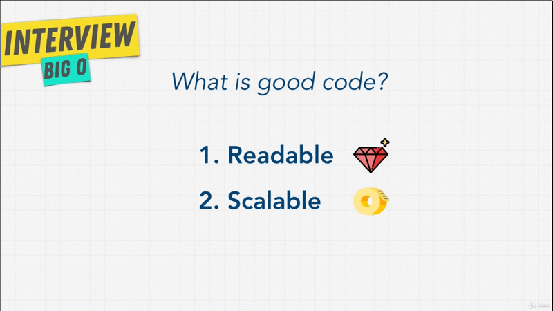
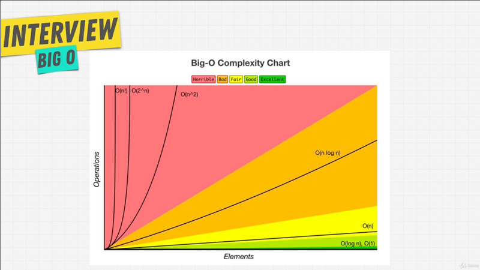

# Chapter-1 Big O -- Asymptotic Analysis

## Table of Contents
1.  [Module Introduction](#module-introduction)
2.  [What is Good Code](#what-is-good-code)
3.  [Big-O Scalability](#big-o-scalability)
4.  [Big-O Cheat Sheet](#big-o-cheat-sheet)

<br/>

## Module Introduction

The Big-O is a concept will be around for very long time, and something will
make you to be a better developer. Big companies all know Big-O, this which is
why you won't get by any of their interviews without encountering this topic.

Any coder can solve given enough time can solve a problem. What matters is
though how well the problem is solved; And this is where Big-O can help us. It
can tell us how well a problem is solved. We're gonna find out what that means
in this Module.

We going talk about Big-O, what it is? How we define it? And then we're going to
use Big-O and it's different notation to distinguish bad code from good code,
good code from great code. We are going to be comfortable with this topic, that
we are going to not to be surprised when this comes up in our interviews. But
we're also going to build this big foundation that is important to be a great
developer.

The reason this topic is at the beginning of this course is that you will see
the Big-O notation came up again and again as we go into topics such as _data
structures_ and _algorithms_.

**[⬆ back to top](#table-of-contents)**
<br/>
<br/>

## What is Good Code

There are two main things we talk about when we say this is good code. What
would you tell somebody if you're asking them to write good code?.
<br/>


<br />

Code can be described in tow points, `[1]`**Readability**, is your code just
generally clean? Can others can understand your code?. `[2]`**Scalable Code**.
Big-O notation is what allows us to measure this idea of scalable; code that can
scale. Something that we're going to get into and you're going to become more
familiar with as we go through this section.

We also going to talk about readable code throughout this entire course, but
touch upon it a little bit more in the next section. For now, because this is
the Big-O section, we're focusing on this idea of scalable code. What does this
really mean thug?
<br/>


<br />

Well I want you to imagine we have a task where we want to bake a cake. We have
a recipe, and this recipe we're going to use in our kitchen to bake a cake; And
there's a good way of baking a cake and a bad way. We give the instruction that
is their recipe, and hopefully this recipe and instruction work well with our
kitchen so that w can bake a cake quickly, and become a good cake.

Well computers are machines; And this machines need to works in order to produce
something for us; And the computers work in the same way. We have these
instructions that we give it through code, and these these instructions that we
give to our machine (computers) give these instructions that provide for us some
sort of an output, for example to turn on the light. We give the computer
instruction to say, hey turn ion the light in our room. A coder is someone that
gives these instructions just like there are many ways to take a cake into
a kitchen or just like there are many ways to bake a cake in the kitchen with
many recipes, ingredients and instructions, there are many ways to solve
a problem through code. They're efficient and inefficient ways to give
instructions.

We have an example of instruction that we're giving our computer called
[findNemo](./findNemo.js). We call this the runtime. How long does it takes to
run a certain problem through a function or a task? How can we measure the Big-0
with this findNemo function? Or the efficiency of this function?.

```javascript
function findNemo(array) {
    for (let i = 0; i < array.length; i++) {
        if (array[i] === "nemo") {
            console.log(`We found ${array[i]} at index "${array.indexOf("nemo")}"`)
        };
    };
};
```

We're going to try and measure the performance of findNemo function and see what
happens when the arrays gets larger. We're going to tie things together as to
what scaleable means, and how Big-O allows us to measure the scalability.

**[⬆ back to top](#table-of-contents)**
<br/>
<br/>

## Big-O Scalability


How we make sure that there is a away for use to measure in terms of efficiency?
What is good code? And what is bad code? And what is code that can scale? That
as the numbers of arrays or inputs increases. it doesn't slow down more and
more.

**_Big-O notation is the language we use for talking about how long algorithm takes
to run_**. We can compare two different algorithms or in this case functions using
Big-O and say which one is better then the other when it came to scale?
Regardless of our computer differences. We can measure Big-O like this chart,
<br/>


<br />

When we talk about Big-O and scalability of code, we simply mean when we grow
bigger and bigger with our input, how much does the algorithm or function slow
down? If the list of characters let's say **Elements** here that is "nemo", so
characters in finding "nemo" in our array as that increases how many more
**Operations** do we have to do? That's all it is.

This is what we call _algorithmic efficiency_. Big-O allow us to explain this
concept. Remember how in our function we initially had an array of just one
which is `const nemo = {"nemo"}` so that the number of **Elements** or number of
inputs in a function. As we increase that array to have more characters and then
we created that massive array of "100000" `const largeArray = new
Array(100000).fill("nemo")`. As that array increases, you saw that the number of
**Operations** or the number of things we do in the loop increased over and
over; And different functions have different Big-O complexities. That is these
number **Operations** can increase really really fast like like `O(n!)` which is
not good, and things that are quite good actually `O(n)` don't increase as much.

We're going to look at examples of different ones and how to actually measure
into Big-O complexity chart, and what this entire notation means.

**_Just remember this point_**, when we talk about Big-O and scalability of code we
simply mean when we grow bigger and bigger with our input; **_How much does the
algorithm slow down. The less it slows down or the slower it slows the better it
is_**.

```javascript
const measureTime = (array) => {

    const start = new Date();
    const hrstart = process.hrtime()
    const end = new Date() - start;
    const hrend = process.hrtime(hrstart);

    findNemo(array);

    console.info("Execution time: %dms", end);
    console.info("Execution time (hr): %ds %dms", hrend[0], hrend[1]/1000000);
};
```

Instead of using `performance.now()` or in NodeJS `process.hrtime()` to measure
the efficiency of our functions, we can just **_calculate how many operations
a computer has to perform_**, because each operations takes time on a computer.
**_Big-O allows us and concerns us with how many steps it takes in
a functions_**.


**[⬆ back to top](#table-of-contents)**
<br/>
<br/>

## Big-O Cheat Sheet

### - Big Os -

**O(1)** Constant -- No loops <br/>
**O(log N)** Logarithmic -- Usually searching algorithm `log n` if they are sorted (Binary search) <br/>
**O(n)** Linear -- for loops, while loops through `n` items <br/>
**O(n log(n))** Log Linear -- Usually sorting operations <br/>
**O(n^2)**  Quadratic  -- Every element in a collection needs ti be compared to ever other element. Two nested loops<br/>
**O(2^n)** Exponential -- Recursive algorithms that solves a problem of size `N`  <br/>
**O(n!)** Factorial -- You are adding a loop for every elements <br/>

**NOTE:** <br/>
**_Iterating through half a collection is still O(n)_** <br/>
**_Two separate collections: O(a * b)_** <br/>


### - What can cause time in a function? -

Operations (+, -, *, /) <br/>
Comparison (<, >, ==) <br/>
Looping (for, while) <br/>
Outside Function call (function()) <br/>

### - Rule Book -

**Rule 1:** Always worst Case <br/>
**Rule 2:** Remove Constant <br/>
**Rule 3:** Different inputs should have different variables. `O(a+b)`, A and B arrays nested would be `O(a*b)` <br/>
`+` for steps in order <br/>
`*` for nesteds steps
**Rule 4:** Drop Non-dominant terms

### - What causes Space complexity?-

Variables <br/>
Data Structure <br/>
Function Call <br/>
Allocation <br/>
