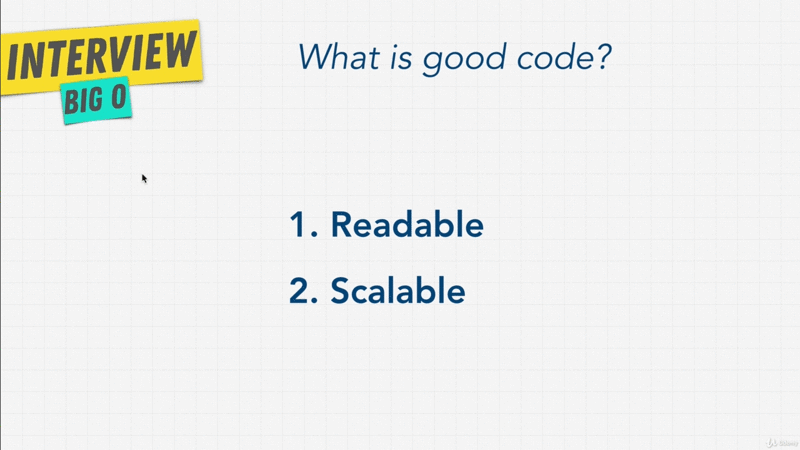
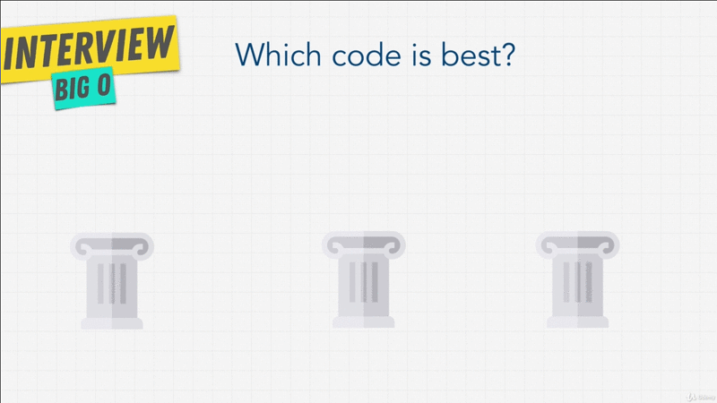

# Chapter-1 Big O -- Asymptotic Analysis

## Table of Contents
1.  [Module Introduction](#module-introduction)
2.  [What is Good Code](#what-is-good-code)
3.  [Big-O Scalability](#big-o-scalability)
4.  [Big-O Cheat Sheet](#big-o-cheat-sheet)
5.  [Big-O Linear](#big-o-linear)
6.  [Big-O Constant](#big-o-constant)
7.  [Big-O Exercise-1](#big-o-exercise-1)
8.  [Big-O Exercise-2](#big-o-exercise-2)
9.  [Simplifying Big-O](#simplifying-big-o)
10. [Big-O Rule 1](#big-o-rule-1)
11. [Big-O Rule 2](#big-o-rule-2)
12. [Big-O Rule 3](#big-o-rule-3)
13. [Big-O Quadratic](#big-o-quadratic)
14. [Big-O Rule 4](#big-o-rule-4)
15. [Pillars Of Programming](#pillars-of-programming)
16. [Space Complexity](#space-complexity)
17. [Exercise Space Scalability](#exercise-space-scalability)
18. [Exercise Twitter](#exercise-twitter)
19. [Optional JavaScript Loop](#optional-javascript-loop)

<br/>

## Module Introduction

The Big-O is a concept will be around for very long time, and something will
make you to be a better developer. Big companies all know Big-O, this which is
why you won't get by any of their interviews without encountering this topic.

Any coder can solve given enough time can solve a problem. What matters is
though how well the problem is solved; And this is where Big-O can help us. It
can tell us how well a problem is solved. We're gonna find out what that means
in this Module.

We going talk about Big-O, what it is? How we define it? And then we're going to
use Big-O and it's different notation to distinguish bad code from good code,
good code from great code. We are going to be comfortable with this topic, that
we are going to not to be surprised when this comes up in our interviews. But
we're also going to build this big foundation that is important to be a great
developer.

The reason this topic is at the beginning of this course is that you will see
the Big-O notation came up again and again as we go into topics such as _data
structures_ and _algorithms_.

**[⬆ back to top](#table-of-contents)**
<br/>
<br/>

## What is Good Code

There are two main things we talk about when we say this is good code. What
would you tell somebody if you're asking them to write good code?.
<br/>


<br />

Code can be described in tow points, `[1]`**Readability**, is your code just
generally clean? Can others can understand your code?. `[2]`**Scalable Code**.
Big-O notation is what allows us to measure this idea of scalable; code that can
scale. Something that we're going to get into and you're going to become more
familiar with as we go through this section.

We also going to talk about readable code throughout this entire course, but
touch upon it a little bit more in the next section. For now, because this is
the Big-O section, we're focusing on this idea of scalable code. What does this
really mean thug?
<br/>


<br />

Well I want you to imagine we have a task where we want to bake a cake. We have
a recipe, and this recipe we're going to use in our kitchen to bake a cake; And
there's a good way of baking a cake and a bad way. We give the instruction that
is their recipe, and hopefully this recipe and instruction work well with our
kitchen so that w can bake a cake quickly, and become a good cake.

Well computers are machines; And this machines need to works in order to produce
something for us; And the computers work in the same way. We have these
instructions that we give it through code, and these these instructions that we
give to our machine (computers) give these instructions that provide for us some
sort of an output, for example to turn on the light. We give the computer
instruction to say, hey turn ion the light in our room. A coder is someone that
gives these instructions just like there are many ways to take a cake into
a kitchen or just like there are many ways to bake a cake in the kitchen with
many recipes, ingredients and instructions, there are many ways to solve
a problem through code. They're efficient and inefficient ways to give
instructions.

We have an example of instruction that we're giving our computer called
[findNemo](./findNemo.js). We call this the runtime. How long does it takes to
run a certain problem through a function or a task? How can we measure the Big-0
with this findNemo function? Or the efficiency of this function?.

```javascript
function findNemo(array) {
    for (let i = 0; i < array.length; i++) {
        if (array[i] === "nemo") {
            console.log(`We found ${array[i]} at index "${array.indexOf("nemo")}"`)
        };
    };
};
```

We're going to try and measure the performance of findNemo function and see what
happens when the arrays gets larger. We're going to tie things together as to
what scaleable means, and how Big-O allows us to measure the scalability.

**[⬆ back to top](#table-of-contents)**
<br/>
<br/>

## Big-O Scalability

How we make sure that there is a away for use to measure in terms of efficiency?
What is good code? And what is bad code? And what is code that can scale? That
as the numbers of arrays or inputs increases. It doesn't slow down more and
more.

**_Big-O notation is the language we use for talking about how long algorithm takes
to run_**. We can compare two different algorithms or in this case functions using
Big-O and say which one is better then the other when it came to scale?
Regardless of our computer differences. We can measure Big-O like this chart,
<br/>


<br />

When we talk about Big-O and scalability of code, we simply mean when we grow
bigger and bigger with our input, how much does the algorithm or function slow
down? If the list of characters let's say **Elements** here that is "nemo", so
characters in finding "nemo" in our array as that increases how many more
**Operations** do we have to do? That's all it is.

This is what we call _algorithmic efficiency_. Big-O allow us to explain this
concept. Remember how in our function we initially had an array of just one
which is `const nemo = {"nemo"}` so that the number of **Elements** or number of
inputs in a function. As we increase that array to have more characters and then
we created that massive array of "100000" `const largeArray = new
Array(100000).fill("nemo")`. As that array increases, you saw that the number of
**Operations** or the number of things we do in the loop increased over and
over; And different functions have different Big-O complexities. That is these
number **Operations** can increase really really fast like like `O(n!)` which is
not good, and things that are quite good actually `O(n)` don't increase as much.

We're going to look at examples of different ones and how to actually measure
into Big-O complexity chart, and what this entire notation means.

**_Just remember this point_**, when we talk about Big-O and scalability of code we
simply mean when we grow bigger and bigger with our input; **_How much does the
algorithm slow down. The less it slows down or the slower it slows the better it
is_**.

```javascript
const measureTime = (array) => {

    const start = new Date();
    const hrstart = process.hrtime()
    const end = new Date() - start;
    const hrend = process.hrtime(hrstart);

    findNemo(array);

    console.info("Execution time: %dms", end);
    console.info("Execution time (hr): %ds %dms", hrend[0], hrend[1]/1000000);
};
```

Instead of using `performance.now()` or in NodeJS `process.hrtime()` to measure
the efficiency of our functions, we can just **_calculate how many operations
a computer has to perform_**, because each operations takes time on a computer.
**_Big-O allows us and concerns us with how many steps it takes in
a functions_**.


**[⬆ back to top](#table-of-contents)**
<br/>
<br/>

## Big-O Cheat Sheet

### - Big Os -

**O(1)** Constant -- No loops <br/>
**O(log N)** Logarithmic -- Usually searching algorithm `log n` if they are sorted (Binary search) <br/>
**O(n)** Linear -- for loops, while loops through `n` items <br/>
**O(n log(n))** Log Linear -- Usually sorting operations <br/>
**O(n^2)**  Quadratic  -- Every element in a collection needs ti be compared to ever other element. Two nested loops<br/>
**O(2^n)** Exponential -- Recursive algorithms that solves a problem of size `N`  <br/>
**O(n!)** Factorial -- You are adding a loop for every elements <br/>

**NOTE:** <br/>
**_Iterating through half a collection is still O(n)_** <br/>
**_Two separate collections: O(a * b)_** <br/>


### - What can cause time in a function? -

Operations (+, -, *, /) <br/>
Comparison (<, >, ==) <br/>
Looping (for, while) <br/>
Outside Function call (function()) <br/>

### - Rule Book -

**Rule 1:** Always worst Case <br/>
**Rule 2:** Remove Constant <br/>
**Rule 3:** Different inputs should have different variables. `O(a+b)`, A and B arrays nested would be `O(a*b)` <br/>
`+` for steps in order <br/>
`*` for nesteds steps <br/>
**Rule 4:** Drop Non-dominant terms

### - What causes Space complexity?-

Variables <br/>
Data Structure <br/>
Function Call <br/>
Allocation <br/>

**[⬆ back to top](#table-of-contents)**
<br/>
<br/>

## Big-O Linear

### -- O(n) --

What would you say if I asked you what is the Big-O of the function
[findNemo](./findNemo.js)?

```javascript
const nemo = ["nemo"];
const everyone1 = ["dory", "bruce", "marlin", "nemo", "gill", "bloat", "nigel", "squirt", "darla", "hank"]
const everyone2 = ["dory", "bruce", "marlin", "gill", "bloat", "nigel", "squirt", "darla", "hank", "nemo"]
const largeArray = new Array(100000).fill("nemo")

function findNemo(array) {
    for (let i = 0; i < array.length; i++) {
        if (array[i] === "nemo") {
            console.log(`We found ${array[i]} at index "${array.indexOf("nemo")}"`)
        };
    };
};
```

As we said a **_runtime_** is simply how long something takes to run. How does
this function and its runtime grow as our input increases. As our inputs goes
from just a single item in an array `nemo`, to 10 items in array ` everyone1
| everyone2` to 100.000 `largeArray`. How does the efficiency of this
function increase?.
<br/>


<br />

> The above diagram is linear. As our number input `(Elements)` increase the number of `Operations` increase as well.

<br/>

We say that the `findNemo` functions has a Big-O notation of `O(n)` or we call
_Linear Time_. It takes linear time to find a `nemo`.

Where this `n` come from? This `n` can be anything really. It's just an
arbitrary letter, and we usually give `n` when it comes to Big-O. This is just
a standard that you'll see across the board and simply means _the Big-O depends
on the number of the inputs_.

If we just had the `nemo` array `const nemo` this `n` would just be `O(1)`; <br/>
If we had the `const everyone1 or const everyone2` array this `n` just be `O(10)`; <br/>
And if we had the `const largeArray` arrays this `n` just be `O(100000)` <br/>

As the inputs increase, you see that the number of `Operations` increase
linearly with it. `O(n)` it's probably the most common Big-O notation you'll
find if we go back to the [Big-O Complexity Chart](#big-o-scalability) you can
see that `O(n)` is in the yellow region, that's as _fair_. As the number of
elements increase, you see that is just a straight line. The number of
`Operations` increases by the same  amount, because; Keep this in mind, **_Big-O
doesn't measure things in seconds_**, Instead we're **_focusing on how quickly
our runtime grows_**.

We simply do this by using the size of the input, which we call `n` and compared
to the number of `Operations` that increase. **_That's what scalability
means_**, as things grow larger and larger, does it scale?

So the `findNemo` function is `O` of `n` and linear time. Another way to think
about it is this,
<br/>

 single element")
<br />

If we have the compression algorithm, let's say this `function()` is the little
compression, and the `Input` is the little box, what's the Big-O notation of
this function? Well if we had one element it will just compress one item.
<br/>

 multiple elements")
<br />

If we have multiple elements, again we still have to run each box through the
compression algorithm to compress the box.

```javascript
//ES5
function compressAllBoxes(boxes) {
    boxes.forEach(function(box) => {
        console.log(box);
    });
};

// ES6
const compressAllBoxes = boxes => {
    boxes.forEach(box => console.log(box));
};
```

If we look at the function for the compress boxes while we're using ES5 and ES6
syntax above, we're essentially looping through each box, and in our case we're
just console logging it. But as you can see here, that all of these all we're
doing as the input increases; the number of boxes increases `(Elements)`, the
number of `Operations` increase; And that is `O(n)` - linear-time.

**[⬆ back to top](#table-of-contents)**
<br/>
<br/>

## Big-O Constant

### -- n(1) --

What happen if we have a function like this,

```javascript
function compressFirstBox(boxes) {
    console.log(boxes[0]);
};
```

A function that says `compressFirstBox` that receives an array of boxes, and
this function simply has `console.log` boxes zero `boxes[0]`. So, that is it's
logging out just the first item in the box. What would you say the Big-O of this
function is? How many steps or operations does this function take if the boxes
increase from 0 to maybe 10, to maybe 100, to maybe 100000? What would happen
here?

> This is what we call `0(1)` - Constant Time.

That is no matter how many times the boxes increase or however many boxes we
have we're always just grabbing the first item in the array.
<br/>

 - Constant Time")
<br />

If we look at this on a graph, If we have one element or one box we do one
operation.  If we have three elements or three boxes we still do just one
operation because we're just grabbing the first item (`Elements`) in the array.
If we have five elements or five boxes or more boxes we just do have same number
of `Operations`.

It's not linear time like it was where it increases and increases with the
number of `Operations`, the number of `Operations` just stay flat. But I have
question here, what if we do something different? If we have a function like
below,

```javascript
const boxes = [1, 2, 3, ,4, 5, 6];

function logFirstTwoBoxes(boxes) {
    console.log(boxes[0])
    console.log(boxes[1])
}

logFirstTwoBoxes(boxes);
```

How do we measure the Big-O of above function? What's the number of operation in
the function? Well we have

```javascript
function logFirstTwoBoxes(boxes) {
    console.log(boxes[0])       // O(1)
    console.log(boxes[1])       // O(1)
}

logFirstTwoBoxes(boxes);        // O(2)
```

Each time the `logFirstTwoBoxes` function runs two operations. So this function
in total is actually running `O` of `2` operations every time. So no matter how
big the boxes get, the number of operations here is going to be two.

If we looks at the graph,
<br/>

 - Constant Time")
<br />

Instead of having `O` of `1`, like we have before, we have `0` of `2`, and then
if we had three opertions it will just be `O` of `3`. But overall it's still
a **_flat line_**, and this is something we're going to get into later on. But
when it comes to constant time we don't care about the nitty gritty `O` of `1`,
`O` of `2`, or `O` of `3`, or `O` of `100`. We round this down to just simply
just saying `O` of `1`, that is we have _Constant Time_.

In term of scalability it's a flat line. It doesn't matter how big our inputs
are, we're always going to do the constant amount of time on a function. **_Keep
in mind: Inputs can be any type of data. Not just arrays_**. If we look at
[Big-O Complexity Chart](#big-o-scalability), we see that `O(1)` is the dark
green area, it's excellent. We love`0(1)` because it's very scaleable right. It
doesn't matter how many `Elements` we have it's always going to run the same.
Predictability when it comes to computing is very very nice and `O(1)` is
definitely excellent.

So we've learned about linear time `O(n)`, and constant time `O(1)`. Let's do
a bit of fun exercise to really solidify our knowledge.

**[⬆ back to top](#table-of-contents)**
<br/>
<br/>

## Big-O Exercise-1

```javascript
// What is the Big O of the below function? (Hint, you may want to go line by line)
function funChallenge(input) {
  let a = 10;                                       // 0(1)

  a = 50 + 3;                                       // 0(1)

    for (let i = 0; i < input.length; i++) {        // O(n)
        anotherFunction();                          // O(n)
        let stranger = true;                        // O(n)
        a++;                                        // O(n)

    };
      return a;                                     // O(1)
};

// Answer
// 3 + n + n + n === 3 + 4n
// Big-O (3 + 4n)
// Big-O: O(n)
```
**[⬆ back to top](#table-of-contents)**
<br/>
<br/>

## Big-O Exercise-2
```javascript
// What is the Big O of the below function? (Hint, you may want to go line by line)
function anotherFunChallenge(input) {
    let a = 5;                              // O(1)
    let b = 10;                             // O(1)
    let c = 50;                             // O(1)

    for (let i = 0; i < input; i++) {
        let x = i + 1;                      // O(n)
        let y = i + 2;                      // O(n)
        let z = i + 3;                      // O(n)
    };

    for (let j = 0; j < input; j++) {
        let p = j * 2;                      // O(n)
        let q = j * 2;                      // O(n)
    };
    let whoAmI = "I don't know";            // O(1)
}
    // Answer
    // 4 + n + n + n + n + n === 4 + 5n
    // Big-O (4 + 5n)
    // Big- O(n)

    // Or if we include for-loop
    // 4 + n + n + n + n + n + n + n === 4 + 7n
    // Big-O (4 + 7n)
    // Big-O: O(n)
```

**[⬆ back to top](#table-of-contents)**
<br/>
<br/>

## Simplifying Big-O
<br/>


<br />

When we talk about Big-O in interviews most of the time you're only going to give
one of Big-Os kinds `O(n), O(1), O(n log n), O(n^2), O(2^n), O(n!)`. You're most
likely never going to actually calculate precisely `O(3n)`, or `3n + 2 + 1`; So how
was I able to simplify the exercise and just say that they `O(n)`?. Luckily for
you, there are just several rules that we can follow when it came to the
Big-O. Check the [cheatsheet Rule Book](#big-o-cheat-sheet)

**[⬆ back to top](#table-of-contents)**
<br/>
<br/>

## Big-O Rule 1

### Worst Case

Let's talk about the very first role when it comes to Big-O, that is worst case
when calculating Big-O we always think about the worst case. What do I mean by
that? Well if we go back to [findNemo](./findNemo.js) for example,

```javascript
const nemo = ["nemo"];

const everyone1 = ["dory", "bruce", "marlin", "nemo", "gill", "bloat", "nigel", "squirt", "darla", "hank"]
const everyone2 = ["dory", "bruce", "marlin", "gill", "bloat", "nigel", "squirt", "darla", "hank", "nemo"]

function findNemo(array) {
    for (let i = 0; i < array.length; i++) {
        console.log("running")
        if (array[i] === "nemo") {
            console.log(`We found ${array[i]} at index "${array.indexOf("nemo")}"`)
        };
    };
};

findNemo(everyone1);

// result
// running
// running
// running
// running
// We found nemo at index "3"
// running
// running
// running
// running
// running
// running

```

The function is not efficient, Because if you look this function we're looping
through the entire array to find `nemo`. Remember we had the `everyone1` array
with about 10 different characters or objects. Well `nemo` was the _fourth member
on the array_; And when we run this function we found `nemo`, but the funny
things is this function **_ran 10 times not four times_**. We already find
`nemo`, all after find `nemo` run pretty wasteful.

We can make this function little bit more efficient, in JavaScript we can just
have something called `break`

```javascript
const nemo = ["nemo"];

const everyone1 = ["dory", "bruce", "marlin", "nemo", "gill", "bloat", "nigel", "squirt", "darla", "hank"]
const everyone2 = ["dory", "bruce", "marlin", "gill", "bloat", "nigel", "squirt", "darla", "hank", "nemo"]
const everyone3 = ["nemo", "dory", "bruce", "marlin", "gill", "bloat", "nigel", "squirt", "darla", "hank"]

function findNemo(array) {
    for (let i = 0; i < array.length; i++) {
        console.log("running")
        if (array[i] === "nemo") {
            console.log(`We found ${array[i]} at index "${array.indexOf("nemo")}"`)

            break;
        };
    };
};

findNemo(everyone1);

// result
//running
//running
//running
//running
//We found nemo at index "3"
```

In our case, if a condition is met in our case if we find `nemo` just break out
of this loop. Once we found `nemo` we're done, we're not going to loop through
the rest of the items or array. Congratulation, we just made our code a little
bit more efficient. That's a good thing right?

Well, when it comes to Big-O, although this is important, when you write good
code, this is something that we want to do. In the big schema thing Big-O only
cares about the worst case, what is the worst case in here?

The worst case is that `nemo` is set of being the fourth item it can at at the
very end `everyone2`. So even we have the `break` statement, we're still going
to run as 10 times, because `nemo` at the end of the array.

The best case is if `nemo` at the very beginning `everyone3`, we only have to
loop through it once. But worst case we're still going to have to go through 10
loops, still is Big-O `O(n)`.

So this is our very first rule, the very first rule is we always care about what
is the worst case

So this is our very first rule, the very first rule is _we always care about what
is the worst case scenario_ because when we talk about scalability we can't just
assume things are going well, even though the `findNemo` function might be of
one if `nemo` is very first items in the array, it doesn't matter, in the grand
scheme of things, because we can't be certain of what the input is going to be.
We're going to assume that all of Big-O is of _Linear Time_, again if we're
finding.

**_In the end of the day, when we talk about Big-O we talk about worst case_**.

**[⬆ back to top](#table-of-contents)**
<br/>
<br/>

## Big-O Rule 2

### Remove Constants

#### Case - 1

```javascript
function printFirstItemThenFirstHalfThenSayHi100Times(items) {
    console.log(items[0]);                              // O(1)

    var middleIndex = Math.floor(items.length / 2);
    var index = 0;

    while (index < middleIndex) {
        console.log(items[index]);                      // O(n/2)
        index++;
    };

    for (var i = 0; i < 100; i++) {
        console.log('hi');                              // )(100)
    };

};

// O(n/2 + 101)
```

We have ridiculous functions in above
`printFirstItemThenFirstHalfThenSayHi100Times`, probably not the best named
function ever, but as the name describe all we're doing is we're going to
console logging the first item in the array, and then we're going to print the
first half of the items. So I'm finding the `middleIndex` of the items,
`items.length` divided by `2`, and I use `Math.floor` as a way for use to make
sure that we get a whole number, and we're going to say variable indexes `0`.

We use `while-loop` here instead of a `for-loop` and I'm saying as long as
`middleIndex` is greater than `0`, I want to console logging the items. So that
means console log the first half of the item we had 10 items, (because `index`
will increase by / every loop until index is 5) and then I'm going to do another
`for-loop` and say I'm console logging `hi` a 100 times.

What is the Big-O of this functions? Well looking over here it's going to be
Big-O of:

- we have 1 for just logging the first items.
- we have half of whatever the items is. In this case `n` divided by `2` because
    event thought we have a `for-loop` or `while-lop` we're only logging half
    the items every time.
- We doing `for-loop`, but again this is a bit tricky, we're not looping over
    the items array we just have `100` no matter how big the items array is.
    `for-loop` always be going to be a `100`

> this is the Big-O of above function. O(n/2 + 101)

Rule number two, states  we want to drop the constant. We simply saying we don't
really care that this Big-O is actually. Remember we only care about the things
that we saw on the [chart](#big-o-scalability) nothing specific like this `O(n/2 + 101)`

So the `101` became a `1`
> The Big-O mutate into `O(n/2 + 1)`

And the `n/2` in the grand scheme of things we only care about when it scales,
when the inputs are getting larger and larger. As `n` get bigger and bigger, we
don't care adding an extra hundred because if `n` is a million adding an extra
hundred on there another `100` steps doesn't really matter and same with
dividing with `2`; as get larger an larger dividing by two has decreasingly
significant effect. So we drop the constant and the Big-O notation become,

> The Big-O mutate `O(n + 1)`

Because `1` if `n` was a million is very  insignificant, we can drop `1` as
well.
> The Big-O mutate `O(n)`

#### Case - 2

```javascript
function compressBoxesTwice(boxes) {
    boxes.forEach(function(boxes) {
        console.log(boxes);                 // O(n)
    })

    boxes.forEach(function(boxes) {
        console.log(boxes);                 // O(n)
    })
}
```
In case two, we have function `compressBoxesTwice`, where this function actually
has two `for-loops` where it does the same thing but it's two `for-loops`? We
have `O(n)` for each `for-loop`. Because these are two steps, while we add them
together became `O(2n)`.

> The Big-O is `O(2n)`

But again, in an interview, this doesn't really matter, because we _drop the
constant_ and if we drop what this function equate to? Well it's just `O(n)`.

> The Big-O mutate `O(n)`.

To prove it we see the graph below,
<br/>


<br />

We see that the `Elements` as the elements increase, we have two `Operations`,
because we have two `for-loops`. If we have _two_ `Elements`, in that case we do
_four_ `Operations`. If we have _three_ `Elements`, then we do _six_ `Operations`. You
see how increases?

The end of the day, even though the line is steeper we have a lot more
operations to do. The way the line increases is still **_linear_**, and that's
the _key_ here with Big-O, we don't really care about steep the line is. We care
about how the line moves as our inputs `(Elements)` increase. It makes a whole
our lives whole lot simpler doesn't it.

**_So remember, drop the constant. You're never going to really see numbers in
Big-O notation_**. Most likely the notations that we've seen in the past before,
on our graph usually the only time you see numbers is when you have `O(1)`,
`O(n^2)`, or `O(2^n)`, which we'll get get to later.

**[⬆ back to top](#table-of-contents)**
<br/>
<br/>

## Big-O Rule 3

### Different terms of inputs

The third Big-O rule is the trickiest parts of an interview that a lot of people
makes mistakes on, but once you understand it, it became really easy to spot.

#### Example - 1

```javascript
function compressBoxesTwice(boxes) {
    boxes.forEach(function(boxes) {
        console.log(boxes);                 // O(n)
    })

    boxes.forEach(function(boxes) {
        console.log(boxes);                 // O(n)
    })
}

// Big-O: O(2n)
// Big-O mutate: O(n)
```

I have the exact same function we saw in the last video `compressBoxesTwice`. We
have the boxes array and we just have two loops here, I'm using `for-each`
syntax in JavaScript, but we're just looping twice over the same array. As
I said before the Big-O of this is `O(2n)`, but because we drop constant it
became `O(n)`.

But the third rule states, that _different terms for inputs_ and what that means
is? Well first all, let me ask you a question,

```javascript
// Function mutated
function compressBoxesTwice(boxes, boxes2) {
    boxes.forEach(function(boxes) {
        console.log(boxes);                 // O(n)
    })

    boxes2.forEach(function(boxes) {
        console.log(boxes);                 // O(n)
    })
}

// Big-O: O(a + b)
```

What if here, I have `boxes` as the first parameters, and then we have `boxes2`
, as the second parameters, and maybe this second `for-loop` actually loops over
the second boxes, what happens here? What is the Big-O?

During an interview, a lot of people trip up and say tat this is still `O(n)`,
it's gonna be `O(2n)`, and drop the constants, this is right? No, because the
third rule states that different terms for inputs; And remember `boxes` the
first one and the second one are two different inputs. One could be a hundred
items long, Another one can be just one item.

So this first `for-loop` is going to depend on how big the first item (first
parameter) or first inputs is; And then the second `for-loop` depends on how big
item or input is; and `n` just arbitrary letter that we decided in. In this case
the Big-O of the function something like `O(a + b)`.

Keep that in mind, just because you see two `for-loops` one after another,
_doesn't mean that they're looping over the same items_. You might be asking
your self, what happen if these `for-loop` are nested? So far we've only worked
with loops that are one after another. Well let's get into the next chapter and
talk about another _common pattern_ we see with Big-O that is nested loops.

**[⬆ back to top](#table-of-contents)**
<br/>
<br/>

## Big-O Quadratic

### O(n^2)

One common interview question that you might get is something along the lines of
log all pairs of arrays. What that's actually means?

```javascript
// Log all pairs of array
const boxes = [1, 2, 3, 4, 5];


function logAllPairsOfArray(array) {

    for (let i = 0; i < array.length; i++) {

        for (let j = 0; j < array.length; j++) {
            console.log(array[i], array[j]);
        };
    };
};

// Big-O: O(n * n);

logAllPairsOfArray(boxes2)
```

If we had an array, let's just say variable `boxes`, and this array is just
contains boxes numbers. Now this array `boxes`, if I want to log all pairs, it
means that I want to log the number `[1, 2], [1, 3], [1, 4], [1, 5], [2, 1], [2,
2], [2, 3], [2, 4], [2, 5]` so on and so forth, how would we go about doing
that?

What is the Big-O of the `logAllPairsOfArray`? This is something that you're
going to see a lot of in interviews, end a _good rule of thumbs_ is if you see
nested loops, that means instead of having two `for-loops` one after another,
where we use _addition_ `+`, when you see loops that are nested we use
_multiplication_ `*`.

> So this becomes Big-O: O(n * n)

Which when we multiply them becomes, `O` to the `^2`.

> Big-O mutated: O(n^2)

If we take look in graph below,
<br/>


<br />

That means, every time the number of `Elements` increase, let's say we have
_two_ elements, we have _four_ `Operations` that we do; if we have _three_
`Elements`, this actually increases quadratically. That means instead of _four_
`Operations` we now have _nine_ `Operations` because we have _three_`Elements`
to the `^2`.

You see here, how the line is now meant (indicate), _it increases well quite
fast_.  If we go back to our [graph](#big-o-scalability), `O(n^2)` it `Horrible`
as in it's pretty slow as the number of `Elements` increases the number
`Operations` increases significantly.

A lot of interview questions are questions that ask you to solve a problem
initially `O(n^2)` and make it faster by perhaps making it into something that
is a bit lower into `Bad`, `Fair`, `Good`, `Excellent`, but definitely not
`Horrible`.

If we go back to [rule number _three_](#big-o-rule-3), that we were discussing
_different terms of inputs_, going back to that example we said `O(a + b)`,
because we had _two_ different arrays or inputs. If the loops is actually
nested, and there now one after another, the Big-O show would have been
`O(a*b)`, that is rule number _three_ making sure to know that we have different
arrays (inputs) that means different notation for each array, because we don't
know the length.

Easy rule of thumbs is, **_any step that happens in the same indentation one
after another, you add `+`, and anything that happens with indentation that is
nested, you multiply `*`_**. Again, different inputs should have different
variables.

Let's move on to the last Big-O rule.

**[⬆ back to top](#table-of-contents)**
<br/>
<br/>

## Big-O Rule 4

### Drop Non Dominants terms

#### Example - 1

```javascript
const numbers = [1, 2, 3, 4, 5];

function printAllNumbersThenAllPairSums(numbers) {

    console.log("these are the numbers:");                              // O(1)

    numbers.forEach(number => console.log(number));                     // O(n)

    console.log("and these are their sums:");                           // O(1)

    numbers.forEach(firstNumber => {

        numbers.forEach(secondNumber => {
            console.log("==> sums:" ,firstNumber, "and", secondNumber, "are:",  firstNumber + secondNumber); // O(n)
        });
    });
};

// Big-O: O(n + n^2)

// result:
// these are the numbers:
// 1
// 2
// 3
// 4
// 5
// and these are their sums:
// ==> sums: 1 and 1 are: 2
// ==> sums: 1 and 2 are: 3
// ==> sums: 1 and 3 are: 4
// ==> sums: 1 and 4 are: 5
// ==> sums: 1 and 5 are: 6
// ==> sums: 2 and 1 are: 3
// ==> sums: 2 and 2 are: 4
// ==> sums: 2 and 3 are: 5
// ==> sums: 2 and 4 are: 6
// ==> sums: 2 and 5 are: 7
// ==> sums: 3 and 1 are: 4
// ==> sums: 3 and 2 are: 5
// ==> sums: 3 and 3 are: 6
// ==> sums: 3 and 4 are: 7
// ==> sums: 3 and 5 are: 8
// ==> sums: 4 and 1 are: 5
// ==> sums: 4 and 2 are: 6
// ==> sums: 4 and 3 are: 7
// ==> sums: 4 and 4 are: 8
// ==> sums: 4 and 5 are: 9
// ==> sums: 5 and 1 are: 6
// ==> sums: 5 and 2 are: 7
// ==> sums: 5 and 3 are: 8
// ==> sums: 5 and 4 are: 9
// ==> sums: 5 and 5 are: 10
```

We have a function `printAllNumbersThenAllPairSums`, let's see what this
function does. Well, These function takes numbers and these numbers variable
we're going to loop over them with `forEach-loop`; So again just looping over
and logging out the numbers and then we have another steps, which should remind
you that probably an _addition_ `+` that we're doing; we're adding another step
and in here we're summing the pair sums, that is where adding each number one
after another.


We see the loops at result of this function, what do you think the Big-O
notation here as well?

So we can say that there is `O(n)` and then the second part which again is
another step, so we're going to say _power_ of _two_, `O(n^2)`, cause we have _two_
`for-loops` nested.

> Big-O: O(n + n^2)

But, rule number _four_ states that we want to _drop the non dominant terms_;
That means we care about the most important terms, in this case, we actually
drop the `n` and just have `n` to the _power_ of _two_, because the input
increases the size of `n` to the _power_ of _two_ is way more important then the
`n`. We always keep the dominant terms.

> Big-O mutation: O(n^2)


#### Example - 2

What if we had a function that had a Big-O `O(x^2 + 3x + 100 + x/2)`? How do we
simplify this, Based on the drop non dominant terms?

> Big-O: `O(x^2 + 3x + 100 + x/2)`

We only worry  about the most important dominant term, because `x` to the
_power_ of _two_ `^2` is the most significant. That is if `x` is `5`, `5^2` is
`25`; `5 * 3` is `15`; and `100`; and `5 \ 2` is `2.5`.

In this case the dominant term is `100`; but remember with Big-O, we're worried
about **_scale_**; And as thing go larger and larger and larger. So when `5` is
become `500`, `500^2` is `250000`; `3 * 500` is only `1500`; and `100` is now
insignificant; and `500 \ 2` is `250`.

You see the `^2` has grown significantly more. Again because we're
only worried about _scale_ here, we drop everything else, and we can just ignore
it completely; and the Big-O Just became `O(x^2)`.

> Big-O mutated: `O(x^2)`

How nice is that, just makes things so much simpler. So there you have it; We
have now a way to simplify everything. Now it makes sense if we go back to our
past examples, why we've just the Big-O `O(n)`, and _because we don't care about
the insignificant items_ only the most important ones.

By the way, a fun little note here, **if we had another loop inside of _two_
loops**, well this would become `O(^3)`, 99.99% of the time, that usually a bad
idea. It scales really-really bad and most likely _you're doing something
wrong_.

We've gone over the _four rules_ and with this in mind, we're going to take
a look at the [cheat-sheet](#big-o-cheat-sheet). So from now on, instead of
having to calculate everything, and really look at every single detail of
a function, you can right away figure out what the Big-O is, or what the time
complexity of a function is.

**[⬆ back to top](#table-of-contents)**
<br/>
<br/>

## Pillars Of Programming
<br/>


<br />

By this point you should be able to talk a little bit especially about
_scaleable_ right. Readable we're going to talk about in the next section, but
scaleable we understood was Big-O right; Well, here's the thing don't hate me
but i may have slightly lied or simplified things but not that much, so don't
worry.

When I say _scaleable_ there's actually _two_ things that we want to consider as
_engineers_. One is **_speed_**; That's what we've been talking about up until
now. How fast is our runtime on the code? How much time does it take for
a function to run? How many operations does it cost?. Well there's another
aspect when it comes to _machines_ to valuable resources, one is _time_ and
_speed_ of our code, and the other one is **_memory_**. You see, computer have
limited memory, back in the day when computers were just being born, memory was
very-very expensive, we only have a little bit of it. As time has gone on, we
have more and more memory but it's not infinite.

Our computer run based on _speed_ which is usually dictated by the CPU, and
_memory_ based on how much memory such as RAM the computer has. Those are two
valuable resources.

How can we talk about memory? We've talked about speed, what about _memory_; and
the good news is, that memory is fairly simple, not as complicated as speed, it
won't take us long to learn as much as we have about speed.
<br/>


<br />

Right now, which code is best can be answered with the three pillars of code?
Something that I want you to take with you _for the rest of your career_, and
something that's going to grow you as an engineer, because from now on when you
write code, you're going to have these three things in mind.

One, is you're going to **_write readable clean code_** that others can read,
that is maintainable. The other one is **_Speed_**, the type of code that we
call **_Time Complexity_**, has a Big-O time complexity that is efficient, it scales
well; But we're going to talk about, quickly about this _third pillars_ and that
is **_Memory_**. What's the memory usage of code? If it uses a lot of memory?
That's not good. We might have limited memory on our machine. With this one, we
use Big-O once again to talk about **_Space Complexity_**; The same notation but
different topics. One is _space_, the other one is _time_; One is _speed_ the
other one is _memory_.

I'm gonna give you a quick little preview, most programming code solution,
there's usually a trade-off between speed and memory. **_You want things go faster,
well then you might have to sacrifice more memory. You want less memory, well
then you might have to sacrifice with increased speed_**.

Let's get into the nitty gritty of how we measure _space complexity_.

**[⬆ back to top](#table-of-contents)**
<br/>
<br/>

## Space Complexity

When a program executes, it has two ways to remember things, the **_heap_** and
the **_stack_**. The _heap_ is usually where we _store variables that we assign
values to_; and the _stack_ is usually where we keep _track of our function
calls_.

Sometimes we want to optimize for using less memory, instead of using less time.
Talking about memory or space complexity is very similar to talking about the
time cost. We simply look at the total size relative to the size of the input,
and see how many new variables or new memory we're allocating; How much memory
is being used?.


Up to this point we've talked about time complexity, and how if we want to
compress let's say some boxes, we just talked about how fast and many operations
this would take. But in real life, there's this other factor of memory and we
have this, we have this _pink_ little box of how much this functions can take?
How much input it;s able to take?.
<br/>

")
<br />

For example, if we had a ton of boxes that we have to create to run this
function, well has limited capacity and it might overflow. By the way things
like Stack Overflow is something we're going to be talked about, and how it's an
issue when it comes to memory; something we'll cover when we get into recursion.

What causes this space complexity? Well luckily for you, I added to our [cheat
sheet](#-whatcauses-space-complexity?-), what cause space complexity? `[1]`
adding variables, `[2]` adding data structures like arrays, objects has-tables,
`[3]` function calls, and `[4]` allocations.

Next chapter, we'll go through some space complexity exercises, and figure out
how we can give the Big-O notation to the subject.

**[⬆ back to top](#table-of-contents)**
<br/>
<br/>

## Exercise Space Scalability

### Example - 1

```javascript
const numbers = [1, 2, 3, 4, 5];

//#5 Space complexity O(1)
function boooo(n) {
    for (let i = 0; i < n.length; i++) {
        console.log(n[i], 'booooo');
    }
}

// Space Complexity: O(1)

boooo(numbers)
// Result:
// 1 booooo
// 2 booooo
// 3 booooo
// 4 booooo
// 5 booooo
```

We have function called `boooo`, we know that the _space complexity_ of this
function or _time complexity_ of this function is `O(n)`. But when to _space
complexity_ let's think about this,what is the _space complexity_ of this
function?

The one gotcha when it comes to _space complexity_ is that when we talk about
_space complexity_ we're talking about **_additional space_**, so we don't
include space taken up by the inputs. We don't really care how big the inputs
`(Elements)` is, I mean we do care, but when it comes to the function `boooo` we
don't really have a control over what sort of input it receives, we only have
control of what happens inside of this function.

Within this function `boooo` are, we adding any space, Well not really the only
thing we're really doing is `let i = 0` variable, and that's it. Other then that
we're not really adding any more memory. So this function `boooo` has a space
complexity of  `O(1)`

> Space Complexity: `O(1)`

It's nice and simple.

### Example - 2

```javascript
function arrayOfHiNTimes(n) {
    var hiArray = [];               // SC O(n)
    for (let i = 0; i < n; i++) {   // SC O(1)
        hiArray[i] = 'hi';          // SC O(n)
    }
    return hiArray;
}

// Space Complexity: `O(n)`

// Result
// [ 'hi', 'hi', 'hi', 'hi', 'hi', 'hi'  ]
```

This time, we have a function `arrayOfHiNTimes`, that doing is creating a new
array, and for the number of items in our input we're going to just fill up
`hiArray` with repeatedly `hi` string.

If we called `arrayOfHiNTimes` return new array with _six items_ and each items
just simply says `hi`. What is the _space complexity_ of this function
`arrayOfHiNTimes`?

Remember our cheat sheet, _variables, data structures, function calls, and
allocation_; Those thing takes _space_ (memory); and in our case we created
variables in our `loop` variable `let i = 0`, but we've also created data
structures right? We created a new array.

If we go back, in this function we've created a new array, and we fill this
array with `n` loop's, again because of our rules when it comes to Big-O we
ignore the constant time `let i = 0`; and instead this function becomes `O(n)`.

> Space Complexity: `O(n)`

Because we're creating a new data structure and adding memory. So _each items is
an additional memory space_ on our computer and times.

You know what, That's pretty much it when it comes to _space complexity_.
I think you're getting the idea, and we'll get a Little bit more into when we
talk about recursion, but when it comes to _space complexity_ you're either
adding additional memory that you need to use and that's sometimes a big
concern, and sometimes there isn't, and something that comes up a lot in
interviews; And something that we'll talk about in the next section that is
sometimes _there's a tradeoff_ between _saving time_ and _saving space_.  You
have to decide, which one you're optimizing for.

Let's get into some fun examples based on what we've just learned in the next
chapter.

**[⬆ back to top](#table-of-contents)**
<br/>
<br/>

## Exercise Twitter

Let's say you're working at Twitter, and I hope everybody knows Twitter here. If
you working at Twitter and your boss asked you to build a feature perhaps
a feature that allows anybody to click `next button` to their `name` and
retrieve their most recent tweet and they're just tweet.  So that is their very
first tweet and their very latest tweet based on Big-O notation and what we know
about Big-O notation, what can we assume about this problem?


```javascript
// Find 1st, Find Nth...
const array = ["hi", "tweet", "news"];

console.log(array[0])                       // O(1)
console.log(array[array.length - 1])        // O(1)

// Space Complexity: O(1 + 1)
// Space Complexity mutated: O(1)

// Result
// hi
// news
```

Let's say a constant of array, and we'll have an array of tweets; And let's say
we have three tweets here `const array = ["hi", "tweet", "news"]`. The index `0`
is the oldest, and the index [2] is the most recent.

If we have an array here, we know that it's going to take us if the tweets are
stored in array, if we console logging `array[0]` we get the oldest tweet, if we
logging `array[array.length - 1]` or `array[2]` we get the `news`, the most
recent tweet; And because of the way arrays work.

We know that both of these operation will `O(1)` for above log. So a total of
`O(2)` operation; But we again use rule book and simplify it to constant time.

So that great, we build a nice little simple Twitter application and we can get
that information very easily.

But now our boss comes back to us, and say hey I want you to compare the _dates_
of tweets. So I want you to look at every tweet now within each array there's an
_object_

```javascript
// Find 1st, Find Nth...
const array = [{                            // O(n^2)
    tweet: "hi",
    date: 2012
    }, {
    tweet: "tweet",
    date: 2014
    }, {
    tweet: "news",
    date: 2015
}];
```

Now, we have to compare each tweet with all the other tweets, and compare their
data. What is the Big-O of this operation? Well, because we're comparing each
item in the array with the other, we are doing the `neted loop` that's take
`O(n^2)`. We know that this is going to take a lot, and fits a person that has
a lot of tweets a lot of inputs in the array.

This operation might cost us a lot of money at Twitter. So you might want to
tell your boss, we might have an issue here, we might need to do something else,
perhaps store the information in a better format, or do something different with
our program in order to avoid something that might be inefficient, and might be
expensive for the company.

Just by thinking like this, now you have this ability to think long term, think
scaleable code.

By the way as the fun one, What happens if I ask you what is the operation an
what's going to cost us If I have a string, and I `.length`.

```javascript
const stringOne = "helloWorldOnTheSame"
console.log(stringOne.length)

// Big-O: O(1)

// Result
// 19
```

What is the length of our `stringOne`? that is `19` items in string. What do you
think the Big-O notation of this string? This is a bit trick question, and
something that you might get asked in an interview, because the answer to this
is _depends_ on the language that you working with.

We need to know how the method works on the _string_ here, and that's built
into JavaScript, and you'll a different built in method for your language, based
on how the language is built, this `.length` might go _one_ by _one_, and iterate
over each letter and count from `0` to all the way until `19`, but _JavaScript
actually has got length property built in to each string_. So for JavaScript
this `.length` property is **_just a simple lookup_**, it's not a function
(method).

We're not running this function (method) to calculate things, instead
it's simply a property of an object. Because of that, again if you're not super
familiar with JavaScript, this may be a little bit confusing, but don't stress
out. The idea is, this operation in JavaScript is `0` constant time.

Without knowing how your language works, you don't know how this property
`.length` my work; perhaps if you had a method `(.length())` how that might
work.

But now you have a powerful foundation for pillar to start thinking about code
in a different way. Start looking at _space_ and _time_ are something that are
**_valuable_** to us as engineers as resources that we must be careful. We don't
have infinite amount of resources, we have to be careful when we code, how we
use up these resource (_space_), and that alone makes you a better engineers.

**[⬆ back to top](#table-of-contents)**
<br/>
<br/>

## Optional JavaScript Loop

I just want you to show a quick tips, especially for those that are familiar
with JavaScript, that thee are many-many ways to do `loops` in JavaScript; And
same with other languages as well, there many to do these loops.

So, I just want to show you some quick ones, that you might see throughout the
course, just so you're familiar with them.

For example `findNemo` function that has a `for-loop` can also be written with
something like `forEach` function.

```javascript
const findNemo2 = array => {

    array.forEach(fish => {

        if (fish === "nemo") {
            console.log(`We found ${array[i]} at index "${array.indexOf("nemo")}"`)

            break;
        };
    });
};
```

There is also another way that we can do this in JavaScript with the `for-of-loop`.

```javascript
const findNemo3 = array => {

    for (let fish of array) {
        if (fish === "nemo") {
            console.log(`We found ${array[i]} at index "${array.indexOf("nemo")}"`)

             break;
        };
    };
};
```

We have different way of solving problems. All of them are using loops, but you
can see some are more readable than others, and that's something that we've
encountered before right? Remember a good code means something that is scalable,
but also something that is readable, depending on your situation and something
we'll get into later on. How maintainable? And how other on your team can
understand the code, there's different ways of doing things, so that it's easier
to work with.

I hope, if you see these syntax `forEach` or `for-of-loop` throughout this
course, you're least familiar, that at the end of the day all we're doing is
loops.

**[⬆ back to top](#table-of-contents)**
<br/>
<br/>

