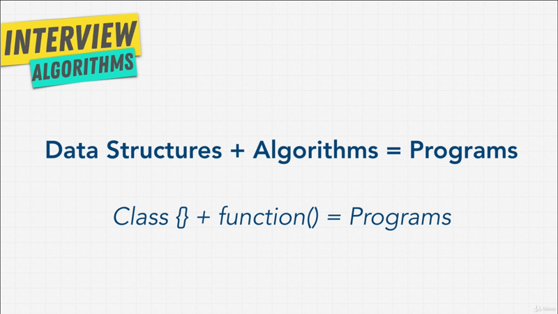
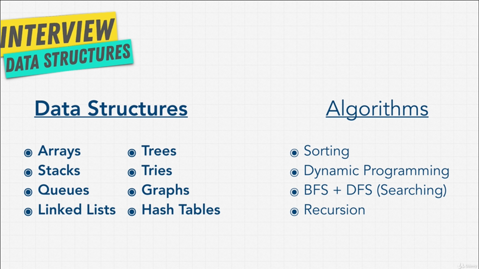
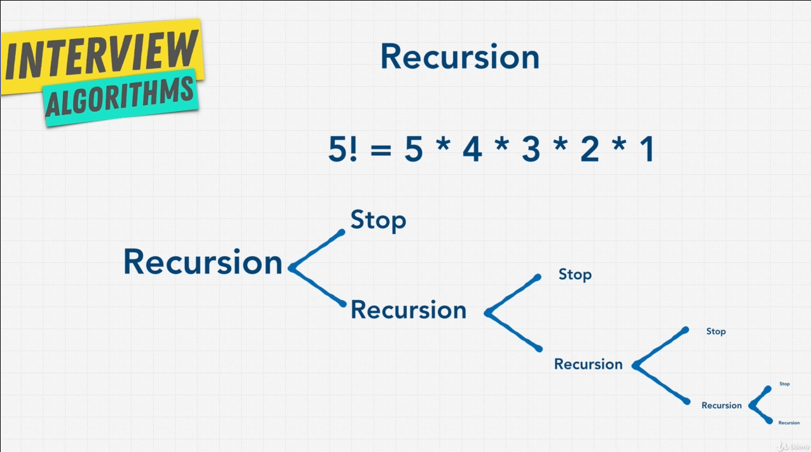
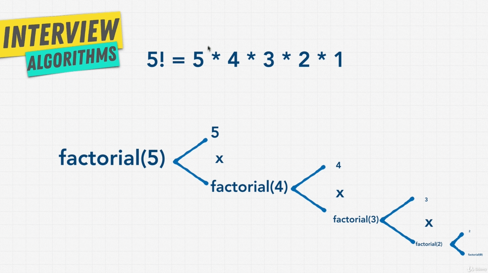
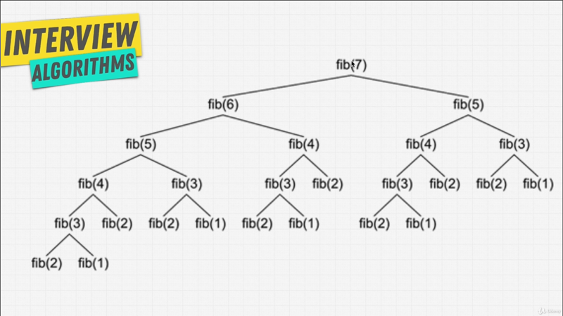
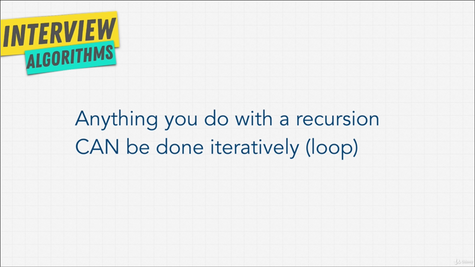
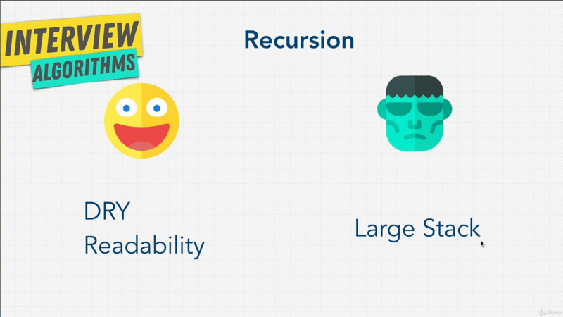
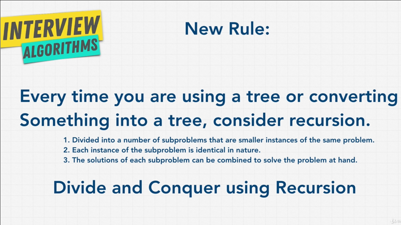
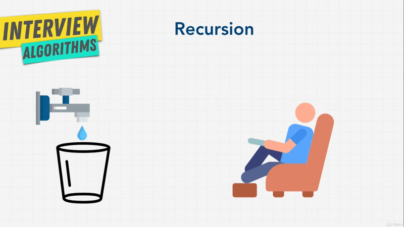
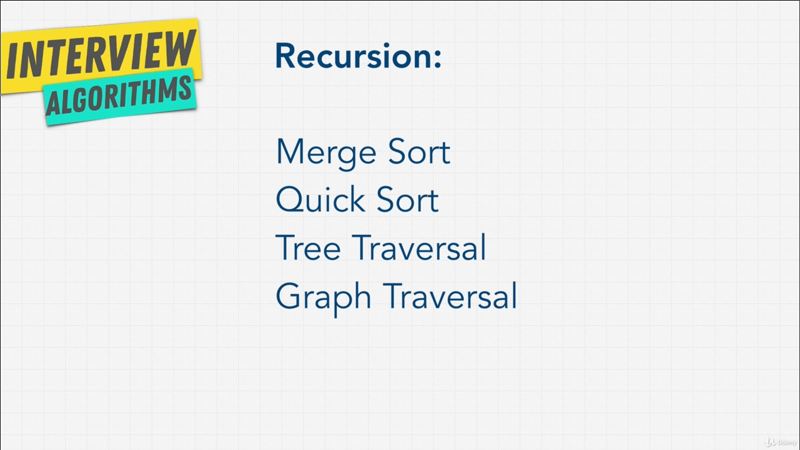

# Chapter-10 Algorithms Recursion

## Table of Contents
1. [Introduction to Algorithms](#introduction-to-algorithms)
2. [Recursion Introduction](#recursion-introduction)
3. [Stack Overflow](#stack-overflow)
4. [Anatomy Of Recursion](#anatomy-of-recursion)
5. [Exercise Factorial](#exercise-factorial)
6. [Exercise Fibonacci](#exercise-fibonacci)
7. [Recursive vs Iterative](#recursive-vs-iterative)
8. [When To Use Recursion](#when-to-use-recursion)
9. [Recursion Review](#recursion-review)


</br>

## Introduction to Algorithms

Welcome to the algorithm section; this us a word that immediately just sounds
nice right?  All the companies are using it these days to sound like they're
doing something really really important. Everybody has a secret algorithm, that
they use to make a machine learning models, analyze user data; make companies
lots of money.

But underneath the hood, algorithms are just functions that programmers write.
A two line functions technically an algorithm, a thousand line algorithm that
sort through images us also algorithm.

Algorithms is simply steps in a process that we take to perform a desired action
with computers. If we go to Wikipedia and search lists of algorithms, the list
is pretty endless, there are a lot of algorithms, it's impossible to know all
of them. You can create your own algorithms, you can use other algorithms that
are popular and well established.

Let's get back to our question of what are algorithms? If we combine our
knowledge of data structures, the ones that we worked on in the previous
section; algorithms allow us to use language built in data data structures like
arrays and objects, or primitive such as integers and boolean, and even custom
data types like we did when we use the class keyword to create Stacks, Queues,
Binary Search Trees. Algorithms allow us to use these data structures to perform
actions on that data.

</br>


</br>

Remember this right, **Data Structure and Algorithms create Programs**. In this
course we're going to talk about the most common interview algorithms, so that
long list on Wikipedia won't be as intimidating, because we're only going to
focus on the want that matter, especially for interviews; but also the ones that
matter most in you career; specifically we're going to go over these topics,
when it comes to algorithms.

</br>


</br>


Now, whey are these algorithms so common in interviews, and especially in big
companies; Well, you can get away with not knowing these topics for a long time
as a programmer, but as we have learned Big-O and scalability of code, is
important as companies get larger and larger. By learning these listed
algorithms we're able to do majority of the scaling, we need to improve our
programs. Remember our Big-O cheat-sheet, and how we haven't really talked about
`O(log N)`, and `O(N log N)`.

Certain algorithms allow us to simplify our Big-O complexity into smaller or
better time complexity. So, by using the right algorithms I could take a
function that has a Big-O `O(N^2)` down to something of `O(N log N)` or
something that has a linear time complexity to `O(log N)`; and these are used
everywhere in large companies, because large companies handle a lots of inputs,
lots of data; so, this topics is extremely important to them, and as your career
grows and grows, these topics will be more and more important to you.

**[⬆ back to top](#table-of-contents)**
</br>
</br>


## Recursion Introduction

I'm actually starting with a bit of a trick here; recursion, which we're going
to talk about in the next couple of lectures, isn't technically an algorithm,
it's more of a concept that we are going to use throughout this section of the
course to write some really interesting algorithms when we get into _sorting_
and _searching_ through a Binary Search Tree, we're going to be using recursion
a lot; so, I want to prepare you, and obviously it's also a common topic in
interviews.  Actually this is the most popular topics I would say when it comes
to interview.


Now, what is Recursion? Really, when you're searching for files on a computer;
for example, if you're on your desktop and you want to find all music files
you're using MP3 files on your computer, you can't do it by just looking at one
folder, you want to look at folders recursively to find all your music. Let me
show you what I mean.


I have the [project
here](htttps://github.com/aneagoie/smart-brain-boost-api-dockerized) that we've
used for one of my other courses and it's a back-end API in Docker. Now,, life
cloned this repository, and I have it right here on my desktop, now If I want to
search through all the files in this project I can simply type an `ls` to show
me the files; but as you see, in blue here we also have folders that inside of
them also have files, how can I also see the files in this blue folders? I can
do something called `ls -R`, `-R` stand for recursively, if I do press Enter
loot at that, I get also the files inside of the folders. You see I have a
controllers folder with `.js` files, I have postgres folder with some
`Dokcerfile`, some  `.sql` file, and with in those I also have another folder that
has different files but, because I was able to lust items recursively, my
computer went inside of each folder and printed out the files.


So, what is Recursion? Well, recursion is when you define something in terms of
itself, simply it's a function that refers to itself inside of the function.
Alright there's no way you get that right? That's probably the most confusing
definition ever.

```javascript
function inception() {
    inception();
};
```

Again, let me show you a different example; If I open the console on browser, a
recursive function is a functions that refers to itself. So i can create a
function called, let's say `inception()`, and this function is recursive if I
refer to itself inside of it.  This is a recursive function; because, when this
function runs, it's going to call itself and run again.

The problem with recursion, and why people find it so difficult is, that it's
and intimidating topic when people start talking about math and theoretical
applications; instead, let's focus here on how recursion helps us to solve
problems. Recursion is really good for tasks that have repeated subtasks to do
that, that it. It kind of like when we looked at the folders inside of this
project, and the reason recursion is so important and the reason that I talk
about it first in this section before we dive into all the other algorithms is,
that this concepts us going to be used in _searching_ and _sorting_  algorithms
that we're going to be talking about; for example, _traversing a Tree_, if you
think about it, are simply same tasks that we do over and over again.

```javascript
function traverse(node) {
    const tree = { value: node.value };

    tree.left = node.left === null ? null : traverse(node.left);
    tree.right = node.right === null ? null : traverse(node.right);
    console.log(tree)

        return tree;
};
```

Remember when we build our own Tree data structure, our Binary Search Tree, and
I gave you a little function at the end called `traverse()` that allowed us to
print out our Tree, so we can verify our answer. If we look at this closer, we
see that we're using recursion here.

I have `traverse()` functions that calls itself within here, and this is
something that we're going to demonstrate a lot when we talk about _searching_
and _sorting_ in the upcoming sections.

Recursion is everywhere. When we do DOM traversal on a Website, if we go to
elements here, when we do this traversal on an HTML Document Object Model we're
using recursion. In JavaScript, when we have a nested object, so an object
inside of an object; well, we use recursion, but the key to getting recursion is
to understand, hat it's not that complex, as long as you practice it a little
bit, once you get it, and get over the initial hump, then it becomes second
nature; and my goal by the end this lectures, that you're going to get
recursions, so let's get started.

**[⬆ back to top](#table-of-contents)**
</br>
</br>


## Stack Overflow

I'm about to show you my favorite animation of the course, I'm very proud of it;
So, don't laugh at me if you think it's so.

I like to think Recursion as this scenario, where you have this top pouring
water into a glass for this little man that's sitting on the couch watching TV;
and when I think about Recursion, I like to think that they have two big
problems. One, is that, well they're kind of difficult to understand at first.
The Second, is that, we can have a case like this, where I'm pouring water into
a glass and pouring water and that is me calling the function over and over and
over; and as we keep going fills up the cup, past it's limit, it keep going, it
doesn't stop, it keep calling the function, keeps going to function until the
man is drowned.

What just happened here? This called Stack Overflow. Let's go back to some code.

```javascript
function inception() {
    inception()
}

// Result:
// Uncaught RangeError: Maximum call stack size exceeded
```

Remember the function `inception()` that we created, I run this function and
simply I'll get an error. I get an error saying "Maximum call stack size
exceeded". My browser is smart enough to say, "all right, you've got to stop
this madness, I'm just calling this inception function over and over and over",
because remember our function just calls itself, and eventually if my browser
doesn't stop , this going to crash; and in the past, that's what would happen if
I run this function, the browser would crash, and I would have to restart it;
but, they've added a safeguards here saying, "hey, you've called the maximum
call stack size, you've got stop what you're doing".

Now, this is called stack overflow, why is that? Let's dive deeper into this
topic.


```javascript
function inception() {
    debugger;
    inception();
}

```

This time, I'm going to add a keyword called `debugger` that the browser is
going to detect and pause the function when it sees this word `debugger`. So,
I'm going to run this function and you'll notice that as soon they hit enter
it's going to stop and give me a little panel here where I can control the
function; let's hit enter, there you go, I'm now in debugger mode, and you'll
see here a few things, _One_, will show me where I am, and the function and also
show me something called **Call Stack**. Now, from the name Stack Overflow, this
might give you a bit of hint.

Right now, we've called the `inception()` function, we haven't called it the
second time around, if I click on the _step over_ icon, it's going to go to the
next line of code; it's going to go to the next; and now it's going to call the
next `inception()` function.

Have a look over here at the **Call Stack**, as to what's going to happen next.
Did you see that? I just added another function on the **Call Stack**, and as we
know about Stack data structure we're just adding the function call on top of
the older one, and if I click _step over_, a third function call, and if I keep
going over and over again, you'll see I'm just adding more and more things to
the Stack.

There's a problem here right? Nothing's getting popped from the stack; instead
the function just keeps running until we run out of memory. Remember Stack in
this case, is grabbing a piece of memory from our computer, and adding
`inception()` to the Stack, and as you know memory is limited, we don't have
infinite amount. So, as we keep goings, it's going to Stack Overflow, and throw
an error; and this is one of the biggest problem with Recursion, that we're
going to get into later on.

As you see here though, it can be very very dangerous, because we can run
programs that overflow, that never stop, that have infinite loops essentially
that crash our programs. You also see here, that this costs memory, a Stack is
holding these function calls, and Recursion, one of it's downside is that, we
have to hold onto these calls and remember them one by one, which can get really
expensive.

So, if you ever get asked this question in an interview about Recursion, maybe a
possible problem with Recursion, you can simply say, "Well, the computer need to
allocate memory to remember things, Stack Overflow can occur when we have
Recursion and there's no way to stop this recursive call", it's simply the
computer saying, "I'm not remember anymore things, cause I'm out of memory, I'm
just calling error out".

In the next lecture, we're going to try and solve this problem and learn about
something called a **Base Case**, I think that you have to have in a recursive
function to stop it form out of memory, and not keep the function all in a Call
Stack.

**[⬆ back to top](#table-of-contents)**
</br>
</br>

## Anatomy Of Recursion

Every recursive function needs to have something called a **_base case_** or a
**_stop point_**. Remember my example at the beginning where I showed you how
recursively check out all the folders in one of our projects; We have to tell
the program, "Hey, if this subfolder we're going to no longer has any more
folders, stop; If this stop wasn't there, the function would just keep running.

So, recursive function have **two paths**, One, is the **_recursive case_**,
that is call the function again, and run it; and then the **_base case_**, that
is stop calling the functions, there's noting more to search.

So, how can we add this feature to telling the function, "Hey, quit it, you're
being ridiculous right now, you need to stop.". Well, we can do something like
this,

```javascript
let counter = 0;

function inception() {
    if (counter > 3) {
        return "done";
};
    counter++;
    inception();
};

inception();

// Result
// => Undefined
```

We can create a `counter`; and we'll say, this counter is `0`; and we can add a
_conditional statement_, will say that `if` the counter is greater that `3`, in
that case just return `done`.

Otherwise, we'll call inception; But we also want to increment the `counter++`
by `1`.

So, if I run this function right now, what do you think will happen? I get
`undefined`.

Is that what you expected? Just to show you something,

```javascript
let counter = 0;

function inception() {
//     if (counter > 3) {
//         return "done";
// };
//    counter++;
    inception();                // [1]
    console.loog("hello?");
};

inception();                    // [2]

// Result
// => Undefined

RangeError: Maximum call stack size exceeded
    at inception2 ()
    at inception2 ()
    at inception2 ()
    at inception2 ()
    at inception2 ()
    at inception2 ()
    at inception2 ()
    at inception2 ()
    at inception2 ()
    at inception2 ()
```

If I comment above code out and we just do this `inception()` where we just keep
inception and perhaps do a `console.log()` here, saying `"hello?"` and I click
run. I get "`RangeError Maximum call stack size exceeded`".

We know, by looking at above function, this version of the function that it's
never going to get to `console.log()`, because as soon as it hits the first line of
the function it's going to go back and say, "Oh, I'm calling this `[1]` " and
then kind of go to call function at here, `[2]`, is just to bounce back and
forth back and forth, never getting to `console.log()`.

But, if we go back to what we have before, well our function clearly has ended,
it hasn't done Stack Overflow and at one point it's ended, because increment the
counter.

```javascript
let counter = 0;

function inception() {
    console.log(counter)
    if (counter > 3) {
        return "done!";
    };
    counter++;
    inception();
};

// Result
// 0
// 1
// 2
// 3
// 4
```

So, let me `console.log(counter)`, if I click run I get `0, 1, 2, 3, 4`; when it
gets to `4`, `counter > 3` we `return "done!"`; but why there's no `"done!"` in
result? This is a great illustration of how recursion works.

Let try this small function into Web-browser console,

```javascript
let counter = 0;

function inception() {
    console.log(counter)
    debugger;

    if (counter > 3) {
        return "done!";
    };
    counter++;
    inception();        // [XX]
};

inception();
```

This time around I'm going to add the `debugger` keyword, so that we can
debug our code and go step by step through it. Let's run our `inception()` in
debugger mode.

We see that we have the Call Stack, `inception()` has just been called by me,
and I also open up this little tab called _Scope_. For our case we want to just
open up the _script Scope_, it shows us what variables we have available to us;
in this case we have a `counter` which is `0`.

So, I'm going to click _Step Over_, and it's going to say, "Hey, we have counter
is equal to `0` is that greeter then `3`?" Nope, I'm going to skip over
increment `counter`, and run `inception()`; you see that? `counter` has now been
incremented, because we've gone through to `counter++`; and now we go to
`inception()`, we're going to run the function again, and you'll notice that the
Call Stack when I click _Step Over_, is going to increase.

You'll see counter goes to `2` in _Scope_ tabs, and we're going to run
`inception()` again. We keep going once more, passing through, `counter` becomes
`3` in _Scope_ tabs, adding `inception()` to Stack Call, and then one more time,
and `3` is not greater then `3` cause now counter is `3` right?.

So, we go one more time, calling `inception()`, adding into Stack, we have `5`
function at our Stack, `counter` is it `4` now in _Scope_ tabs which is greater
than `3`, We're finally going to enter the `if` condition, that going to return
done for us.

I click next or we called _Step Over_ icon button, look that, we have a local
variable now, that has return value `"done!"`. We've now return `"done!"` and
we're no longer going to call `inception()`, the Call Stack is now going to
start is going to start popping off all the function because we have a `return`
keyword, I'm going to stop whatever I'm doing at the bottom, and return from
this function.

So, this `inception()` function is going to get return `"done!"`, but notice
what happens next. I get `Return value: undefined` in _Scope_ tabs as we popped
off the tip item form the Call Stack; and if I keep popping things from the Call
Stack, the return value is undefined, and tht's why we get.

Now, why is that? Well, if we go back to our functions, what you just saw was us
essentially doing calling `inception()`, we called inception 4 times.

```javascript
inception(inception(inception(inception())))
|         |         |         |
|         |         |         |-- 4th
|         |         |-- 3rd
|         |-- 2rd
|-- 1rd
```

Within the `4th` call, we said return `"done!"`. So the `4th` inception function
turns into done,


```javascript
inception(inception(inception("done!")))
|         |         |         |
|         |         |         |-- 4th
|         |         |-- 3rd
|         |-- 2rd
|-- 1rd
```


Then we go the `3rd` function. Now, the problem with this, and I know this
little bit confusing, is that once we returned, once we popped off the Stack, and
we're now at `3rd` part of the inception; But this inception `[XX]` never return
anything. Wen a function doesn't return anything, it just return `undefined`.

So, we need to keep telling it, to return this `"done!"` and bubble it up
towards the very end; and this is something that you have to keep in mind with
recursion.

There is usually a **_base case_** and you always want to make sure, you return;
So, that the value you want gets bubbled up all the way to top. In our case, all
we need to do is, say `return inception()`


```javascript
let counter = 0;

function inception() {
    console.log(counter);

    if (counter > 3) {
        return "done!";
    }
    counter++;

    return inception();
}
// Result
// 0
// 1
// 2
// 3
// 4
// => "done!"
```

With this way, the `3rd` inception function knows to return whatever
its result was, which was `"done!"` in the `4th` function, which again is
`"done!"`; so on and so forth, until we get return value which is `"done!"`.

### Tips `debugger` Keyword

What  I just showed you is all you need to build Recursive function. You have
the **three rules**:

1. Identify the **base case**.
2. Identify the **recursive case**.
3. Get closer and closer an return when needed. Usually you have 2 returns for
   the **base case** and **recursive case**,

Because you want to return something at the end of the function.


We have an idea of how Recursion works, the function simply get closer and loser
to the **base case**, and once it gets to the **base case** it finally return
and pops functions off the Stack.

But that's enough talking for me, I think it's time for us to do some coding
exercises to get really familiar with this topic.

I'll see you in the next one.

**[⬆ back to top](#table-of-contents)**
</br>
</br>

## Exercise Factorial

Welcome back, I have a fun little exercise for you, and now you're asking
yourself, Andrea you say all the exercise are fun? You are the big liar.
Alright, fair point, I think this one's going to be fun.

I want you to write actually two functions that finds the _factorial_ of any
number. Why two functions? Well, one function is going to be recursive using
what we just learned, where we have to create a **_base case_**, we have to
follow the steps right?. If we go back we have to `[1]` Identify a base case,
`[2]` Identify the recursive case, and then finally `[3]`  make sure that we
were return to turn both cases.

So this recursive function `findFactorialRecursive()` is going to return an
answer, but what is a factorial?

</br>


</br>

A good way to think about factorial, is this notation `5!`, five exclamation
mark. Factorial simply means multiply `5 * 4 * 3 * 2 * 1`, you keep going down
one by one, multiplying each number until you get to `1`. So, `6!` factorial
will be `6 * 5 * 4 * 3 * 2 * 1`.

You'll notice here, that it's a recursion pattern that we're doing, we call the
function and we have two cases that can happen, we have the **_base case_** to
stop, or **_recursive case_** and so on and so forth; we keep going and keep
going until we hit `1`.

</br>


</br>

So, I want to build a function that does this for us. I'm going to write the
function `factorial(5)`, and it's going to run through this. But remember, our
definition of recursion; **recursion is when you define something in terms of
itself**.

Now a good way to think about factorial is this, `5!` factorial is simply `5  *
4!`. `5! = 5 * 4 * 3!', because `4 * 3!` is factorial(4).

You can see here, how we might have a recursion function that we can write.

Using this knowledge, see if you can create a function that allows you to do
this. Now, when it comes to this question, there's two ways that you can go
about it. you can do the _recursive approach_, where the function calls itself;
or you can do _iterative approach_. which means looping and most of you are
probably to find it easier to solve it with _iterative approach_ with just a
`for-loop` for example.

I'm going to leave this up to you to figure out. See if you can do both
functions, and see if they give you the right number.

### Solution Factorial

#### Iterative Approach

Let's start off with the **iterative approach**, that is no recursion. If we
want to run the function let's say

```javascript
findFactorialIterative(5);
```

Well, we can create a variable,


```javascript
function findFactorialIterative(number) {
    let answer = 1;

    if (number === 2) {
        answer = 2;
    };

    for (let i = 2; i < number; i++) {
    }

    console.log(answer);
};

findFactorialIterative(2)

// Result
// 2
```

let's say `answer` and for now this answer will be `1`. All we're going to do is
do a `for-loop`; will say `let i = 2;`, in our case to simplify things we start
`i` with `2`, I'm going to explain in a second, why we want to start a `2`. I'm
going to say `1 < number`; and then we're going to increment `i` by one `i++`.

Why are we starting at `2`? You might notice a shortcut here, `1!` factorial is
just `1`; `2!` factorial is `2 * 1` which is just `2`. So these last two bits,
if somebody says `1!` or `2!` factorial which is just simply return the number
that they're entered; because there's no real calculation that we need to do.

So this is a little shortcut, we avoid extra loops, but just saying that if the
number that the user enters, is let's say `2`; so that is `2 < 2`; the way we
have it now, if somebody enters `findFactorialRecursive(2)` we're going to
return `1`.

But instead we can just say maybe a _simple conditional check_, saying that if
`number === 2` we'll just say `answer` is equal to `2`.

I run this function, `findFactorialIterative(2)` I get `2`. If I say
`findFactorialIterative(1)` I get `1`; and there's other check that we can do
obviously, but for our case this is good enough.

Let's look at what we can do inside the `for-loop`. Well the way factorial works
is to simply to say `answer = answer * i`. So that if I test with
`findFactorialIterative(5)` I get `24`; which is actually not the right answer,
because it's clearly higher then `24`. That because a little mistake in `for
(let i =2; i <= number; i++`. If I run this again, I get `120` which is the
right answer for `5!` factorial.


#### Recursive Approach

```javascript
function findFactorialRecursive(number) {

    if (number === 2 || number < 2) {
        return 2;
    }

    return number * findFactorialRecursive(number-1)
}
findFactorialRecursive(5);

// Result
// 120
```

What about the Recursive approach? In the recursive version, we'll just do a
simple check saying if `number === 2`, and we can do other check as well, but
that should be enough; for now, for us to create a **_base case_**; so, if the
number gets to `2` we'll just return `2`. There's our _base case_, that's how we
stop.

We could also do the check `number < 2`, so we return `1` when number is less
then `2`.

Next, we're going to return our recursive version which will simply be number
times the function `findFactorialRecursive()` with `number - 1`, and that's the
key here. We want to always get lower and lower until we hit the base case.

Now, if I run this function `findFactorialRecursive(5)` I also got `120`.

This is a little hard to wrap your mind around. So, you might want to copy
`findFactorialRecursive()` code and open up your console browser developer tools
like I showed you, and got step by step.

But, if we start with the number `5`, it's `5` equal `2`? Nope, then we'll say
`5 * findFactorialRecursive(4)` should be our answer. Just like the diagram that
I showed you. We keep going and keep going until we hit the _base case_ of the
number equal to.

Now, one last bit, what do you think the Time Complexity of these two functions
are? One uses a `for-loop`  with the loop being the number associated with it,
and we're doing a but of shortcut here, so it's technically less than of `O(n)`,
but because of our Big-O rules, this is still going to be `O(n)`.

the recursive function, if we look at this, we are looping how many times? Well,
we calling the function, function find factorial recursive, the same number of
times as the number itself; or with shortcut in case of _base case_. So this
also become `O(n)`.

If you got these question, good job it's tough one, if you didn't, don't worry
we have another one coming up. I'll see you in the next one.

**[⬆ back to top](#table-of-contents)**
</br>
</br>

## Exercise Fibonacci

You can't talk about Recursion without talking about the Fibonacci sequence.
What is the Fibonacci sequence? Well it's this

```javascript
// 0, 1, 1, 2, 3, 5, 8, 13, 21, 34, 55, 89, 144 ...
```

If you notice, the pattern is that we're always adding the first two items
equals the next number. So `0 + 1` is equal `1`; `1 + 1` is equal `2`; `1 + 2`
is equal `3`, so on and so forth. So, the previous two numbers always equals the
current number.

So, I have another exercise for you; this one a little bit tougher than previous
one. Given a number `N` that the function's going to receive; return the index
value of the Fibonacci sequence. So, if I say, that I want the `N` to equal `2`
it's going to give me `0, 1, 1`, this function is going to return `1`. If I say
Fibonacci number `8` I would get `0, 1, 1, 2, 3, 5, 13, 21`, I would get `21`.

The function will tell me what number is associated with the index that I give
it. Once again I have the **iterative approach**, that is using just simple
`for-loop`; and also the **recursive approach**.

I challenge you to try both of these, and see if you can do it. A big hint here
is, that the _recursive approach_ is actually easier that the _iterative
approach_. So, good luck out there, and I'll see you in the solution lecture.

### Solution Fibonacci

Let's actually start off with the _recursive approach_ this time, because in
this case the _recursive approach_ is actually a lot simpler to think about.

#### Recursive Approach

```javascript
function fibonacciRecursive(n) {
    if (n < 2) {
        return n;
    }
    return fibonacciRecursive(n-1) + fibonacciRecursive(n-2);
}

fibonacciRecursive(3)
```

All we would do with our Recursive function s to say, well the base case is
going to say number for `(n)` is going to equal to `2` if that's the case,
if we actually look at the sequence (`0, 1, 1, 2, 3, 5, ...`) we see that if the
index is `0`, the answer is `0`; if the index is `1`, the answer is `1`; and if
the index is `2`, the answer changes to `1`.

So, instead our _base case_ can maybe just simply be, `if (n)` less then `2`
we're always going to just return whatever the `n` is. So, if we say `0`, it's
going to return `0`; if we say `1`, is going to return `1`; if we have an index
higher than that, well then we have to do some recursion.

All we're going to do here, is have another return statement, and say this
function is going to equal `fibonacciRecursive(n-1) + fibonacciRecursive(n-2)`,
because, remember the sum is always, the answer is always the numbers `1` and
`2` before it. So, we're just adding the number `1` and `2` before our
sequence, that's it.

If we run this function, let's say if we've `fibonacciRecursive(3)` I get result
`2`, because index `3` from Fibonacci sequence is `2`. Let's do
`fibonacciRecursive(8)`, I get result `21`, nice. If I do
`fibonacciRecursive(0)` I get `0`; if I do `fibonacciRecursive(1)` I get `1`; if
I do `fibonacciRecursive(2)` I get `1`.

Nice and simple. Well, I don't know about simple. You really have to get
comfortable with this before you truly understand what's happening. But, I have
a little diagram here to help you.

</br>


</br>

All we've done is simply this. If I added `7` here, our recursive function is
going to get one less then `7`, and two less then `7`; and then within those
function, do the same thing, one less than `6`, two less then `6`; one less than
`5`, two less than `5`; and it's doing all of these until we get to `fib(1)` to
where we have our _base case_ that returns that number.

This is a diagram that we're going to get back to; but you see, we're doing a
lot of calculations; but simply put this is all we're doing.

Now, I said that, the _recursive approach_ is actually simpler than the
_iterative approach_. Let's have a look at what the iterative approach would
look like.

#### Iterative Approach

```javascript
function fibonacciIterative(n) {
    let arr = [0, 1];

    for (let i = 2; i < n + 1; i++) {
        arr.push(arr[i-2] + arr[i-1]);
    };

    return arr[n];
};

fibonacciIterative(3)
```

We'll create an array, and there's many ways of doing this, this is my preferred
way, and this array is going to have to the initial items of the sequence,
that's `0` and `1`.

This is going to first of all return the array an item of `[n]`; we're creating
of Fibonacci list, and then grabbing whatever index the user wants. In our case,
if the user requests `0` or `1`, we already have the array refilled with `0` and
`1`, and it's going to return the same, but we still need to calculate for all
the other ones.

That's where we do a `for-loop`, and say let `i` equal `2`, because we're going
to start adding, when the index `2` to start filling this array. We'll say `1`
is less than `n + 1`, or we can do equal here if you want, we'll leave it at
that for now, and we'll increment `i++`.

In this `loop` we're going to keep going until we hit the number of index that
we're interested in, and all we're going to say is `arr.push(arr[i-2] +
arr[i-1]`)`. Similar to what we did before, we're just summing the previous two
numbers and pushing it to the array.

Let's see if this work, If I run `fibonacciIterative(3)`, I get `2`; what about
`findFactorialIterative(8), I get `21`, perfect; and if I do
`fibonacciIterative(0)`, I get `0`; `fibonacciIterative(1)`, I get `1`; and the
last `fibonacciIterative(2)`, I get `1`.

Now, I said that, the _recursive approach_ is simpler than the _iterative
approach_, that's my personal opinion, you might not think that _iterative
approach_ is quite easy, but to me _recursive approach_ is reads a lot nicer
than all _iterative approach_ we're doing. This is something we're going to get
into in the next lecture, where we talk about the trade-offs between the
_iterative_ and the _recursive_ approaches to these problems, and why? Maybe
you're wondering right now, why would we ever write anything Recursive, if you
find this confusing? We'll get to that.

The one thing I want to show you is, something that we just learn here, that is
new to us. What do you think the Big-O of these two functions are? Well, in our
_iterative approach__ the Big-O is linear time right?  It's `O(n)`; basically
we're just iterating through the `loop` and `O(n-2)` times, because we're skipping
the first two items which in turn makes it `O(n)`.

What about the _recursive approach_? Remember the diagram I showed you, that's a
lot more calculation than just the seven right? We've a lot of function calls,
that happen in this case in the recursion solution, it takes what we call
**Exponential Time**, the size of the Tree, exponential grows when and
increases. If Fibonacci number was `8` we would have this Tree as well as
another Tree underneath the `fib(8)`. So what is the Big-O of that?

This is very exciting, because we're learning about a new Big-O notation. We
learning about `O(2^N)`, we're learning about Exponential Time. Which can be
seen with recursive algorithms that solve a problem of size `N`. _`2` to the
power of `N`_.

If we go to our Big-O cheat-sheet, we can look _`2` to the power of `N`_, you
see how much it increases? That's pretty bad. It's bigger than even `O(n^2)` (n
square), the two nested `for-loops`.

Exponential Time means, every additional elements in the Fibonacci sequence, we
get an increase in function calls exponentially.

Here's a fun little trick, although this is `O(n)` the _iterative approach_; the
_recursive approach_ because it's `O(2^n)`, If I run
`findFactorialRecursive(40)` you can see how much longer that took to calculate.
Because our Time Complexity is increasing more and more. Now, if I do
`fibonacciRecursive(43)`, you'll see that we're waiting and waiting for the
calculation to happen, and eventually the browser comes up with the calculation.
As a bonus question, think of how many calculation `fibonacciRecursive(43)`
required? Although, might be more readable, is not in **ideal solution**, as you
can see Big Time Complexity is pretty big, and this is something that you might
get asked in an interview, and I know what you're thinking; Andre, you just
taught us about Recursion, and it's not even good, it's slow, it's confusing,
why would I ever want to use Recursion?

In the next lecture, I'm going to talk about this trade-off. Why would you ever
use Recursion over something that is iterative. Why would any sane person do? As
you find out there, some pros and cons and as a matter of fact like `O(2^n)`
such as Fibonacci sequence and recursion can be made to `O(n)` using something
like dynamic programming and memorization, which we're going to talk about
toward the end of this course, and we're going to get back to this; but let's
finally answer the question in the next lecture. **Why would you ever use
Recursion over something iterative?**

**[⬆ back to top](#table-of-contents)**
</br>
</br>


## Recursive vs Iterative

</br>


</br>

There is a theorem that states anything that can be implemented recursively can
be implemented iteratively. That is, you can go your whole life without
implementing _recursive function_ and just use `loops`.

So, why would we ever want to confuse yourself with a topic like Recursion that
can be a little confusing? Well, some problems it's actually easier to write,
but it really depends on the situation. Keep in mind, that there's two options;
and by now you know that with programming, there's always pros and cons; and a
good engineer is somebody who can make the right decision based on those pros
and cons.

But, I want you to keep this on mind for interviews, because interviewers will
ask you to solve a problems; and the problems can solve with Recursion can
usually be solved Iteratively as well.


Looking at our Fibonacci functions, this is a simpler example of Recursion, but
there are times when Recursion can keep you code DRY; A big rule when it comes
to programming, and there are a lot problems when it comes to Recursion, as it
get harder and harder; when using recursive functions, it's allow your code to
be more readable and also DRY; simpler, have less loops happening with confusing
code. I'm little bit biased, because although, recursion is a powerful
technique, in my opinion it's not always the best approach.  So, you need to
make sure, because of it;s main drawback.

</br>


</br>


That is, although recursion can keep your code DRY, and make your code more
readable, it also creates this extra memory footprint. Because, every time we
add a function to the Call Stack, it adds extra piece of memory. So, you have
cases where you can get Stack Overflow; or if you system has expensive memory,
you want to avoid making too many recursive calls, and for some people recursion
is also something that is hard to wrap your mind around; and if we have a team
of young engineers of developers that aren't familiar with recursion that may
not be the best option.

But, the main drawback is this, that iterative approaches tend to be more
efficient, because they don't make these additional function calls, that take up
the Stack Space, with the downside being that, iterative solutions might be not
as readable; and the rule that I like to follow is, that **I like to use recursion
when you're working with data structures**, that you're not really sure how deep
they are, where you don't know how many loops to go through.

As you'll see, recursion is really useful for things such as Tree data
structures and doing traversal, because that is often the case.

In the next lecture, I want to talk about this topic a little bit deeper and
when to use recursion; but, I do want to point one thing quickly, there's
something call **Tail Call optimization** in many languages. For example, in
JavaScript with ES6, it allows recursion to be called without increasing the
Call Stack. You can read more about it, in the resources that are provided to
you in this [course](https://2ality.com/2015/06/tail-call-optimization.html);
but in another language as well, there are certain ways to write recursion; So,
there are more memory efficient.

So, this large Stack issue can actually be resolved during production, but let's
talk about a definitive guide to when to use recursion in the next lecture.

**[⬆ back to top](#table-of-contents)**
</br>
</br>

## When To Use Recursion

When should we use Recursion? This is the role that I like to use. When it gets
to complicated problems like _traversing_ or _searching trough Trees or Graphs_,
something that we're going to talk about with Brute Force Search (BFS) search
and Depth Force Search (DFS), Recursion is really really useful, and better than
_iterative approaches_, and we're _sorting through **items**_. There's also
cases that will see that Recursion is preferred.

</br>


</br>

When it comes to Recursion, these are the rules that I like to follow every time
we're using a Tree or converting something into Tree consider Recursion; and
there's **three key** thing in an interview question that might trigger a
recursive solution.

One, is that a problem can be divided into a number of sub-problems that are
smaller instances of that same problems. Such as exercises we've done with
Fibonacci numbers or Factorial. We can break those down into little Trees that
break down to smaller and smaller pieces, those are inherently recursive
problems.

Second factor, is that each of these instances of problem is in identical in
nature. That is, the calculations that we need to do are pretty much the same.
They maybe smaller values but the actual calculations underneath it is all the
same over and over.

The third point, is those solutions if you solve the smaller problems those leaf
nodes of that Tree and you combine them, that solves the problem at hand, then
that is a recursive solution that you can use.

You'll see a lot of Divide and Conquer using Recursion. Remember Divide and
Conquer which we mentioned when we got to the Tree data structure lesson's, it's
kind of like looking through a _phone book_; when you're looking for _Bell_ in the
phone book, you're not starting from _"A"_, and simply go one page at a time
from left to right; No, you usually split the phone book in the middle or try to
go to the _"B"_ section of the phone book and start dividing up the problem;
page by page until you get closer and closer. This Divide and Conquer type of
question usually have recursive in them.

As we know, the one thing that recursion can do, that looping can't; is that they
can make tasks super super easy, such as these types of problems (in term of
readability and coding).

```javascript
// Write down Traverse function with Recursion

function traverse(node) {
    // code here ...
};
```

As a matter a fact, I encourage you to write your own Traverse function, that we
use in our Tree data structure. This is something that we're going to get to
when we get to searching; in the algorithms section. But if you want to
challenge your self, see if we can write a Traverse function like I did above
using Recursion; and then also tried to write it with `loops`, you'll see that
with `loops` thing like Tree Traversal is a headache. I can't even do it on the
top of my head, with Recursion it's pretty straightforward, with `loop` you
usually have to maintain some sort of Stack to keep track of things, and it
really adds a lot of complexity.

So, use the rules above to notice when a recursive problem present itself during
an interview. I'll leave a few more exercise for you after this lecture; but as
we'll see we'll come back to this topic when we get into other algorithms
sections; and things will start to get clearer and clearer.

I'll see you in the next one.

**[⬆ back to top](#table-of-contents)**
</br>
</br>

## Recursion Review

When we talk about Recursion and Computer Science we're talking about a function
that calls itself. This type of technique is really good at some problems,
because of its ability to maintain **_state_** a different level of recursion.

</br>


</br>


Just like our coachmen watching TV here, Recursion can be thought of as a but of
glass that gets filled up with _recursive calls_ of functions; and then we start
popping from the top until the very last function get popped off, and return a
value.

</br>


</br>

One thing that w want to be careful of with Recursion, was this idea of Stack
Overflow, this added _Memory Space_ as we keep calling the same function over
and over until we possibly can reach a limit and get Stack Overflow.


The Rule of thumb that we learned is, that we should _use Recursion_ when it
makes code more _readable_; but sometimes it can be less efficient than
iterative (looping) solution; so we have to be careful.

</br>


</br>

We also learned the rule, that anything you do with Recursion can be done
iteratively; and in interviews you'll get asked the question of the pros and
cons of why we might want to use Recursive over Iterative.

I know I've brought this up before, but it's worth repeating. Recursion is
interesting and clever, but can be costly. So, you have to be really careful
with it, because _Recursion and Space Complexity are not friends_.

But, when it comes to some problems like Sorting and Tree Traversal, you'll see
that we're going to have to use Recursive solutions to make things simpler.

</br>


</br>

Specifically, when we talk about these upcoming topics, we're going to be using
Recursion. So, get ready for it. Merge Sort, Quick Sort, Tree Traversal, Graph
Traversal all use Recursion.

Now, we're equips a lot better to handle those situations that are going to come
up.

We're starting to build our mind map slowly and slowly, and you can see that
when it comes to Tree data structure, ask your self, should we use Recursion?
Most of the time you do want to use Recursion, but be mindful, that Space
Complexity or Stack Overflow can happen.

I'll see you in the next chapter.

**[⬆ back to top](#table-of-contents)**
</br>
</br>

