# Chapter-11 Algorithms Sorting

## Table of Contents
1. [Sorting Introduction](#sorting-introduction)
2. [The Issue With Sort Function](#the-issue-with-sort-function)
3. [Bubble Sort](#bubble-sort)
4. [Exercise Bubble Sort](#exercise-bubble-sort)
5. [Selection Sort](#selection-sort)

</br>

## Sorting Introduction

In the past when I learned about Sorting, it involved a lot of math, a lot of
different algorithms, and I just never really enjoyed it, because I didn't
understand why we need to know Sorting?, I mean, you just have a _sort function_
usually in programming language and that's it, right? I just never understood
the point of it, and you probably thinking the same thing.

Let me explain, in interview Sorting is _really important_. You hear question
lake take an array of numbers and _sort_ them; or the interviewer want you to
do something to some input, and they tell you that this input is Sorted, and
you're wandering why did they just tell us that? Why does it matter if it's
sorted or not?, and why do companies care so much about Sorting? If I can just
use the builtin _sort method_ in my own language.

Well, here's the thing, Sorting is not  a big deal when it comes to small input
data, you'd be right; you can do something like this,

```javascript
const letters = ["a", "d", "z", "e", "r", "b"];

letters.sort();

// Result
["a", "b", "d", "e", "r", "z"]
```


We've an array of `letters`, and this array simply has `["a", "d", "z", "e", "r",
"b" ]`; and if somebody asked to sort this, well we can just use something like
a _sort method_ that comes in most languages `letters.sort()`, If I run this
functions, I get back the sort letters; nice and easy, just sorted everything.

Why would companies ever ask such a simple question of us? You see the problem
is when inputs get larger and lager, kind of like when we talked about Big-O, we
don't care about small inputs; that's easy to do, especially with our modern
fast computers; it's starts costing companies a lot of money when we have to
perform operations on larger and larger _data sets_; that's when things becomes
a little bit crazy and expensive.

</br>


</br>


For example, Google has a ton of Websites that are indexed. What if they need to
sort those Websites? In a way, perhaps _sorting a news article_ based on the time
that it was released?; and because we are talking about Google here, we're not
talking about ten articles, we're talking about thousand, million more articles
sorted based on _date_.

What about Amazon? Amazon is all about Sorting, they sort their product based
on _category_, based on _price_, based on _rating_, and they have millions of
products.

What about Apple? Well, Apple has the Apple-Store, and they list all their
_apps_ in some of a sorted order, _podcasts_ in sorted order.

What about Microsoft? Well Microsoft, they need to sort of all their logs, or
let's say their data center around the world. So that if an incident happens,
they know where it's coming from.

What about Netflix? Well Netflix, they need to sorted their _shows_, their
_movies_, their _TV shows_, somehow, right?.

They can't usually just use a builtin _sort method_ that comes with the
language, and they usually need custom sorted method based on the data; so that,
they can lower their cost, and lower the operations that their computers need to
do.

Most places sort their data or pre-process it and these companies including
small one usually sort data to make sure that it's _meaningful_; if it's random
data that is not sorted, it's really really hard to access. So, most of the time
we sort data or pre-process it.

Now, the examples that I just talked about, they are a little bit silly, but it
does prove my point. For these companies if they do something wrong, or they do
it in an inefficient way, it means losing a lot of money. That's why they ask
these questions in an interview. They want to make sure you understand how
important the topic is, and then you can make right decision as you employee;
what sorting algorithms should be used based on the problems.

So, that's the goal of this section. I'm going to show you how to implement
Sorting on your own, if you want; but most importantly we're going to talk about
the **_different sorting algorithms_** available to you; and how we can make the
right decisions for your company, and obviously to a start coding interview.

Now, the reason that most Sorting Algorithm lessons get really boring, is that
there's so many Sorting algorithms. If we search sorting algorithms on
[Wikipedia](https://en.wikipedia.org/wiki/Sorting_algorithm), you get a pretty
large list, and implementing these Sorts one by one yourself, takes a lot of
time, but most likely you will never implement your own Sorting algorithm in
your life, except for maybe a simple one in an interview, because mos of these,
especially the advanced ones that are really fast, are done by academics that
spend years figuring out what the best most optimal way of Sorting is; and
interviewers don't expect to be able to implement every single Sorting
algorithm.

My goal in this section is, to teach the hight level; why you need to know to
become a better engineer; and also the coding interviews, I'll show you how to
implement some of the poor Sorting algorithms; but more importantly, we're going
to talk about the trade-offs between them so that you're able to talk about them
intelligently during an interview.

</br>


</br>

For the next few lecture, we are going to talk about these Sorting algorithms,
an also a couple of bonus ones towards the end; but the key thing to remember
is, that as more and more data is handled by our computers, which is a big
trending computing Sorting and Searching are two of the biggest Computer Science
problems in the software world.

 Searching, we're going to get into in the next section. But Sorting is
something we'll we have for the master at the end of this lectures. So, let's go
learn how to make a good decision when ti comes to Sorting.

**[⬆ back to top](#table-of-contents)**
</br>
</br>

## The Issue With Sort Function

Let's start about Sorting; when it comes to specific languages, and I'm going to
use JavaScript here. I'm going to be showing you different _Sorting Algorithms_
that it can be used with any type of data; It doesn't just have to be _string_,
it doesn't have just to be _numbers_, it can be any type of data. But I also
want to show you why sometimes you want to be careful when it comes to Sorting,
and just don't trust that your built in method and your own languages **_sort's
data correctly_**.

Let me demonstrate this with JavaScript,

```javascript
const letters = ["a", "d", "z", "e", "r", "b"];
const basket = [2, 65, 34, 2, 1, 7, 8];

letters.sort();
basktet.sort();
// Result
["a", "b", "d", "e", "r", "z"]

[
   1, 2, 2, 34,
  65, 7, 8
]
```

Let's say we have another array here, and this array will call it `basket`; and
this `basket` will have, instead of `letters`, it will have some _numbers_ `[2,
65, 34, 2, 1, 7, 8]`.

Now, we saw that, when we sorted the `letters` everything looked good. What
happen if I sort the `basket` here of _numbers_? What do you think will happen?
I get `[ 1, 2, 2, 34, 65, 7, 8 ]`. Is that what you expected? That doesn't look
sorted does it?

Now, this is silly example, but it's important to demonstrate; that when it
comes to sorting you want to make sure if you're not implementing it, you know
how it works. For example, when it comes to JavaScript, the way it _sorts
numbers_ is, that it actually convert then to _string_; at least that's how
_sort method_ works.

 So, what happens underneath the hood is, instead of just comparing _numbers_ it
does something along the lines of, if he gets to `65` and then it's going to
grab the character code in the first index;

```javascript
"65".cahrCodeAt(0);
"2".charCodeAt(0);
"34".charCodeAt(0);
"7".charCodeAt(0);

// Result
54
50
51
55
```

 So, we can use the method `charCodeAt()` and give it `0`; it's going to measure
the character code at `65`, if I run this I get `54`.

</br>


</br>

Now, `54` is Unicode, and if I go to
[unicode-table](https://unicode-table.com/en/), this whole characters are
encoded in our computers. Now if I go to `6`, when we hover the `6`, it's says
the HTML code for it it is `54`, the character representation is `54`. So that's
what happening here.

If I do `"2".charCodeAt(0)`  and  `"34".charCodeAt(0)`; I get, `2` is `50`; `34`
is `51`. But if I do like `"7".charCodeAt(0)`, it's going to grab `55`.

So, a lot of people get _confused_, when they use a _sort method_ like
`baskets.sort()` for sorting a _numbers_; they don't get the response as they
want it; and that's why it's good to **_read the documentation_** of whatever
you're using, such as _sort method_ and understand how it works in a language;
and to add even more confusion, you see
[here](https://developer.mozilla.org/en-US/docs/Web/JavaScript/Reference/Global_Objects/Array/sort),
that **the _Time_ and _Space Complexity_ of _sort_ cannot be guaranteed as it is
implementation dependent**.

Remember, JavaScript has a standard called `ECMAScript`, a governing body
suggest what it should look like. However, how you implement it, is really
dependent on different engines.

So, the Chrome browser would use a different JavaScript implementation than let
's say Firefox or Safari; and what kind of Sort algorithm they use underneath
the hood is, dependent on the browser; and that's something we're actually going
to talk about later on in this chapters.

But, to finish off this section about the weirdness of Sorting, let me show you
one more example.

```javascript
const spanish = ["unico", "árbol", "cosas", "fútbol"];

spanish.sort();

// Result
[ 'cosas', 'fútbol', 'unico', 'árbol' ]
```

Let's say I have an array of Spanish word here; and we want to sort these
`spanish` what do you think would be happen? `[ 'cosas', 'fútbol', 'unico',
'árbol' ]`.

Again, because of Unicode characters the letter `á` with the _accent_ on it; is
not the actual `a` that would come before something like `c`.

```javascript
spanish.sort(function(a, b) {
    return a.localeCompare(b);
});

// Result
[ 'árbol', 'cosas', 'fútbol', 'unico' ]

```

 So, in this case, to solve this problem, we would have to do something along
the lines of creating function inside of `sort()`; that takes `a` and `b` as
parameter which is the first and second item; and it's going to return a
`a.localeCompare(b)`, which allows us to compare a characters even if there were
a different languages. If I run above function, you see that it's now fixed and
everything is working.  Again,
[localeCompare](https://developer.mozilla.org/en-US/docs/Web/JavaScript/Reference/Global_Objects/String/localeCompare)
is something that you can check out.

Now, the reason I'm showing you this, is not because we want to become
JavaScript experts; Well, everybody has their own language, but to show you that
there's many ways that we can Sort things; and even more with small little
differences like `["unico", "árbol", "cosas", "fútbol"]`, there's a lot of
considerations that need to be had; and underneath, this `sort()` method is
actually one of the algorithms that we're going to learn about in this course;
and I also recommend you checking out [MDN
page](https://developer.mozilla.org/en-US/docs/Web/JavaScript/Reference/Global_Objects/Array/sort),
that's shows you how you can compare different things, such as _numbers_,
_objects_, and _items in object_ using `sort()` method.

In order to sort `basket` properly, we'd have to do something like,

```javascript
const basket = [2, 65, 34, 2, 1, 7, 8];

baskter.sort(function (a, b) {
    return a - b;
});

// Result
[ 1,  2,  2, 7, 8, 34, 65 ]
```

Where we have a function inside of the `sort()` method, that will take `a` and
`b`, which is first and second item; and we'll simply say return `a - b`. If I
run this function, we see that our _basket numbers_ are sorted.

That's enough for now. Let's talk about the Sorting Algorithms that are being
used in Computer Science in next lecture. I'll see you in that one.

**[⬆ back to top](#table-of-contents)**
</br>
</br>

## Bubble Sort

</br>

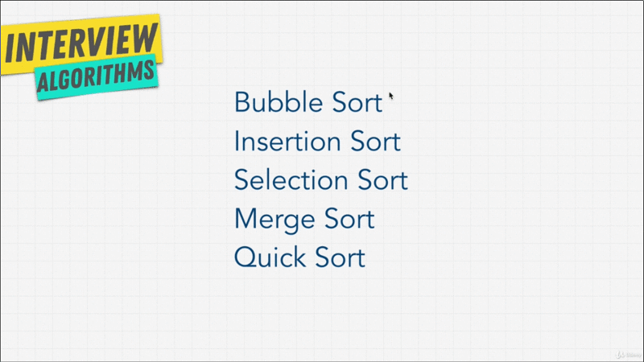
</br>

Let's start off with the very first item on our list. Bubble sort is part of
these first three Sorting algorithms. Here that are called **_Elementary
Sorts_**. They're very simple basic Sorting algorithms that you would usually
think of,if somebody asked you to Sort something at the top of your head.

The second item here that we're going to get into later **Merge Sort** and
**Quick Sort** are more complex algorithms; that most of the time can be more
efficient than the first ones.

But, to build that Lego block, let's start off with Bubble Sort. How does Bubble
Sort work?

</br>

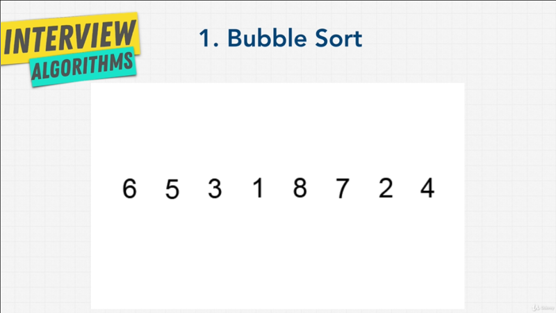
</br>


Well, let me ask you question, if I gave you a list and I ask to sort it in your
head; imagining that you had blocks of above letters, how would you move them
around? Or how would you tell a computer to move them around to Sort it; and
Bubble Sort might be the one of the first thing that comes into mind;s it the
Bubble Sort comes from the idea of _Bubbling Up_ the largest value using
_Multiple Pass_; let's see what I mean by that.

</br>

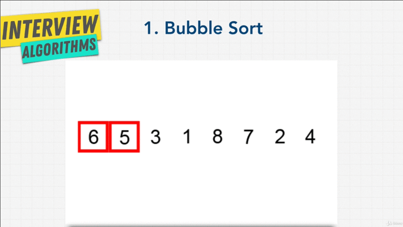
</br>

We look at `6` and `5`, and say is `6` is larger than `5`?; and then we look at
`6` and `3`, and say is `6` larger than `3`? Let swap them out; and then `6` and
`1`, once again `6` is lager than `1`, let's sort them up. We look at `6` and
`8`, `8` is _larger_ than `6` So we keep the way it is;

Let's move onto next one, `8` and `7`, `8` is larger than `7`, let's sort them
out; and `8` and `2`, swap them out; `8` and `4`,swap them out.


</br>

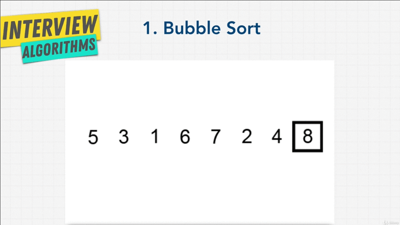
</br>

We Bubble Up the highest number and then we go from beginning. `5` and `3`; `5`
and `1`, we Bubble Up the largest number.

</br>

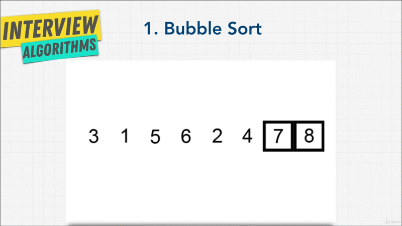
</br>

So, that `7` comes next;

</br>

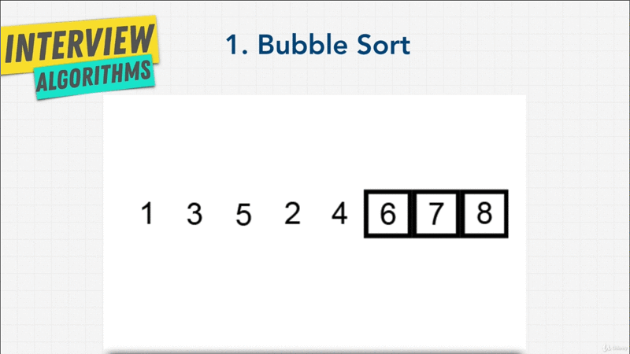
</br>

Then we keep going and going, until `6` coming next.

</br>

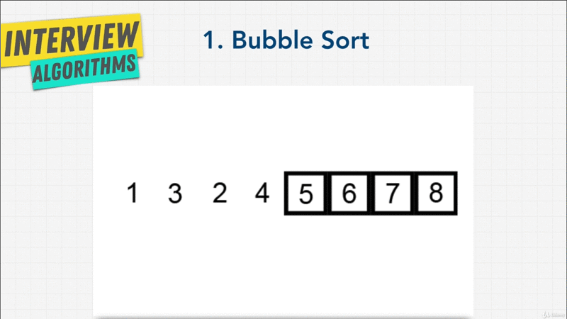
</br>

Then we keep `looping` until we Bubble Up the highest number, one by one.

</br>

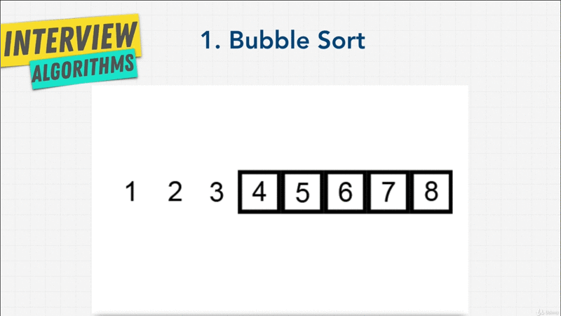
</br>

Until we have a sorted list.


That is Bubble Sort.

Now, before we even code this, what do you think of Bubble Sort? As you might
have guessed, is not the most efficient, is it? Look at how many comparisons we
did, and everything was one by one looping and looping; and Bubble Sort is one
of the simplest Sorting algorithm, but also one of the least efficient. So,
don't have me for showing you how this works.

It's usually used as a learning tool, as the first step in learning a certain
algorithm.

What do you think the **Time Complexity** and **Space Complexity** of this
algorithm is?  The answer, we can use Big-O cheat-sheet.

</br>

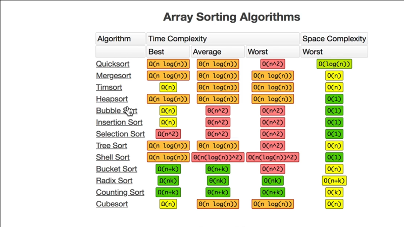
</br>

If we look at Bubble Sort, we see that the cases we're most interested in is,
the **_Average_**, and the **_worst case_**. We see that it's `O(n^2)`; with the
_Space Complexity_ of `O(1)`, we're not really creating any new data structures,
we're _just comparing items in nested loops one by one_.

But, let's see it in code, to see why this is all over `O(n^2)`?; and I want to
challenge you here. In the next lecture, we're going to code along the Bubble
Sort algorithm.

But if you want, go ahead and try implementing this on your own, and see how
your code matches up with me mine in the next lecture.

**[⬆ back to top](#table-of-contents)**
</br>
</br>

## Exercise Bubble Sort

Let's code our own Bubble Sort Algorithm.

```javascript
const numbers = [99, 44, 6, 2, 1, 5, 63, 87, 283, 4, 0];

function bubbleSort(array) {
    const length = array.length;

    for (let i = 0; i < length; i++) {
        for (let j = 0; j < length; j++) {

            if(array[j] > array[j+1]) {
                // Swap numbers
                let temp = array[j];
                array[j] = array[j+1];
                array[j+1] = temp;
            };
        };
    };
};

// Result
[ 0,  1,  2,  4,  5, 6, 44, 63, 87, 99, 283 ]
```

I'm creating a function called `bubbleSort()` that's going to taken a `array` as
parameter; and I have an array in variable called `numbers`. Ideally when we
enter this array of `numbers` into this functions, it spits out a sorted way.

Based on animation we saw, we ideally start from the beginning, compare first
and second item, swap out the items if the left one is larger than the right;
and keep going until the largest item ends up in the last index, and then we
loop over things again.

The first thing I want to do is, I'll just create a variable so I don't have to
keep repeating my self named `length = array.length` here; it shall be the
length of the items `numbers` variable, which should be `11`.

Inside here, we'll do a `for-loop` and we'll say `let i = 0; i < length; i++`;
and with in the `loop` we grab the first item; we know want to compare it with
second item and so on and so forth. We should know this by now.

We want to add another `for-loop`, it's going to `let j = 0; j < length; j++;`.
Now, in the second `for-loop` here, we'll say that _if_ `array[j]` at index of
`0`; so that is `99`; `99` is greater than `array[j+1]`, that is `44`.

So, if `99` is greater than `44`, in the _nested `loop`_; we'll say, let's **_swap
numbers_**. We can simply do that by saying creating `temp` variable, that holds
`array[j]` which the first pass will be `99`; and give the first index of `0` to
`array[j] = array[j+44]`.

Now, `99` goes into the second index, so than means `array[j+1] = temps`.

You might to go back to reading this nested loop. But all we're doing is just
swapping `numbers`; if the _left hand side_ is bigger than the _right hand
side_; and once is done we increment `j` to `1`; so, that we compare _index of
`1` and `2`_; and then we compare index of `2` and `3`; `3` to `4`; `4` to `5`
until we Bubble things up; and then we go to the top (`for-loop`) and compares the
items again in the _outer `for-loop`_.

Let's see if this works. If we run `bubbleSort(numbers)` and console log
`numbers` if it's Sorted; and now look at that `[ 0,  1,  2,  4,  5, 6, 44, 63,
87, 99, 283 ]`, our list (`numbers`) is now sorted.

That was Bubble Sort. As you can see, we have two nested `for-loop`; giving us
`O(n^2)`; but we're not really holding variables to another data structure, or
holding the `numbers` into other data structures. So the Space Complexity is
`O(1)`. As we can see in our Big-O cheat-sheet, Sort is probably not the best
algorithm, although it has good Space Complexity.

You can use the code hat I leave for you to play around with; but for now, let's
go on to our next Sorting algorithms.

Congratulations, you've just completed your first Sorting algorithm, but we have
more to go.

**[⬆ back to top](#table-of-contents)**
</br>
</br>

## Selection Sort

</br>


</br>

Let's talk about selection Algorithm; and it's called **Selection Sort**.
_Selection Sort_ is again one of the simpler possible ways to Sort the _list_
and the algorithm works by _**scanning a list of items for the smallest
element**; and then swapping that element for the one in the first position_.

Let's me show you with this animation here,

</br>

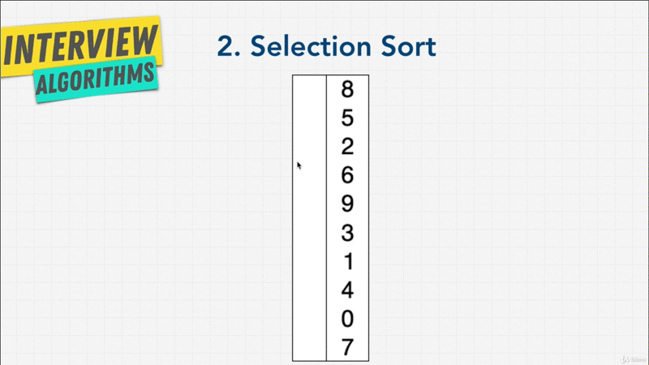
</br>

We start with the first item and the second item. The **red** here signifies
that it's the smallest item that it's seen; and then the **blue** is scanning
ahead to find the smallest item.

So, right now `8` is the smallest item, but we encounter `5`; so `5` switches to
the smallest item. We encounter `2`; so `2` becomes a smallest item. We keep
going, `6` is not smaller than `2`; `9` isn't; `3` isn't.

We encounter `1`; `1` becomes the smallest item. We keep going, we find `0`; `0`
becomes smallest item; and we just finished the list.

So now, we move `0` to the first index in our list. We swap it put.


</br>

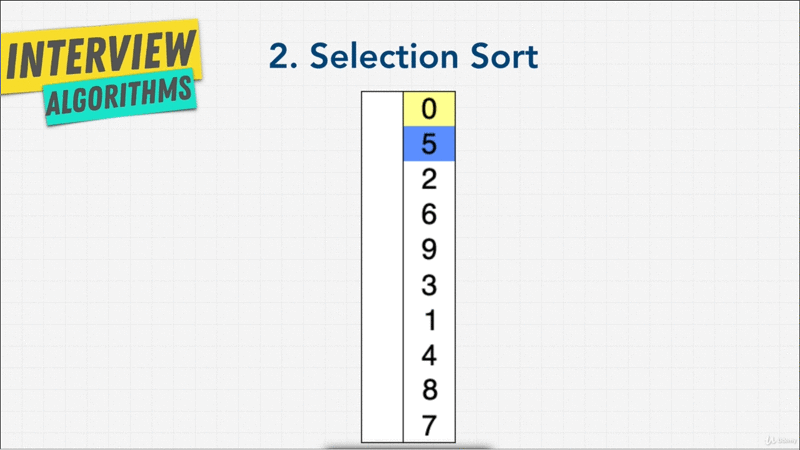
</br>

Then we keep going back to the beginning finding the smallest item, which is
`1`; and then placing `1` in the second item.


</br>

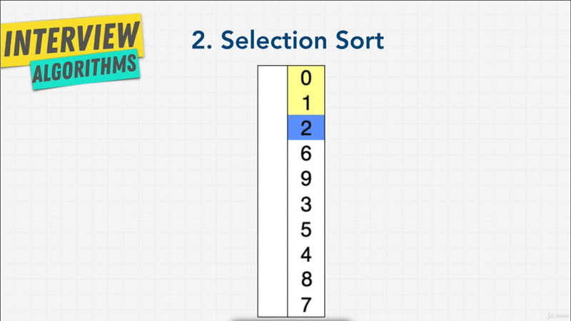
</br>

</br>

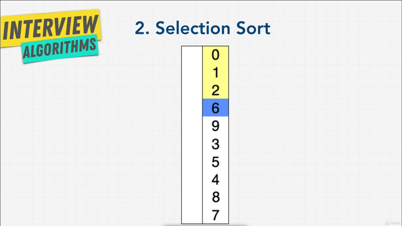
</br>


</br>

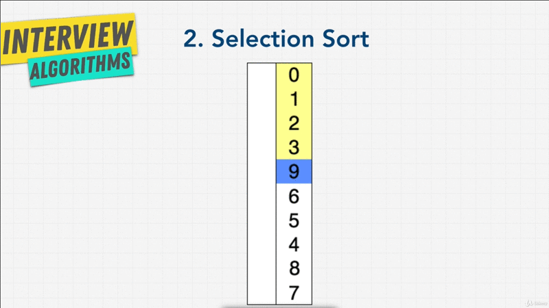
</br>

</br>

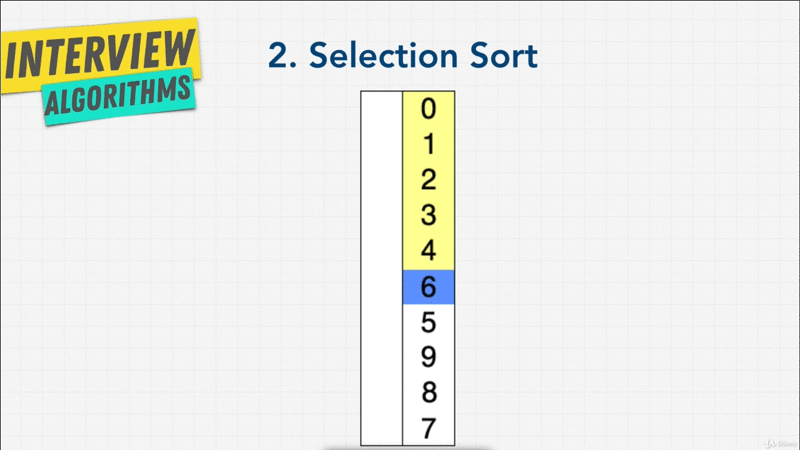
</br>

</br>

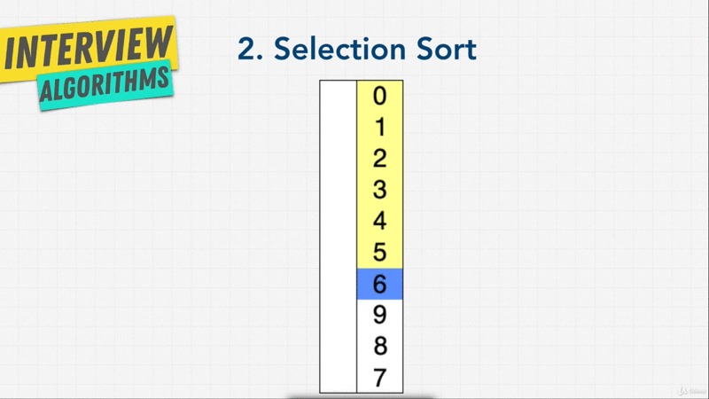
</br>

</br>

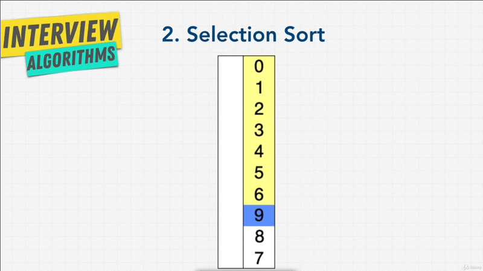
</br>

Then we keep going and repeating the process until we found the smallest item,
place it next in the list, until we have our list completely sorted.

</br>

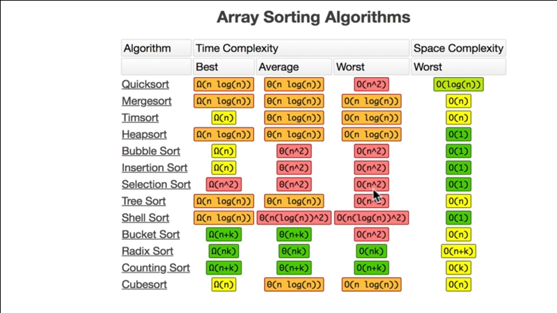
</br>

As you can see Selection Sort, we're still going to see a Time Complexity of
`O(n^2)`, if we look back at the Time Complexity chart, we see then Selection
Sort not very fast similar to Bubble Sort. We have those **nested `for-loops`**,
but uses a Space Complexity of `O(1)`, it doesn't really add any additional data
besides the input.

Now, using the animation that you just saw, you can implement your own
Selection Sort. I'm going to leave the starter code for you as an exercise.

```javascript
const numbers = [99, 44, 6, 2, 1, 5, 63, 87, 283, 4, 0];

function selectionSort(array) {
}

selectionSort(numbers);

console.log(numbers);
```

Using what you know from the Bubble Sort, and what you just saw for Selection
Sort animation. How you can use that information to Sort the list using
algorithm; and I'll show you the solution in the next lecture.

**[⬆ back to top](#table-of-contents)**
</br>
</br>
