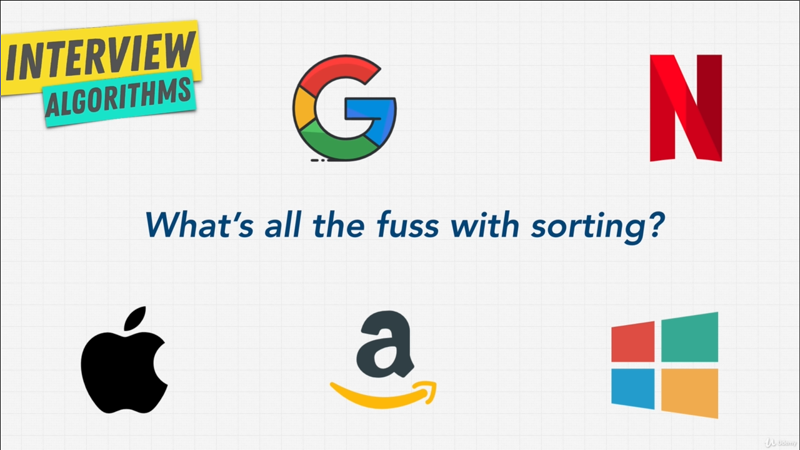
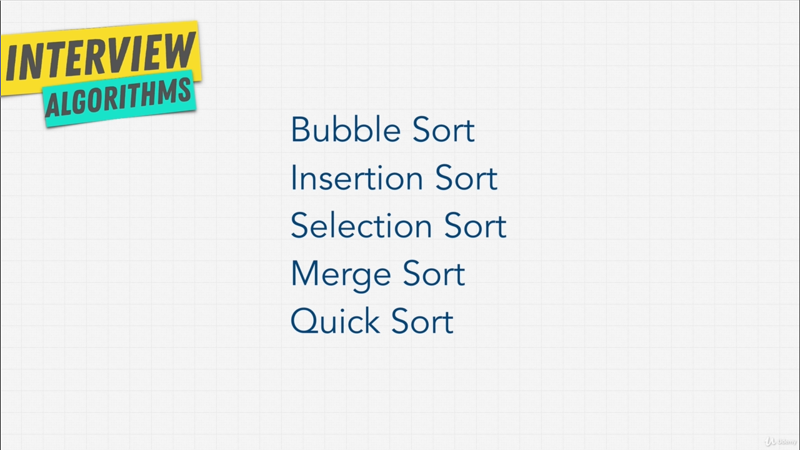
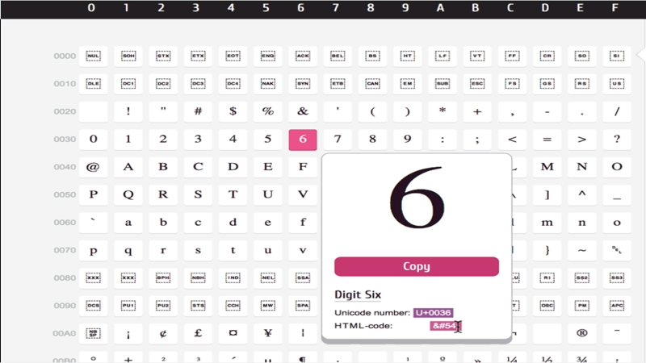

# Chapter-11 Algorithms Sorting

## Table of Contents
1. [Sorting Introduction](#sorting-introduction)
2. [The Issue With Sort Function](#the-issue-with-sort-function)

</br>

## Sorting Introduction

In the past when I learned about Sorting, it involved a lot of math, a lot of
different algorithms, and I just never really enjoyed it, because I didn't
understand why we need to know Sorting?, I mean, you just have a _sort function_
usually in programming language and that's it, right? I just never understood
the point of it, and you probably thinking the same thing.

Let me explain, in interview Sorting is _really important_. You hear question
lake take an array of numbers and _sort_ them; or the interviewer want you to
do something to some input, and they tell you that this input is Sorted, and
you're wandering why did they just tell us that? Why does it matter if it's
sorted or not?, and why do companies care so much about Sorting? If I can just
use the builtin _sort method_ in my own language.

Well, here's the thing, Sorting is not  a big deal when it comes to small input
data, you'd be right; you can do something like this,

```javascript
const letters = ["a", "d", "z", "e", "r", "b"];

letters.sort();

// Result
["a", "b", "d", "e", "r", "z"]
```


We've an array of `letters`, and this array simply has `["a", "d", "z", "e", "r",
"b" ]`; and if somebody asked to sort this, well we can just use something like
a _sort method_ that comes in most languages `letters.sort()`, If I run this
functions, I get back the sort letters; nice and easy, just sorted everything.

Why would companies ever ask such a simple question of us? You see the problem
is when inputs get larger and lager, kind of like when we talked about Big-O, we
don't care about small inputs; that's easy to do, especially with our modern
fast computers; it's starts costing companies a lot of money when we have to
perform operations on larger and larger _data sets_; that's when things becomes
a little bit crazy and expensive.

</br>


</br>


For example, Google has a ton of Websites that are indexed. What if they need to
sort those Websites? In a way, perhaps _sorting a news article_ based on the time
that it was released?; and because we are talking about Google here, we're not
talking about ten articles, we're talking about thousand, million more articles
sorted based on _date_.

What about Amazon? Amazon is all about Sorting, they sort their product based
on _category_, based on _price_, based on _rating_, and they have millions of
products.

What about Apple? Well, Apple has the Apple-Store, and they list all their
_apps_ in some of a sorted order, _podcasts_ in sorted order.

What about Microsoft? Well Microsoft, they need to sort of all their logs, or
let's say their data center around the world. So that if an incident happens,
they know where it's coming from.

What about Netflix? Well Netflix, they need to sorted their _shows_, their
_movies_, their _TV shows_, somehow, right?.

They can't usually just use a builtin _sort method_ that comes with the
language, and they usually need custom sorted method based on the data; so that,
they can lower their cost, and lower the operations that their computers need to
do.

Most places sort their data or pre-process it and these companies including
small one usually sort data to make sure that it's _meaningful_; if it's random
data that is not sorted, it's really really hard to access. So, most of the time
we sort data or pre-process it.

Now, the examples that I just talked about, they are a little bit silly, but it
does prove my point. For these companies if they do something wrong, or they do
it in an inefficient way, it means losing a lot of money. That's why they ask
these questions in an interview. They want to make sure you understand how
important the topic is, and then you can make right decision as you employee;
what sorting algorithms should be used based on the problems.

So, that's the goal of this section. I'm going to show you how to implement
Sorting on your own, if you want; but most importantly we're going to talk about
the **_different sorting algorithms_** available to you; and how we can make the
right decisions for your company, and obviously to a start coding interview.

Now, the reason that most Sorting Algorithm lessons get really boring, is that
there's so many Sorting algorithms. If we search sorting algorithms on
[Wikipedia](https://en.wikipedia.org/wiki/Sorting_algorithm), you get a pretty
large list, and implementing these Sorts one by one yourself, takes a lot of
time, but most likely you will never implement your own Sorting algorithm in
your life, except for maybe a simple one in an interview, because mos of these,
especially the advanced ones that are really fast, are done by academics that
spend years figuring out what the best most optimal way of Sorting is; and
interviewers don't expect to be able to implement every single Sorting
algorithm.

My goal in this section is, to teach the hight level; why you need to know to
become a better engineer; and also the coding interviews, I'll show you how to
implement some of the poor Sorting algorithms; but more importantly, we're going
to talk about the trade-offs between them so that you're able to talk about them
intelligently during an interview.

</br>


</br>

For the next few lecture, we are going to talk about these Sorting algorithms,
an also a couple of bonus ones towards the end; but the key thing to remember
is, that as more and more data is handled by our computers, which is a big
trending computing Sorting and Searching are two of the biggest Computer Science
problems in the software world.

 Searching, we're going to get into in the next section. But Sorting is
something we'll we have for the master at the end of this lectures. So, let's go
learn how to make a good decision when ti comes to Sorting.

**[⬆ back to top](#table-of-contents)**
</br>
</br>

## The Issue With Sort Function

Let's start about Sorting; when it comes to specific languages, and I'm going to
use JavaScript here. I'm going to be showing you different _Sorting Algorithms_
that it can be used with any type of data; It doesn't just have to be _string_,
it doesn't have just to be _numbers_, it can be any type of data. But I also
want to show you why sometimes you want to be careful when it comes to Sorting,
and just don't trust that your built in method and your own languages **_sort's
data correctly_**.

Let me demonstrate this with JavaScript,

```javascript
const letters = ["a", "d", "z", "e", "r", "b"];
const basket = [2, 65, 34, 2, 1, 7, 8];

letters.sort();
basktet.sort();
// Result
["a", "b", "d", "e", "r", "z"]

[
   1, 2, 2, 34,
  65, 7, 8
]
```

Let's say we have another array here, and this array will call it `basket`; and
this `basket` will have, instead of `letters`, it will have some _numbers_ `[2,
65, 34, 2, 1, 7, 8]`.

Now, we saw that, when we sorted the `letters` everything looked good. What
happen if I sort the `basket` here of _numbers_? What do you think will happen?
I get `[ 1, 2, 2, 34, 65, 7, 8 ]`. Is that what you expected? That doesn't look
sorted does it?

Now, this is silly example, but it's important to demonstrate; that when it
comes to sorting you want to make sure if you're not implementing it, you know
how it works. For example, when it comes to JavaScript, the way it _sorts
numbers_ is, that it actually convert then to _string_; at least that's how
_sort method_ works.

 So, what happens underneath the hood is, instead of just comparing _numbers_ it
does something along the lines of, if he gets to `65` and then it's going to
grab the character code in the first index;

```javascript
"65".cahrCodeAt(0);
"2".charCodeAt(0);
"34".charCodeAt(0);
"7".charCodeAt(0);

// Result
54
50
51
55
```

 So, we can use the method `charCodeAt()` and give it `0`; it's going to measure
the character code at `65`, if I run this I get `54`.

</br>


</br>

Now, `54` is Unicode, and if I go to
[unicode-table](https://unicode-table.com/en/), this whole characters are
encoded in our computers. Now if I go to `6`, when we hover the `6`, it's says
the HTML code for it it is `54`, the character representation is `54`. So that's
what happening here.

If I do `"2".charCodeAt(0)`  and  `"34".charCodeAt(0)`; I get, `2` is `50`; `34`
is `51`. But if I do like `"7".charCodeAt(0)`, it's going to grab `55`.

So, a lot of people get _confused_, when they use a _sort method_ like
`baskets.sort()` for sorting a _numbers_; they don't get the response as they
want it; and that's why it's good to **_read the documentation_** of whatever
you're using, such as _sort method_ and understand how it works in a language;
and to add even more confusion, you see
[here](https://developer.mozilla.org/en-US/docs/Web/JavaScript/Reference/Global_Objects/Array/sort),
that **the _Time_ and _Space Complexity_ of _sort_ cannot be guaranteed as it is
implementation dependent**.

Remember, JavaScript has a standard called `ECMAScript`, a governing body
suggest what it should look like. However, how you implement it, is really
dependent on different engines.

So, the Chrome browser would use a different JavaScript implementation than let
's say Firefox or Safari; and what kind of Sort algorithm they use underneath
the hood is, dependent on the browser; and that's something we're actually going
to talk about later on in this chapters.

But, to finish off this section about the weirdness of Sorting, let me show you
one more example.

```javascript
const spanish = ["unico", "árbol", "cosas", "fútbol"];

spanish.sort();

// Result
[ 'cosas', 'fútbol', 'unico', 'árbol' ]
```

Let's say I have an array of Spanish word here; and we want to sort these
`spanish` what do you think would be happen? `[ 'cosas', 'fútbol', 'unico',
'árbol' ]`.

Again, because of Unicode characters the letter `á` with the _accent_ on it; is
not the actual `a` that would come before something like `c`.

```javascript
spanish.sort(function(a, b) {
    return a.localeCompare(b);
});

// Result
[ 'árbol', 'cosas', 'fútbol', 'unico' ]

```

 So, in this case, to solve this problem, we would have to do something along
the lines of creating function inside of `sort()`; that takes `a` and `b` as
parameter which is the first and second item; and it's going to return a
`a.localeCompare(b)`, which allows us to compare a characters even if there were
a different languages. If I run above function, you see that it's now fixed and
everything is working.  Again,
[localeCompare](https://developer.mozilla.org/en-US/docs/Web/JavaScript/Reference/Global_Objects/String/localeCompare)
is something that you can check out.

Now, the reason I'm showing you this, is not because we want to become
JavaScript experts; Well, everybody has their own language, but to show you that
there's many ways that we can Sort things; and even more with small little
differences like `["unico", "árbol", "cosas", "fútbol"]`, there's a lot of
considerations that need to be had; and underneath, this `sort()` method is
actually one of the algorithms that we're going to learn about in this course;
and I also recommend you checking out [MDN
page](https://developer.mozilla.org/en-US/docs/Web/JavaScript/Reference/Global_Objects/Array/sort),
that's shows you how you can compare different things, such as _numbers_,
_objects_, and _items in object_ using `sort()` method.

In order to sort `basket` properly, we'd have to do something like,

```javascript
const basket = [2, 65, 34, 2, 1, 7, 8];

baskter.sort(function (a, b) {
    return a - b;
});

// Result
[ 1,  2,  2, 7, 8, 34, 65 ]
```

Where we have a function inside of the `sort()` method, that will take `a` and
`b`, which is first and second item; and we'll simply say return `a - b`. If I
run this function, we see that our _basket numbers_ are sorted.

That's enough for now. Let's talk about the Sorting Algorithms that are being
used in Computer Science in next lecture. I'll see you in that one.

**[⬆ back to top](#table-of-contents)**
</br>
</br>
