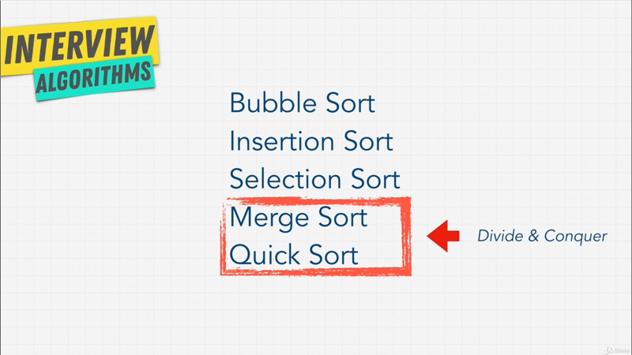

# Chapter-11 Algorithms Sorting

## Table of Contents
1. [Sorting Introduction](#sorting-introduction)
2. [The Issue With Sort Function](#the-issue-with-sort-function)
3. [Bubble Sort](#bubble-sort)
4. [Exercise Bubble Sort](#exercise-bubble-sort)
5. [Selection Sort](#selection-sort)
6. [Exercise Selection Sort](#exercise-selection-sort)
7. [Insertion Sort](#insertion-sort)
8. [Merge Sort](#merge-sort)
9. [Quick Sort](#quick-sort)
10. [Which Sort is Best](#which-sort-is-best)
11. [Radix Sort and Counting Sort](#radix-sort-and-counting-sort)
12. [Exercise Sorting Interview](#exercise-sorting-interview)
13. [Sorting In Your Language](#sorting-in-your-language)
14. [Sorting Review](#sorting-review)

</br>

## Sorting Introduction

In the past when I learned about Sorting, it involved a lot of math, a lot of
different algorithms, and I just never really enjoyed it, because I didn't
understand why we need to know Sorting?, I mean, you just have a `sort()`
function usually in programming language and that's it, right? I just never
understood the point of it, and you probably thinking the same thing.

Let me explain, in interview Sorting is _really important_. You hear question
lake take an array of numbers and _sort_ them; or the interviewer want you to
do something to some input, and they tell you that this input is Sorted, and
you're wandering why did they just tell us that? Why does it matter if it's
sorted or not?, and why do companies care so much about Sorting? If I can just
use the builtin _sort method_ in my own language.

Well, here's the thing, Sorting is not  a big deal when it comes to small input
data, you'd be right; you can do something like this,

```javascript
const letters = ["a", "d", "z", "e", "r", "b"];

letters.sort();

// Result
["a", "b", "d", "e", "r", "z"]
```

We've an array of `letters`, and this array simply has `["a", "d", "z", "e", "r",
"b" ]`; and if somebody asked to sort this, well we can just use something like
a _sort method_ that comes in most languages `letters.sort()`, If I run this
functions, I get back the sort letters; nice and easy, just sorted everything.

Why would companies ever ask such a simple question of us? You see the problem
is when inputs get larger and lager, kind of like when we talked about Big-O, we
don't care about small inputs; that's easy to do, especially with our modern
fast computers; it's starts costing companies a lot of money when we have to
perform operations on larger and larger _data sets_; that's when things becomes
a little bit crazy and expensive.

</br>


</br>

For example, Google has a ton of Websites that are indexed. What if they need to
sort those Websites? In a way, perhaps _sorting a news article_ based on the
time that it was released?; and because we are talking about Google here, we're
not talking about ten articles, we're talking about thousand, million more
articles sorted based on _date_.

What about Amazon? Amazon is all about Sorting, they sort their product based
on _category_, based on _price_, based on _rating_, and they have millions of
products.

What about Apple? Well, Apple has the Apple-Store, and they list all their
_apps_ in some of a sorted order, _podcasts_ in sorted order.

What about Microsoft? Well Microsoft, they need to sort of all their logs, or
let's say their data center around the world. So that if an incident happens,
they know where it's coming from.

What about Netflix? Well Netflix, they need to sorted their _shows_, their
_movies_, their _TV shows_, somehow, right?.

They can't usually just use a builtin _sort method_ that comes with the
language, and they usually need custom sorted method based on the data; so that,
they can lower their cost, and lower the operations that their computers need to
do.

Most places sort their data or pre-process it and these companies including
small one usually sort data to make sure that it's _meaningful_; if it's random
data that is not sorted, it's really really hard to access. So, most of the time
we sort data or pre-process it.

Now, the examples that I just talked about, they are a little bit silly, but it
does prove my point. For these companies if they do something wrong, or they do
it in an inefficient way, it means losing a lot of money. That's why they ask
these questions in an interview. They want to make sure you understand how
important the topic is, and then you can make right decision as you employee;
what sorting algorithms should be used based on the problems.

So, that's the goal of this section. I'm going to show you how to implement
Sorting on your own, if you want; but most importantly we're going to talk about
the **_different sorting algorithms_** available to you; and how we can make the
right decisions for your company, and obviously to a start coding interview.

Now, the reason that most Sorting Algorithm lessons get really boring, is that
there's so many Sorting algorithms. If we search sorting algorithms on
[Wikipedia](https://en.wikipedia.org/wiki/Sorting_algorithm), you get a pretty
large list, and implementing these Sorts one by one yourself, takes a lot of
time, but most likely you will never implement your own Sorting algorithm in
your life, except for maybe a simple one in an interview, because mos of these,
especially the advanced ones that are really fast, are done by academics that
spend years figuring out what the best most optimal way of Sorting is; and
interviewers don't expect to be able to implement every single Sorting
algorithm.

My goal in this section is, to teach the hight level; why you need to know to
become a better engineer; and also the coding interviews, I'll show you how to
implement some of the poor Sorting algorithms; but more importantly, we're going
to talk about the trade-offs between them so that you're able to talk about them
intelligently during an interview.

</br>


</br>

For the next few lecture, we are going to talk about these Sorting algorithms,
an also a couple of bonus ones towards the end; but the key thing to remember
is, that as more and more data is handled by our computers, which is a big
trending computing Sorting and Searching are two of the biggest Computer Science
problems in the software world.

 Searching, we're going to get into in the next section. But Sorting is
something we'll we have for the master at the end of this lectures. So, let's go
learn how to make a good decision when ti comes to Sorting.

**[⬆ back to top](#table-of-contents)**
</br>
</br>

## The Issue With Sort Function

Let's start about Sorting; when it comes to specific languages, and I'm going to
use JavaScript here. I'm going to be showing you different _Sorting Algorithms_
that it can be used with any type of data; It doesn't just have to be _string_,
it doesn't have just to be _numbers_, it can be any type of data. But I also
want to show you why sometimes you want to be careful when it comes to Sorting,
and just don't trust that your built in method and your own languages **_sort's
data correctly_**.

Let me demonstrate this with JavaScript,

```javascript
const letters = ["a", "d", "z", "e", "r", "b"];
const basket = [2, 65, 34, 2, 1, 7, 8];

letters.sort();
basktet.sort();
// Result
["a", "b", "d", "e", "r", "z"]

[
   1, 2, 2, 34,
  65, 7, 8
]
```

Let's say we have another array here, and this array will call it `basket`; and
this `basket` will have, instead of `letters`, it will have some _numbers_ `[2,
65, 34, 2, 1, 7, 8]`.

Now, we saw that, when we sorted the `letters` everything looked good. What
happen if I sort the `basket` here of _numbers_? What do you think will happen?
I get `[ 1, 2, 2, 34, 65, 7, 8 ]`. Is that what you expected? That doesn't look
sorted does it?

Now, this is silly example, but it's important to demonstrate; that when it
comes to sorting you want to make sure if you're not implementing it, you know
how it works. For example, when it comes to JavaScript, the way it _sorts
numbers_ is, that it actually convert then to _string_; at least that's how
_sort method_ works.

 So, what happens underneath the hood is, instead of just comparing _numbers_ it
does something along the lines of, if he gets to `65` and then it's going to
grab the character code in the first index;

```javascript
"65".cahrCodeAt(0);
"2".charCodeAt(0);
"34".charCodeAt(0);
"7".charCodeAt(0);

// Result
54
50
51
55
```

So, we can use the method `charCodeAt()` and give it `0`; it's going to measure
the character code at `65`, if I run this I get `54`.

</br>


</br>

Now, `54` is Unicode, and if I go to
[unicode-table](https://unicode-table.com/en/), this whole characters are
encoded in our computers. Now if I go to `6`, when we hover the `6`, it's says
the HTML code for it it is `54`, the character representation is `54`. So that's
what happening here.

If I do `"2".charCodeAt(0)`  and  `"34".charCodeAt(0)`; I get, `2` is `50`; `34`
is `51`. But if I do like `"7".charCodeAt(0)`, it's going to grab `55`.

So, a lot of people get _confused_, when they use a _sort method_ like
`baskets.sort()` for sorting a _numbers_; they don't get the response as they
want it; and that's why it's good to **_read the documentation_** of whatever
you're using, such as _sort method_ and understand how it works in a language;
and to add even more confusion, you see
[here](https://developer.mozilla.org/en-US/docs/Web/JavaScript/Reference/Global_Objects/Array/sort),
that **the _Time_ and _Space Complexity_ of _sort_ cannot be guaranteed as it is
implementation dependent**.

Remember, JavaScript has a standard called `ECMAScript`, a governing body
suggest what it should look like. However, how you implement it, is really
dependent on different engines.

So, the Chrome browser would use a different JavaScript implementation than let
's say Firefox or Safari; and what kind of Sort algorithm they use underneath
the hood is, dependent on the browser; and that's something we're actually going
to talk about later on in this chapters.

But, to finish off this section about the weirdness of Sorting, let me show you
one more example.

```javascript
const spanish = ["unico", "árbol", "cosas", "fútbol"];

spanish.sort();

// Result
[ 'cosas', 'fútbol', 'unico', 'árbol' ]
```

Let's say I have an array of Spanish word here; and we want to sort these
`spanish` what do you think would be happen? `[ 'cosas', 'fútbol', 'unico',
'árbol' ]`.

Again, because of Unicode characters the letter `á` with the _accent_ on it; is
not the actual `a` that would come before something like `c`.

```javascript
spanish.sort(function(a, b) {
    return a.localeCompare(b);
});

// Result
[ 'árbol', 'cosas', 'fútbol', 'unico' ]

```

 So, in this case, to solve this problem, we would have to do something along
the lines of creating function inside of `sort()`; that takes `a` and `b` as
parameter which is the first and second item; and it's going to return a
`a.localeCompare(b)`, which allows us to compare a characters even if there were
a different languages. If I run above function, you see that it's now fixed and
everything is working.  Again,
[localeCompare](https://developer.mozilla.org/en-US/docs/Web/JavaScript/Reference/Global_Objects/String/localeCompare)
is something that you can check out.

Now, the reason I'm showing you this, is not because we want to become
JavaScript experts; Well, everybody has their own language, but to show you that
there's many ways that we can Sort things; and even more with small little
differences like `["unico", "árbol", "cosas", "fútbol"]`, there's a lot of
considerations that need to be had; and underneath, this `sort()` method is
actually one of the algorithms that we're going to learn about in this course;
and I also recommend you checking out [MDN
page](https://developer.mozilla.org/en-US/docs/Web/JavaScript/Reference/Global_Objects/Array/sort),
that's shows you how you can compare different things, such as _numbers_,
_objects_, and _items in object_ using `sort()` method.

In order to sort `basket` properly, we'd have to do something like,

```javascript
const basket = [2, 65, 34, 2, 1, 7, 8];

baskter.sort(function (a, b) {
    return a - b;
});

// Result
[ 1,  2,  2, 7, 8, 34, 65 ]
```

Where we have a function inside of the `sort()` method, that will take `a` and
`b`, which is first and second item; and we'll simply say return `a - b`. If I
run this function, we see that our _basket numbers_ are sorted.

That's enough for now. Let's talk about the Sorting Algorithms that are being
used in Computer Science in next lecture. I'll see you in that one.

**[⬆ back to top](#table-of-contents)**
</br>
</br>

## Bubble Sort

</br>


</br>

Let's start off with the very first item on our list. Bubble sort is part of
these first three Sorting algorithms. Here that are called **_Elementary
Sorts_**. They're very simple basic Sorting algorithms that you would usually
think of,if somebody asked you to Sort something at the top of your head.

The second item here that we're going to get into later **Merge Sort** and
**Quick Sort** are more complex algorithms; that most of the time can be more
efficient than the first ones.

But, to build that Lego block, let's start off with Bubble Sort. How does Bubble
Sort work?

</br>


</br>

Well, let me ask you question, if I gave you a list and I ask to sort it in your
head; imagining that you had blocks of above letters, how would you move them
around? Or how would you tell a computer to move them around to Sort it; and
Bubble Sort might be the one of the first thing that comes into mind;s it the
Bubble Sort comes from the idea of _Bubbling Up_ the largest value using
_Multiple Pass_; let's see what I mean by that.

</br>


</br>

We look at `6` and `5`, and say is `6` is larger than `5`?; and then we look at
`6` and `3`, and say is `6` larger than `3`? Let swap them out; and then `6` and
`1`, once again `6` is lager than `1`, let's sort them up. We look at `6` and
`8`, `8` is _larger_ than `6` So we keep the way it is;

Let's move onto next one, `8` and `7`, `8` is larger than `7`, let's sort them
out; and `8` and `2`, swap them out; `8` and `4`,swap them out.

</br>


</br>

We Bubble Up the highest number and then we go from beginning. `5` and `3`; `5`
and `1`, we Bubble Up the largest number.

</br>


</br>

So, that `7` comes next;

</br>


</br>

Then we keep going and going, until `6` coming next.

</br>


</br>

Then we keep `looping` until we Bubble Up the highest number, one by one.

</br>


</br>

Until we have a sorted list.

That is Bubble Sort.

Now, before we even code this, what do you think of Bubble Sort? As you might
have guessed, is not the most efficient, is it? Look at how many comparisons we
did, and everything was one by one looping and looping; and Bubble Sort is one
of the simplest Sorting algorithm, but also one of the least efficient. So,
don't have me for showing you how this works.

It's usually used as a learning tool, as the first step in learning a certain
algorithm.

What do you think the **Time Complexity** and **Space Complexity** of this
algorithm is?  The answer, we can use Big-O cheat-sheet.

</br>


</br>

If we look at Bubble Sort, we see that the cases we're most interested in is,
the **_Average_**, and the **_worst case_**. We see that it's `O(n^2)`; with the
_Space Complexity_ of `O(1)`, we're not really creating any new data structures,
we're _just comparing items in nested loops one by one_.

But, let's see it in code, to see why this is all over `O(n^2)`?; and I want to
challenge you here. In the next lecture, we're going to code along the Bubble
Sort algorithm.

But if you want, go ahead and try implementing this on your own, and see how
your code matches up with me mine in the next lecture.

**[⬆ back to top](#table-of-contents)**
</br>
</br>

## Exercise Bubble Sort

Let's code our own Bubble Sort Algorithm.

```javascript
const numbers = [99, 44, 6, 2, 1, 5, 63, 87, 283, 4, 0];

function bubbleSort(array) {
    const length = array.length;

    for (let i = 0; i < length; i++) {
        for (let j = 0; j < length; j++) {

            if(array[j] > array[j+1]) {
                // Swap numbers
                let temp = array[j];
                array[j] = array[j+1];
                array[j+1] = temp;
            };
        };
    };
};

// Result
[ 0,  1,  2,  4,  5, 6, 44, 63, 87, 99, 283 ]
```

I'm creating a function called `bubbleSort()` that's going to taken an `array`
as parameter; and I have an array in variable called `numbers`. Ideally when we
enter this array of `numbers` into this functions, it spits out a sorted way.

Based on animation we saw, we ideally start from the beginning, compare first
and second item, swap out the items if the left one is larger than the right;
and keep going until the largest item ends up in the last index, and then we
loop over things again.

The first thing I want to do is, I'll just create a variable so I don't have to
keep repeating my self named, `const length = array.length` here; it shall be
the length of the items `numbers` variable, which should be `11`.

Inside here, we'll do a `for-loop` and we'll say `let i = 0; i < length; i++`;
and with in the `loop` we grab the first item; we know want to compare it with
second item and so on and so forth. We should know this by now.

We want to add another `for-loop`, it's going to `let j = 0; j < length; j++;`.
Now, in the second `for-loop` here, we'll say that _if_ `array[j]` at index of
`0`; so that is `99`; `99` is greater than `array[j+1]`, that is `44`.

So, if `99` is greater than `44`, in the _nested `loop`_; we'll say, let's
**_swap numbers_**. We can simply do that by saying creating `temp` variable,
that holds `array[j]` which the first pass will be `99`; and give the first
index of `0` to `array[j] = array[j+44]`.

Now, `99` goes into the second index, so than means `array[j+1] = temps`.

You might to go back to reading this nested loop. But all we're doing is just
swapping `numbers`; if the _left hand side_ is bigger than the _right hand
side_; and once is done we increment `j` to `1`; so, that we compare _index of
`1` and `2`_; and then we compare index of `2` and `3`; `3` to `4`; `4` to `5`
until we Bubble things up; and then we go to the top (`for-loop`) and compares
the items again in the _outer `for-loop`_.

Let's see if this works. If we run `bubbleSort(numbers)` and console log
`numbers` if it's Sorted; and now look at that `[ 0,  1,  2,  4,  5, 6, 44, 63,
87, 99, 283 ]`, our list (`numbers`) is now sorted.

That was Bubble Sort. As you can see, we have two nested `for-loop`; giving us
`O(n^2)`; but we're not really holding variables to another data structure, or
holding the `numbers` into other data structures. So the Space Complexity is
`O(1)`. As we can see in our Big-O cheat-sheet, Sort is probably not the best
algorithm, although it has good Space Complexity.

You can use the code that I leave for you to play around with; but for now,
let's go on to our next Sorting algorithms.

Congratulations, you've just completed your first Sorting algorithm, but we have
more to go.

**[⬆ back to top](#table-of-contents)**
</br>
</br>

## Selection Sort

</br>


</br>

Let's talk about selection Algorithm; and it's called **Selection Sort**.
_Selection Sort_ is again one of the simpler possible ways to Sort the _list_
and the algorithm works by _**scanning a list of items for the smallest
element**; and then swapping that element for the one in the first position_.

Let's me show you with this animation here,

</br>


</br>

We start with the first item and the second item. The **red** here _signifies
that it's the **smallest item** that it's seen_; and then the **blue** is
_**scanning ahead** to find the smallest item_.

So, right now `8` is the smallest item, but we encounter `5`; so `5` switches to
the smallest item. We encounter `2`; so `2` becomes a smallest item. We keep
going, `6` is not smaller than `2`; `9` isn't; `3` isn't.

We encounter `1`; `1` becomes the smallest item. We keep going, we find `0`; `0`
becomes smallest item; and we just finished the list.

So now, we move `0` to the first index in our list. We swap it put.


</br>


</br>

Then we keep going back to the beginning finding the smallest item, which is
`1`; and then placing `1` in the second item.


</br>


</br>

</br>


</br>

</br>


</br>

</br>


</br>

</br>


</br>

</br>


</br>

Then we keep going and repeating the process until we found the smallest item,
place it next in the list, until we have our list completely sorted.

</br>


</br>

As you can see Selection Sort, we're still going to see a Time Complexity of
`O(n^2)`, if we look back at the Time Complexity chart, we see then Selection
Sort not very fast similar to Bubble Sort. We have those **nested `for-loops`**,
but uses a Space Complexity of `O(1)`, it doesn't really add any additional data
besides the input.

Now, using the animation that you just saw, you can implement your own
Selection Sort. I'm going to leave the starter code for you as an exercise.

```javascript
const numbers = [99, 44, 6, 2, 1, 5, 63, 87, 283, 4, 0];

function selectionSort(array) {
}

selectionSort(numbers);

console.log(numbers);
```

Using what you know from the Bubble Sort, and what you just saw for Selection
Sort animation. How you can use that information to Sort the list using
algorithm; and I'll show you the solution in the next lecture.

**[⬆ back to top](#table-of-contents)**
</br>
</br>

## Exercise Selection Sort

```javascript
const numbers = [99, 44, 6, 2, 1, 5, 63, 87, 283, 4, 0];

function selectionSort(array) {
    const length = array.length;
    for(let i = 0; i < length; i++){
        // set current index as minimum
        let min = i;
        let temp = array[i];
        for(let j = i+1; j < length; j++){
            if (array[j] < array[min]){
                //update minimum if current is lower that what we had previously
                min = j;
            };
        }:
        array[i] = array[min];
        array[min] = temp;
    }:
    return array;
};

selectionSort(numbers);
console.log(numbers);

// Result
[ 0,  1,  2,  4,  5, 6, 44, 63, 87, 99, 283 ]
```

I've left for you the solution for the Selection Sort; now, I'm not going to be
going one by one to each Sorting algorithm, because it does take a lot of time.
I don't want to bore you and lose you, because there's so many more exciting
things happening throughout the next couple lectures.

So, I'll leave this for you to see how it works. It's not that much different
from Bubble Sort.

We see that with Selection Sort, We're setting the _current index as minimum_.
So, the very first item in the array becomes the minimum.

But, when we loop through the rest of the list, we want to _**update** the
minimum, if the current is lower that what we had previously_.

So, what we had here `let min = i`, where we initially set the first item in the
array. `99` as the minimum. A soon we get to `44`, we're going to say, "oh `44`
is less than `99`", let's update the minimum `min = j`; so, that index where
`44` is now the minimum.

We're going to swap out those numbers just like we saw in the animation; and it
also is a really well documented thing on the internet.

For example, if you are a Python developer, you can just type search "Python
selection sort" and you'll find how Selection Sort it's implemented in Python;
and you can run the programs as well.

So, depending on your language, you can usually search on Google in first or
second link, and show you how algorithms implemented.

As you can see in above code, we have **two nested `for-loops`** through the
entire array, so it's `O(n^2)`.

For the rest Sorting Algorithms, I will have the code provided for you, so you
can play with it, and interact with it.

If I run this `selectionSort()`, you see the result above function, it's works
properly; but you can also search for you own language to find Sorting
algorithm, so yo understand it on a deeper level.

Let's talk about the next Sorting Algorithm in the next lecture coming up.

**[⬆ back to top](#table-of-contents)**
</br>
</br>

## Insertion Sort

Up until this point we've talked about Sorting algorithms that weren't very
efficient and aren't commonly used. Now Insertion Sort is _not the most efficient
algorithm either_, but there's cases where it's actually extremely fast, which
we're going to talk about. So pay attention, because **this one starts to get
important**.

You see, Insertion Sort is useful for times when you're pretty sure their **list
is almost sorted** or it's already sorted; which sound silly, but sometimes is
important in Computer Science; and in a best case scenario you can get `O(n)` or
linear time when the list is almost sorted.

Let's see how it's work,

</br>


</br>

We have a list and we look at `6`; we look at the first sign and just leave it
where it is. We now look at the next item, `5`; and because `5` is less than `6`
we switch it over; and then we go next into the list.

We say, "hey `3` where are you in relation to `5` and `6`? Well, it's less than
those two item, so we shift over, and `3` gets placed in front.

So we know have the list of `3, 5, 6`; We look at `1`, and say "oh yeah, that's
the first item we want to shift everything", we put `1` to the left.

We then look at `8`; well, `8` is larger than all those items, so let's just
attach it to the end of our list.

We look at `7`; well, `7` shifted between `6` and `8`.

We look at `2`; We shifted `2` between `1` and `3`;

We look at `4`; we place it between `3` and `5`. That's it.

This is probably the way that your brain works; if you physically had Lego block
with these numbers, you would move things around; and this type of Sorting
perform really really well when it comes to small data sets, which we'll get
into later on with our exercises. But can you do this type of Sorting in code?

See if you can implement your own Insertion Sort.

```javascript
const numbers = [99, 44, 6, 2, 1, 5, 63, 87, 283, 4, 0];

function insertionSort(array) {

}

insertionSort(numbers);
console.log(numbers);
```

Same thing as before, this time we have the Insertion Sort algorithm based on
the animation, can you implement your own Insertion algorithm. In the next
lecture I'll show you the answer.

### Solution Insertion Sort

```javascript
function insertionSort(array) {
    const length = array.length;

    for (let i = 0; i < length; i++) {
        // move number to the first position
        if (array[i] < array[0]) {
            array.unshift(array.splice(i, 1)[0]);
        }
        else {
            // find where number should go
            for  (let j = 1; j < i; j++) {
                if (array[i] < array[j-1] && array [i] < array[j]) {
                    // move number to the right spot
                    array.splice(j, 0, array.splice(i, 1)[0]);
                };
            };
        };
    };
};

insertionSort(numbers)
console.log(numbers)
```

Just like it happened in the animation. We first `loop` over the `array`; and if
the _item we're `looping`_ for is **less than** the _first item_ in the `array`;
Well, we just  move that item use the `unshift()` method in `array`, and added
to the first index in the `array`.

Otherwise, if the _item we're currently loping over_ is **not less than** the
_first index_; in that case we got to figure out where the number should go.

So, we're going to `loop` through things. Do an `if` statement to see where the
numbers should go; and then we move that number to the right spot using the
`splice()` method; so that if we click run the `insertionSort()` function; we
have our list sorted.

I'll once again leave this function here for you to play around with.

</br>


</br>

I want to talk about Big-O complexity of Insertion Sort. There are times where
Insertion Sort can work really really well. The **best case** scenario for
Insertion Sort when the list almost sorted or the data is really small it can be
really fast is `O(n)`.

If we go back to our little animation, and we look at Insertion Sort in a nearly
sorted data; I click play, you'll notice that it's the first none that will
finish; it's quite fast actually compared to all the other ones.

As well, we discuss in the next videos when it comes to small data sets or data
sets that are nearly sorted, you want to use Insertion Sort over most other
sorting algorithms.

Let's move on on to the next Sorting algorithm.

**[⬆ back to top](#table-of-contents)**
</br>
</br>

## Merge Sort

### O(n log n)

</br>

')
</br>

Up until this point, we talked about Sorting algorithm, Bubble Sort, Insertion
Sort, Selection Sort that we called **elementary Sort**; they are OK, but they
have those nested `for-loops`, and most of the time it was `0(n^2)`, which was
a little bit slow; can we do better? Well, yes we can.

We're going to encounter our last Big-O in our list `O(n log n)`. Now in order
to understand what `O(n log n)` means, we have to talk about next sorting
algorithm, **_Merge Sort_** and **_Quick Sort_**.

</br>


</br>

Unlike Bubble Sort, Insertion Sort and Selection Sort; they use the technique
that we've heard of before. _Divide and Conquer_. We learned about this when we
learning about Trees.

Remember, when looking through a _phone book_, we open up that book, not form
the first page, but from the middle page, and we keep breaking up the pages
until we find the name we're looking for.

Merge Sort and Quick Sort use this concept of Divide and Conquer; and the idea
of _Recursion_, which we've talked about.to divide the problem down to do work
on each subset and then combining the solutions.

We're going to see how this actually works. But I want to remind you, that any
time we see something like Divide and Conquer, it usually gives you a `O(log n)`
advantages.

</br>


</br>

As you can see above diagram, it is the last piece of the puzzle.That actually
improves is better than `O(n^2)`.

The next couple Sorting algorithms we're going to look at are now going to have
nested for loops, and have `O(n^2)`. Instead they're going to have `O(n log n)`
time complexity, which makes things a lot better, and save companies a lot of
time.

In order to understand what `0(n log n)` means, we have to start off with
looking at Merge Sort.  Let's have look at how it works, and then I'm going to
explain what the benefits are.

</br>


</br>

We have the same list as before. We're going to take this list and actually
divide it in half; and then we're going to divide each of these subset into half
again; and again we're going to divide those sub-list into half again until we
have one item.

</br>


</br>

Once we have that divide up, we're going to take the first item and second item,
and say "hey which one should I put first?" Let's put `5` firs, and then `6`
right after;

Notice here, how we're building a **Reverse Tree** in a sense.

Then we look at `3` and `1`; and say "`1` and `3`. So we are getting closer and
closer to that root note.

We then comparing `8` and `7`; `7` comes before `8`.

Then we comparing `2` and `4`; `2` before `4`.

</br>


</br>

Now, we again combine those list in **Reverse Tree**. Saying `5` and `1`, which
one come first? `1` come first; and then let's compare `5` and `3`; `3` comes
first; then `5` and `6`.

</br>


</br>

Then we look on the right side, we say, `7` and `2`; `2` comes before `7`; and
then what about `4`? `4` comes before `7`; and because we know that `7` and `8`
are already Sorted, we just place `7` and `8` right next to each other.

</br>


</br>

Finally, we combine these last two lists into our root node to combine the list
and make it sorted.

`1` comes first, and `2` comes after. `3` and `4` comes; then `6`; `7` and `8`;
then we have our Sorted list.

Now, that look extremely complicated. A lot more complicated than the other
Sorting algorithms right?

Merge Sort is one o the most efficient ways. You can Sort a list of things and
typically is going to perform better than most other Sorting algorithms; and in
terms of Complexity, well it;s definitely more complex isn't it?.

We're using Divide and Conquer approach which should tip you off, that it's
going to use some sort of Recursion.

The first part of `n` in `(n log n)`, is comes from the fact that we're still
comparing everything. We have to look at each one of the numbers, and compare
them in order to Sort it.

Now, once we divide the list into one (single entities/item), which finding the
middle index of these things, are actually `O(1)`, because it's an easy
mathematical operations. Get the length of the list, and find the middle.

But, once we _divide the array_, we need to Sort the items, which going to take
`O(n)`, we have to look at every single item; and actually sort them, and were
able to create the list.

But unlike Bubble Sort for example, although we have to compare everything at
least once. We don't have compare everything to everything, like we did with
Bubble Sort. All we have to do is compare their local list to each other.

> Remember: `(log n)` is kind of like the height of the Tree.

It's something like Bubble Sort or Insertion Sort. Once we thought the list;
once we then compared the next item to the rest of the list.

Merge Sort is also helpful, because it's what we call **stable**, which just
means that if you have equivalent elements that is, let's say `6` and `6`, or
a name that is the same, it will keep the original order in the array. This can
sometimes be important, depending on the type of data.

Let's have a look at it's own Big-O.

</br>


</br>

We see that Merge Sort has `O(n log(n))`, and with Space Complexity `O(n)`.
Unlike Bubble Sort, Insertion Sort, and Selection Sort we have a bigger Space
Complexity, because we have to hold on to that divided up list and memory.

So, that is one downside of Merge Sort, but we've now managed to make our
sorting algorithm a lot faster.  Now, how do we implement Merge Sort?

### Merge Sort Exercise

I have here for you an exercise,

```javascript
const numbers = [99, 44, 6, 2, 1, 5, 63, 87, 283, 4, 0];

function mergeSort(array) {
    if (array.length === 1) {

        return array;
    };

    // Split Array in into right and left

    return merge (
        mergeSort(left);
        mergeSort(right);
    );
};

function merge(left, right) {

};

const answer = mergeSort(numbers);
console.log(answer);
```

I want you warn you this is really difficult. Merge Sort is really hard to
implement, and wrap your mind around. If you don't feel comfortable with
Recursion, it's going to be a little bit tough.

Keep in mind that, I'm showing you here how to do it, just for your own
interest, but most likely in an interview you're never going to be asked to
implement your own Merge Sort. You're just going to be asked maybe, how it's
implemented.

I've created a little skeleton to help you out. We have the Merge Sort that is
going to have a function takes an array.

We have the base case, because we're going to use Recursion here, saying that,
when `array.length === 1`, remember there's only one item in the list. That is
when each `numbers` at the top in its own list. We're going just to return the
`array`.

We're going to return and we're going to me `mergeSort()` the _left_
hand-side, and the right hand-side;

We're going use `merge()` function, that is going to merge the left and the
right hand-side.

So, the first step is, for you to split the array down the middle in the
left-hand and right-hand side. Then run it, with the `mergeSort()` algorithm;
and in the `merge()` function I want you to actually do the **_comparison_**.

I don't expect you to get this right away. There's very few people that can do
this on top of their head. But see if you can use all your resources available,
Google it, to figure out how to create your own Merge Sort algorithm.

I'll see you in the solution chapter.

### Merge Sort Solution

```javascript
function mergeSort(array) {

    if (array.length === 1) {
        return array;
    };

    // Split Array in into right and left
    const length = array.length;
    const middle = Math.floor(length / 2);
    const left = array.slice(0, middle);
    const right = array.slice(middle);

    //console.log(length);
    //console.log("left", left);
    //console.log("right", right);

    return merge (
        mergeSort(left),
        mergeSort(right)
    );
};

function merge(left, right) {

    const result = [];
    let leftIndex = 0;
    let rightIndex = 0;

    while (leftIndex < left.length && rightIndex < right.length) {

        if (left[leftIndex] < right[rightIndex]) {
            result.push(left[leftIndex]);
            leftIndex++;
        }
        else {
            result.push(right[rightIndex]);
            rightIndex++;
        };
    };

    //console.log(left, right);
    return result.concat(left.slice(leftIndex)).concat(right.slice(rightIndex));
};

const answer = mergeSort(numbers);
console.log(answer);
```

I have the answer for you here, and I'm not going to code along, because well
this is one of those pieces of code that me just writing in and typing it in
a 30 minute, isn't really going to help your understanding.

**I recommend you go through this code line by line to fully understand**.

But, if we take a look here, all we're doing in the fist pass in the
`mergeSort()` function is we're going to get the `length` of the `array`; find
the `middle` of the `array`; and then we're going to `slice` the `array` into
the `left` hand-side, and `right` hand-side.


So, that if console log here, and I click run, we see the result

```javascript
left [ 99, 44, 6, 2, 1 ]
right [ 5, 63, 87, 283, 4, 0 ]

left [ 99, 44 ]
right [ 6, 2, 1 ]

left [ 99 ]
right [ 44 ]

left [ 6 ]
right [ 2, 1 ]

left [ 2 ]
right [ 1 ]

left [ 5, 63, 87 ]
right [ 283, 4, 0 ]

left [ 5 ]
right [ 63, 87 ]

left [ 63 ]
right [ 87 ]

left [ 283 ]
right [ 4, 0 ]

left [ 4 ]
right [ 0 ]
```
We see that the first time around, we're just splitting the item right down the
middle, where we have `[99, 44, 6, 2, 1]` in the `left` hand-side; we have `[5,
63, 87, 283, 4, 0]` in the `right` hand-side.

In the next pass; because, remember we're doing recursion and
`merge(mergeSort(left), mergeSort(right))` has being called again; we're now
dividing up `[99, 44]` and `[6, 2, 1]` into it's own pass;

Then the `left` hand-side we splitting out. `[99]` and `[44]` into individual
items. `[6]` and `[2, 1]` into left and right, until we have everting into one
item.

Then we start splitting off the `right` hand-side as well.

What about the `merge()` function? The merge function is going to be a little
bit hard to read; but if we take a look here, all we're saying is, we have
a `result` which is hold an empty `array`, that we're going to fill everything
with.

Then we are going to have a `leftIndex` and `rightIndex`.

We're going to compare here. Is the `leftIndex` less than the length of the left
`array` and the `rightIndex` less than the right `array.length`, which is make
sure that we have items in our array.

If that's the case then let's compare out our **left-Item** to the
**right-item**; and `push()` into a new array, into our `result` array the item
that is less. In this case it will be the **left-hand item**; and then we
increment.

Otherwise, if the **left-item** is higher than the **right-item**, we do the
opposite; and the right-item goes into our `result`.

Remember, this `merge()` function is doing what we saw in the animation, where
splitting the function down in the first part of the function; and then, in the
**merge** we're going to take the left and right compare it and place it into
the `result` array; and then go to the next, and keep doing this over and over;
and creating our `result` array.


If I console log in `merge()` function, we can see exactly what we're doing.

```javascript
[ 99 ] [ 44 ]
[ 2 ] [ 1 ]

[ 6 ] [ 1, 2 ]
[ 44, 99 ] [ 1, 2, 6 ]

[ 63 ] [ 87 ]
[ 5 ] [ 63, 87 ]

[ 4 ] [ 0 ]
[ 283 ] [ 0, 4 ]

[ 5, 63, 87 ] [ 0, 4, 283 ]
[ 1, 2, 6, 44, 99 ] [ 0, 4, 5, 63, 87, 283 ]
```

We have `[99] [44]` and then `[2] [1]`.

So on the `left` hand-side and `right` hand-side. `[99]` and `[44]` get compare,
becomes `[44, 99]`.

Then we compare `[2] [1]`, which becomes `[1, 2]`.

Then `[6]` and `[1, 2]`, which becomes `[1, 2, 6]`.

We keep going and keep going until the very last step, where we have two list
here `[ 1, 2, 6, 44, 99 ] [ 0, 4, 5, 63, 87, 283 ]`, and we compare `[0]` and
`[1]`, we place `[0]` in the result array, and then we place `[1, 2]` and just
keeps going and keeps going exactly like our animation.

Now, I encourage you to play around with this, and perhaps go steps by steps;
the bad news is that, the next algorithm is even more complicated. But luckily
for you as I said, you don't have to ever do this in an interview. You just need
to know that Merge Sort is great algorithms to use, because we get `O(n
log(n))` Big-O.

Let's take a look another Sorting algorithm.

**[⬆ back to top](#table-of-contents)**
</br>
</br>

## Quick Sort

Let's even talk about our fifth sorting algorithm, Quick Sort; even just from
the name you're thinking, this is going to be quick. Quick Sort, just like Merge
Sort, is a _Divide and Conquer algorithm_, which mean and ring a bell in your
head saying, that there's probably going to be `O(n log(n))`, and if you
thinking that, you're right.

You see, Quick Sort uses something called a **pivoting technique** to break the
**main list** into **smaller lists**; and the _smaller list_ use the _pivoting
technique_ until they are sorted.

Let me show you the animation of Quick Sort,

</br>


</br>

Quick Sort works like this, and if you're looking at this diagram, you're
completely confused as to what is happening. This describes Quick Sort fairly
well, it's pretty complex to understand.

Let' me show you a better demonstration.

</br>


</br>

I have a little diagram here, let's say we have a list that look like this, we
have `3, 7, 8, 5, 2, 1, 9, 5, 4`. What we do here is, we pick a **random
pivot**. Let's say that `4` is going to be our pivot. Once we pick _pivot item_
we're going to say, "all right, I want all numbers that are less than `4` to
come to it's left and all numbers that are greater than `4` to come to its
right.

So what we do?

Well, we start comparing the numbers, we look at `3` and `4`. `3` is to the left
of `4`, that fine. What about `7`? `7` is higher than `4`, so it should be to
it's right. We're going to move `4` to the left position to make a space for
`7`; `7` jumps over to the right, and we swap the `5` that `4` came into the `7`
position;

Now we check `5` and `4`, we've got to do the same thing, We put `5` to the
right of `4` and swap `9` in there. Once again `9` is higher than `4`. So `9`
comes to the right of `4`.

Then we look at `8`, same thing with `8`; and then finally `5` and `4`, well `4`
and `5` switch places.

Now, we have a list `3, 1, 2, 4, 5, 8, 9, 5, 7`, that has `4` as the _pivot_;
and we know that `4` is going to be in that position in the array, and
everything else to the left of it and to the right of it it still needs to get
sorted; but at least we know where `4` stands.

From there, using Divide and Conquer we now split the list, and we do the same
thing. We get a _pivot_ on the left list, which will be `2`, and we say
everting to the right of `2` should be higher, everything to the left of `2`
should be lower; And we have this left list sorted.

On the right, we do the same thing until we split the list with `7` in the
middle, and we keep breaking things down and keep breaking things down like
a Tree, and this is where Divide and Conquer comes from. Until we have all the
individual list sorted and we combine them.

Now, you might have two question for me looking at this?

**_One_** is, how do we even pick this **pivot point**? The answer is, that is
kind of random. It really really depends on the situation, but as you see here,
we just happen to pick the _pivot point_ as always the last item in the array.

The **_second_** is, how am I ever going to code this? This is pretty challenge
and I don't expect you to get it. I'll leave code for you, and you can try it
out if you want, but the best way to understand the Quick Sort is by watching
the video [Hungarian Quick Sort](https://www.youtube.com/watch?v=ywWBy6J5gz8).
The implementation and the visual is a little bit different here. But the idea
is the same, **Quick Sort can be implemented in different ways**, but the idea
of the pivot is the same.

Let's got to main concepts. Quick Sort is really really useful; and between
Quick Sort and Merge Sort, I would say that the most used Sorting algorithms.

</br>


</br>

You'll notice here **_two things_**,

**One** is, that Quick Sorts Space Complexity plays really really good, I mean
not as good as Bubble Sort, or Insertion Sort, or Selection Sort, but is still
better than Merge Sort, its **worst case** is `O(n^2)`, that is because t can be
`0(n^2)` when the _pivot_ is the **smallest** or the **larger** item in the
list, because, then you're not really splitting the list in half, and because
of this you really want to make sure that you pick a good pivot for Quick Sort.

You'll get the better Space Complexity, but the worst case could be bad. So, in
those cases, Merge Sort might be better if your list was presorted for whatever
reason, and in that list if we pick the _pivot_ to be the first item or the last
item, then our Sorting routine here would be take a very very long time, because
again the list will not really be split in half.

Ideally in a Quick Sort, you're **picking** the pivot intelligently based on your
list.

Now, Quick Sort there is a lot of variance to it, and there's different
implementations. But I want you to take this away from this lecture. Quick Sort
is usually the fastest on average, but the downside is, that it has some pretty
nasty worst case behaviors. So, if you have to guarantee no bad data or you can
guarantee that the pivot is going to be good, then you should be avoiding the
Quick Sort; but on average it's usually the best Sorting algorithm.

Alright, so we've learn five different Sorting algorithms, but the most
important part is, when should I use what?.

In the next lecture, we're going t go over exactly that, follow by a fun little
exercise.

**[⬆ back to top](#table-of-contents)**
</br>
</br>

## Which Sort is Best

We've learned our Sorting algorithms, but you might be asking yourself, I'm
still confused about when to use what? What about if I asked you in an interview
a question about which Sorting algorithm will be best, if I had a user's data of
100 million names that need to be sorted? Well, let's go over some **rules**.

**When you should use Insertion Sort**? Well, Insertion Short should be used with
**only a few items**, if your input is small or items are mostly sorted, it's
really really fast. It uses very little Space, and most importantly it's really
easy to implement in code.

So remember this, only a few items and mostly sorted data you should use
Insertion Sort.

**When you should use Bubble Sort**? To be honest, you're never going to be use
Bubble Sort. It's only really used for **educational purpose**, as a way to
teach sorting; but, it's very rare that you'll find this in real life, because
is just **not very efficient**.

**When you should use Selection Sort**? Again, same thing with Selection Sort,
as you can see, it's numbers aren't very good. So, most likely you won't be
using it. Mostly it's being used as a teaching mechanism which I did.

Sorry, didn't mean to waste your time with learning Selection Sort; but, it is
important to build the foundation.

**When you should use Merge Sort**? This one is my favorite, Why? Well, Merge
Sort is really good, because of Divide and Conquer. We have `O(n log(n))`, it's
fast; and because best average in _worst case_ is always `O(n log(n))`,we always
divide up the list evenly. You can always guarantee that, this is going to be
the case, which is not the case for most other algorithms.

So, if you worried about _worst case_ scenario, you should use Merge Sort; but,
if you want to **sort in memory on your machine** and you're worried about Space
Complexity, Merge Sort is going to be really expensive. A it's use Space Complexity
`O(n)`.

However, if you had _huge files that can be sorted in memory_, so you have
external-sorting that you need, maybe like a _process outside of memory_, it's
suitable for external sorting, then Merge Sort is good, because we won't care
much as much Space Complexity.

**When you should use Quick Sort**? Quick Sort is actually better than Merge
Sort, _average case_ and Space Complexity, I mean it has the same speed as time
as Merge Sort, but less Space Complexity.

It's probably one of the most popular Sorting algorithms; But, the one downside
is the _worst case_ scenario; if you don't pick the **pivot** properly, you
could have really really slow sorting.

So, you have to be careful, and if you're really worried about _worst case_ then
you rather pick something else.

Now, you might be asking yourself, **what about Heap Sort**? We haven't really
talk about that.

I'm going to leave a resources for you, so you can learn about Heap Sort as
well. It's very similar to Quick Sort and Merge Sort, but you see here, that it
has a Space Complexity `O(1)`. Isn't Heap Sort better than all of the above?
Well, Heap Sort can Sort in place, and doesn't have the _worst case_ quadratic
behavior that Quick Sort has, or the memory usage that Merge Sort has.


But, on average is _actually slower than Quick Sort_ in most cases.

It's one of those things where with Heap Sort, unless you really really worried
about _worst case_ and memory, then you might use it; but most of the time
I would say, you're using Quick Sort or Merge Sort.

What about Shell Sort, Bucket Sort, Radix Sort, Counting Sort? How come we're
not talking about these one? Why can we just use these, they look a lot better
than all the other ones?, especially when it comes to Time Complexity.

Good Question, let's talk about in the next lecture.

**[⬆ back to top](#table-of-contents)**
</br>
</br>

## Radix Sort and Counting Sort

</br>

[chapter-11-23.gif](./images/gif/chapter-11-23.gif "Quick Sort animation")
</br>

We have talked about these five shorting algorithms, and by now you should know
that Merge Sort and Quick Sort, although they're harder to implement, are the
most often used algorithms in real life, because they use Divide and Conquer to
get us this `O(n log(n))` performance boost.

Can we beat `O(n log(n))`? Here's the thing, mathematically it is impossible to
improve on this. If any body comes up with an algorithm that is faster than `O(n
log(n))`, they're going to be very very rich.

Mathematically it's impossible, because `O(n log(n))` means that we have to Sort
by **comparison**. All of these (Bubble, Insertion, Selection, Merge, Quick
sort) are Sorting algorithms have to compare every number to each other.

But, there is one exception to this rule. **You can improve this if you don't
make comparisons**. What that's mean? There's a small section of input that we
can actually beat `O(n log(n))` and these are called a **Non-Comparison Sort**;
and you'll most likely see **Counting Sort** and **Radix Sort**.

What does that mean?

Counting Sort and Radix Sort is an entire different way to think about Sorting.
With **Comparison Sort**, we decided the order of the numbers based on asking the
question, "hey, is this element bigger than the one over there?", and we just
kept doing that, every number got compared to each other.

**Non-Comparison** does it a little bit different. We're going to use the way
that numbers and data is stored on our computers, in `0` and `1`; and take
advantage of that value to Sort thing.

</br>


</br>

This can get pretty complex, as you can see above paper, just looking at the
diagrams, and for example Radix Sort here, how we store numbers in `0` and `1`.

</br>


</br>

We can use this knowledge to actually Sort some things.

I'm going to leave resources for you, if you want to get really technical and
into this topic, I do warn you, you can get a little bit mathy, but the one
thing to note here is, that these type of Sorting algorithms, Counting Sort and
Radix Sort, **only work with numbers**, specifically _integers_, in a restricted
range.

So, if you have only numbers that you want to solve Sort, and the range of those
numbers go from, let's say from `0` to `100`, that is a small range, then you
would use something like above diagram to make things really fast; but it
wouldn't work on any type of data. It only really works on numbers, because of
the way numbers are stored in memory.

You see, unlike something like Merge Sort or Quick Sort that are universal, that
is they can Sort any type of data. Things like Counting Sort and Radix Sort, is
only useful for fixed length integers. They are able to beat the speed of `O(n
log(n))`.

</br>


</br>

As you can see above diagram, Bucket Sort, Radix Sort, Counting Sort, in their
average cases have `O(n+k)`, `0(nk)`. What `k` and `n` means, is beyond the
scope of this course, and some argue that in the end, this actually still turns
out to be pretty slow or the same `O(n log(n))`.

The only thing you need to know about this is, _that sometimes if you have
**numbers** that are within a certain range_, it could be faster than Quick Sort
or Merge Sort.

Now, we know this, let's do some interview exercise based on Sorting, to solidity
what we just learn.

### Resources

- [Radix Sort](https://brilliant.org/wiki/radix-sort/)
- [Radix Sort Animation](https://www.cs.usfca.edu/~galles/visualization/RadixSort.html)
- [Counting Sort](https://brilliant.org/wiki/counting-sort/)
- [Counting Sort Animation](https://www.cs.usfca.edu/~galles/visualization/CountingSort.html)

**[⬆ back to top](#table-of-contents)**
</br>
</br>

## Exercise Sorting Interview

Most people focus on just coding Sorting algorithms, which just doesn't apply in
real life. Most developers and engineers go their entire life not ever coding
a Sorting algorithm from scratch; but we are going to encounter situations,
where we need to make decisions on which Sorting algorithms to use.

So, to prepare you for that, I have a couple question,

```javascript
//#1 - Sort 10 schools around your house by distance:
A: Quick Sort. the distance is a number, I can use Merge or Quick Sort
algorithms cause.

//#2 - eBay sorts listings by the current Bid amount:
A: Merge Sort, Bid amount is a certain number, I can use Merge Sort.

//#3 - Sport scores on ESPN
A: Quick Sort

//#4 - Massive database (can't fit all into memory) needs to sort through past year's user data
A: Merge Sort

//#5 - Almost sorted Udemy review data needs to update and add 2 new reviews
A: Merge Sort

//#6 - Temperature Records for the past 50 years in Canada
A: Quick Sort

//#7 - Large user name database needs to be sorted. Data is very random.
A: Merge Sort

//#8 - You want to teach sorting for the first time
A: Buble Sort
```

The question are number above, and I want you to answer each question each
question, if this was asked to you by your employer or boss, or maybe an
interview, what type of Sorting algorithms would you'd used based on above
factor?

For example, we have 10 schools around your house, and you want to Sort
them by _distance_, what type of Sorting algorithm would you use?.

You'll see here, we have 8 questions. Give it a try; and in the next lecture
I'll give you my opinion.

### Solution Sorting Interview

Let's go step by step, and see how your answer match up

> Sort 10 schools around your house by distance

So, the input is only `10`, it's fairy small, we need something simple. In this
case, I'll probably use **Insertion Sort**, it's really fast on _small sorts_,
it's easy to code, and it has Space Complexity `O(1)`.

It also could be that these `10` schools are already _presorted_ or nearly
sorted on our list. So, Insertion is just the simplest for this type of small
data. I like Insertion Sort for this type of things.

> eBay sorts listing by the current Bid amount

What would you use for this? I would actually use something like **Radix** or
**Counting Sort**, because, well a bid is usually a number between, let's say
_$1_ to let's say _$5000_, probably even less when it comes to payment on eBay.
Let's say $1 to $100. These are numbers that need to be sorted; and because it's
a _fixed length of integers_, integers are most likely not going to be
a _$1.000.000_, because, well, hopefully nobody's bidding that much on eBay.

So, how do you use Radix or Counting Sort to beat that `O(n log(n))`?; Knowing
that the bids are always going to be a number within a certain range.

> Sport scores on ESPN

It's can vary, there's decimal places sometimes there's. There's different
formats, such as _tennis_ and _soccer_, and different things, and there's
definitely lots of sports and lots of scores to handle.

In this case, I'm going to use **Quick Sort**. It's going to be the most
efficient, an we might have the _Worst Case_, I doubt that scores are going to
be sorted, because there are just so many different kinds; but, I'm also worried
about _in-memory sorting_.

So, if I use Merge Sort, it might be a little too much for this, because of our
increase Space Complexity `O(n)` _versus_ Quick Sort, which if you remember, has
better Space Complexity `O(n log(n))`.

By the way, you might have your own answer for this. Maybe you thought that the
sport scores on ESPN will be, they input's would be a little bit different. You
could have your different types of answers. The idea here in an interview
situation is, to explain yourself, and if you know the principles, then the
interviewers is going to say, "oh, he or she knows what they're talking about".

> Massive database (can't fit all into memory), needs to sort through past
> year's user data.

Massive database; so, we can _fill all this data into **memory**_ to sort it. We
probably need to sort out externally, and let's say we need to sort through past
years user data. So, it's a ton of data, and we need to sort it somehow; let's
say by some _sort of a date_.

Base on that information that i got here, it sounds like I need to do something
called **Merge Sort**. The reason I would pick this is, because well, it sounds
that we're not going to be sorting really in-memory, because the data so big,
but because the data is big, I'm really worried about the performance. I don't
want the Worst Case of Quick Sort `O(n^2)`. I want to make sure that no matter
what I'm going to get `O(n log(n))`.

> Almost sorted Udemy review data needs to be update and add 2 new reviews

So, we have a massive list of your reviews. Let's say that you raided the
course, and this course you're taking has 500 reviews, and you've added review,
and your friends just added two new reviews to the scores.

In this case, I'm going to use **Insertion Sort**. Why is that? Well, although,
this data might be huge, and maybe I have a lot of reviews. I'm assuming that
most of the _previous data is already sorted_; and all I'm doing is adding two
new reviews to this data. Insertion Sort for pre-ordered list is going to be
work better than any other type presorted.

> Temperature Records for the past 50 years in Canada

This is a little tricky, firs, I would use something like Radix or Counting
Sort, _if the temperatures have *8no decimal places**_. If we're saying, you
know it's `-30` to let's say `40` degrees, that's a integer number between
a small range, that might work well.

But, if I want to Sort through  data that also has, maybe temperatures that are
really accurate, and have decimal places, which you can do with Radix or
Counting Sort, than I'm probably going to use **Quick Sort**, again just we can
do some in **memory sorting**, and hopefully save on that Space Complexity.

> Large use name database needs t be sorted. Data is very random

All right, so we have a _user name database_, that need to be Sorted. I'm not
really sure, I don't have enough information to make a decision here. Maybe
I would use **Merge Sort**, if we have enough memory; and memory isn't too
expensive on the machine. Or I'll use **Quick Sort**, if I'm not too worried
about Worst Case, and that user name databases isn't that large. Maybe I'll just
use Quick Sort, just to save Memory Space and I can just pick a good **pivot**.

> You want to teach Sorting for the first time

I'll choose **Bubble Sort** and **Selection Sort**.

Hopefully you have fun with these Sorting algorithms questions. This is probably
the finest I can get it. I hope you get a good idea of how to answer these
questions when they come to the interview.

**[⬆ back to top](#table-of-contents)**
</br>
</br>

## Sorting In Your Language

I want have just quick lecture to tell you about something interesting, and this
depends on your language; but, remember the Sort method that we had in
JavaScript or perhaps your language.

```javascript
[1, 3, 2].sort();
```

I challenge you to figure out what Sort of Sorting algorithm it's using
underneath the hood.

In most cases, it's either going to be Quick Sort or Insertion Sort and Merge
Sort combined together. So go out and search what Sorting algorithm your
language uses.

When it comes to JavaScript, there's actually no requirement to JavaScript as to
which Sorting algorithm to use. We have ECMAScript in JavaScript which is the
standard; but, because the standard doesn't mention how `sort()` method should
be implemented. Different browser that have different JavaScript Engines, Chrome
has V-8, Mozilla has its own engine, Safari its own engine, they all implement
differently.

Last time I checked, in Mozilla they use Merge Sort for sorting. In Chrome the
V-8 engine sort is implemented with Quick Sort and also Insertion Sort for the
smaller arrays.

I thought that was interesting. I see you in the next lecture.

**[⬆ back to top](#table-of-contents)**
</br>
</br>

## Sorting Review

Another section done, and we covered Sorting specifically Sorting algorithm in
this section. Most of the time, when talking about Sorting algorithms, we're
going to be talking about `O(n log(n))`.

We learned that there is a ton of Sorting algorithms, and we covered the main
ones they get use more often. If you really excited about the topic, and you
find this interesting, then well, good for you. You're one of few.

I encourage you to search different Sorting algorithms, but to review,

**Quick Sort** you want to _use when your average case **Performance** matters more
than the **Worst Case**_, because Quick sort allow us to Sort in `O(n log(n))`,
but in worst case is `0(n^2)`.

**Merge Sort** on the other hand is great, because it's always `O(n log(n))`,
and it's also **stable**; which means, that it always gives the same result in
order if two items are same. Although, the Space Complexity is a little bit
higher than Quick Sort, it's `O(n)`. It's definitely a useful Sort.

We also talk about, Insertion Sort, Selection Sort and Bubble Sort. Those are
fun when you're doing something **quick and dirty** and you want to just
experiment around with Sorting; but, in **real life, you're not going to use
them**. Most likely in real life you are using the framework or languages or
libraries Sorting algorithm.

> Although Insertion Sort is great for small or nearly sorted inputs.

Their advantages is that their fairly easy to implement in code.

During the interview you might something like this, in those rare cases that
they ask you to implement a Sorting algorithm you'll say,"Well, because we have
a _time constraint_ I like to use something naive and not efficient like Bubble
Sort, which is slow in real life. Instead of implementing like Merge Sort if
it's OK with you"; because we can assume that Merge Sort is something that we
can implement with a library or fairly easily with documentation, or you can say
something like, "We can just use Merge Sort to Divide and Conquer the code to
make it more efficient".

With above way, you show the interviewer that, yes, you can implement Sorting,
like Bubble Sort, but you also know about things like Merge Sort to make it more
efficient without having to actually implement it.

So, by the end of this, all I hope you now understand the trade-offs where you
can look at Sorting algorithms, and decide base on their **Speed Ability**, and
their **Readability**, whether the input is already sorted or nearly sorted, how
large the input; you can make the right decision on Sorting.

**[⬆ back to top](#table-of-contents)**
</br>
</br>
