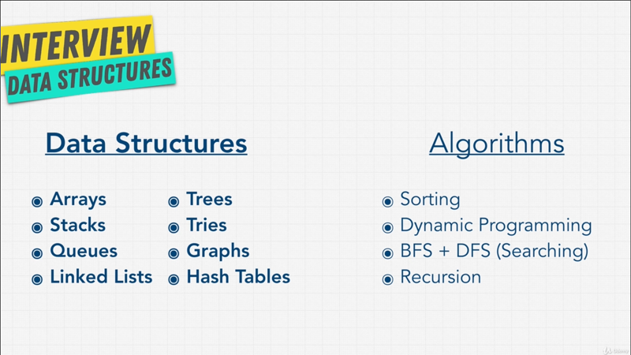

# Chapter-12 Algorithms Searching BFS + DFS

## Table of Contents
1. [Searching + Traversal Introduction](#searching-+-traversal-introduction)
2. [Linear Search](#linear search)

</br>

## Searching + Traversal Introduction

</br>


</br>

We've talked about Recursion and Sorting, we have a few more to go. In this
section, we're going to talk about **Searching and Traversal**, including
**Breadth First Search** and **Depth First Search**.

Searching is something we do a lot on our computers. When we talked about
Sorting, some of you may have been like, "man, it doesn't really sound that
useful"; but Searching, we use that every day, don't we? We look for files in
our computer, we run command `f` and search for things, search for words and
documents, we search Google, we search Youtube, we search hashtag `#` on
Twitter and Instagram; Searching is a big part of our lives;

But, how are all these computers and programs able to search things so fast.
There's more and more data in this world, more and more Websites to search for.
How are we able to do these things so fast? How is google able to do these
things so fast?

Well, in this section we're going to build this foundation of how it all works.

</br>


</br>

We're going to be talking about a few types of Searching and Traversal, and
hopefully by the end of it all, you're going to understand how places like,
Facebook, Google, and Google Maps work when it comes to Searching at
**fundamental level**.

Let's get started.

**[⬆ back to top](#table-of-contents)**
</br>
</br>

## linear Search

Let's talk about the very first type of Search, Linear Search. In computer
science Linear Search or **Sequential Search** is a method of** finding a target
value within the list**, and we should be familiar with this; before, because
through out the course we've loop through arrays to find items. It sequentially
checks each element of the list for the target value until a match is found, or
until all the elements have been searched.

Let's take a look at visual,

<!-- images here -->
Linear Search is simply this. We have items that can be nodes, that can be
numbers, that can be anything, and we go one by one looking through the list.

We check the first item, then the second item, then the third, the fourth, the
fifth, and the sixth. In the **best case** scenario, we find what we're looking for
in `o(1)` tine, because it's at the very beginning of the list, such as if we're
looking for `6` over here.

<!-- images here -->

However, in **worst case** scenario, we have to go through the entire list, if
we are looking for `9`, and check every single node, or if we're looking for
something that doesn't exist, we still have to check every single item, and this
type of Sorting is very familiar to us. For example, if we take a look at
JavaScript,

```javascript
var beasts = ['Centaur', 'Godzilla', 'Mosura', 'Minotaur', 'Hydra', 'Nessie'];

beasts.indexOf('Godzilla');

beasts.findIndex(function(item){
  return item === 'Godzilla';
});

beasts.find(function(item){
  return item === 'Godzilla';
})

beasts.includes('Godzilla')
```

I have a list above, of `beasts`, and let's say, we're looking for `Godzilla`.
There's many way that I could search for this item `Godzilla` in this list. One
way of doing it in JavaScript is using **`indexOf()`**, which gives me the index
where I can find `Godzilla`, this uses Linear Search to try and find the Item.

Another way is to use **`findIndex()`**, that takes a function with a condition that
the item **must equal** `Godzilla`, and it's something going to return **true**
when it find something, again if I run this I get `1`.

Another way is to use **`find()`** function, giving it same function as we did
above; but this time it's going to return the actual item instead of the index.

Finally, we also have this way of searching, the **`includes()`** method, that
simply says, does `beast` include `Godzilla`?, and it's going to give me
**true** or **false**, and in this case it's **true**.

Your language have different ways to implement this type of Search. But all of
this searches are _Linear Search_; that is worst case, we're going through the
entire list, and as you know, our inputs or our list can get really really
large, with Linear Time `O(n)` is OK, but it's not the fastest.

We can't use Linear Search to index Websites like Google, or search for friends
like Facebook, because it's going to cost us a lot of time.

<!-- gif here -->

Is there a better way? Well, what if the list of our data here was, perhaps
sorted, would that help us in any way? Would we be able to improve, let's say
we're looking for `9` now, and we knew that the **list was sorted**. Let's
answer that question in the next chapter.

**[⬆ back to top](#table-of-contents)**
</br>
</br>

