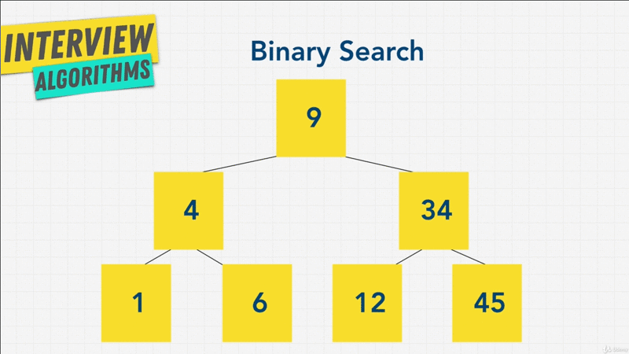

# Chapter-12 Algorithms Searching BFS + DFS

<!--{{{ ## Table of Contents-->
## Table of Contents
1. [Searching + Traversal Introduction](#searching-+-traversal-introduction)
2. [Linear Search](#linear-search)
3. [Binary Search](#binary-search)
4. [Graph - Tree Traversals](#graph---tree-traversals)
5. [BFS Introduction](#bfs-introduction)
6. [DFS Introduction](#dfs-introduction)
7. [BFS vs DFS](#bfs-vs-dfs)
8. [Exercise BFS vs DFS](#exercise-bfs-vs-dfs)
9. [Breadth First Search Function](#breadth-first-search-function)

</br>
<!--}}}-->

<!--{{{ 1 ## searching + traversal introduction -->

## searching + traversal introduction

</br>


</br>

We've talked about Recursion and Sorting, we have a few more to go. In this
section, we're going to talk about **Searching and Traversal**, including
**Breadth First Search** and **Depth First Search**.

Searching is something we do a lot on our computers. When we talked about
Sorting, some of you may have been like, "man, it doesn't really sound that
useful"; but Searching, we use that every day, don't we? We look for files in
our computer, we run command `f` and search for things, search for words and
documents, we search Google, we search Youtube, we search hashtag `#` on
Twitter and Instagram; Searching is a big part of our lives;

But, how are all these computers and programs able to search things so fast.
There's more and more data in this world, more and more Websites to search for.
How are we able to do these things so fast? How is google able to do these
things so fast?

Well, in this section we're going to build this foundation of how it all works.

</br>


</br>

We're going to be talking about a few types of Searching and Traversal, and
hopefully by the end of it all, you're going to understand how places like,
Facebook, Google, and Google Maps work when it comes to Searching at
**fundamental level**.

Let's get started.

**[⬆ back to top](#table-of-contents)**
</br>
</br>
<!--}}}-->

<!--{{{ 2 ## linear Search -->
## linear Search

Let's talk about the very first type of Search, Linear Search. In Computer
Science Linear Search or **Sequential Search** is a **method of finding a target
value within the list**, and we should be familiar with this; before, because
through out the course we've loop through arrays to find items. It sequentially
checks each element of the list for the target value until a match is found, or
until all the elements have been searched.

Let's take a look at visual,

</br>


</br>

Linear Search is simply this. We have items that can be nodes, that can be
numbers, that can be anything, and we go one by one looking through the list.

We check the first item, then the second item, then the third, the fourth, the
fifth, and the sixth. In the **best case** scenario, we find what we're looking for
in `o(1)` time, because it's at the very beginning of the list, such as if we're
looking for `6` over here.

However, in **worst case** scenario, we have to go through the entire list, if
we are looking for `9`, and check every single node, or if we're looking for
something that doesn't exist, we still have to check every single item, and this
type of Sorting is very familiar to us.

For example, if we take a look at JavaScript,

```javascript
var beasts = ['Centaur', 'Godzilla', 'Mosura', 'Minotaur', 'Hydra', 'Nessie'];

beasts.indexOf('Godzilla');

beasts.findIndex(function(item) {
  return item === 'Godzilla';
});

beasts.find(function(item) {
  return item === 'Godzilla';
});

beasts.includes('Godzilla');
```

I have a list above, of `beasts`, and let's say, we're looking for `Godzilla`.
There's many way that I could search for this item `Godzilla` in this list. One
way of doing it in JavaScript is using **`indexOf()`**, which gives me the index
where I can find `Godzilla`, this uses Linear Search to try and find the Item.

Another way is to use **`findIndex()`**, that takes a function with a condition
that the item **must equal** `Godzilla`, and it's something going to return
**true** when it find something, again if I run this I get `1`.

Another way is to use **`find()`** function, giving it same function as we did
above; but this time it's going to return the actual item instead of the index.

Finally, we also have this way of searching, the **`includes()`** method, that
simply says, does `beast` include `Godzilla`?, and it's going to give me
**true** or **false**, and in this case it's **true**.

Your language have different ways to implement this type of Search. But all of
this searches are _Linear Search_; that is worst case, we're going through the
entire list, and as you know, our inputs or our list can get really really
large, with Linear Time `O(n)` is OK, but it's not the fastest.

We **can't** use Linear Search to index Websites like Google, or search for
friends like Facebook, because it's going to cost us a lot of time.

</br>


</br>

Is there a better way? Well, what if the list of our data here was, perhaps
sorted, would that help us in any way? Would we be able to improve, let's say
we're looking for `9` now, and we knew that the **list was sorted**. Let's
answer that question in the next chapter.

**[⬆ back to top](#table-of-contents)**
</br>
</br>
<!--}}}-->

<!--{{{ 3 ## Binary Search -->
## Binary Search

In the last chapter we ask the question, is there a better way to find number in
a Sorted  List?

Just for this example, let's add an extra number to our list,

</br>


</br>

Let's say I was looking for `34`, and I knew that my list, let's say **array was
sorted**. What's a better way to go about it, instead of checking every single
item one by one from left to right?

Well, we can use something called Binary Search, because we know _list is
sorted_, we can discard half the items instead of one at a time, let me sow
you.

</br>


</br>

We can start in the middle of the list, and say is `9` higher or lower than
`34`? Well, `34` is higher than `9`, so let's discard everything to the left of
it.

</br>


</br>

Then, we go to the middle index again, in this case there's no technically
a medium, so let's just choose `12`, go the left of the media. Is `12` higher or
lower than `34`? Well, it's definitely lower, so let's remove everting to the
left of it.

</br>


</br>

Then, let's find the middle index; and, Oh we just found `34`. Instead of going
through the item one by one, we did that in **three operations**, and this looks
familiar right?

</br>


</br>

It's something we learned about when we talked about Trees, specifically Binary
Search Trees, because if our data is sorted, we can do better than `O(n)` or
_linear time_,

</br>


</br>


Because this Sorted List might remind of something. We're essentially creating
a Binary Search Tree.

Unlike Linear Search, we can discard half the items, instead one of the time;
and you might be thinking, well, that's a ridiculous, because in order for us to
even searches, we have to Sort the list first, and that takes computational
power right?

But, storing data in a _Data Structure_ like a Tree instead of _Linear Data
Structure_ like an array is actually **more efficient**; and this is something
we've are already discussed with _Tree Data Structure_.

As we **insert items**, if we **sorted** them, it's actually gives us better
performance then adding it to an on **unsorted List** that we have to search
through one day; and because in a Tree, where we make a decision, should we go
left or right?, and we discard half the items every step, this should trigger
something in your brain saying, "oh, this is a Divide and Conquer approach",
which gives us a `O(log n)` time.  Because `O(log n)` comes from the fact that,
we're not visiting all nodes. Each step down the Tree, we're eliminating nodes.

So, this is the deal with Binary Search, `[1]` you split a list, over sorted
item, `[2]` and decide from there, whether item you're looking for is in the
left or the right of the list?, and because the List is Sorted, you can make
that decision very easily, with just comparing things;

</br>


</br>

We just keep going until we find what we want, in this case number `34`. We make
`3` decisions.

With this, it's make sense; because, if you're a teacher that's looking at stack
of essays and papers by students; if that stack of paper is _not organized_,
then you have to go through in one by one to find, let's say _Timmy paper_; but,
if the stack of paper is _sorted alphabetically_, then you can find _Timmy_ by
dividing the papers half each time until you get to _Timmy_.

Just like a phone book, we start with `n` element, then we step down, we have
`n` divide by _two elements_ remaining; and as we step down, we have `n` divided
by _four elements_ remaining, and we keep going until we find our element.

In the Sorting section, we learn that Merge Sort and Quick Sort are doing the
same thing.

We also learned how actually Search through this Tree in our [Data
Structure](../chapter-8-data-structure-trees/BinarySearchTree.js) section right?
With Linear Search we have `for-loops`. With Binary Search Tree, we have our
'lookup()' method, where we checked the **_left node_** and the **_right
node_**, and divide up the list using a `while-loop` in half each time.

</br>


</br>

So, we know how to do Linear Search and Binary Search. We know that Binary
Search is going to be `O(Log n)` Time Complexity **versus** Linear Search which
is `O(n)`.

But, what about the rest? Well up until this point, we've talked about when
we're Searching for an item, where we know that `34` exists; our list is Sorted
in a Binary Search Tree; and we know where to go, left or right;

But sometimes, we have to do something call **Traversals**, and Traversals
simply means, well, going from node to node, either finding a specific thing, or
making sure that you touch every single node. Perhaps we don't want to add
a color attribute to each node here. Perhaps we want to update these numbers and
multiply them by two, in that case we have to visit every single node. How we do
that?

Let's find out in the next chapter.

**[⬆ back to top](#table-of-contents)**
</br>
</br>
<!--}}}-->

<!--{{{ 4 ## Graph - Tree Traversals -->
## Graph - Tree Traversals

There are times when we want to do something called Traversal, and the name
Traversal and Search s often used interchangeably, sometimes meaning the same
things, sometimes not.

</br>


</br>

Up until now we talked about Binary Search Trees, and we knew what we're looking
for, and we always knew where to go, left or right; but, other times we want to
do some operations on the same node, as I mentioned before, we might want to
**add some color** property to this node.

Perhaps if we had a _user node_, we want to add an 'H' property to all our users
that are in a Tree structure. Perhaps you want to add `shape` property to these
nodes.

Or perhaps, we don't have a Sorted Tree, it's not a Binary Search Tree, or we
have a Graph that has _no order_ to it, in which case we have to visit every
node.

Or, maybe we're working on Google, and our boss asked us to, "hey, can we check
if our Binary Search Tree we entered into our databases is correct", and that
it's actually valid, and making sure that the left item is always lower than the
right item; and in order for us to check that, we have to touch every single
node, but ho would we go about doing this?

You can think of Traversals as visiting every node, and as you can imagine,
because we're visiting every node that's an `O(n)` operation - Linear Time.

Up until now, we did `loops` to visit all of our Data Structure. Like arrays,
Linked List, Hash Tables, Queues, Stack. So, how do we go about doing this in
a Data Structure like a Tree or even a Graph?

</br>


</br>

Luckily for us there's **two ways** of doing this, that we need to learn. `[1]`
Do we have to do a Tree Traversal? Or `[2]` do we have to do a Graph Traversal?
In that case, our two options are the exact same. We have Breadth First Search
(BFS) and Depth First Search (DFS), and sometimes this is called Traversal
instead of Search.


As you can see both with Trees and Graphs it's the same thing. The Big-O is
`O(n)`, because we have to visit every single node using these two techniques.

But, let's review why this is important, and why we don't store everything and
just Lists, which is simpler to understand. Well, the main benefit of why we
don't put complex data into just Lists, like arrays that are sorted is that, we
get the `O(log(n))` of arrays.

What about Hash Tables? Those are easy. Well, remember that Hash tables aren't
_order_, and at the end of the day, when you represent data with different Data
Structure based on their needs; and, Trees and Graphs worked really well for
a lot of cases which we've already discussed; when we Search for things, we have
the benefit, but also when we _insert_ or _delete_ items, we have better
performance than something like an array, but we also maintain the order that we
wouldn't have otherwise with hash Tables. Tree and Graph used a lot, when we
want to Search nodes, or visit every node, and it represent a lot of data that
models the real world.

Now, let's explore how these two (BFS, DFS) Traversal techniques works. I'll see
you in the next chapter.

**[⬆ back to top](#table-of-contents)**
</br>
</br>
<!--}}}-->

<!--{{{ 5 ## BFS Introduction -->
## BFS Introduction

Let's look at the first of the two types of Searching or Traversing a Tree or
Graph, it's called Breadth First Search.

The way Breadth First search works is, that you start with the _root-node_ and
_move left to right_ across the second level, then move left to right across the
third level, and so on and so forth.

</br>


</br>

You just keep going from left to the right, level by level, and you keep going
until you find the node your are looking for, or the Tree ends.

Let's have a look at another visual Breadth First Search works like this,

</br>


</br>

We go to the root-node, then the second level, then the third level, and then
finally the fourth level. You can see here how they're numbered, going one by
one.

Now, we're going to code Breadth First Search, and understand how it's works.
But I want to mention, that Breadth First Search **uses additional memory**,
because it's necessary to track the **child node** of al the nodes on a given
level, while searching that level. This means that, we need to track every node
and its children in order.

We're also going to talk about some of those implications, when we code Breadth
First Search, and also look at the **pros** and **cons** compared to the other
kind, that first.

Let's go to our code code for quick example.  We have here the Tree that we
created in our [Tree Data Structure section](../chapter-8-data-structure-trees)
section,
a [BinarySearchTree](../chapter-8-data-structure-trees/BinarySearchTree.js) that
creates a Tree for us that look like below,

```
// Trees
               9

        4             20

     1     6     15        170

// List | Breadth First Search
[9, 4, 20, 1, 6, 15, 170]
```

`9` is a root-node, we have `4` and `20` on second level, `1`, `6`, `15`, `170`
in third level.

If we did Breadth First Search, what would do you think the order would be? If
we wanted to convert that into a List. Well, we'd first visit `9`; then we'd
visit second level `4` and `20`, and then we visit the third level, again going
from left to right, we'd visit `1`, `6`, `15`, `170`; and using Breadth First
Search, we're able to create this List.

Let's have a look at the second way of Traversing a Tree or a Graph, and that is
Depth First Search. Let's have a look at next chapter.

### Resources

[trekhleb-Breadth First
Search](https://github.com/trekhleb/javascript-algorithms/tree/master/src/algorithms/tree/breadth-first-search)

**[⬆ back to top](#table-of-contents)**
</br>
</br>
<!--}}}-->

<!--{{{ 6 ##  DFS Introduction -->
##  DFS Introduction

Depth First Search on like a Breadth First Search is a little bit different. The
Search follows one branch of the Tree down as many level as possible until the
_target notice found_ or the _end is reached_.

When the Search can go on any further, it continuous at the nearest ancestor
with an unexplored child. Let me show you,

</br>


</br>

We start off with `9`; then we go to `6`, then we go to `1`, and we've reached
a leaf node, there's no more leaf children.

So, we go back, up to `6`, to our ancestor; and then see if there's any more
unexplored children, in this case haven't gone to `4`; So, lets go back up to
`4`.

Now we go up, because there's no more children, all the way up to `9` and say,
"All right, let's go to the right now". We go to `12`, then `34`, and then come
back up, and then search `45` as well.

Now, Depth First Search has a **lower memory requirement** then Breadth First
Search, because it's _**not** necessary to store all the child pointers at each
level_. Something  that we'll see when we actually coded.

The idea with Depth First Search is, that we want to go as deep as possible into
a Graph or Tree; usually starting from the lift side and then start going to the
right until the Traversal of the Tree is done.

As the name suggest, we go **Depth first** _deep first_ versus Breadth.

</br>


</br>

Depth Search looks something above. Once again, we go all the way down, come
back up then all the way down; come back up all the way down. As you can see,
going _deep first_, then keep going to the right.

I like to think of Depth First Search was like walking through a maze right?
We're going as far as we can, and when we hit a Deep end; well, you turn back
around, and go to the next point, where you can make perhaps a left to a far
right until you get to the end of the maze, or the maze are end.

So, if we go back to our code, how Depth First Search would look?

```
// Trees
               9

        4             20

     1     6     15        170

// List | Breadth First Search
[9, 4, 20, 1, 6, 15, 170]

// List | Depth First Search
[9, 4, 1, 6, 20, 15, 170]
```

Well, form what we know,

> Hint, there's going to be different variations for Depth Search

Form what we know, we would start off with `9`, then `4`, then `1`; go back up
to `4` and then find `6`; go back up to find `20`, go the left found `15` and go
to the right one find `170`.

So, our list is a little bit different than Breadth First Search. We have
**different orders**, but why do we have these two ways of exploring a Tree or
a Graph? What the pros and cons?

Up until now, I've just been talking, but you might not understand why one is
better than the other?.

Before we implement this into code, I want to go over the pros and cons of each.
Let's do that in the next chapter.

### Resources

[trekhleb-Depth First
Search](https://github.com/trekhleb/javascript-algorithms/tree/master/src/algorithms/tree/breadth-first-search)

**[⬆ back to top](#table-of-contents)**
</br>
</br>
<!--}}}-->

<!--{{{ 7 ## BFS vs DFS -->
## BFS vs DFS

I like to think of Breadth First Search as a water flooding from the top. Kind
of like where we check from the top all the way down.

I like to think Depth First Search for a search as little lines go one as deep
as they can, and then they keep going to the right.

But, what is the advantages over the other? They both do the same thing,
Traversal. But each one is use for different reasons; and in interviews, you'll
get question about what type of Traversal to do? And usually, you'll have one of
these two answer that you have to say.

So, when should use one over the other? And we're going to explore that
throughout the next couple of lectures.

But I want to start off with the main pros and cons. The Time Complexity for
Breadth First Search and Depth First Search is the same, right?. They all visit
the nodes at least once, so it's all `O(n)`, all Traversal is `O(n)`.

So, when we're trying to Traverse through a Tree or a Graph, we're really to do
is, walk through the Tree without ever repeating ourselves and the *order* is the
thing matters when it comes to Breadth First Search and Depth First Search.

</br>


</br>

Now, Let's talk about Breadth Firs Search first. With Breadth First Search It's
very good for *finding the shortest path* between a _starting point_ and any
other reachable node, because we always start off with the _root node_, and then
search the closest nodes first; and then the nodes furthers.

With this, is going to become more apparent when we talk about Graph Traversal,
and we have some chapters specifically for this discussion, but the one
*downside* with Breadth First Search is, that it *requires more memory* than
Depth First Search.

Again, something we'll discuss more of, when we start coding it. But a *good
rule of thumb* is, that if you have additional information on the location of
the target node, and you know that the node is likely in the upper level of
a Tree then Breadth First Search is better, because it will search trough the
closest nodes first.

</br>


</br>

On the other hand, Depth First Search is the opposite. If you know that the node
is likely at the lower level of a Tree, perhaps Depth First Search is better in
that case.

Depth First Search is really good at asking the question, does the path exist
to us or not? From a source node to a target node.

Again, something we'll get more into when we talk about Graphs.

The biggest advantages with Depth First Search is, that it *uses less memory*
then Breadth First Search.

The downside with Depth First Search is, that it can get slow, especially if the
Tree or Graph is really really deep, and it's *not* necessarily good at *finding
shortest path* like Breadth First Search.

Now, that w have an idea of when to use what; I know it's not 100% yet, we're
getting there. But first I want to do is a bit of an exercise.

**[⬆ back to top](#table-of-contents)**
</br>
</br>

<!--}}}-->

<!--{{{ 8 ## Exercise BFS vs DFS -->
## Exercise BFS vs DFS

```lang-txt
//If you know a solution is not far from the root of the tree:
A: BFS,

Reason: cause it like water fall, it check for each level that contain
the target. As the hint is the target is "not far from the root Tree", it will
stop until the target found.

//If the tree is very deep and solutions are rare:
A: DFS,

Reason: cause it check in every branch level, from left - leaf to bottom
level; and go to right - leaf to bottom level.

//If the tree is very wide:
A: BFS

Reason: I choose BFS, cause I do not search the target on deep side, with BFS
I can jump from one branch to another branch in same level.

//If solutions are frequent but located deep in the tree:
A: DFS

Reason: As the target are located `*deep*` in the Tree, I choose DFS.

//Determining whether a path exists between two nodes:
A: DFS

Reason: If the target is unknown, DFS will be the choice, cause it start search
from every branch, and if is target is on left - leaf it will find fast; if not,
it will consume more Memory - Space.

//Finding the shortest path:
A: BFS

Reason: If the target position was known and mostly the Tree is sorted, BFS will
be the choice. If not, still the BFS is advantages is can seek the shortest path
with more Memory - Complexity is higher than DFS.
```

Let's do a little exercise with just general information with these two
Traversal techniques.

I have question above for you; and Underneath it  I want you to answer whether
you should use Breadth First Search or Depth First Search, and these are the
type of questions that you're going to get asked in an interview; and it's good
to understand.

I know, our knowledge is not complete yet, because we haven't coded anything.
But I want to lay the foundation is, that when we start coding, you understand
why we have these things.

So, give it a go, try and answer these question above, and in the next lecture,
I'll go over the solution.

### Solution BFS Vs DFS

How was the exercise? Hopefully it wasn't too difficult. If you're able to
answer these questions, you're most likely you're going to be OK in an
interview, if you get asked about Breadth First Search or Depth First Search.

So, let's go to the answer.

> If you know a solution is not far from the root of the Tree

Well, we talked about this, we want to use *Breadth First Search | BFS*, because
it starts searching the closest nodes to the parent first.

> If the Tree is very deep and solution are rare

Well, this is a bit of a tougher question, but we would use *Breadth first
Search | BFS*; and the reason we do that over something like Depth First Search
is, that Depth First Search will take a really long time with this type of
a Tree.  Because the Tree is really deep, it's going to go one by one, going
really really down below;

Because solutions are rare, it's most likely going to just repeat that over and
over; and as you'll see, with Breadth First Search, we use Recursive functions;
and with Depth First Search that can take a really really long time.

Although with this one, we also have some *Memory concern* with Breadth First
Search.

So your answer may vary, but this is what I would us as long as you an explain
that to the interviewer you're find.

> If the Tree is very wide

Well, that is there's a lot of nodes, it's not a Binary Tree, it just has a ton
of nodes underneath each parent.

Again, this is a bit a tougher one, but we want to use *Depth First Search
| DFS*, because a Breadth First Search is going to *_need to much Memory _*. The
way Breadth First Search works is, that it has to keep track of the nodes, and
the current level in, something called Queue that we'll see.

Because of that, it might take up too much Memory.

> If the solution are frequent but located deep in the Tree

Well, in that case we do use *Depth First Search | DFS*. So hopefully we''ll be
able to find an answer quicker than Breadth First Search.

> Determining whether a path exists between two nodes

That is what *Depth First Search is built for*.

> Finding the shortest path.

That is for Breadth First Search.

Now, keep this document in mind, and revisit it as we learn more and more about
these two algorithms, because things are going to start making sense more and
more. But these is a good sheet to keep in mind before you go to an interview,
in case you get asked these questions.

Enough talking for now, I think it's time to start coding these algorithms. I'll
see you in the next one.

**[⬆ back to top](#table-of-contents)**
</br>
</br>
<!--}}}-->

<!--{{{ 9 ## Breadth First Search Function -->
## Breadth First Search Function

```
                9
        6               12
    1       4       34      45

// List | Breadth First Search
[9, 6, 12, 1, 4, 34, 45]
```

Let's start to code our very first algorithm with Breadth First Search. If you
remember, with Breadth First Search we have to go from the top - root, then to
the left and then visit all the nodes in that level; and when I said that it
*uses a lot of Memory* is, that when it visits `6` and `12`, from there, it's
going to back to `1`, `4` then `34` then `45`.

So, as it goes through this level (`'6'`, `'12'`) we need to keep *a reference*
to all the children nodes of every node that we visit. So, that we can go back
to them and visit `1` and `4`, that's where the memory is coming from. Because
we have *to keep track* of those children of the level that we're on.

You'll also notice these path that we're talking from `9` to `6` to `12` to `1`
to `4` to `34` to `45`.

We're going to be using a Queues - Data Structure, which allows us to keep
a reference to the nodes that we want to come back to, because we know `6` is in
front of `12`. We can go back to it, and discover it's child nodes.

So, let's get coding with our Breadth First Search algorithms.

```javascript
// BinarySearchTree.js
class BinarySearchTree {

    constructor() {
        ...
        ...
    }

    insert(value) {
        ...
        ...
    }

    lookup(value) {
    }

    remove(value) {
    }
}
```

We have over here our `BinarySearchTree` (class) from our [Tree - Data
Structure](../chapter-8-data-structure-trees/BinarySearchTree.js) chapter.

We've already implemented the `insert()`, `lookup()`, `remove()` methods,

```javascript
//               9
//
//        4             20
//
//     1     6     15        170
```
and we've created this `BinarySearchTree()`  that give us above type of Tree.

Enough for repetition of what we done, let's start coding our own Breadth
First Search implementation; and ideally by above functions, we get a list of
all the items n the order of Breadth First Search, that is `[9, 4, 20, 1, 6, 15
170]`.

###  breadthFirstSearch() functions

```javascript
class BinarySearchTree {
    ...
    ...

    breadthFirstSearch() {
        let currentNode = this.root;
        let list = [];
        let queue = [];
        queue.push(currentNode);

        while(queue.length > 0){
            currentNode = queue.shift();
            console.log(currentNode.value);         //[1]
            list.push(currentNode.value);
            if(currentNode.left) {
                queue.push(currentNode.left);
            }
            if(currentNode.right) {
                queue.push(currentNode.right);
            }
        }

        console.log("=>", list);
        return list;
    }
}

tree.breadthFirstSearch();
// Result
9
4
20
1
6
15
170

// => [ 9,  4,  20, 1, 6, 15, 170 ]

```

In this functions we need three things,

- First, the `currentNode`, which will start with the root - node (`this.root`)

- Second, the actual list `list = []` of an Array type, that will be our answer.
  Will have an array here, where we insert the numbers into in the order of
  Breadth First Search.

- Third, we also need a Queue - Data Structure `queue = []` which will use an
  Array for this example. To keep track of the level we're at, so that we can
  access the children once we go through it.

  Remember, we going to keep track of `*9*` then we're going to keep track of
  `*6*` and `*12*`; and when we get to `6` and `12`, that's going to be in our
  Queue. But we have to go back once we're at the end of that level to `6`, so
  that we can discover `1` and `4`.

  So, that's what the Queue will be used for.

The very first thing we're going to do is, to add the Queue the very first item
the root - node. So, we're going to say `queue.push(currentNode)`. What we need
to to in here is, go from the `currentNode` down to our children node, and again
go from left to right; and then go to their children node and go from left to
right.

Th way we're going to do that i to use `while-loop` and we'll that as log as
`queue.length` is greater than `0`, that is we have nothing left in the Queue.
In that case, we'll say the `currentNode` will be `queue.shift()`.

`shift()` simply means, that we *take the very first item* in the Queue.
Remember, a `queue` is just the line up to the roller coaster; and the first
person that comes in gets to go first on the roller coaster, and `shift()`
simply *returns and removes* the first item in the `queue`.

In our case, will have `9` as the first item in the Queue; and we're going to
_shift_ that and assign it to the `currentNode`; and because this is the
root-node, we want to start off in our answer that the `list` will have the
number `9` at the top.

Still inside `while-loop`, we're going to do is, say `list.push()` the
`currentNode.value`, which will be `9`.

So, we have the first answer in our list, which `9`.

From there, we're going to say, "hey, does the `9` node have a left children?"
(`if (currentNode.left)`). Because if it does, let's add it to the `queue`,
saying that would you need to check out that node, and we'll push it to the
`queue` the `currentNode.left`. (`queue.push(currentNode.left)`).

So what we just did here is, we've added `4` to the `queue`.

We also want to add `20` to the `queue`.

So, I'm going to say, after you've added `4` to the `queue`, I'm going to say,
"hey, does `currentNode` have a right child node?" (`if (currentNode.right)`).
In that case, we'll added to the `queue` again as the *second item* in the
`queue`; and the `currentNode.right` will be push to the `queue`.
(`queue.push(currentNode.right)`)

This is the amazing thing of all we just did. Now that the `queue` has two items
as if passes you will have `4` and `20`. It's going to `loop` through come to
`currentNode = queue.shift()` and say, `queue.shift()` is going to grab `4` and
say `push(4)` to the `list`. (`list.push(4)`).

Then going to say, "hey, does `4` have a left child?" Yes it does, it has `1`.
Well, then added to the `queue`. So `1` gets added to the `queue` that has `[4,
20]`, now is `1`.

Then we say, "hey does `4` have a right child?" Yes it does, we have `6`. Well,
we're going to add `6` to the `queue` again. So, we're going to have `[4, 20, 1,
6]`.

Then we go back to the top, and say, "what's next in `line`?" Well, we have
`20`. So let's `shift(20)`. Grab that. Remove that from our `queue` and go
through it again and again as we give example for `4`.

Again, left child will be `15`, and right child will be `170`.

Now, we test the result, we console log our `currentNode.value` in `while-loop`,
which will be the _shifted - node_, that is the node that we're going to be
operating on, and checking out.

```lang-text
9
4
201
6
15
170
```

We see that, first I'm checking `9`, then I'm checking `4`, then I'm checking
`20`, than `6`, than `15`, than `170`. Very very cool. We're pushing the list
every time.

So, all we need to do at the end is, just save `return list`. So that, if I run
this,

```JavaScript
[ 9,  4,  20, 1, 6, 15, 170 ]
```

We can look at that, I have my Breadth First Search. That return `[ 9,  4,  20,
1, 6, 15, 170 ]`.

There's wasn't to bad was it? We see from this code here, that it's quite simple
and the only issue that we have is, that this `queue[]`  can get pretty large,
because we have to keep reference to our child nodes.

The Memory Consumption that can really hurt us is this `queue` that we keep
adding to. We keep popping things, we also add the `queue`. So that if we have
a *really wide Tree*, instead of a Binary Tree where we just have a left and
a right leaf, and maybe we have 10 child nodes, this `queue` can get pretty big;
and depending on the _data that memory consumption_ might be big.

That's one the *main downside* with Breadth First Search.

Hopefully, you see the _simplicity_ of Breadth First Search, wasn't too bad, it
was?. All right I'll see you in the next lecture.

**[⬆ back to top](#table-of-contents)**
</br>
</br>
<!--}}}-->

