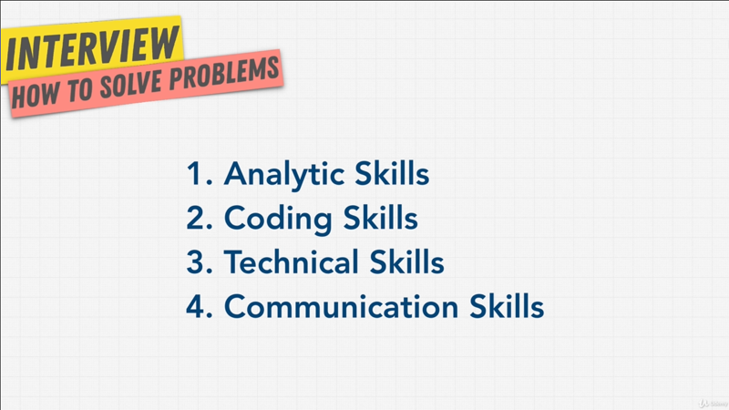
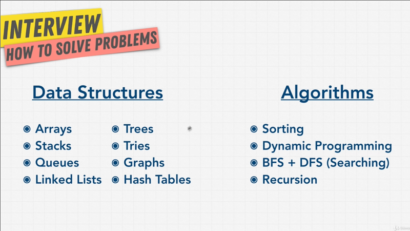

# Chapter-2 How To solve Coding problems

## Table of Contents

1.  [Module Introduction](#module-introduction)
2.  [What Are Companies Looking For](#what-are-companies-looking-for)
3.  [What We Need For Coding Interview](#what-we-need-for-coding-interview)

 

## Module Introduction

At the end of the day, an interview is a way for company to find out can you
solve a problem that company or employer has? Because if you're able to solve
their problems then you're valuable, and you will produce more value to them
then the salary that they're paying you. That is what a technical interview
tries to answer.

We can be smart and strategic about where we apply, and how we apply to
a company and we learned about that in the previous sections; But ere comes the
big challenge, you've got an interview, what do you do? Over the next couple of
sections we're going to tackle this question and get you as prepared as possible
for the _coding interview_; and we're going to get very technical.

Up until now we haven't seen that much code, but we're going to get into nitty
gritty details over the next couple of section. Before we dive into _coding
problems_, _data structures_ and _algorithm_ and all of these fun coding
details, we must first understand this one principle, **_how to solve
problems_**. You see if we know every single algorithm in the world inside and
out you know all the data structure you're the best coder in the world.

Well it doesn't guarantee that you will succeed in a technical interview. This
section is meant to prepare you so that you have the foundation laid out, so
that after this all you need to succeed in the technical interview is the _actual
coding aspects of the questions_. It's not the smartest interviewer that gets
hired, most of the time it's the interviewer that is **_able to answer this
fundamental question_**, will you solve the company's problem?

If you're a genius but you can't talk to people, you don't work well with others
or you write ugly code that people don't understand, or you can't communicate
a solution to a problem then you won't get a job. It's not necessarily about the
solution to a problem, in a coding interview it's about the **thought process**,
and knowing the tradeoffs **_between data structures and algorithm, space and time
complexity_**.

Just like in real life coding, you don't memorize things. You have to _deeply
understand them_, understand the _tradeoffs_. That's what  we're doing here.

I know I'm taking a long time to get my points here, but we're trying to build
the fundamental before we dive in really deep, so we **_understand the why of each
thing_**.
 

 

We're building this foundation, by _first_ **_understanding the Big-O_**, which
we did in the previous section; and then **_learning how to solve these
problems_**. In this section I'm going to show you step-by-step what we need to
do to solve problems in a way that companies really like; So that you succeed in
this coding interview. We're going to look at `[x]`some sample coding interviews
from Google and see what they did and what is the ideal process to ace this
interview. So that once we have these foundations we can use _data structure_
and _algorithm_ to solve our problems. Because the interview isn't about your
ability to **_memorize_** _data structure_ and _algorithms_, most people make
that mistake.

An interviewers can detect right away who actually knows these things versus
just memorizing them the week before interview. So how you can ace the coding
interview?

In this section we're going to talk about the technical interviews and how to
succeed in them. I'm going to show you what a successful interview at Google
looks like, and then break everything down step by step as to why you need to
do.

I will also give you a  nice little cheat sheet to summarize everything in this
section so that you can always view it before an interview.

At the end, we're going to solve a coding problem ourselves just like you would
in an interview and analyze different solution to that problem based on what we
have learned up until now. We're going to figure out the best way to solve the
problem, but also analyzing different Big-O solutions when it comes to _space_
and _time_.

By the end of this section, you're going to have a big '_aha_'  moment.
I guarantee it, where we're going to take everything we've learned up until now
into our data structure and algorithm section to really understand the
tradeoffs.

**[⬆ back to top](#table-of-contents)**
 
 

## What Are Companies Looking For
 

 

Most people tend to think it just coding skill but as you can see here, there's
actually _four_ things that they're looking for.

`[1]` **_Analytic Skills_**, that is how can you think through a problem and analyze
things, and when you're coding during an interview they want to hear your
thought process and how you go from not knowing the answer to solving the
problem.

`[2]` They're also looking at **_coding skill_**, which is do you code well? Is your
code clean well? Organized? Readable?.

`[3]` they also want to obviously know their **_technical skills or technical
knowledge_**, that is **_do you know the fundamentals_**?. Did you just memorize
things, or do you understand the _pros_ and _cons_ of different solution.

`[4]` Finally your **_communication skills_**. Does your personality match the
company's personality? Can you communicate well with others? With the team most
likely. You won't be working by yourself, you're working with others teams, with
bosses, with managers; and they want to know whether you're the type person
that's going to fit well and work well within the company.

Most people get hung up on the idea of learning every single algorithm, data
structure, doing a thousand problems to practice before an interview. These are
important, but in most companies don't actually need to know how to write
a binary search tree, or write a sorting algorithm from scratch.  We're going to
go through that in this course, but most of the time you learn it on the go, on
the job when you actually need it.

Let's be honest, as engineers we know that most of the time when a problem
present itself, we're good at searching the web on Google for answers. Not
a single one of us has everything memorized in our head. Companies notice,
they're not dumb. What they're looking for, are people who know how to look for
answers and they want to know that **_you know your data structure and
algorithm, and you know of their existence_**. That's the key, they want to know
_when you should use a certain data structure over the other_. _Why should we use
certain algorithm over another?_.

At the end of the day, companies want smart people. They want people that can
solve problems that they cannot solve themselves, because that's what they're
paying you. Having worked at companies and also hiring people it's surprisingly
hard to find people that can solve problems themselves without holding their
hand, or walking them through a problem entirely.

Moving forward, I ask you to just do this one simple thing. **_Do all the
exercise_** in the course, **_pause_** the videos if you need, **_re-watch_**
the videos if you need to. Do you **_need to understand the why of doing
this_**, why are we learning this?, Why is this the answer to the problems?, Why
is this answer better than the other?.

Again, don't worry we're going to practice this muscle throughout.

**[⬆ back to top](#table-of-contents)**
 
 

## What We Need For Coding Interview
 

 

In order to solve coding problems, we need to _learn these data structure_ and
_these algorithm_. It doesn't look at bad does it? Here's the big secret, there
are a lot more data structure than this graph, and a lot more algorithm than
this. Just like when you learn a new language, you don't read through the
dictionary and learn every single word in that dictionary, and that language.
Instead you focus being able to communicate with others. You _only focus on
things that are being used most of the time_.

When it comes to data structures and algorithms, these are where you're going to
get asked on interviews, because these are the ones that get used most and _90%_
of the time to solve a really complex problem, you're only using these things.

All you need is the base line skills, and companies just want to know that
you've prepared for the interview and can succeed with their system.

A lot of people complain about coding interviews, or white board interviews, and
how useless they are, because they never use some of these algorithms or data
structures_ in their day to day job. They're just a way to weed out people that
aren't willing to work hard. Look at this as an advantage, not many people work
on their interview questions. You're going to work harder than '99%' of the
people out there, because you know that getting a good job will have a big
impact on your life.

As you see here, the good news is, that it's not as hard as you think. You just
have to put time and effort into the right things, as long we learn our right
data structures when and why to use them?, How to implement them?, How to solve
problems with them? And same with algorithms, and we combine it with our [cheat
sheet](./interview-cheatsheet.pdf) where we compare our code that is `[1]`
readable, that is `[2]` memory efficient and time efficient using Big-O between
these two, that's all interviews are, that's all coding interviews ask for.

If we go back to [our outline of the
course](https://coggle.it/diagram/W5u8QkZs6r4sZM3J/t/master-the-interview) we're
getting into the [technical interview
section](https://coggle.it/diagram/W5E5tqYlrXvFJPsq/t/master-the-interview-click-here-for-course-link)
, we are going to go over the technical interview diagram, so it all makes
sense. We're going to talk about `[x]` different data structures that we have,
we going to talk about _Arrays_, _Tree_, _Stacks_, _Graph_, and a lot more. We
are going to talk about the Big-O of each one of these data structures. We going
to talk about different algorithms, when yo use what?, and like I said this is
going to look overwhelming at first, but we're going to go through this step by
step, so that at the end all of this makes sense to you.

We also going to use a [cheat sheet](./interview-cheatsheet.pdf) to help us
solve these coding problems. In this cheat sheet we've already covered the three
pillars of good code, we already talked about what skills the interviewer is
looking for, but we haven't talked about others parts.

**[⬆ back to top](#table-of-contents)**
 
 
