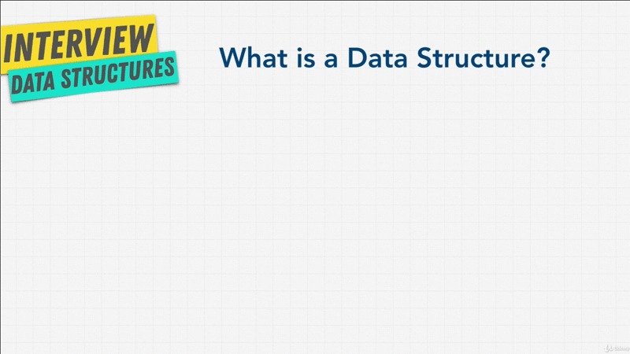
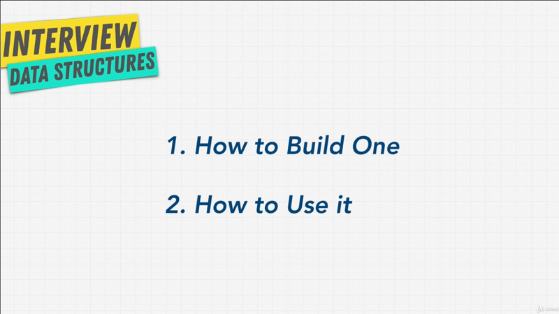
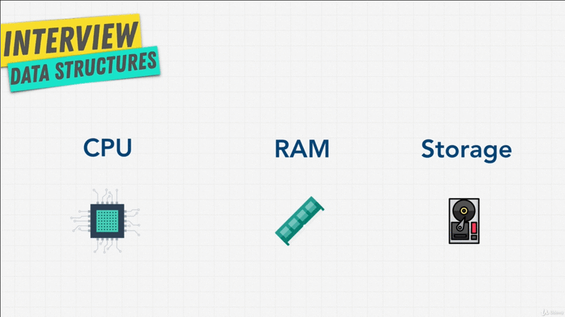
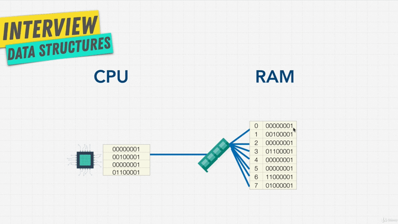
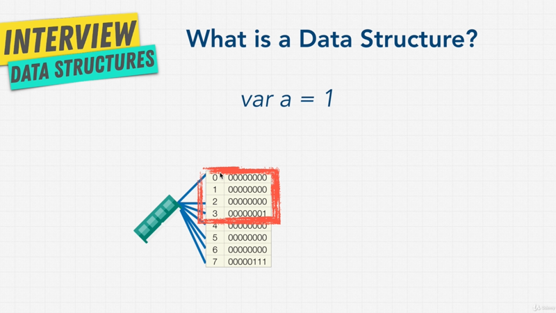
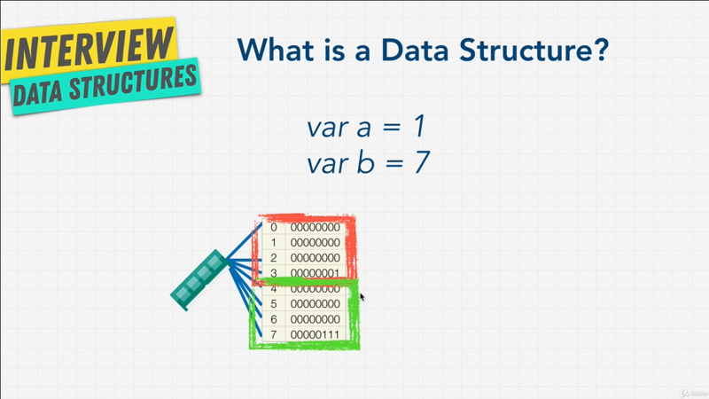
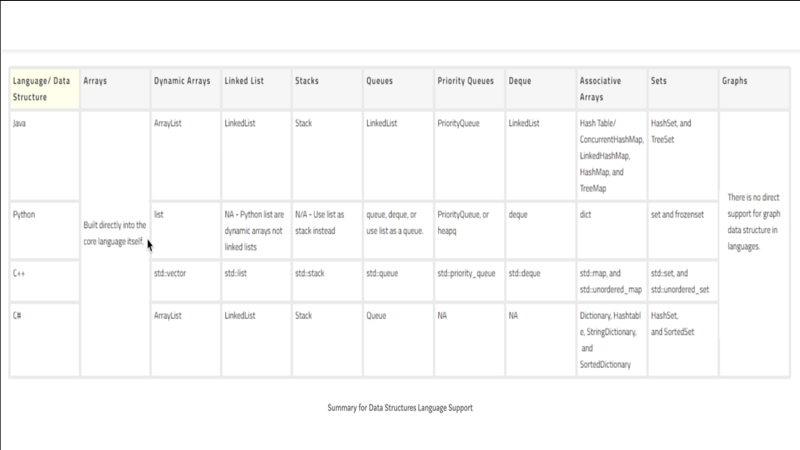

# Chapter-3 Data Structures Introduction

## Table of Contents

1.  [Module Introduction](#module-introduction)
2.  [What is a Data Structure](#what-is-a-data-structure)
3.  [How Computer Store Data](#how-computer-store-data)
4.  [Data Structure In Different Languages](#data-structure-in-different-languages)

<br/>

## Module Introduction

What is a data structure? Is a collection of values. What is
algorithms? Is the steps or process we put into place to manipulate these
collection of values, it's what allows us to write programs.

A person who knows how data structures and algorithms work, and how to use them,
can write great programs. The beauty is that these are _timeless_, no matter
what programming language you use, whether you prefer one library over the
other, whether you write code in Angular or React or Svelte or Vue in the
frontend development world, or you are game developer. Underneath it all, it's
all data structures and algorithms. If you understand these, then you can really
easily adapt and tackle all sorts of technical problems. It's why companies like
FAANG as questions specific to data structures and algorithms, because although
it may be important to know the latest and greatest JavaScript syntax or maybe
the latest and greatest library, _those things change_, if you know the
fundamentals though, then they can throw you any problem, any situation, and you
are able to make the right decision. This knowledge is extremely valuable.

The longer you are on the field, the more and more you realize that you need
these fundamental principle of data structures and algorithms in order to be
a great developer or engineers.

Over the next few sections, we have a long way to go to get familiar with data
structures and algorithms, so can write a good programs. Let's get started.

**[⬆ back to top](#table-of-contents)**
<br/>
<br/>

## What is a Data Structure

Data structure is a collection of values, the values can have relationship among
them, and they can have functions applied to them. Each one is different in what
it can do, and what it is best used for. Most important thing to take away is
that each data structure is good and is Specialized for its own thing.
<br/>


<br />

You can think of data structures as any sort of compartment or container, a data
structure is simply a file cabinet of different types. You have  a _backpack_
a place where you put maybe your school books, you have _drawer_ where you pull
clothes, you have a _fridge_ where you put your food, a _folder_ for your files,
and a _packing box_ maybe for your toys.

Each one of these container are useful for it's own thing, for example I'm not
going to put my food in a _drawer_ because that _yogurt_ is going to go bad in
_drawer_, likewise I'm not going to put all my _papers_ and _files_ in my
_backpack_ or perhaps a _packing toy box_ because it's just going to get crumple
up.

Each one of these containers are specific for it's own thing, and that's what
data structure really is. It's a way for us to organize data, so that we can go
into the _backpack_ and retrieve that data really easily. We can go into the
_fridge_ and grab that _popsicle_ or _ice cream_ really fast.  We can put things
in data structures and we can take things from data structures, and that's all
it really is.


There are a ton of data structures, just like in our real life, how we have all
these containers hold these places to put things in. In programming we have
a ton of them. If we go to
[Wikipedia](https://en.wikipedia.org/wiki/List_of_data_structures) for example,
while if we scroll through here see see a ton of data structures. This is going
look overwhelming, but don't worry most of these while I've never encountered
myself, and they're very-very specific. You probably only have about _five_ or
_six_ data structures that are really-really important that we're going to go
over.

You may even heard about _Bitcoin_ and how to use _Block chain_ technology, this
magical word, well _Block chain_ at the end of the day is simply a data
structure, a way to hold information.

So in our programming world, data structures, we can store things like
_numbers_, _string_, _boolean types_ just like we saw when we coded in
JavaScript with arrays and objects. **_Arrays and objects in JavaScript_** are
each a **_form of data structure_** that allows us to store information.

As human, this what we do on Earth, we take the chaos and the disorder, and make
order out of it, at least we try to, we organize our farms to produce food. We
package the food and we deliver them to the grocery stores and organize them in
the grocery store, so that human can grab those, and can then purchase these
groceries and give money to put in a compartment (space) and a bank. That's all
programs are, we're modeling  real life scenarios.

The more advanced a developer you become, the more time you will start thinking
and spending time talking about data structures. This is why interviewers love
to talk about data structures.

As I always like to mention, there are always tradeoffs. Every programming
question has a tradeoff. Remember are the are three pillars of _Readability_,
_Memory_ and _Speed_ when we talked about what code is best, well we have the
same thing with data structures. One is better than the other in some aspects,
and the other better than the other, that's why they exist, each one for its own
specific case, and there are two parts to understanding data structures.
<br/>


<br />

`[1]` _How to actually Build One_, how can we build with code some of these data
structures?; `[2]` _How to Use it_. We're going to do both of these in this
course, but the _second point_ is the most important. Because data structures
are usually just tools and most of the time they're already pre-built for us.
The most important part is, how to use them? When to use one over the other? And
we kind of saw a little bit of that in the previous section, when we talked
about how to solve problems, where we used an _object_ versus an _array_ to make
our code more efficient.

The goal in this course is to understand data structures, so that you can pick
the right data structure for your problems. Based on different scenarios, data
needs to be stored in a specific format. We have a handful of data structures
that cover our need to store data in different formats.

Let's get a little bit deeper into this topic.

**[⬆ back to top](#table-of-contents)**
<br/>
<br/>

## How Computer Store Data

In order to truly understand the value of data structures, we have to go deep
down into the way computer at the fundamental level, In order for a computer
to run code, he needs to keep track of things, like _variables_, _numbers_,
_strings_ or _arrays_. These variables are stored in what we call RAM. That's
how programs run.
<br/>


<br />

We remember RAM from _Space Complexity_ video right?, on top that we also have
_Storage_ where we store things like our _video_, _files_, _music_, _documents_;
and this Storage can be a disk drive, a flash drive, or a solid state drive.
Data Storage is permanent, or will be called persistent. So when you turn off
you laptop or computer it's still going be there when you turn in back on. In
RAM you lose the memory when the computer turns off.

Why wouldn't we just always use Storage? So we don't loose any data; Well the
problem is that Persistent Storage is slow, because you see a computer is run by
its CPU, you can think of the CPU as the little worker that does all the
calculations that we need, it does the actual work inside our computer. This CPU
needs access to the RAM and the Storage, but it can access the RAM and the
information in the ram a lot faster.

Let me give an example as if we're using Google when we run Google Chrome for
example browser, that Google Chrome browser has a piece of code. Here I've
simplified it, and we just have `var a =1`, we're just assigning this variable
`1` but we can imagine how we have hundred or thousand of lines of code of
Google Chrome. In order for our computer to run Google Chrome, we run the CPU
for it to do so; When a _variable_ is declared in, let's say script to run
Google Chrome, it's going to hold that in memory in our RAM; But once we turn
off or close Google Chrome, we want to be able to reopen it. Well that' what we
do when we save an application on our computer. We save it to storage, so that
next time we open up Google Chrome the CPU is going to grab the program from the
storage, so that it can use it again; And for Google Chrome to run fast, and run
smaller scripts it's going to keep that information in RAM.
<br/>


<br />

You can think of RAM in the computer as a massive storage area, kind of like
a data structure. This massive storage area has shelves (stack) that are
numbered. We called these _**Address_ or addresses and it's a really-really big
shelf that holds a lot of information, it allows us to run programs on our
computer.

Each of these shelves holds what we call `8 bits` or numbers. Each one of these
numbers is a bit; And a bit is a tiny electrical switch that can be turned on
and off; instead of calling it _on_ or _off_ we call it `1` or `0`, and `8 bits`
is called a **_Byte_**.

Each shelf has one Byte of storage and the CPU is connected to so meting called
a _Memory Controller_; and Memory Controller doe the actual **_reading_** of this
memory as well as **_writing_** this memory, because sometimes the shelf might
be blank and doesn't have anything.

This direct connection to the CPU is important, because the CPU asks the RAM,
hey what's in shelf number `0`?; and the Memory Controller actually has
connections individually to all of these shelf's; _again that's really
important_, because it means that we can access the `0` shelf and immediately
access the `7` shelf or `10` shelf, or `10000` shelf, without having to climb
down or step down. That what the name Random Access Memory means, we can access
memory really fast, because we have these connections and each shelf we want, we
just need to know which shelf we're looking for. We can access the _bits_ at any
random address in memory right away.

Even though this Memory Controller can jump between far apart memory addresses
really fast, **_programs tend to access memory that is nearby_**, the closer the
information is to the CPU and the less they has to travel the faster a program
can run.

So, computer are actually tuned to get extra speed boosts when reading
_memory-dresses_ that are close to each other, for computer to access `0` and
`1` is a lot faster than a computer for it to access `0` and `1000`, because
these are a lot closer together. To further optimize this, are computers also
have a **_CPU Cache_** where the CPU has a tiny-tiny memory where is stores
a copy of stuff that is really-really recent and this is called a **_Cache_**,
a common one that you might hear is something called **_Air LRU Cache_**.

So, again if we use Google Chrome as an example, we turn on Google Chrome with
what say application download it on our storage; the CPU loads it up, and
because we've visited hackernews.com for example, it's going to load up the
information for that site and put it into memory, or maybe even Cache if it can
hold it.
<br/>


<br />

So, why is this important for data structures?. Well, data structures are
a _remember_ ways for us to store information; for example, if we want to store
a variable `var a = 1`, well in our modern computers usually we represent
_integers_ that is the number `1` in `32 bits`, that is this block size of RAM;
and by the way this is now can be `64 bits` with more and more recent upgrades.

With this way, we can store the number `1` within this block of `32 bits`, Why
`32 bits`? Because `8 bits` which is `1 byte`, so `8 * 4 = 32`. We can store `32
bits` of information and this bit of `a = 1` is stored new in memory or the
address `[0 - 3]`.
<br/>


<br />

If we have another variable `var b = 7` we would be store it in the next block
`[4 - 7]` in our RAM.
<br/>


<br />


In doing this, you can now think about how system that are `8 bit` can hold `255
bits` of information. Things that are `16 bit` while they can hold a lot more
information; And now we have systems that are `32 bit`, you can see here that
we can hold a ton of information; and if we had `64 bit` that is instead of
having _8_ little shelves, we can have a lot of information that we can store;
And the bigger ` -bit` the more diverse that information is.

If we had an `8 bit` system, well the number `256` we can really store that;
that's really hard to do. I can demonstrate this to you with JavaScript.

```javascript
// Math.pow()
console.log(Math.pow(8, 255))   // 1.9406476153758862e+230
console.log(Math.pow(6, 1000))  // infinity
```

There's something called **_integer overflow_**, Now JavaScript technically
doesn't have integers, it only has what we call a **_64 bit float_**, but the
idea is that a computer can only store a certain number of information, so
using above syntax in JavaScript `Math.pow()` function that return the base to
the exponent power. The _first parameter_ is the _base_ to the power of the
_second parameter_.

If we put the `Math.pow(6, 1000)` the result is _infinity_, why is that? Well,
as the number becomes too large to store in our RAM, then we need to represent
this number `(6, 100)` that we cannot store into something that is tangible, and
JavaScript case it is _infinity_. No matter how big this number `(6, 100000)`
above of certain threshold i going to just say infinity

I show you all this because other data types other than _numbers_ work the same
way. Each data type has has a number of `bit` associated with it; and that needs
to get stored in the system; and the system allocates data storage and then CPU
reads from that storage.

There is nice knowledge with [Registers and
Rams](https://www.youtube.com/watch?v=fpnE6UAfbtU) and
[articles](http://statmath.wu.ac.at/courses/data-analysis/itdtHTML/node55.html),
so you can get more information about Computer store their data, we don't want
to get too deep in this, but a data structure is like this
[diagram](./images/gif/chapter-3-4.gif); **_A data structure is an arrangement of
data_**. You can define the way you interact with this data, and how it is
arranged in RAM; So some data structure in RAM are organized right next to each
other. Some are organized apart from each other, and they have different _pros_
and _const_ on access.

Our goal is to minimize the operation that we need to do for the CPU to get the
information, for the CPU to write the information; and that is why data
structures are so powerful. We're thinking about the _low levr_ and I don't know
by you, but this to me when I learned about this was really really exciting,
because **_we have a way now to think how data structures actually affect the
process_** of our computers, and how we can use what we know about computers now
to write great code.

**[⬆ back to top](#table-of-contents)**
<br/>
<br/>

## Data Structure In Different Languages

Each language has their **_own data-types or builtin data-types_**. JavaScript for
example has _Numbers_, _Strings_, _Boolean_ and _Undefined_.

Each language has **_data structures to organize these data-types_**; for
example in JavaScript we have _arrays_, and _objects_ that we use and they are
data-types.

It allows us to structure and organize information such as our _primitive data
types_ or even hold more complex one, like having an array that contains
multiple object. We're going to talk about this in more detail.

I want to show you hat we do have different languages that have different access
to some data structures.
<br/>


<br />

You can see above, some of other languages that we can use in this course and
whether they have them available. We see that Java has ArrayList, Linkedlist,
Stacks, PriorityQueue, and many other types. Now doesn't that mean that if we're
using JavaScript we can only use Arrays and Object? Well no, not really
although these languages come with data structure built in. We can also built
our own, and most languages have enough data structures and data-types or us to
build and create our own data structures.

If JavaScript doesn't have Stacks, well we can build one.

To finish this section and finally dive in into our first data structure,
I wanted to just remind you, that we have a [little
map](https://coggle.it/diagram/W5E5tqYlrXvFJPsq/t/master-the-interview-click-here-for-course-link/c25f98c73a03f5b1107cd0e2f4bce29c9d78e31655e55cb0b785d56f0036c9d1)
of what we need to know for the coding interview. In this map, I have a little
present emoji :gift: next to each one of the data structure that we're going to
talk about. As you can see there aren't that many of them; and many of them are
quite related or are  children of the other. Use this as reference for you to
just draw map of how things are connected and what the data structure are that
we're going to talk about.


**[⬆ back to top](#table-of-contents)**
<br/>
<br/>
