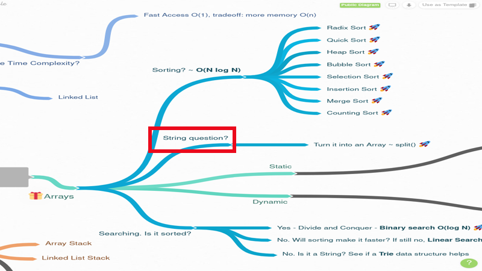
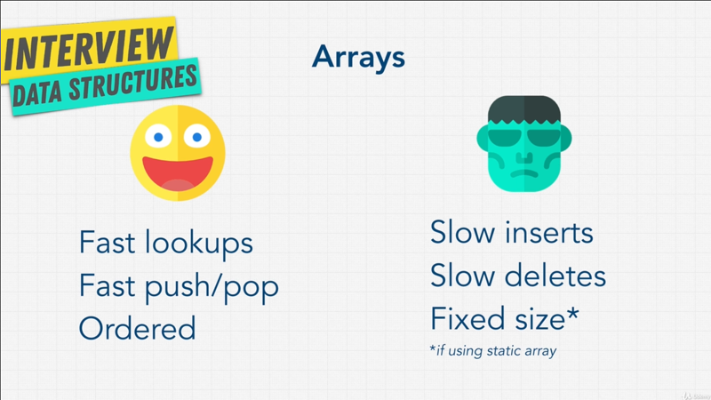

# Chapter-4 Data Structures Arrays

## Table of Contents

1. [Array Introduction](#array-introduction)
2. [Static vs Dynamic Arrays](#static-vs-dynamic-arrays)
3. [Optional Classes In JavaScript](#optional-classes-in-javascript)
4. [Implementing An Array](#Implementing-An-Array)
5. [Strings and Arrays](#strings-and-arrays)
6. [Exercise Reverse A Strings](#exercise-reverse-a-strings)
7. [Exercise Merge Sorted Arrays](#exercise-merge-sorted-arrays)
8. [Array Summary](#array-summary)

</br>

## Array Introduction

### Array chart

</br>


</br>

Arrays which sometimes called **_Lists organizes items sequentially_**, that means
one after another in memory.

Kind like what we have here, we have some sort of data at _index_ `0` say _Juice_
and then right after at _index_ `1` we have _Apple_, maybe this is a grocery list.
In our computers memory it will be one after another, because remember our RAM
is a lot bigger than just `7` slots. And the arrays are probably the simplest
and the most widely used data structure.

Lucky for us we're starting with this, because arrays have the **_least amount
of rules_**, and because they're **_stored in contiguous (neighboring) memory
that is in order_**, array also have the **_smallest footprint_ of any data
structure**.

So, if all you need to _store some data_ and _iterate over it_, that is go one
by one step by step, Arrays are the best choice. Especially if you know the
indices (index) that is on the left `0, 1, 2, etc` of the items you are storing,

### example - Lookup

Just as quick glance (look through) and we'll go over the **_Lookup O(1)_** and
friends in more detail in later videos; But **_lookup_** or access with array
are _constant time_ of `O(1)` it's super super fast.  Others actions or methods
that we're going to go over so, like _Push_ are also fast. But _Insert_ and
_Delete_ are `O(n)` or linear time.

In order to demonstrate Arrays, let's actually use code to show you an example.

```javascript
const string = ["a", "b", "c", "d"]

strings[2]      // "c"

// 4 * 4 = 16 bytes of storage

// [O  | a]
// [1  | a]
// [2  | a]
// [3  | a]
// [4  | b]
// [5  | b]
// [6  | b]
// [7  | b]
// [8  | c]
// [9  | c]
// [10 | c]
// [11 | c]
// [12 | d]
// [13 | d]
// [14 | d]
// [15 | d]
```

We have an array `const string = ["a", "b", "c", "d"]`. Now looked on this and
based on what we've learned so far, we can make a couple assumptions. For
example, to store the letter `a`, `b`, `c`, and `d`, that `4` items; if we are
on `32 bit` system that is we have `4` shelf's to store the letter `a` in `0`
and `1`. Well if that's the case, we just multiplies `4`  by `4`; and each item
taking up `4` shelf's in our memory. That means we're using up `16 bytes` of
storage.

If we remember in our little example here, that with `32 bit` systems, we have
`4` shelf's to store this number `var a = 1`.
</br>


</br/>

Again this is a bit of simplified version of looking at it, but I hope you see
what we're doing here, we're simply storing `"a","b","c","d"` in sequential
order in our RAM.

So the computer now knows where to find variable these items, therefore when
I do `strings[2]`, I'm telling the computer, hey go to the array called
`strings`, you should know where that is, because underneath the hood you stored
it for me, and grab the _third item_, remember the indexes are `2`, so grab the
third item from where the array is stored on your memory.

If I run this, or in NodeJS console log it, I get an object `'c'`. The computer
is going to grab that information for me because it's stored for me `strings`,
and `strings[2]` it's grabbing it for me.

### example - Push

All right, so let's do a few more operations with arrays, and see what the pros
and cons are. In JavaScript we have a few methods that we can use with arrays.

`[1]` **_Push_**, _which simply allows us to add something at the end of the array_.

```javascript
const string = ["a", "b", "c", "d"];

strings.push("e");          // O(1) - operation.

console.log(strings);       // [ 'a', 'b', 'c', 'd', 'e'  ]
```

If I run I get an array `[ 'a', 'b', 'c', 'd', 'e'  ]`. This `strings.push()`
operation, because it just adds it at the end of the array is an `O(1)`
operation. All we doing is adding whatever item we want at the end, we're not
looping through anything.  Hopefully that make sense why that would be `O(1)`
that's very convenient.

### Example - Pop

We can also use `[2]` **_Pop_**, and Pop is the opposite of Push. Pop will
simply mean to _remove the **last** item from the array_.

```javascript
console.log(strings);       // [ 'a', 'b', 'c', 'd', 'e'  ]

strings.pop();              // Time-Complexity: O(1)
console.log(strings);       // [ 'a', 'b', 'c', 'd' ]

strings.pop();              // Time-Complexity: O(1)
console.log(strings);       // [ 'a', 'b', 'c']
```

You can see the letter `e` was moved. If do `strings.pop()` again, we see that
this time around we've removed string `d`. What do you think the
Time-Complexity of this operation is? Once again is `o(1)`, because we not
looping through anything, we're just removing the last item, and remember our
computer knows where last item is stored.

### Example - Shift

What if we want to add an item at the _beginning_ of an array? Well, we have
something called `[3]` **_Unshift_** in JavaScript, and depending on your
language you will have perhaps something different.

```javascript
strings.unshift("x");       // 0(n)
console.log(srings)         // [ 'x', 'a', 'b', 'c']
```

We see that string `x` have been added at the beginning of our array. What do
you think the Time-Complexity of this operation is?;

By the way, as we go through data structures and because we know Big-O notation
is in it pretty cool that we're able to think about code beyond just 'oh, I'm
just doing this' `strings.unshift()`. We can think deeply about what happening
underneath the hood. Why `string.unshift()` operation be longer then
`strings.pop()` operation?. I find that fascinating, and when I first understood
this point, it really made me a better engineer; and I hope you're starting to
get this 'aha' moment for you as well, especially if this is your first time
with data structures.

What are we doing with _Unshift_? Well, remember variable `strings` are
essentially stored.

```javascript
const strings = ["a", "b", "c", "d"];
//index         [ 0,   1,   2,   3 ]
```

When I add letter `x` with _unshift()_, I'm all of sudden adding `x` into our
array.

```javascript
const strings = ["x", "a", "b", "c", "d"];
//index         [   ,  0,   1,   2,   3 ]
```

But we now have to _shift_ the _index number_, because the indexes still like
this. But this time around we have to say, OK `0` is for `x`; `a` is now index `1`;
`b` is now index `2`; `c` is now index `3`; `d` is now index `4`;

```javascript
const strings = ["x", "a", "b", "c", "d"];
//index         [ 0 ,  1,   2,   3,   4 ]
```

Just by me doing this, you might have seen something we just **iterated `loop`**
through everything, and  reassign the indexes; and I did _five_ moves or _five_
operations to realign the indexes; And this should give you a hint, that is
**_unshift()_** operation is `0(n)`, _depending on the size of the array_ that
how long it;s going to take to do that operation we're looping.

So, right away we know that with the arrays, maybe it's not the best data
structure for **_adding items at the beginning of the array_**.

### Example - Splice

What if we wanted to add something in the middle of the array? So we can use
method `[4]` **_spilce()_**. With _spilce_ I can say `strings.splice()`

```javascript
const strings = ["x", "a", "b", "c"];

strings.splice(2, 0, "alien")
console.log(strings)            // [ 'x', 'a', 'alien', 'b', 'c'  ]
```

Again I get a hint of what I can do, the first is the **_start_** number, so
I want to start at index of `2`; and remember we have an array of `["x", "a",
"b", "c"]`, so we starting at `b` and the second parameter is the
**_deleteCount_**; What do we want to delete? Or how many things from this index
do we want to delete? In our case we don't want to delete anything, we want to
add, so I say `0`, and then the **_items_** that we want to add, we want to add
string that says `"alien"`.

So, _splice_ told us, go to index of `2`, where `b` was initially, and add
`alien` instead of `b` and just _shift_ things over.

```javascript
// [1]
const strings = ["x", "a", "b", "c", "d"];
//index         [ 0 ,  1,   2,   3,   4 ]

// [2]
const strings = ["x", "a", "alien", "b", "c", "d"];
//index         [ 0 ,  1,            2,   3,   4 ]

// [3]
const strings = ["x", "a", "alien", "b", "c", "d"];         // O(n/2) => mutated into O(n)
//index         [ 0 ,  1,     2,     3,   4,   5 ]
```

What we've done here is If we go back to our variable `strings` we have the `x`
in our array and we shifted these indexes of `x` and they are still the same,
but we shifted `b` over; `[w]` And  I want to add `alien`; `[3]` and we now had
to go over everything and say index `2` for `alien`, we want index `3` for `b`,
we want index `4` for `c`, we want index `5` for `d`.

So, what's our Big-O here? Our Big-O in this case, we did half of the operations
because we changed half the array with half loop through the array; it would be
`O(n/2)`. But remember our rules when it comes to Big-O , we remove constant and
simply just call `O(n)`. Worst case it's just going to be `O(n)` operation.

I want to leave this  for you,so you can play around and try different methods
on Arrays; but I hope you understand how they work and how that some good things
(pros) that we can do, such as **_accessing the array_** that is `O(1)`, because
it's well extremely fast, we know exactly where it is in memory; And we can
**_push_** and **_pop_**, but when it comes to **_unshifting_** or
**_splicing_** or even **_deleting_** because with _splice_ we can even do
_deletes_, that's going to be `O(n)`.

If we go back to our [chart](#array-chart), which we now have a better
understanding of why arrays `Lookup O(1)` are extremely fast we know where they
are. We know why `push O(1)` adding the end of the array is extremely fast, but
why `insert O(n)` and `delete O(n)` might my not be the best or the fastest when
t comes to arrays;

But here's the thing, there's actually two type of array, and in the next video
we're going to talk about these two types.

**[⬆ back to top](#table-of-contents)**
</br>
</br>

## Static vs Dynamic Arrays

As I mention in the previous videos, there are two types of arrays, it's called
`[1]` **_static_**,and the other `[2]` **_dynamic_** Arrays. What is the
difference between the two?

Well, the one limitation of _static arrays_ is that they're **_fixed in size_**,
meaning you need to specify the number of elements, your arrays will hold ahead
of time. In [this case] (#array-chart), if this was a _static array_ I would
say, create an array of seven items, knowing beforehand that in my grocery list
I'm only going o have _max_ seven items, because arrays are allocated in
adjacent blocks of memory when they're created, there's no guarantee that after
we've allocated `7` shelf's of memory that you can keep adding things on,
especially in order. We solve this problem with _static array_ that require us
to say ahead time, 'hey, I only want `7` shelf's of memory' with _dynamic array_
and _dynamic array_ allow us to copy and rebuild an array at a new location
which with more memory. If we wanted more memory;

So for example, with our _static array_, if we realize that we forgot another
item on our list, and we need eight items, what happens is, we copy this entire
array, we allocate `14` block of memory and paste this list plus the eight item
into that new location. Let me show you how this works with code.

You see in languages like C++, which has a _static array_ to create an array,
you do something like this,

```c
// C++
// [1]
int  a[20]

// [2]
int b[5] {1, 2, 3, 4, 5}
```

Above says, `[1]` I want a new array that has a space of `20` items; Or we can
do something like `[2]` `int b[5]` with then fill up the array of five items
with `{1, 2, 3, 4, 5}` integers. Because of this is a _static array_ in order
for us to add a _six_ item on, we would need to copy entire array and move it
over to completely different area of memory in order to create the space for it.
Lucky for us, when I showed you with JavaScript how to do this well, we never
have to worry about. _In JavaScript example we never really allocated memory, and
that's because JavaScript and other languages like Python where you have list
and array list in Java, then **work like dynamic arrays**_, they automatically
allocate memory according to the increase in size of the array.

So right off the bet, you're thinking _dynamic array_ are way better easier,
I don't have to think about memory, because of automatic resizing and that gets
into discussion of managing memory which low level language like C++ allow,
while higher level languages like JavaScript allow us to not think about memory
and let the machine take care of it for you.

There's time where maybe yo do want to manage your memory and times where you
don't need to, based on your needs. Obviously having more control over memory
allows you to really tweak things and make things faster, and that why languages
like C++ can be much faster than higher level languages like JavaScript, but we
don't need to get into that. What we want to get out of this lesson is that
_dynamic array_ expands as you add more elements. So, you don't need to
determine the size ahead of time, but you may noticed something with _dynamic
array_
</br>


</br/>

You see over dynamic array chart, how I have a point at`append* O(1)`, that is
the same as the `.push()` command that we did in the previous lesson, But I have
star `*` that says it can be `o(n)`, why is that? Well, if we remember our
array,

```javascript
const strings = ["a", "b", "c", "d"]
                ["a", "b", "c", "d", "e"]   // add another letter
```

If underneath the hood JavaScript and our machine only created _four_ blocks of
memory (shelf's) for this array, and we _add another letter_ underneath the hood
because this is a dynamic array, it's going tho loop over these items, copy them
and move it to a different location with now _eight_ blocks of space (it usually
doubles the space); So that we can keep adding after letter `e`, like empty
space.

You see here because we did this looping, the operation becomes `O(n)`, so
that's something to keep in mind, although it's minor detail, it's good to know
how things work underneath the hood, and most of the time with the languages
that you're working during interviews you will be talking about _dynamic array_
and you won't have to worry about allocating memory, and thinking about the
possibility that you might have to copy the array, that's really low level, but
I wanted to show you they work, so that you have those fundamentals going forth,
and understand when it comes to array, just because you're adding at the end
using the `.push()` command, you can assume that it's `O(1)`  most of the times
or constant time, but every once in while you might encounter a situation where
it's `O(n)` linear time.

**[⬆ back to top](#table-of-contents)**
</br>
</br>

## Optional Classes In JavaScript

Now as I said with both arrays and functions, these are advanced concepts you're
probably not going to just get it 100% the first time around, but use these
videos (lectures) as reference to come back as you progress through your career.

In this optional videos, I'm going to talk about three things that are important
with objects, we are going to talk about:

1. [Reference Type](#reference-type)
2. [Context](#context)
3. [Instantiation](#instantiation)

</br>

### Reference Type

Let's get start with the first one, _reference type_, what I mean when I say
reference type? Well, I wanted to see if you can guess what's going to happen
when I do,

> NOTE: Use browser console or NodeJS REPL

```javascript
[] === []               // false

// OR
console.log([] === []) // false
```

arrays equal array? `[] === []`, what do you think the answer is going to be?
Well, the result is `false`, interesting,
</br>

```javascript
[1] === [1]             // false
```

What if I do `[1] === [1]` what do you think the result? The result is `false`,
quite interesting. One more question,
</br>

```javascript
var object1 { value: 10 };
var object2 = object1
var object 3 = { value: 10 }

console.log(object1 === object2)        // true
console.log(object1 === object3)        // false
```

If I do `obejct1 === object3` I get `falae`, But why is that? We get `value: 10`
for both, right? Let's pick something else,
</br>

```javascript
var object1 { value: 10 };
var object2 = object1
var object 3 = { value: 10 }

object1.value = 15;
object2.value;                          // 15
object3.value                           // 10
```

If I do `object1.value = 15`, and now I do `object2.value` the result is `15`;
But if I do `object3.value` the result is `10`, well how was confusing right?

Let's look at what's actually going on; And this is the first topic we're
talking about which is _reference type_, let's look at diagram,
</br>


</br>

Objects are what's called the _referenced type_ in JavaScript, up until this
point  all the others JavaScript types that we've learned including _Numbers_
_Null_, we have _Undefined_, _Boolean_, _String_ even _Symbols_, they're all
defined by the JavaScript programming language. So the person who wrote
JavaScript ([Brendan Eich](https://en.wikipedia.org/wiki/Brendan_Eich)) and
EcmaScript, the standard says, these are **_primitive types_**. We'll tell you
what they are, now a _reference type_ which is a **_non primitive type_**, are
not defined by the programming languages. What that mean is? That they're
_created by the programmer_.

So, let's look as an example, when I say `var number1 = 1`, JavaScript knows
what `1` is it; It's a type of _Number_, and it's a primitive type, it's always
the same thing, it's immutable every time it uses _one (**1**)_; That's the same
one that JavaScript knows about. When I do `var number2 = 1`, it's using the
same number _one (**1**)_ that JavaScript knows about.

However, when we created `var object1 = {value: 10}`, `var object2 = object1`,
`var object3 = { value: 10 }` well, those were _created by the programmer_, they
are **_reference type_**.

So, what we said was, I want `object1` create a new Object, well say the
black-box or filling cabinet; and in it put value `10` into this black-box.

`object2` says, I want you to just **_reference_**, and that's where the word
comes form; reference `object1` saying "hey I want whatever s inside this
black-box".

When `object3` gets created, it's a _new object_, because we have
the new brackets `{}`, and it's saying put value in the new black-box.

Essentially what we're doing is saying, when we create a variable `object1`
we're storing just a reference to an address to where storing the value `10`
which is `Box1`, so we're saying `object1`, I'm just letting you know that this
is the address of all the content that you want, and that's in `Box1`.

`object2` is saying, I want whatever is in `object1`, and we look in `object1`,
and `object1` just has the information of `Box1`, so it references that.

In `Object3`, creates a new object, so it's saying, I'm going to put my contents
in `Box3`, and I'm just going to have the address of the box saying `Box3`.

So, going back to our example, this makes sense, when we change `object1.value
= 15` we change the content of `Box1`; So, when we do `object2.value` which is
referencing the same box as `object1` that's is `15`, but `object3.value`
doesn't change, because that's interesting in a completely different box, it's
`Box3`.

Going back to first example `[] === []`, well as I mentioned in previous
lectures (videos), **_arrays are just objects_** at the end of the day. So, when
you create an array `[] ===`, it's same thing creating a box, a data structure;
and `=== []` it create a second data structure.

So that is a **_reference type_**. A very important concept, but I think you get
it right? Let's get to next one, this gets little tricky here.

### Context

This one's called **_context_**; and _context_ get confused a lot with
**_scope_**. If you remember we said that _scope_ is created when it see `{}`.

```javascript
function b() {
    let a = 4;
}

console.log(a)      // ReferenceError: `a` is not defined
```

If we create a function, as soon as we create that function there is a _new
scope_ that's created. So we can have new variable `let a = a`  that lives
within this universe, it doesn't know anything about the **_root scope_**
(global scope) which is over outside the function. If I logging variable `a`
outside the function, it will return `ReferenceError` because it doesn't exist,

So that's **_scope_**.

#### Context - example 1

```javascript
// at browser console
console.log(this)                   // Window {...}

console.log(this === Window)        // true

this.alert("hello");

.alert("hello");
```

Now, how it's _context_ different, _context_ tells you **_where we are within
the object_**. Let me explain if we `console.log(this)`, `this` probably the
most confusing word that a lot of people have trouble and even people that have
been in the industry for years, still have a difficult time with `this`, but
let's see what it is; `this` will result a `Window` object. So just double check
if I logging `this === Window` I get the result `true`.

So, what `this` means is, **_what is the object environment that we're in right
now?_**, the best way to think about it is, what is to the left of the ` -.` dot?; So,
right now I'm able to do `.alert()` because I'm inside the `Window` object. So
doing `Window.alert()` or `.alert()` is the same thing.

Now, why that is important? Well when we get to _instantiation_  I'll show you
why it is, but it's very important concept when you see again and again. But
remember, `this` just **_refers to what object it's inside of_**.

#### Context - example 2

```javascript
function a() {
    console.log(this);
};

a()         // Window {...}

window.a()
```

I do `function a()` within this function I do  `console.log(this)`; If I call
`a()` what do you think happens? Still `Window` object, `this` is still refers
to the function. If you remember, that's because I said it has to be what object
we're inside of right now.

Technically `function a()` I can go `window.a()` to run the function. So the
left of the `-.` dot, that the Window. In order to create a new value for `this`
you have to do something like,

```javascript
const object4 = {
    a: function() {
        console.log(this)
    }
}

object4.a()             // { a: [Function: a]  }
```

I run `object4.a()` now `this` is the object which is refer to `object4`.

So, why is that important for us? Well, first of all you'll see it and other
codebases, so it's good to know, but it's really important when we do
instantiation. Instantiation is when you make **_a copy of an object_** and
**_reuse the code_**.

Imagine you're building a big multiplayer game online, and this game's going to
have many's player you can have, like _wizard_, _trolls_, _warlocks_, _elves_;
Now if you had to create an object for every single players, that's a lot of
repeated code, that's a lot of hassle, and that's a lot of your time, and it's
not very efficient. to solve that, you can do something called instantiation,
you're making instances or **_multiple copies of an object_**.

Let me show you how we do instantiation in JavaScript again.

### Instantiation

This is going to look a little bit weird at first, just like `for-loops` did,
just like function did at beginning; but it's just the syntax, and you'll get
used to it.

```javascript
class Player {
    constructor(name, type) {
        this.name = name;
        this.type = type;
    };

    introduce() {
        console.log(`Hi I am {this.name}, I'm a ${this.type}`);
    }
}
```

Let's say, we have a class named `Player`. Now you see the new syntax already,
and I capitalize a class. Now think of a class as something that I want to make
copy of it. If I ever want to make a copy of an object, it's a good idea to do
something like this (use `class` keyword), so that well you'll see how easy it
is to copy this.

We do class `Player`, and within here we'll say `constructor()`. Let's give it
this `Player` can have a `name` and `type`, and within the constructor,
`this.name` he calls `name`; and `this.type` he calls `type`.

Constructor, when you create class `Player`, class says, "every time I'm making
a copy of a `Player`, the first thing that gets run is the `constructor()`
function"; and this `constructor()` function is going to create these properties
`(name, type)` on the player object.

Now I can create anything that I want for the `Player`. Let's say we want to
create a _method_ such as `introduce()` that console logs `${this.name},
${this.type}`. What I'm saying, this `Player` class, any player that I create
will always be able to introduce himself, and they all also have `this.name` and
`this.type`.

The reason we use `this` here, is that when we create a player we can access the
`name` and `type` property. I'll show you later on how that works; But this is
just a syntax, you're going to get used to, in order to access the `Player` and
make copies of it; You'll have to run a constructor, which is all the properties
and methods that you want the player to have. You can also create methods that
players can have and any time you want to access a property within the
constructor, we'll use `this.name` into use `introduce()` method. What I have to
do, is I'll have to write `this.introduce()`.

OK, so we have a player, but when we're building our multiplayer game, we want
to a new copy of `Player` class built add onto it. Let's say we want to create
a _wizard_ player.

```javascript
class Wizard extends Player {
    constructor(name, type) {
        super(name, type)
    };

    introduce() {
        console.log(`WEEEE I'm a `this.type);
    };
};
```

`class Wizard extends Player`, What is this code saying? This code saying,
I want `Wizard` to extend whatever a `Player` has. So I want to add on top
whatever player has;

Again because `Wizard` is a class it we'll have to do with `constructor()`, this
`Wizard` is going to accept `name` and `type`. Within constructor, this is
a tricky part, any time we `extends` something, we need to also call the
constructor function of the `Player` (parent class).

We have to do something called `super()` with the properties that we want to
pass to the constructor, in this case is `name` and `type`, I know this is
little bit confusing, it's just something you have to do. Whenever you `extends`
a class you want to use `super()` so that you essentially have access to
`this.name` and `this.type` from class `Player`.

We also want with the `Wizard` class to have a `play()` function (method) and
the `play()` function was just console logging `Weee I'm a ${this.type}`.

Now we have a `Wizard`, what the power? What the reason to instantiate `Wizard`
from `Player`? Instead of constantly creating players, and then saying that they
are wizard and then can play. Now I can say,

```javascript
const wizard1 = new Wizard("shelly", "Healer");
```

If I want to create a new Wizard, I'll just say,

```javascript
const wizard2 = new Wizard("Shawn", "Dark Magic");
```

So, let's go through it, and make sure we understand everything. As we've learn
let's use `console.log()` on,

```javascript
// Instantiation
class Player {

    constructor(name, type) {
        console.log("===> Player", this);           // [1]
        this.name = name;
        this.type = type;
    };

    introduce() {
        console.log(`Hi I am ${this.name}, I'm a %{this.type}`);
    };
};

class Wizard extends Player {
    constructor(name, type) {
        // console.log("===> Wizard", this);        // [2] ReferenceError
        super(name, type);
        console.log("===> Wizard:", this);           // [3] ===> Wizard: Wizard { name: 'Shelly', type: 'Healer' }

    };

    play() {
        console.log(`WEEEE I'm a ${this.type}`);
    };
};

const wizard1 = new Wizard("Shelly", "Healer");
const wizard2 = new Wizard("Shawn", "Dark Magic");

// Result
// ===> Wizard {}
// ===> Wizard {}

wizard1.play()                                      // WEEEE I'm a Healer.
wizard1.introduce()                                 // Hi I am Shelly, I'm a Healer

wizard2.introduce()                                 // Hi I am Shawn, I'm a Dark Magic
```

`[1]` What `console.log(this)` give us? We get `Wizard {...}` object. Let's go
trough everything here. I say, we have a class `Player`; then a class `Wizard`
extends `Player`; and then we have two variables `wizard1` and `wizard2`.

Now, the program's going to see the `new` keyword, anytime it sees `new` keyword
it says, "oh we're creating a new `Wizard`, and this `Wizard` is going to have
two parameters `("Shelly", "Helear")`". So it's going to go to the `Wizard`
class again, because it has `new` keyword, and says "I want to extends
`Player`"; It's going to the `Wizard` constructor and it's going to see
`super()`;

What `super()` does? It's takes us up to the constructor of `Player`; and run the
constructor `Player`.

Now, it's attached `this` in `console.log(this)` as the `Wizard`, and then
run `introduce()` function from `Player` class; and run the `play()` function
from `Wizard` class.

Now, if I go to `wizard1.play()` i get `WEEEE I'm a Healer`, because _Shelly_ is
a _Healer_; But I also have access to `wizard1.introduce()` with result `Hi
I am Shelly, I'm a Healer`

We also have access to `wizard2.introduce()` it's give us back the result `Hi
I am Shawn, I'm a Dark Magic`.

`[2]` what the result of `console.log(==> Wizard, this)`? I get,

> ReferenceError: Must call super constructor in derived class before accessing
> 'this' or returning from derived constructor

What that saying is, that in order for me to access `this` on `Wizard` class to
get `this.type` I have to call `super`, which run the `Player` constructor. So,
that's what `super` is doing. It's sound kind of weird, but it just something
that you need.

`[3]` If I put `this` after `super` keyword, it should return for us `===>
Wizard Wizard { name: 'Shelly', type: 'Healer'  }`

The keyword `class`, `extends`, `super` is actually new syntax on _ES6_, that
you'll see a lot on ReactJS. Back in the day this is how we used to do it,

```javascript
// Classical inheritance
var Player = function(name, type) {
    this.name - nmae;
    this.type = type;
}

Player.prototype.introduce = function() {
    console.log(`Hi I am ${this.name}, I'm a ${this.type}`);
}

var wizard1 = new Player("Shelly", "Healer");
var wizard2 = new Player("Shawn"m "Dark Magic");

wizard1.play = function() {
    console.log(`WEEEE I'm a ${this.type}`);
}

wizard2.play = function() {
    console.log(`WEEEE I'm a ${this.type}`);
}
```

The exact same code I have up there `class Player{...}`, it's called _Classical
inheritance_, it doesn't look too bad, but you see that there's `prototype`
keyword, which it's another thing that you'll see in JavaScript, and to be
honest with you, you shouldn't really use _Classical inheritance_, it doesn't
look very nice. You see that, we have to attach `.play()` to both `Wizard`, it
just doesn't look as nice as `instantiation`.

Once you get used to everything, it's not too bad. All we're saying is, as soon
as we say `class` we say, "hey, we probably going to make a copy of object.". So
we want to make copies of `Player`, we want to make copies of `Wizard`, and
that's called **_instantiation_**.

When I do the `new` keyword, I say, "make an instance of `Wizard`", and `Wizard`
uses some functionality from the `Player` and adds its own little `play()`
function as well.

Holly moly that was a lot, like I said. This section is something that you'll
have to come back to, and you won't  get it right away. It's really-really hard
to fully understand the topic without actually having to use it in real life.

Just keep this in mind every time you hear somebody talk about **_reference
type_**, or **_context_**, or even **_scope_**  or **_instantiation_**
something; Well these are the things that they're talking about. Objects are
really-really complicated, they're really hard, but with that, it gives us
a lot of power. Good luck.

**[⬆ back to top](#table-of-contents)**
</br>
</br>

## Implementing An Array

</br>


</br>

Now that we know how to use arrays where they're fast, where they're slow. We're
going to get into a part that is not crucial for interviews, but it's good to
understand how they work, and how to build an array.

Most likely in an interview, you won't get asked "Hey, build the array from the
beginning". But I do want to build those foundations for you, so that we
understand arrays from a fundamentals level.

So, let's build an arrays ourselves. In this lectures (videos) we're going to be
using the `class` syntax in JavaScript. So we're going to create an array class,
even though with JavaScript and many other languages we can just do `const
a = []` and we've created an array.

Let see if we can build one of our own. Because as you'll find out as we go
through this course, _data structures_ are simply things that we can build from
scratch. We can create whatever _data structures_ we want, we can create our own
_data structures_.  The most common _data structures_ are well-known and are
already implemented in most languages, because they're so useful. But you are
able to build _data structures_ you want from scratch and as you'll find out
most _data structures_ are **built on top of other _data structures_**.

To get started we're going to create an array in JavaScript but just a heads up.
JavaScript is a bit an interesting case, arrays in JavaScript are just **_objects
with integer based keys._** that act like indexes; That's what we're going to
build. Different languages will have this implementation differently, but what
we're going to learn here, is still going to be applicable to how arrays work in
other languages.

```javascript
class MyArray {
    constructor()  {
        this.length = 0;
        this.data = {};
    };

    get(index) {
        return this.data[index];
    };

    push(item) {
        this.data[this.length] = item;
        this.length++;
        return this.length;
    };

    pop() {
        const lastItem = this.data[this.length - 1];
        delete this.data[this.length - 1];
        this.length--;

        return lastItem;
    };

    delete(index) {
        const item = this.data[index];
        this.shiftItems(index);

        return item;
    };

    shiftItems(index) {
        for (let i = index; i < this.length - 1; i++) {
            this.data[i] = this.data(i + 1);
        };

        delete this.data[this.length - 1];
        this.length--;
    }
};

const newArray = new MyArray()


console.log(newArray)           // myarray { length: 0, data: {} }
console.log(newArray.get(0))    // Undefined

newArray.push("hi")
console.log(newArray)           // MyArray { length: 1, data: { '0':'hi'  } }

newArray.push("you")
console.log(newArray)           //  MyArray { length: 2, data: { '0': 'hi', '1': 'you'  } }

newArray.push("!")
console.log(newArray)           // MyArray { length: 3, data: { '0':'hi', '1': 'you', '2': '!'  } }

newArray.pop();
console.log(newArray)           // MyArray { length: 2, data: { '0':'hi', '1': 'you'  } }
```

We're going to start off with creating a class we call this `MyArray`. Within
the array we'll have a constructor which is the _initial function_ that will be
run when we create this `MyArray`. This constructor is going to have **_two data
points_**. `[1]` `this.length` property, because with an array we're able to
determine the length of the array, and the initial length will be `0`. That is
how many item the array has, and then we'll obviously have the`[2]` `this.data`
within the array, this is going to be an `{}` object.

### Create `get()` method

Now, what's the most common action that we have in array? Well the access, to
access the data. So, let's create `get()` method, and this `get()` method is
going to take an `index` to actually grab the data from memory. So, I'm just to
say return `this.data`, and if `this` keyword is confusing to you, make sure you
watch the previous videos.

`this.data` is just referring to constructor `this.data = {}`. We're just to
return the `data` to the `index` | `return this.data[index]` that we're requiring.

Let's see how this would work in action. To create a new `MyArray` all we need
to do is `const newArray = new MyArray()`. If I do `console.log(newArray)` I get
result `myarray { length: 0, data: {} }`. If I do `console.log(newArray.get(0))`
i get result `undefined`; well, because there's nothing in `this.data = {}`
object, we have no items; and JavaScript automatically has the type `undefined`
when while there's nothing.

### Create `push()` method

Let's add our next method, that is `push()` method, to _add something at the end
of the array_. This `push()` method will take in an `item` that we will give it
and within this method we will simply add data `this.data[]` of our object, it's
going to add it to the length `this.lengh` of our item become
`this.data[this.length]`.

Because we have `0` items, and the length is `0`, this `push(item)` method is
going to add the data at `this.data[this.length]` and the `0` index will simply
now contain the `item` | `this.data[this.length] = item;`

Because we want to keep adding items if we wanted to, we will say
`this.length++`, because now our array has a length of `1` instead of `0`.

Next time, we run the `push()` method, `this.length` will be `1` and the `item`
will be added at index of `1`; And let's just `return this.length` for now.
Because the typical `push()` method in JavaScript will usually return the length
of the array. If we run this we get result,

```javascript
 console.log(myArray.push("hi"))       //MyArray { length: 1, data: { '0': 'hi'  } }
```

 `data` is going have a property index of `0` with object `"hi"`.

What if we add another thing, let's do `newArray.push("you")`, if I run this
I get the result, `length` of `2` now, with `index` of `0` is `"hi"`, and
`index` of `1` is `"you"`

```javascript
console.log(myArray.push("you"))        // MyArray { length: 2, data: { '0':'hi', '1': 'you'  }  }
```

### Create `pop()` method

Well, let's add the `pop` command to **remove the last item of the array_**.
Once again, we have the `pop()` method, that doesn't receive anything, we don't
need to pass it a parameter. All we need to do is to delete the last item in the
array.

We can simply have a variable let's say `lastItem`, that grabs the last item in
our data object. So this is going to be  `this.data[this.length - 1]`.

Remember we want the index of `1`, even though the length is `2` we are counting
from `0`. We want the last item in the data. From here, we can just use the
`delete` keyword in JavaScript, and say `this.data[this.length - 1]`, just
delete the item.

Obviously we need to decrease `this.length--`; So just shorthand on JavaScript
to decrease the `length` of our data by `1`.

Finally we can just return `item` that we deleted.

Now, if I run another command add new item to the array `newArray("!")` the
result,

```javascript
console.log(myArray)                    // MyArray { length: 2, data: { '0':'hi', '1': 'you'  }  }

myArray.push("!")
console.log(MyArray)                    // MyArray { length: 3, data: { '0': 'hi', '1': 'you', '2': '!'  }  }
```

Now, we try the `pop()` method command `newArray.pop()`, we get result,

```javascript
myArray.pop()
console.log(MyArray)                    // MyArray { length: 2, data: { '0': 'hi', '1': 'you'  }  }
```

If I run `newArray.pop()` again

```javascript
myArray.pop()
console.log(MyArray)                    // MyArray { length: 1, data: { '0': 'hi' }  }
```

I see that I have length of `1` and only `hi` remaining on data, very cool.

### Create `delete()`  method

Let's add one last method, to show you why some operation in arrays are
`o(n)`. We're going to add the `delete()` method. `delete()` method is going to
take `index` which item we want to delete.

We have variable `item`, we create reference to `this.data[index]` which is the
item we want to delete. How we going to delete this? Because remember, in array
we'll have to delete the item, then _shift_ the index of all the other data
types by _one_, because we want to follow _good coding practice using the idea
of single responsibility principle_ We create another function that does
**_shifting data_** for us.

I'm going to create a new method, and we do this in JavaScript using `this`
syntax `this.shiftItems()`, and this method is going to take the `index` that we
received in the `delete()` method.

#### Create `shiftItems()` method

We created `shiftItems()` method, and this method of `myArray` class will have
the `index` parameter passed into it; And this is where we do some fun things.
We going to have to loop through the items.

```javascript
for (let i = 0; ...; ...)
```

We use `for-loop` which right away should ring the bell, and say "Oh, this is an
`O(n)` operation" we're going to have and `index` of `0`;

```javascript
for (let i = index; i < this.length - 1; i++);
```

Actually instead of `0`, remember because we want to shift not all of them, just
wherever the index starts from, we say `index`; And now I will has to be
`this.length`, so `i` less then `this.length - 1`; And we going to increment `i`
by one each time through the loop.

```javascript
this.data[i] = this.data[i + 1]
```

Within this loop, all we're going to do is say `this.data [i]`  at each `index` that
we loop through is going to equal `this.data[i + 1]`. What just happen here?
Well, we're saying, start at the `index` that we want to start to delete from,
and iterate through it all the way until the end.

Within this loop, I want you to take each item in the data that we have, and
instead of what it had before, I wanted to add the data that is right next to it
with `+` plus `1`.

So, we had an array that is `[0, 2]`; I'm  saying from index of `0` I want you
to now instead make `0` equal to `2` so `index[i + 1]`. We're shifting the items
to the left by `1`.

We have shifted here all the items, one to the left, and because we did that the
index we gave it for the `delete()` automatically get replaced, because that `i`
is going to get replaced.

```javascript
this.data[this.length - 1]
```

There's an issue here right? Because now, the very last item in the array is
`this.data[]` at `this.length - 1`, which is the last item in the array, well
still exists. We've shifted everything over by `1`, but we've never touched very
last item, because we stopped when `i < this.length - 1`. So
`this.data[this.length - 1]` is still full.

I try comment this line `this.data[this.length - 1]`, and just show you what
happen if we just leave it like this,

```javascript
delete(index) {
    const item = this.data[index];
    this.shiftItems(index);

    // return item;
};

shiftItems(index) {
    for (let i = index; i < this.length - 1; i++) {
        this.data[i] = this.data(i + 1);
    };

    // this.data[this.length - 1];
}
```

I'm going to run,

```javascript
console.log(newArray)       // MyArray { length: 3, data: { '0': 'hi', '1': 'you', '2': '!'  } }

newArray.delete(1)
console.log(newArray)       // MyArray { length: 3, data: { '0': 'hi', '1': '!', '2': '!'  } }
```

If I run the command `newArray.delete(1)`, I get `you` is deleted; but then
I have, explanation mark `!` at index of `1`; So the shifting is working, but
index of `2` I still have the explanation mark `!`, because while we never
deleted it, we've shifted everything once over once over but we never touched
index of `2`.

All we need to do to get rid of that issue is the `delete` keyword to delete the
last item; and obviously to document our length, because we just delete an item,
we add the command `this.length--`.

```javascript

shiftItems(index) {
    for (let i = index; i < this.length - 1; i++) {
        this.data[i] = this.data[i + 1];
    };

    delete this.data[this.length - 1];
    this.length--;
}

console.log(newArray)       // MyArray { length: 3, data: { '0': 'hi', '1': 'you', '2': '!'  } }

newArray.delete(1)
console.log(newArray)       // MyArray { length: 2, data: { '0': 'hi', '1': '!'  } }
```

If we run the command above now, we get the result back length of `2` and data
`2`.

At the end, you might look at all this method, and want to add your own methods.
But I think of now you have understanding of how array work, and how they're
implemented underneath the hood.

We have simple `O(1)` which is really really nice, but as soon we have to start
_shifting indexes_ and changing things around we have to loop over things, which
makes it `O(n)` or linear time.

**[⬆ back to top](#table-of-contents)**
</br>
</br>

## Strings and Arrays

I wanted to add a quick video (note) to let you know about a common **_interview
trick_**. We're going to be doing some arrays question after this. But in
interviews, you should treat any **_string question_** like over below as an
**_array question_**.
</br>


</br>

You see, **_strings are simply array of characters_**. Most of the time in an
interview, when you get a question like _reverse a string_ _you should be
thinking_, is convert string into an array, do some sort of loop on it or an
operation using something like a `split()` method in JavaScript, and then
returning it as a string after you've finished the operation with them.

So, that is a very common question where you're manipulating string. Just keep
that in mind, and will actually demonstrate this in the next lecture, when we do
a very common interview question.

**[⬆ back to top](#table-of-contents)**
</br>
</br>

## Exercise Reverse A Strings

We're going to start off with a very very common one, and it's shouldn't be too
complicated to start us off.

```javascript
// Create a function that reverse a string.
// "Hi My name is Andrei" should be:
// "ierdnA si eman yM iH"

function reverseString(str) {
    // .....
    // .....
}
```

The interviewer asks you, can you create a function that reverse a string?

### Exercise Answer - 1

Well in order to reverse a string, the first thing we want to do is some sort of
check of our input.

We can't just assume that we're going to always receive a string, what if
somebody calls the reverse function with `undefined` or with a `number`? What
happens then? And the good thing to always start off with, is to check the
input.

In my case I'm going to do a simple check

```javascript
function reverseString(str) {
    // Check input
    if (!string || str.length < 2 || typeof str !== "string") {
        return console.log("Your input is not a string or the string length less then 2 characters");
    };
    const backwards = [];
    const totalItems = str.length - 1;

    for (let i = totalItems; i >= 0; i--) {
        backwards.push(str[i]);
    };

    console.log(backwards);                         // [1]

    const reverseBackward = backwards.joint("");
    console.log(reverseBackward);                   // [2]

    return reverseBackward;
};

// Result:
// [
//   'i', 'e', 'r', 'd', 'n',
//   'A', ' ', 's', 'i', ' ',
//   'e', 'm', 'a', 'n', ' ',
//   'y', 'M', ' ', 'i', 'H'
// ]
// ierdnA si eman yM iH
```

> if (!string || str.length < 2 || typeof str !== "string")

Let's say that if there's no string `!string`, so that is `undefined`; Or
perhaps that the `string.length` is less then `2` I can write `string.length
< 2`, that means, well I'm just receiving one letter or no letters, in which
case we don't really need to any operations, it's already kind of reverse; We
also can use _input validation_ such as using the `typeof` keyword in JavaScript
To check if it's a _string_ type that user input. Otherwise let's do some
operations.

> const backwards = [];

To reverse the string, well let's think about this, we want to convert it into
an array, so I create variable `let backward = []` it's keep the string that
user will input;

And this is what we are going to return from the `reverse()` function. I'm going
to return _the array that is reversed_, but when we want to return a string
right?. Even thought we're going to convert whatever we receive into an array,
at the end we want to turn it back into a string. In JavaScript we can do the
`toString()` method, or the `joint()` method.

> const totalItems = str.length - 1;

In here we want to grab the length of the string that we converted into an
array, so I make a variable `totalItems`, because I don't want to have repeated
code, so I'm going to say `str.length - 1`.

Now we're going to loop through our string; So, let's say `let i = totalItems`;
So `i` is going to equal however many characters we have in our string, and
we're going to keep going until `i` is greater then equal to `0`, I can write `i >=
0`; And all we're going to do, because we want to go from back to front, we're
going to decrements the `i`, I can write `i--`. So we going to go from the
length of the `str` all the way back, so we're going to start off with the last
characters into the first one because we in backward condition already.

In this loop all we going to do, is say `backward.push()` each item we want to
create; So, `str[i]`.

> backwards.push(str[i])

I know what are you thinking? Well, why don't we just convert the string into an
array? You told me all about converting strings into an array, and we didn't
really do that?. In JavaScript actually has the `split()` method from array to
split things into an array, but with JavaScript we can actually just use
**_string as an arrays_** and access each property with bracket notation `[]` so
that essentially our arrays is `str[i]`. We don't have to run any `split()`
commands, `str[i]` is also works.

All we doing is, we're going backwards one by one, and pushing each item of our
given string into an array. If we `[1]` logging at first time we get the reverse
string already; and we join altogether in `[2]` second log.

I hope you got that answer, and understand the steps we going through, Or maybe
you have a better answer than me, because what I did here is not necessarily the
cleanest way; and depending on which programming language you use, you might
have built in methods that simplified the steps.

### Exercise Answer - 2

In JavaScript, for example we can use some built in methods that come with the
arrays to just simplify the whole things (exercise Answer - 1), and make our
code more readable.

```javascript
function reverseString2(str) {

    // split the string and reverse and join it.
    const reversed = str.split("").reverse().join("");

    console.log(str);
    console.log("==> result:", reversed);
    return reversed;
};

const string = "Hi My name is Andrei"
reverseString2(string);

// Result:
// Hi My name is Andrei
// ==> result: ierdnA si eman yM iH
```

Let's create a new function, and I'm going to call this functions
`reverseString2()`; and this `reverseString2` once again receive short of an
input `str`. I won't do any input validation for this one; just let's assume
that we can just copy and paste it in function.

We create a variable `reversed` that grab the `str` that run the `.split()`
method, because this time we're not going to access the `[i]` like we did last
time. We just straight away converted into an array, so that we can use builtin
method that comes in JavaScript arrays called `.reverse()`; This reverse does do
what the loop do in previous answer.

```javascript
for (let i = totalItems; i >= 0; i--) {
    backwards.push(str[i]);
};
```

Now, we just use another builtin method called `.join` for arrays at the end. By
using a  builtin method, called `.reverse()` I avoided all this work,

```javascript
const backwards = [];
const totalItems = str.length - 1;

for (let i = totalItems; i >= 0; i--) {
    backwards.push(str[i]);
};
console.log(backwards);
```

How nice is that?. What about another solution? Again many different ways.

### Exercise Answer - 3

Let's say the interviewer says, is there a more modern cleaner way that you can
make this function?

```javascript
const reverseString3 = str => str.split("").reverse().join("");

const string = "Hi My name is Andrei"
console.log(reverseString3(string))

// Result:
// erdnA si eman yM iH
```

Because in JavaScript there is the new ES6 syntax, you can even create one line
function call it `reverseString3`; And do the exact same thing using every
builtin method.

Or, you can do more fancy by using _spread operator_, like this,

```javascript
const reverseString4 = str => [...str].reverse().join("");

const string = "Hi My name is Andrei"
console.log(reverseString3(string))

// Result:
// erdnA si eman yM iH
```

We no longer need to use the `.split()` method. I run this, I get the same
thing.

### Exercise Answer Summary

Again, I just want to demonstrate to you that there are many different ways to
solve a problem; and then interviewer is not going to reject you for a job, just
because you implemented [Answer 1](#exercise-answer---1) versus [Answer
3](#exercise-answer---3). **_It depends on how you deliver your solution_**. This
is something we talk about in our _"how to solve problem"_ section, how you want
to talk through the problem, explain to the interviewer why you did, and as long
as you understand the _pros_ and the _cons_ of each solution, that's what makes
a great engineer.

**[⬆ back to top](#table-of-contents)**
</br>
</br>

## Exercise Merge Sorted Arrays

Welcome back, it's time to do another fun or re-interview question. An
interviewer asks you, given two arrays that are sorted, can you merge these two
arrays into one big one? That's still sorted.

```javascript
// Sort this arrays into one single array.
const array1 = [0, 3, 4, 31];
const array2 = [4, 6, 30]
function mergeSortedArrays(arr1, arr2) {

}

// Result;
// [0, 3, 4, 4, 6, 30, 31];
```

### Exercise Answer - 1

```javascript
const array1 = [0, 3, 4, 31];
const array2 = [4, 6, 30]

function mergeSortedArrays2(arr1, arr2){

    const mergedArray = [];
    let array1Item = arr1[0];
    let array2Item = arr2[0];
    let i = 1;
    let j = 1;

    // Check Input
    if(arr1.length === 0) {
        return arr2;
    };

    if(arr2.length === 0) {
        return arr1;
    };

    while (array1Item || array2Item){
        if(array2Item === undefined || array1Item < array2Item){
            mergedArray.push(array1Item);
            array1Item = arr1[i];
            i++;
        }
        else {
            mergedArray.push(array2Item);
            array2Item = arr2[j];
            j++;
        }
    }
    return mergedArray;
}

mergeSortedArrays2(array1, array2);
```

We'll start off by first defining the function name, called `mergeSortedArray`,
it's going to take two parameter, first array we named this parameter with
`arr1` and second array we named this parameter with `arr2`

```javascript
const mergedArray = [];
//...
//...
return mergedArray;
```

I'm going to first define some variables that we're going to use throughout the
function. The first one will be `mergedArray` which will be our answer, for now
it's going to be an empty array. We might as well just make sure that we return
this `mergedArray` at the end. Hopefully it all works, and we can populate this
with these two arrays; and we can populate `mergedArray` with these two arrays.

```javascript
let array1Item = arr1[0];
let array2Item = arr2[0];
```

I also want to grab the `arr1` item with create a new variable `array1Item`,
just for reference and this is going to e our very first array item. So this
`array1[0]` simply has the `0` item at our first array.

We do the same thing, grab the `arr1` item with create new variable
`array2Item`, which is going to grab the number `4` from second array.

```javascript
 if(array1.length === 0) {
     return arr2;
 };

 if(array2.length === 0) {
     return arr1;
 };
```

The very first thing I like doing in functions is _checking_ for some sort of
input, making sure everything works. I'm going to spare you the time of me doing
this because you should have an idea of how to check whether it's an array,
whether you have two parameters.

But the one input that I think is worth checking is, what if we have something
like this, where the second array is just an empty array, in our case we can
just return the first array, because it's already sorted. We're still merging
the two arrays, but the other array doesn't have anything. That's the same if
the first array was just empty as well.

So, to avoid any extra work, let's check for those condition, so that right away
we can give out the answer and make our function more efficient in those cases.

I can just do an `if` statement, I'll say `array1.length` if that equal to `0`,
so if first array is empty, just simple return the second array `array2`

We can do the same for the other case, if `array2.length` is empty, then we can
just return the first array `array1`. Nice and simple.

```javascript
let i = 1;
let j = 1;

while (array1Item || array2Item){
    if(array2Item === undefined || array1Item < array2Item){
        mergedArray.push(array1Item);
        array1Item = arr1[i];
        i++;
    }
    else {
        mergedArray.push(array2Item);
        array2Item = arr2[j];
        j++;
    }
}
```

For now, let's get into harder topic, which is what happens if both of these
array are full, like they are now. Well, just to change things up, because I've
been using the `for-loops` for a while, I'll use the `while-loop` in JavaScript,
and this simply says loop through the items while a condition is met.

In our case, I'm going to say while there is `array1Item` or there is an
`array2Item` do something; and remember these variables `array1item` and
`array2Item` are simply for now the first item in each one of the arrays.

By the way, if you wondering why sometimes I use `const`, sometimes I use `let`.
Well `const` mean that once I assign this variable `mergedArray` to this `[]`,
I can't modify it, I can't say `mergedArray = [2]`, it's going to give me
a warning, because it's constant, I can add things to the array, but I can't
change this reference to the array. On the other hand `let` allows me to do
that. So later on I can say `array1Item` equals to something like something new,
like `array1[1]`. So that's why we're using `let` syntax.

While we have things in the arrays, we want to first do a but of _check_, let's
say if `array1Item` is less then `array2Item`, that is if `0` is less than `4`,
we want to add to `mergedArray`; we want to say push, and we'll push the first
item in the array `.push(array1Item)`; So we're going to push `0`.

Because we've now pushed the `0` item into `mergerArray.push(array1Item)`, we
don't need to worry  about `0` anymore. So, we can just simply say, `array1Item`
is now going to equal `array1` at index of `[1]`, right, because now we want to
move to array item `[0, 3, 4, 31]`, at index `[1]` which is `3`. So that we can
compare `3` with `4`.

We want increment `array1[1]` every time, because we are doing loop here, let's
convert this into an index that is `[i]` to become `array1item = array[i]`, and
incremented by `i++`.

At the top, we can just say for the beginning that `i` is going to equal `1`
(`let i = 1`). So, that way as we loop through this `[i]`, `[i]` is going to
increment with `i++` so that we can go to another index of first array `[0, 3,
4, 31]`.

That's the case when `array1Item` is **_less then_** `array2Item`. Let's do the
other side. If array two (`[4, 6, 30]`) is **_less then_** array one (`[0, 3, 4,
31]`), we now merge into the `array2item`. Because if `array1Item` is **_not
less then_** `array2Item` we don't even have to add other `else` condition.

Cause we know `array1Item` is **_greater then_** `array2Item`, in which case we
can just add the second array item (`mergedArray.push(array2Item)`) so that is
we add `[4]` from second array instead;

Again we want to do the exact same thing we did with the first item or the first
array, that is `array2Item` is going to equal`array2[]`, we need a different
index for `array2[]`, we can use the same one which is `[i]` right? So we can
just say `[j]` (`array2[j]`), and `j` we simply do the same thing `let j = 1`.

Once we figured out the _zero_ index items, we can then move on to index of
_one_, than index of _two_, index of _three_ son and so forth in both arrays
that we input in.

We get an error,

> FATAL ERROR: invalid array length Allocation failed - JavaScript heap out of memory

```javascript
if(array1Item < array2Item) {}
```

In this case we **_missed a critical point_**, that is in this check `if`
statement; if we do the `while-loop` as long as `array1Item` or `array2Item` are
populated, and we check here if `array1Item` is less then `array2Item`
(`array1Item < array2Item`).

The problem here, is that we could have a case where one of these (`array1item,
array2Item`) arrays; Because we using **_OR_** `||`, it could be we get
**_undefined_** or we _reached the end of the line_. In order to account for that
the critical thing to do here, is to always know how your code is running.

So let's do a console logging in `while-loop` inside the `if` statement. Let's
see what we get throughout the loop. So I'm just going to write the correct
version and then explain why we did what we did. I'm going to write if
`!array2Item` _doesn't exist_ or _undefined_ it's going to turn into _true_ so we
can ran through this code.

```javascript
// ...
//...
while (array1Item || array2Item) {
    console.log("==>", array1, array2)
    if(!array2Item || array1Item < array2Item) {            // correct version
        mergedArray.push(array1Item);
        array1Item = array1[i];
        i++;
    }
    else {
        mergedArray.push(array2Item);
        array2Item = array2[j];
        j++;
    }
}
mergeSortedArrays([0, 3, 4, 31], [4, 6, 30]);

// Result:
// ===> Debug: 0 4
// ===> Debug: 3 4
// ===> Debug: 4 4
// ===> Debug: 4 6
// ===> Debug: 31 6
// ===> Debug: 31 30
// ===> Debug: 31 undefined
```

Notice what we just logging here, we've log `array1Item` and `array2Item`, so
this is why we're comparing throughout our loop, we get `31` and `undefined`,
you see here the `array2Item` becomes _undefined_, and in order for us to bypass
this undefined, So that w can add the `31` in `array1Item` into the final slot
of the array.

If the first array is just like this `[0, 3, 4]`,

```javascript
mergeSortedArrays([0, 3, 4], [4, 6, 30]);
// Result:
// ===> Debug: 0 4
// ===> Debug: 3 4
// ===> Debug: 4 4
// ===> Debug: 4 6
// ===> Debug: undefined 6
// ===> Debug: undefined 30
```

We get undefined for the first array. However, because we're doing the second
check `...||array1Item < array2Item`, which is `array1Item` is **_less then_**
`array2Item`.

In our case if we logging in `undefined < 6`,

```javascript
console.log("===> Answer:", undefined < 6)

// Result:
// ===> Answwer: false
```

Well, I get `false`. So, even though in this time around, `array1Item` is
undefined because this statement (`array1Item < array2Item`) is **_false_**, we
go to the `else` statement, and filled the rest of the array with `6` and `30`,
which come from `array2Item`.

### Exercise Answer Summary

Why I'm explain all this crucial steps, one by one? Cause I wanted to point this
out to you, because may not be the cleanest solution, right?. I mean looking at
the answer code, just think about what I had to explain, and draw out for you to
fully understand how this works. **_I did this for the specific reason_**;
during the interview, if you have to **_explain things in detail_** like what we
did, and write things out; well, perhaps there's a better way of writing it.
Because an _interviewer is going to get confused_ as to `!array2Item ||
array1Item < array2Item` what means, it doesn't really read like English, does
it?

Ideally these functions are really really nice to just read. So, perhaps I can
take this part of this function `!array2Item || array1Item < array2Item` and
convert it into its own functions and just name this as should
`pushFirstArrayItem` and in `else` statement should `pushSecondArrayItem`. By
extracting out these pieces of code into their own little function you can clean
out these answer and making more readable, and interviewers are going to like
the solution.

Now, during the interview you may not have time to do so, but you can let the
interviewer know how you _wrote the solution and you understand_ that, this
statement (`!array2Item || array1Item < array2Item`) is probably no the most
readable solution; and this is what you would do to clean it up.

You don't have to actually code it, as long as you tell them, and you understand
where you would improve things. That in an interviewer's eyes is just as good as
you actually coding it that way.

Hope you got this far, and I'll see you in next lectures.

**[⬆ back to top](#table-of-contents)**
</br>
</br>

## Array Summary

</br>


</br>

Great, you just finished your first _data structure_, and they're going to get
more and more fun. You see in the above diagram we've learned to complete our
mental model of data structure. I promise you by the end of this course, this
whole diagram is going to make sense.

We've finished a small part of it. The array's we talked about, _static_ and
_dynamic arrays_ we talked about Big-O complexity in arrays, and how _dynamic
arrays_ can sometimes have `O(n)` because while sometimes we have to double up
or expand our memory (space).

We also talked about how strings and question regarding strings can be treated
very similar to array question, where you just convert them (string) to an array
and then _join_ then back up and return a string answer.
</br>


</br/>

There's a few other point in array we're going to talk about when we get into
algorithms. By now, you should take a look at the Big-O cheat sheet data
structure operations, and understand why the array data structure has these
Big-O numbers; and understand when an array is a good thing to use.

One thing you'll note when it comes to an arrays, especially when we get to
algorithms is that they are really-really good at having **_sorted data_**. When
it comes to sorting, arrays are awesome, because they're in memory in
_sequential order_ according to their index.

When you would want to use an array? When you would it?
</br>


</br>

Arrays are great for `[1]` _fast lookup_, that is just accessing information
where you know which index you want to look at. `[2]` It's really fast that
_push_ and _pop_, adding things at the end of an array or taking things out at
the end of the array. `[3]` of course because it's _ordered_, having something
that is ordered and close to each other in memory makes it really fast.

However, array has slow in `[1]` _slow insert and deletes_, because we have tho
**_shift to race whenever it's not at the very end of the array_**. Finally
`[2]` if using _static array_ it's fixed size. That means sometimes you have to
declare the memory ahead of time, and how large of an array you want. That can
be avoided if we use some of the more modern languages that have _dynamic
array_.

### More Technical interview Question in Arrays

These exercise are _completely optional_, if you want to practice more interview
question related to **arrays**. You can also come back to these once you have
finished the course. I _recommend you_ to watch the video title **_How To Use
[Leetcode](https://leetcode.com)_**, in the bonus section of the course at the
very end to see how you can do these problems and see the solution in any
language that you choose.

**_Arrays_**:

1. [Two Sum](https://leetcode.com/problems/two-sum/description/)
2. [Maximum subarray](https://leetcode.com/problems/maximum-subarray/description/)
3. [Move Zeroes](https://leetcode.com/problems/move-zeroes/description/)
4. [contain duplicate](https://leetcode.com/problems/contains-duplicate/description/)
5. [Rotate array](https://leetcode.com/problems/rotate-array/description/)
</br>

**_Bonus_**

This question is the type of problems that can be done using what we about
arrays, or even [regular expression](https://regex101.com/)

- [Longest Word](https://www.coderbyte.com/language/Longest%20Word)

We're going to come back to array, because a lot of other data structure we're
going to talk about later on, like _queues_ and _stack_ are related to arrays.
But for now I want top get into other data structures, because we still have
a few to go through.

**[⬆ back to top](#table-of-contents)**
</br>
</br>
