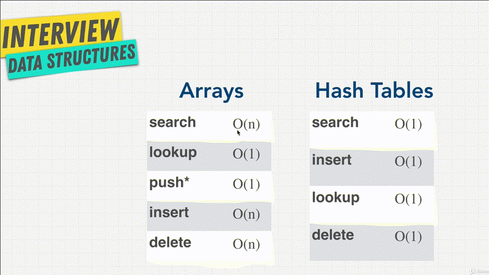
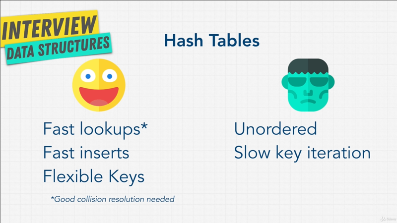
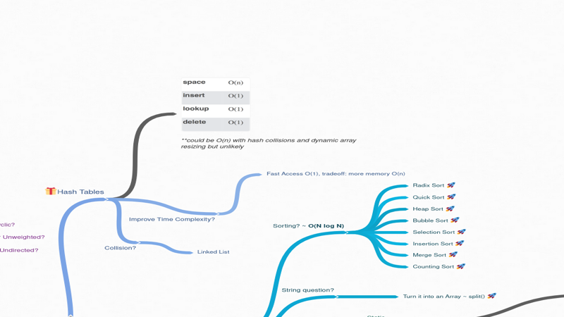

# Chapter-5 Data Structures Hash Tables

## Table of Contents

1.  [Hash Tables Introduction](#Hash-Tables-Introduction)
2.  [Hash Function](#hash-function)
3.  [Hash Collision](#hash-collision)
4.  [Hash Tables in Different Languages](#hash-tables-in-different-languages)
5.  [Exercise Implement a Hash Table](#exercise-implement-a-hash-table)
6.  [Hash Tables VS Arrays](#hash-tables-vs-arrays)
7.  [Exercise - First Recurring Character](#Exercise---First-Recurring-Character)
8.  [Hash Tables Review](#hash-tables-review)

<br/>

## Hash Tables Introduction

It's time for our next data structure _hash tables_. Hash tables or _hash map_,
_maps_, _maps on_, _unordred maps_, _dictionaries objects_, there are many ways
to call this data structure, and different languages ave have different names
for it, and slight variations on the hash tables. **_Objects_** for example, in
**_JavaScript_** are a **_type of hash tables_**.

The reason I'm starting the course with arrays and objects or hash tables is,
because these two are the two are most common interview question. You're _going
to use them in any coding question_.

Me personally, I have yet to be part of an interview that you didn't have to
know these. They are an absolute MUST. Luckily for us, pretty much every
language has a built in hash table, just like arrays. In Python they're called
_dictionaries_, JavaScript as we said are Objects. Java has maps, Ruby has
_hashes_; and hash tables are very important all across computer science. You
see them a lot in databases, in caches, and they're extremely useful. So what
are they?

Also you may wondering, what does the name hash table mean? Where did this name
come from? Well let's look at an example,
<br/>


<br />

Imagine you're going grocery shopping, and you have an object here, basket
(`basket.grapes`) and you want to add grapes as the property of the baskets
object; again, we're using JavaScript syntax, but this should look familiar to
you.

We wanted to set, that `baskter.grapes` is going to equal `10000`. We're buying
`10000` grapes, because you can never have too may grapes. Now first of,
thinking about how we would store this with arrays, it will to be a little bit
more difficult right?. In the array we have an _index_ that's numbered and the
_value_. With hash tables or an objects, we get to set a _key_ which is grapes,
and a _value_; so we get to set a _key value pair_. So, right away we see some
benefits in here.

A way hash table works, is we have the _key_ which is grapes, and this **key is
used as the _index_** of where to find the values in memory. Remember with the
arrays we have the index, which was the number, but with hash tables we use
_grapes_ as a way to find it in our memory shelf.


This is done this way, with something called a **_ has function_**. But for now
we just assume this (has function) is a _black-box_, we don't know what going on
with hash function (black-box). All that's happen is we're going to pass
_grapes_ into this black-box, this black-box is going to do some magic, and out
of it, comes a key into an index, where we want to store this (grapes) values.

Now, our `10000` grapes can be stores and this memory address `711`. Technically
it actually stores both grapes (key) and the value (`10000`), her I've just
simplified it to `10000` just so it's a little bit cleaner; But keep in mind,
that **_it's going to store both key and value_**; I'll show you a diagram
showing this later on.

So, this black-box gets to decide where to put the data on our memory in our
computers. But you might be wondering, what is this thing (hash function)? And
why does he get to decide where to put all this information?

For that I'll see you in the next lectures.

**[⬆ back to top](#table-of-contents)**
<br/>
<br/>

## Hash Function

There are some key aspects of hash functions, `[1]` **_is one way_**, in the
sense that if I give somebody a hashed number they will have no idea what the
input was, and practically impossible for me to have any clue as to what the
input.  `[2]` **_No matter how many times your input, there it's going to be the
same_**; but as soon as you change one thing is going completely change the output,
this is what we call **_in-dept content_** or  **_idempotent_**. In fancy way of
saying, it's a function _given an input always output the same output_.

The one benefit and why we would want to use hash function in a data structure
is that we get **_really fast data access_**, because all we have to do to find
_grapes_ or `basket.grapes` is to pass grapes into something like _[MD5
Hash](http://www.miraclesalad.com/webtools/md5.php)_, it's generates a random
number for me, and I immediately know where it is in my memory on my computer.

Technically a has functions that we use for hash table is going to be take
_grapes_ generate some sort of gibberish number and then converted to an
**_index space_** or and **_address space_** that it has based on the hashed
number.

Unlike arrays where we just had _ordered indexes_, with has tables all we need
to do is give it a **key** and we know exactly where that item is in our memory.
But you might be wondering, this hash function doesn't just slow things down?
Because every time we want to add a _property_ and a _value_ `grapes = 10000` to
a _hash table_ we have to run it through the has function, so we can decide
where to put it in memory. If you noticed that, good job that is a big factor
you don't want to hashing function take a very long time, because every time you
add a property to memory or retrieve a property to memory, we add both times,
were sending the _key_ grapes into hash function, to find where to get it from.

Underneath the hood, remember because **hash tables** exist in all language,
they're implemented with an optimum hashing function, that's really really fast,
as a side note hash function like **Sha-256** take a really long time to
generate a hashed number, and it is an overlay complex hashing function that is
used a lot in places like cryptography where you want the hashed number to take
longer, but that is outside the scope of this course.

### Summary hash function

To review, we have a **key** that is _grapes_, we send it through a hash function
that is going to hash something really really fast, and then **_map whatever the
hash came out to be into a memory address_** where we want to store our data,
`basket.grapes = 10000`. When it comes to hashing functions you typically leave
this to whatever framework or languages you're using, and we usually assume
a time complexity or Big-O `n(1)` because this happens really fast.

Now that we understand what hash function does, let's us talk little but more
about hash tables, why they're useful, and why in some cases are better than
arrays?.

**[⬆ back to top](#table-of-contents)**
<br/>
<br/>

## Hash Collision

### Hash Tables
<br/>


<br/>

Looking at hash functions you can start to think about what actions they perform
and how fast it can be done? When it comes to `[1]` **_inserting_** something in
our memory space, well it's going to be `O(1)`. We hash the _key_ such as grapes
through the hash function, and places it automatically into the address spaces
that it comes up with. `[2]` **_lookup_**, is the exact same `O(1)`, we access
the property, that property is going to get hashed, and direct us exactly to the
address to find the values. `[3]` With **_delete_**, it's same thing `O(1)`, we
simply use the key right away we know where to delete the item from, and because
it isn't ordered, we don't have to shift indexes like we did with arrays,
everything is just nice and simple. `[4]` with **_searching_**, it's give us
Big-O `O(`1`)`, if we want to find something in our basket like _apples_ that
easy to, we use hash function.

```javascript
let user = {
    age: 54,
    name: "kylie",
    magic: true,
    scream: function () {
        console.log("")
    }
}

user.age                        // O(1)
// result: 54

user.spell = "abra kadabra";    // O(1)
user.spell                      // O(1)
// result:
// "abra kadabra"

user                            // O(1)
//result:
// {
//   age: 54,
//   name: 'Kylie',
//   magic: true,
//   scream: [Function: scream],
//   spell: 'abra  kadabra'
// }

user.scream()                   // O(1)
// result:
// aahh!
```

If we go to our playground, in JavaScript I can create an object `let user
= {}`, and this _user_ will have property of age, `age: 54`, let say we have the
property of name `name: "kylie"`,let say Kylie does a magic skills so we set
property of magic `magic: true`, and for fun let's say that we have a function
`scream` that just console logging the scream `"ahhh!"` as a string.

When I run this object, I've created a _user_ object, and all this object
property are all going to get placed somewhere in memory with different
addresses. I can access this user really really fast, by saying `user.age` which
is going to give me `54` at `O(1)`.

Perhaps adding a new property, I can just simply say `user.spell = abra
kadabra`, if we check this user, now user have the properties of `spell` with
value `abra kadabra`, this is access of all `O(1)`, because take it through the
hash functions and the computer decided where to put both `speel` and `"abra
kadabra"` in memory.

If I firearm `user.scream()`; same thing, I get to access this function in
memory really really fast at `O(1)`, how amazing is that? I know what you're
thinking, hash table are amazing, we should be using them all the time, and
you're right, we should be using them in a lot of cases, but as we know there's
always _pros_ and _cons_.

Let me talk to you one of the **main problem with hash tables**,  I link to
[hash table
animation](https://www.cs.usfca.edu/~galles/visualization/OpenHash.html), so you
can play around with it later.
<br/>


<br />

I have a little animation here, where we have _12 memory spaces_. Remember, our
computer has limited space, and when we create an object or hash table, the
computer decides how much space to allocate, it's not going to allocate all the
space to the hash table, it's going to bit allocate a bit of it. I'll show you
later on when we implement our own hash table, how we can adjust the size.

Seeing that there is only _12 spaces_ you can imagine, if I insert `1`, I'm
going to insert the number `3`, let's do insert number `55`, what happen there?
Do you see that, the hash function randomly assigned a space in memory and put
it in space `[3]`; remember, there's nothing telling the hash function to evenly
distribute until everything is full. Although hash function are optimized to try
to distribute this data all over, it also matter what we put into it.

When `55` get hashes, well this hash function generates the address location of
space `[3]` to put in it, and because we already have hashed number `3` there,
it does something funny here. Let's keep adding here and see what happens, I'll
`2`, I add `12`, and add `14`. It did the same thing again.

What we just noticed here, it's something called **_Collision_**.

### Hash collision user
<br/>


<br/>

The **_Collision_** looks something like above. We have the **_keys_**, let's
say we inserting the **_name_**, the **_phone number_**  of a user; and we
initially place `John Smith`, this key for `John Smith` gets hashed, gets placed
in the address space of `152` and get stored. Remember how I said, it actually
stores both _keys_ and _values_. It stores in something called **_bucket's_**
`John Smith` with the value, that is phone number. We keep going with `Lisa
Smith`, then `Sam Doe`, than `Sandra Doe`. As soon we has `Sandra Dee` it becomes
the same address space as `John Smith` and we have a collision.

Because of this collision, we need a way to store both users somehow in this
address space `152`, and something funky is going on here, this _little black
circle_ and then a point and _Sandra Dee_.

Just a **hint here**, The key space of `152` is actually a _new data structure_,
that we're going to learn about called **_Linked List_** coming up soon.  You
see, with hash tables **we can't avoid these collisions, with enough data with
limited memory we always going to have this collision**.

So, there is a possibility if we go back to our example. I start a new hashes
visualization,
<br/>


<br />

If we constantly just keep adding to the same memory space, which slows down our
ability to access or insert information, because now if I want to check what's
in this address space `[1]`, I have to go 5 deep. Theoretically when you have
a collision it slows down reading and writing a hash table with `O(n/k)`, where
`k` is the size of your hash table, and remember because we remove constant, and
simplify things it, becomes `O(n)`.

Collision will likely happen in any hash table implementation. Luckily for you,
you're never going to have really implemented yourself, and it's not very common
interview question, but you do want to know about it, so you can talk about it.


### Dealing with Hash Table Collision

There's two common ways to deal with these collision, I showed you one of them
with something called `[1]` Linked List, which we'll talk about it later on. If
we go to [hash table Wikipedia page](https://en.wikipedia.org/Hash_table) and
look at _Collision Resolution_, you can see that there's a ton of different ways
to solve collisions. The way that I showed you is called _Separate Chaining_,
but there's different methods like _Open Addressing_, and _Robinhood Hashing_
that you can read about it, if you're really interested in the topic.

The point I want to make is that there is a bit of a downside when we talk about
fast `Lookup O(1)` in hash tables, occasionally depending on the hash function
it might change on to `Lookup O(n)`.

Let's keep going, expand our knowledge of hash tables at next chapter.

**[⬆ back to top](#table-of-contents)**
<br/>
<br/>

## Hash Tables in Different Languages

Hash tables are implemented differently in different languages, but most of the
time, the **_key_** and the **_value_** can be any type of data structure.

```javascript
scream : function() {
    console.log("aahh!")
}
```

We saw above that we can have a **_function_** as a value, we can ha another
object  as a value.

```javascript
sceam: new Array(15),
```

We can have an array as a value if we want, you can do this in arrays as well.
We don't just have numbers and strings in arrays. We can have arrays of objects.
You can also sometimes have _keys_ that more than just string. You can
potentially have functions as keys, and a value that is also a function or
perhaps a number or an array whatever you want.

### Map() and Sets()

In JavaScript in an object like `user` we have, if we pass a key that is
a number or a function it actually gets a `stringify` and it only allows string
keys, but with the new version of JavaScript and ES6 you actually have something
called `Map()` and `Sets()` which also familiar with in other languages.

```javascript
const a = new Map()
```

A `Map()` is created like above; and the difference between a `Map()` and an
Objects, is the fact that a `Map()` allows you to save any data type as the key.
Remember with an object you can only save the key as _string_, with `Map()` it
allows us, if we want to even have functions as keys or arrays as keys.

Another benefit of `Map()` is that it **_maintains insertion order_**. What does
that means? Well, within object, there is no order. If we go back to our
[diagram](#hash-tables), our data is inserted randomly in different places. If
we go back to our [user example](#hash-collision-user) we see that there is
definitely **no order**, when we grab all the values of an object. We start with
`Lisa Smith` which was entered second, then `John Smith` then perhaps `Sandra
Dee`, `Sam Doe` gets selected last. There is no order like there was with
arrays.

There are some version of hash tables like `Map()` in JavaScript that maintain
the order of _insertion_, so that when we loop through items in an object we
have this maintained order.

```javascript
const b = new sets()
```

`Sets()` is another feature, very similar to `Map()`, the only difference is
that **_it only stores the keys no values_**. So, you see here, each language as
we mentioned comes with own pre-built versions of data structure. But at the end
of the day, all of them are hash tables.

In order to truly understand how hash tables work, I think we should build one
in the next section we are just going to do just that.

**[⬆ back to top](#table-of-contents)**
<br/>
<br/>

## Exercise Implement a Hash Table

It's time for us to implement our own hash table, but let's do a bit of an
exercise, and this maybe difficult, so don't get upset if you're not able to
finish it. As extra challenge, I have created a template for you,

```javascript
class hashtable {
    constructor(size) {
        this.data = new array(size);
    };

    _hash(key) {
        let has = 0;
        for (let i = 0; i < key.length; i++) {
            hash = (hash + key.charCodeAt(i) * i) % this.data.length;
        };

        return hash;
    };
};

const myHashTable = new HashTable(50);

myHashTable.set("grapes", 10000);

myHashTable.get("grapes")
```
A new `HashTable` that we're going to create. Yes I know JavaScript already has
objects and we can just simply create one like we've seen before. This
`HashTable` has a constructor that will receive a `size`. So when we create this
hash we're going to **give it a memory space size** of `50`, let's say we only
want `50` shelf's of memory. We're going to create `this,data` where our data
are will live and within it, it's going to create a new array, and this array is
going to hold our information for us.

In example, we would have something like `[[grapes, 10000]]`, as our bucket. So
the first item in the array will be an array that is `[grapes, 10000]`. Remember
if we looked at the [diagram](#hash-collision-user) we have these **_buckets_**
that our data lives in, and because right now we're implementing our own
`HashTable` we're using arrays instead of objects.

The idea is that using a new method that **you'll have to create** which will be
called `.set()`. You are going to be able to set _grapes_ as the first index of
the array, and the number of _grapes_ (`10000`) as the second index in  the
array.

From there, we can have another method `get()` which retrieves the _grapes_ and
return `10000`.

Now you're probably wondering what is `_hash()` method do?  I wrote this ahead
of time for you, because it's not really important as part of the course. But
remember we need a hash function in order to create a hash table, and I've
created here the smallest tiniest hash function you can think of.

We're going to talk about what `_hash()` method actually does in the solution.
For now all you have to know is, that it's going to just generate a hash for us.

```javascript
myHashTable._hash("abrakadabra");           // result: 39
myHashTable._hash("grapes");                // result: 23
```

So, your challenge here, is to create these two new method `set()` and `get()`
that adds to `this.data` and retrieves from `this.data`. If you're not super
familiar with JavaScript, this may be hard but give it try.


### Exercise Answer

```javascript
// Task:
// Create set() and get() methods to store key value pair, and retrieve a value with hashing.
// Solve the collision on hash tables

class HashTable {
    constructor(size) {
        this.data = new Array(size);
    };

    _hash(key) {
        let hash = 0;
        for (let i = 0; i < key.length; i++) {
            hash = (hash + key.charCodeAt(i) * i) % this.data.length;
        };

        return hash;
    };

    set(key, value) {

        // Store the key
        let address = this._hash(key);

        if (!this.data[address]) {
            this.data[address] = [];
        };

        this.data[address].push([key, value]);
        console.log("====> --", this.data[address])

        return this.data;
    };

    get(key) {
        const address = this._hash(key);
        const currentBucket = this.data[address];

        // Check if currentBucket not empty
        if (currentBucket) {
            for (let i = 0; i < currentBucket.length; i++) {

                if (currentBucket[i][0] === key) {
                    console.log("c-3 shelf's: %d ,key: %s, value: %d", address, currentBucket[i][0], currentBucket[i][1])

                    return currentBucket[i][1]
                };
            };
        };

        return undefined;

    };

};

const myHashTable = new HashTable(50);

myHashTable.set("grapes", 10000)
myHashTable.get("grapes")

console.log("==============")
console.log("")

myHashTable.set("orange", 2500)
myHashTable.get("orange")

console.log("==============")
console.log("")

myHashTable.get("papaya")
```

OK, let's chunks the code.

### Private method

Before we get started I do want to mention something that you may be wondering
about underscore (`_`) over `_hash()` method, what does that mean? In most other
language like Java, when you create a class, you can have **_private
properties_**, that is properties I can't access outside of this class.

So, I wouldn't be able to do `myHashTable._hash()` and access the `_hash()`
property or method. Now, with JavaScript and ES6 that's not really possible;
There;s a _common standard_ which is to put underscore (`_`) in a properties or
methods, and in JavaScript world which says, this `_hash()` is a private
property.

This underscore in `_hash()` just meaningless really, I can still access the
`_hash()` method, but it is a developer standard or convention in programming
world, and in the JavaScript community to let other developers know that, "Hey,
you shouldn't be accessing this", even though you technically you can. There are
ways to make it works, and half private properties but it requires things like
closure symbols or
[WeakMap](https://developer.mozilla.org/en-US/docs/Web/JavaScript/Reference/Global_Objects/WeakMap)
which again is beyond the scope of this course, and we don't need to worry
about. That's where the underscore is coming from.

Let's talk a little bit about what `_hash()` function does. If I enter

```javascript
_hash(key) {
    let hash = 0;
    for (let i = 0; i < key.length; i++) {
        hash = (hash + key.charCodeAt(i) * i) % this.data.length;

        console.log("===>", hash)
    };

    return hash;
};

_hash("grapes")

// result:
// ===> 0
// ===> 14
// ===> 8
// ===> 44
// ===> 48
// ===> 23
```


First, create a new variable that is `let hash = 0` and then this `key` as
parameter are we're going to grab the length of grapes so that is `6` characters
of length. We are to going add `0` which comes from the `hash+key.charCodeAt()`,
[charCodeAt](https://developer.mozilla.org/en-US/docs/Web/JavaScript/Reference/Global_Objects/String/charCodeAt)
simply gives us an integer between `0` and this `6535` representing the UTF-16
code, so that's just encoding. It's pretty much saying, give me characters code
because remember in memory a string or letter represented as a number.
`charCodeAt()` method allows us to say at index whatever we put in parameter, so
let's say we looking at `charCodeAt(i)` at index `[i]` the very first on will be
a letter `g`. We're going to get the character code for `g` that is a number we
multiply that by the index `i`, again just to make sure makes a unique and then
we use what's called the [modulo
operator](https://developer.mozilla.org/en-US/docs/Web/JavaScript/Reference/Operators/Remainder)
`%` to make sure that `this.data.length` stays within the length of `50` the
size of our data; and then we return the `hash`.

An easy way to see what's happening here, is to simply console logging `hash`,
if I run this we see that it's going to loop through our _grapes_ character by
character. It's going to generate some sort of hash, and because this hash
constantly looped over we include whatever the generated, let's see the first one
is `0`, and the next iterations is going to equal `14`, generate something else
which `8`, and keeps going until we get `23`. You can take your time and go
through this code if you really want to.

### Create set() method

Final result `set()` method.

```JavaScript
set(key, value) {

    // Store the key
    let address = this._hash(key);

    if (!this.data[address]) {
        this.data[address] = [];
    };

    this.data[address].push([key, value]);
    console.log("====> --", this.data[address])

    return this.data;
};

const myHashTable = new HashTable(2);

myHashTable.set("grapes", 10000)
```

#### Chunked the code

Using our hash function, let's do our very first method. Let's create the
`set()`. This method is going to receive a `key` and a `value`. The first thing
we want to do is create a variable called `let address` which represent where we
want to store information, and we'll say `this._hash(key)`. All we're saying is,
store this data `"grapes", 10000` that we're going to insert the _key_ _value_
in this `address` space, that is created by our `_hash()` function, and we give
it the key of _grapes_. Remember our little animation, we're sending the
_grapes_ to into that magic little box hat has the hash function.

```javascript
set(key, value) {

    // Store the key
    let address = this._hash(key);

    if (!this.data[address]) {
        this.data[address] = [];
        this.data[address].push([key, value]);

        console.log(this.data)          // result: [ <23 empty items>, [ [ 'grapes', 10000  ]  ], <26 empty items> ]

    };
};

const myHashTable = new HashTable(2);

myHashTable.set("grapes", 10000)        // result: undefined.
```

From there, we simply say if `this.data[address]`, if it doesn't exist, and
there's noting there, because _remember in a hash table we can have collision_,
and because we only have `50` spaces or shelf's, we **might have these collision
with enough data**. So we're going to check if there is nothing in
`this.data[address]` in that case I'll just simply add that data; we're going to
say `this.data` is going to be an array (`this.data = []`); And in this new
address space we're going to simply to add by doing `push([key, value])`.

Let's run this code and see what happens, I get `undefined`. If I just
`console.log(this.data)` I get `[ <23 empty items>, [ [ 'grapes', 10000  ]  ],
<26 empty items> ]`. We have `23` empty items; on the `24` item we have an array
with value `grapes, 10000`; and then `26` empty items after that. Remember we
have `50` shelf's in our memory, and we have `23` plus `1` is not an empty array
plus `26` that's `50`.

But, what happen if `this.data[address]` is already exists? If I change the
`HashTable()` let's say `2` memory space.

```javascript
myHashTable = new HashTable(2);

myHashTable.set("grapes", 10000)
//result:
// [ <1 empty items>, [ [ 'grapes', 10000  ]  ] ]
```

If I change this around, Check out what happens to my hash table.

```javascript
myHashTable = new HashTable(2);

myHashTable.set("grapes2", 10000)
//result:
// [ <1 empty items>, [ [ 'grapes2', 10000  ]  ] ]
```

Great, it just **deleted my previous entry**. We **have collision**, but we're
not doing anything about it; And we've just deleted our data. That could been
really important to user data, we definitely don't want that.

So in order to solve that, we simply say, because we're checking here (`if
(!this.data[address])`) if there is nothing in that `address` space do
`this.data[address].push()`. Otherwise simply add on to that array.

```javascript
set(key, value) {

    // Store the key
    let address = this._hash(key);

    if (!this.data[address]) {
        this.data[address] = [];
        this.data[address].push([key, value]);

        console.log(this.data)          // result: [ <1 empty items>, [ [ 'grapes', 10000  ] ] ]

    }
    else {
        this.data[address].push([key, value]);
    };
};

const myHashTable = new HashTable(2);

myHashTable.set("grapes", 10000)        // result: [ <1 empty items>, [ [ 'grapes', 10000  ] ] ]
```

Run the same command in `else` block, but we can make more nicer and cleaner way
of doing this. Is to actually just take out the `else` block, because regardless
we're always going to be pushing `push()` (adding)  _key_ and _value_ that we
set add to the data.

All we do just remove the `this.data[address].push([key, value])` on `if` block,
and wipe the `else` statement.

```javascript
set(key, value) {

    // Store the key
    let address = this._hash(key);

    if (!this.data[address]) {
        this.data[address] = [];
    }
    this.data[address].push([key, value]);

    return this.data;
};

const myHashTable = new HashTable(2);

myHashTable.set("grapes", 10000)        // result: [ <1 empty item>, [ [ 'grapes', 10000  ] ] ]
myHashTable.set("apple", 56)            // result: [ <1 empty item>, [ [ 'grapes', 10000  ], [ 'orange', 2500 ] ] ]
```
Just we know what's happening here, let's add `return this.data`, and we add
`apple, 56`, if I run this you see what happen here. If you look closely, we
have `<1 empty item>`, and then an array that contains inside of it, the first
index that is an array, and a second index that is another array, _because we've
just pushed on to our **existing array**_, because our memory space is only `2`.

Very cool, that's not too bad.


#### Create get() method

```javascript
get(key) {
    const address = this._hash(key);
    const currentBucket = this.data[address];

    // Check if currentBucket not empty
    if (currentBucket) {
        for (let i = 0; i < currentBucket.length; i++) {
            if (currentBucket[i][0] === key) {
                // console.log("c-3 shelf's: %d ,key: %s, value: %d", address, currentBucket[i][0], currentBucket[i][1])

                return currentBucket[i][1]
            };
        };
    };

    return undefined;
}; // O(1) if there's collision it become O(n)
```

#### Chunked the code

Well, I want to be able to grab _grapes_ and _apples_. We can use the `get()`
method here, which will receive a _key_; and this method is going to do the
exact same thing, in that we running it through that black box (buckets) where
we're going to create, or we're going to use the `_hash()` function to get the
address of where we want to go.

Now we have the address to where we want to grab our information from. However
remember, that we store this information in a _bucket_, so we have `grapes
10000`, how do we grab that? We know where to get from, we have the `address`
but we need to loop over and grab `[grapes, 10000]` or `[appels, 56]`.

```javascript
get(key) {
    let address = this._hash(key);
    const currentBucket = this.data[address]

    console.log(currentBucket)          // [ [ 'grapes', 10000  ], [ 'orange', 2500 ] ]
}
```

We create a variable saying `currentBucket` that was just be
`this.data[address]`, so we don't repeat our self, and we have reference to this
address or the _address and the data value_; so, this means if we logging
`currentBucket` I have the two items in the same bucket; Remember that it is
technically just within its own bucket within one array,


We're grabbing all the information, but all we want to do is have `10000` being
returned, that how hash tables work, or the `get()` hash function works. Well
all we need to do is to say,

```javascript
if (currentBucket.length) {
    // ...
    // ...
}
return undefined;
```

If `currentBucket.length` has something in it, in that case we are going to do
something, otherwise we're going just return `undefined`, because there's
nothing in the bucket. We're checking if `grapes, 10000` is actually exists. So
if nothing in the array, if the length is `0` and the array is empty, while then
we're not interested in it.

As a matter of fact, we actually don't even need the `.length` here, because
remember initially it's just going to be an empty array with undefined.

```javascript
constructor(size) {
    this.data = new Array(size);
};
```

And we add an array to each slot or shelf's, whenever we set something, and it's
an empty address.

```javascript
set(key, value) {

    // Store the key
    let address = this._hash(key);

    if (!this.data[address]) {
        this.data[address] = [];
    };
};
```

So, we can just leave it like this,

```javascript
if (currentBucket) {
    for (let i = 0; i < currentBucket.length; i++) {

        if (currentBucket[i][0] === key) {
            console.log("c-3 shelf's: %d ,key: %s, value: %d", address, currentBucket[i][0], currentBucket[i][1])

            return currentBucket[i][1]
        };
    };
};

return undefined:
```

Because if it's undefined it'll skip over and return undefined.

Now inside the `if` block, we will do `for-loop`, because **_remember we might
have multiple items in this bucket_**, like we saw when we have `2` memory
spaces in which cases. So we need to loop over, we are going to say as long as
`i` is less than `currentBucket.length` just increment by.

Within `for` block, this is little bit tricky, so hopefully you follow. I'm
going to say if `currentBucket[i]` by which is the index; So remember is going
to say index `0` is going to grab `[ [ "grapes", 10000 ] ]`; then index `1`
which going to grab `[ [ "apples", 56 ] ]`.

If I do `currentBucket[i][0]` that means grab the first, in our case the  `i` so
it's going to be `0` first, grab this first array (`[ [ "grapes", 1000 ] ]`)
which will be _grapes_; and then once it's loops the next time around and `i` is
`1`, it's going to be _apples_ check that _against_ the `key`. Remember the key
we receive in `get(key)`, that we are looking for.  So if _grapes_ the key
matches with the shelf's item, in that case just return the
`currentBucket[i][1]` because we want to return `10000`.

Hopefully you follow here, because if I run `myHashTable.get("grapes")` I get
`10000`; If I run `myHashTable.get("apples")` I get `56`.

### set() and get() Summary

By looking a this code, I hope you understand on a deeper level, the time
complexity implication of hash tables. Even though we're doing a loop within the
`_hash()` function, remember that `_hash()` function are really really fast.
We're just looping over the `key`, so we don't consider this `_hash()` function
to be `0(n)`, this is very very fast. This `_hash()` function is `O(1)`.

When we set something within `set()` function, there's no loop there. We just
adding it to our data, we're just pushing it, so that is `O(1)`.

If we go to `get()` method, most of the time, if there's **no collision** it's
going to be `O(1)`, and in real life you can consider that it is `O(1)`. But in
our really bad example, with just `2` memory spaces, and not a very good hash
function well, this `get()` function can become `O(n)`.  We have `for-loop` in
`get()` might create the list, we saw in our [user list
example](#hash-collision-user) that will be `O(n)` if this (collision) `152`
just kept going and growing.

But there is one other method I want us to build, and to showcase to you, one
other downside of hash tables. What if we wanted to go through all the key of
the hash table? How would we do that? We going to try implement that in the next
chapter.

### Create keys() method

Final result `keys()` method.

```javascript
keys() {
    const keysArray = [];
    console.log(this.data.length);                  // [1]
    for (let i = 0; i < this.data.length; i++) {
        if(this.data[i]) {
            console.log(this.data[i])               // [2]
            keysArray.push(this.data[i][0][0])
        };
    };

    console.log(keysArray)                          // [3]
    return keysArray;
};

const myHashTable = new HashTable(5);
myHashTable.set("grapes", 10000)
myHashTable.set("apples", 56)
myHashTable.set("oranges", 2)

myHashTable.keys("apples");

// result: [1]
// 50

// result: [2]
// [ [ 'grapes', 10000  ]  ]
// [ [ 'apples', 56  ]  ]
// [ [ 'oranges', 2  ]  ]

// result: [3]
// [ [ 'grapes', 10000  ], [ 'apples', 56  ], [ 'oranges', 2  ]  ]
```

#### Chunked the code

Let's implement one last feature in our hash table. I want to create something
call `keys()`. `keys()` allows us to iterate or loop through all the keys of
our hash table, in this case _grapes_ and _apples_.We add some new items to our
hash table just for fun. We add _oranges_, to see what going on.

Now, if we run `keys()` ideally it's going to iterate and spit out _grapes_,
_apples_ and _oranges_ for us to see what we need to go shopping for. How would
we go about building this?


Well, because we're going to do some sort of looping, I'm going to start up by
creating a constant `keyArray` and it's going to be an empty array (`const
keyArray = []`).

With in here, we are going to loop, so for `let i =0; i < this.data.length;
i++`. Inside this `for-loop` we want to loop through all `50` items spaces, all
shelf's one by one, we're going to loop through them, yep that's a lot of
iteration;

If in the shelf's there is some sort of data `if (this.data[i])`, if it's not
undefined completely empty, and there is something valuable for us that we want
to look. Because remember, we allocate `50` spaces on the shelf's but we've only
placed `3` items or `3` **data points**.

If there is something in that memory space, in that case we can just say
`keysArray.push(this.data[i][0])` we grab the index. So the first array that we're
at is `["apples", 56]` if I do `[i][0]` here, and we return after all the loop
`return keysArray`. If I run this, I get

```javascript
keys() {
    const keysArray = [];
    for (let i = 0; i < this.data.length; i++) {
        if(this.data[i]) {
            console.log(this.data[i])                   // [2]
            keysArray.push(this.data[i][0])
        };
    };

    console.log(keysArray);                             // [3]
    return keysArray;
};
```
I get `[ [ 'grapes', 10000  ], [ 'apples', 56  ], [ 'oranges', 2 ] ]`; But
I just wanted `[ 'grapes', 'apples', 'oranges' ]`. To see what's going on here,
let's logging `this.data[i]`; Which is what we're doing while we pushing.

```javascript
// result: [2]
 [ [ 'grapes', 10000  ]  ]
 [ [ 'apples', 56  ]  ]
 [ [ 'oranges', 2  ]  ]
```

We see that we get **array within the array**.  Because remember, we have one
massive array in each time we create a new shelf's space, we have to have a new
array (`this.data[address] = []`) that we create and we push into that. So
a little bit of a gotcha here. We have to say to remove the odd  array with
first `[0]`, and another `[0]` to grab the first index of the array. Just like
that. So we get back a result, only _grapes_ _apples_ and _oranges_ without odd
array.

```javascript
[ 'grapes', 'apples', 'oranges' ]
```

### Exercise Summary

Well, done we just implemented a hash table; And you may have noticed something
a downside of hash tables. We have to loop (`keys()`) here, right? We had
a `for-loop`, looping through the entire memory space in order to fund our
keys. That was so much easier with the arrays, with the array we would have had
three items and we would ave looped over three times instead in `keys()` we
looped over `50` times, imagine if we have `500` shelf's, that's even more.

We're starting to learn how things work underneath the hood, so that now we
have an idea of, "maybe, if we're using this type of method `(keys())` of
objects might not be the best idea.".

Let's drawback of object or hash tables; in JavaScript we can use something
like `for in loop` to loop over items in an object, which is very very slow. As
you might realize, there's no guaranteed order, every time we're just adding
sometimes to our `address`, but when we grab items from the `address` we just
go from `0` to `50` shelf's, even though the items just randomly put in
different shelf's.

But I hope now you actually get to see how it works. We're putting items
randomly in a shelf's but when we retrieve them, they are all unordered.o

That's why coding things out, even though you most likely won't get this asked
in an interview, knowing how things work, allow you to talk about them
intelligently, and I hope this exercise has done that for you.

I leave this for you, to play around with, and perhaps add different methods
like `value()` that grabs the value instead of the keys. For now let's finalize
our talk of hash tables by comparing them to arrays.

**[⬆ back to top](#table-of-contents)**
<br/>
<br/>


## Hash Tables VS Arrays
<br/>


<br/>

Why hash tables? Hash tables are great when you want quick access to certain
values. Remember that searching (`search O(n)`) through an **array** for `n` item
takes a really long times with `keys()` or `get()` method, we have to loop
through every item, and see if a certain string or a certain number is in array.

With hash tables that's really really fast. This is why you see hash tables in
place like databases right? We want search for something in databases, and it
gives back to us right away. Similarly inserting items (`insert O(1)`) in hash
tables unlike an array (`insert O(n)`) that might shift indexes is typically
`O(1)`. You just simply have to hash and create the key. Although that we have
those cases of **collision**, most of the time that's something that we don't
need to worry about to much and we can assume an _insert_ of `O(1)`.

Then there's other aspects that are quite similar, between the two, arrays let
you quickly look up the value for a given key. Keys are called **_indexes_** in
an **array**; and we don't get to pick them, it's always `0, 1, 2, 3`. I hash
tables we can pick them; So, hash tables is kind of like a hack on top of an
array to let us use flexible keys instead of being stuck with `0, 1, 2, 3`.

A problem of hash tables that we discussed, was the idea of **_no concept of
order_**. In array each item was placed next to each other on a shelf's in
memory. Hash tables are kind of placed all over the places.

Now, we have an idea of the differences between the two, I think it's time for
us to actually work on some exercises and interview questions, that we'll use
hash tables in their answers. I'll see you on that one.

**[⬆ back to top](#table-of-contents)**
<br/>
<br/>

## Exercise - First Recurring Character

It's time for an exciting interview question question; and this question comes
straight form Google.

```JavaScript
//Google Question
//Given an array = [2,5,1,2,3,5,1,2,4]:         // [1]
//It should return 2

//Given an array = [2,1,1,2,3,5,1,2,4]:         // [2]
//It should return 1

//Given an array = [2,3,4,5]:                   // [3]
//It should return undefined
```

Given an array let's say look like above, Tell me the first recurring
characters?. What does that mean? Well if we look at this array `[1]`, I want
a function that I can enter this array `[1]` this input is going to look through
all the numbers, and tell me which one gets repeated first. So we look at `2`,
`5`, `1`, and `2` and we say `2` already been seen, `2` is recurring number.

If we look at another example, we see `2`, `1`, `1`, and we stop here, because
`1` we've already seen before. We can say the first recurring characters is `1`.

If we get an array that all unique items, we just returned `undefined`.

So, how would you go about solving this? Give it a go, see what you come up
with. If you need help, perhaps scout on discord, and chat with some of the
community members, and I'll see you in the solution chapter.

### Exercise Answer

#### Naive approach

```javascript
const givenArray = [2,5,1,2,3,5,1,2,4]
const givenArray2 = [2,1,1,2,3,5,1,2,4]
const givenArray3 = [2,3,4,5]
const givenArray4 = [2,5,5,2,3,5,1,2,4]

// Naive approach with array
function firstRecurringCharacter(input) {

    for (let i = 0; i < input.length; i++) {
        for (let j = i + 1; j < input.length; j++) {
            if (input[i] === input[j]) {

                console.log(input[i], input[j])
                return input[i];
            };
        };
    };

    console.log("no recurring character found")
    return undefined;
};
// Time Complexity:  O(n^2)
// Space Complexity:  O(1)

firstRecurringCharacter(givenArray);
```

So, I'm going to loop through the first item of `givenArray`, which is `[2]`,
I keep it in variable `i`, then the `[5]` as the second item in variable `i`,
then `[1]` as the third, and keeps goings.

I want to grab the first item as I keep it in variable `i`, and then **do
another loop** to check it With second loop item which is `[5]` as I keep it in
variable `j`. If it doesn't find anything I keep the first item `i` versus `[1]`
as the second item in variable `j` and keeps going to next items in variable `j`
which is `[2]`, and then say "ah, that's the one I'm looking" .

If it doesn't find anything it's going to go the next `[5]` as I store it in
variable `i`, and compare with second loop which is now `[1]` as variable `j`, and
so on.

We want to start variable `j` with second index item in the array, because we
don't want to compare `[2]` as the first index in variable `i` with `[2]` as
same first index in variable `j`, instead we want to compare `[2]` in variable
`i` with `[5]` the second index in the array as first item in variable `j`.
We do little trick here is to do `i + 1` for variable `j`, that's it we always
go one to the right of where the `i` is as the first indexes.

Inside the nested loop we use `if` statement saying `input[i]` does that equal
with `input[j]`?. Does `[2]` is equal to `[5]`?, does `[2]` equal to `[1]`?, does
`[2]` equal to `[2]`?, if that equal, then just simply `return input[i]`.

Otherwise, if we do all this work, and nothing happens we can just `return
undefined` out side all loops.

This looking to be working nice and simple, but as you can see here, we're not
being very efficient. We have **nested loops** should trigger `o(n^2)`. Although
technically we're actually always looping a little bit more efficient, because
of `i + 1` on `let j =  i + 1`, we're not looping twice over the entire array.
In the end when you remove the constants and simplify things it's still going to
be `O(n^2)`.

#### Better approach

So, how we can solve this using the hash tables.

```javascript
const givenArray = [2,5,1,2,3,5,1,2,4]
const givenArray2 = [2,1,1,2,3,5,1,2,4]
const givenArray3 = [2,3,4,5]
const givenArray4 = [2,5,5,2,3,5,1,2,4]

function firstRecurringCharacter2(input) {

    let hashmap = {};                               // Space Complexity: O(n)

    for (let i = 0; i < input.length; i++) {
            console.log(hashmap[input[i]])          // [A]
        if (hashmap[input[i]] ) {
            return input[i]
        }
        else {
            hashmap[input[i]] = i;
        };
        console.log(hashmap)                        // [B]
    }

    console.log(hashmap)                            // [C]
    console.log("no recurring character found")

    return undefined;
};

// Time Complexity:  O(n)
// Space Complexity:  O(n)

firstRecurringCharacter2(givenArray);

// Result [A];
// undefined
// undefined
// undefined
// 0
// undefined
// 1

// Result [B]:
// { '2': 0  }
// { '2': 0, '5': 1  }
// { '1': 2, '2': 0, '5': 1  }

// Result [C]:

```

Let's use a hash table, or an object to do something interesting. That is, to
add these `givenArray`, as we iterate one by one, so loop through all the items,
add them to hash table, while we're doing that, we can check to see if the
property already exists or the key already exists.

We add `[2]` to the hash table, then `[5]` to the hash table, hen `[1]` to the
hash table, and when we try to add the forth index in array which is [2], we can
trigger a warning say, "We already have `[2]` as the key". So using that logic
let's see how we can implement that.

I'm going to create variable `hashMap`, because the keys are going to be unique,
it's not going to let any duplicate keys.

We can simply do our loops, in this loop all we're going to do is say, if
`hashMap`, we can check in this `hashMap` if it's empty, the first check in
here, I want to say if the key already exists I want to just return the item
`input[i]`, because we don't need to do any more work. As soon as we find a key
that already exists in our hash table, stop all the looping and just return; in
this case we want to return `[2]`. So at index `3` of the array, it;s going to
return and say `[2]` because, well this key already exists in my hash table.

The way we do that in `if` check; is to simply say, if `hashMap[input[i]]`
because remember `input[i]` is going to equal to array index `3` the value is
`2` when we loop through it. If that exist, the `return input[i]`. Otherwise, we
will just add  it to our `hashMap`, so `map[input[i]] = i`  the value can be
anything, we just leave it `i` which is the index. So, `{[2]: 0}`, `{[5] : 1}`,
`[1]: 2`; and we just `return undefined` outside the loop in case none of this
happens in case there is no match.


At the end of `for-loop` I just console logging `[C]` it I get nothing, instead
I get `5`. What happen?, Well if we console log `[A]` at what `if` statement
giving us (`map[input[i]]`), I get,

```javascript
console.log(hashMap[input[i]])

// undefined
// undefined
// undefined
// 0
// undefined
// 1
```

What does mean? Well, remember we're looping through the log `[A]`, and we are
saying hey does `[2]` at index one exist? Does `input[0]` which is `[2]` exist
as a key exist?; It's simply saying `hashMap.2` does it exist?; and because that
doesn't exist, we get `undefined`;

It's going to go to next, hey, does `[5]` exist? No, it doesn't; Hey does `[1]`
exist? No, it doesn't; Hey does `[2]` exist? As soon as it checks `[2]` again,
it's equal `hashMap[2]` , it's going to say "ah I already have it". It's at
index of `0`.

However because when the result is get to `0`, the way JavaScript works it put
`0` in `if (0)` block statement, but in `if` statement `0` is what we call
**falsie** in JavaScript; and that has to do with **[type
coercion](https://developer.mozilla.org/en-US/docs/Glossary/Type_coercion)** in
JavaScript something that a lot of people get annoyed about with the language.

So, what we need to do, is to make sure that we specify we want
`(hashMap[input[i]] !== undefined)`, or change in `else` block
`hashMap[input[i]] = true`. So as soon as it doesn't equal to `undefined` I want
you to `retrun input[i]`. Now if we run, we get back result `2` not `5`. If we
logging at bottom `[B]`, so we can see the actual iteration that's happening,

```javascript
{ '2': 0  }
{ '2': 0, '5': 1  }
{ '1': 2, '2': 0, '5': 1  }
```

We see that, it adds `2` at index of `0`; then `2` at index of `0` with `5` at
index of `1`, so on and so forth, until it stops after the third loop, because
encounters `2` again, it's going to check and say `2` already exists, just
return it. How cool is that?

We just made this entire thing with just **single loop**, that is way faster
than our first version, just only using hash tables we get more efficient in
Space Complexity. How cool is that?

For me, doing things like this, and seeing the power of how learning about Big-O
and hash tables, hash improved our coding ability, just gets me really really
excited, and I hope this gets this get you excited as well.

We made this function have a time complexity of `O(n)`. We've improved it with
one downside, we've increased the memory (`hashmap`), the space complexity by
`O(n)`, because we're creating a new object in this function that needs to keep
track of all the items in the array; in the worst case when there is no match
it's going to go through the entire item list of the array, and hold that
information in the `hashmap`. In turn we have a faster function.


To finish off, I want to give you one last challenge. Looking at these two
implementations, what happens if we have something like this,

```javascript
firstRecurringCharacter2([2,5,5,2,3,5,1,2,4])
// Result: 5
```

What do you think the first recurring character is? If I run this, I get `5`,
because `5 5` occurs sooner tan `2 2`. Because of the way we implemented the
second function.

However if I go to first version,

```javascript
firstRecurringCharacter([2,5,5,2,3,5,1,2,4])
// Result: 2
```

I get the result `2`. Why is that? If we go to the first function, we see the
way we are doing things is, we are going one by one in a different way. We
saying grab `[2]` as index of `0`, then compare `[2]` with `[5]`, and then `[5]`, and
then `2` and so on; And we move over to `[5]` as index `1`, then compare with
`[5]` with `[5]`, and then `[2]` so on and so forth. Because of the way we have
that implemented, it's going to detect `2 2`, because the outer loop has index
of `0`, and has `[2]` as going to loop, before compare `[5]` with `[5]`. Versus
our second version function with hash table, where we had all these items and we
were able to compare them, once we grabbed all of them, and that's another
powerful ting when you think about array and hash tables, and how you're able to
compare things.

Based on what the interviewer asked, you might have a wrong answer, maybe they
want you to detect `5 5`, before you detect `2 2`. My bonus question to you, if
you have time, and a bit of a challenge is to convert the first version function
into something that matches the answer to detect `5 5`. How would you go about
doing that? You most likely going to have to do something interesting in here,

```javascript
// ...
    if (input[i] === input[j]) {
        return input[i];
    }
// ...
```

Good luck with that.

**[⬆ back to top](#table-of-contents)**
<br/>
<br/>

## Hash Tables Review
<br/>


<br/>

Another data structure down, hash tables by now you should absolutely love then,
because well they're very useful, they're used everywhere. The funny thing is,
that it's probably the common interview question where you use hash table to
optimize something, kind of like we saw in our interview question by using has
tables we optimize those nested loops, that are `O(n^2)` to `O(n)` linear time..

This is a question that comes up again, and again that I promise you if we
notice this pattern it will be extremely useful for you, in an interview and
undoubtedly you'll have an instance where you have to use it, and follow this
exact same step.

In this section, we learned that hash tables have really `[1]` **_Fast
Lookups_** but remember we need a _good collision resolution needed_, usually we
don't need to worry about this, because our language in computer, underneath the
hood take care of that for us. `[2]` it allows us to do **_Fast Inserts__**, and
depending on the type of hash tables, such as `Maps()` in JavaScript, we can
have `[3]` Flexible Keys, instead of an array that has numbered indexes.

The downside with hash tables is, that is `[1]` **_unordered_**, it's hard to
really go through everything in order. Also it hash `[1]` **_Slow Key
Iteration_**, that is, if I want to grab all he keys from a hash table, I'll
have to go through the entire memory space, as we saw when we build our own hash
table.

Looking at the Big-O [cheatsheet](bigocheatsheet.com/), we can see that hash
tables has _search_, _insertion_, _deletion_ of `O(1)`, but in worst case due to
collision there are some `O(n)` operation that could happen.
<br/>


<br/>


If we go to
[mindmap](https://coggle.it/diagram/W5E5tqYlrXvFJPsq/t/master-the-interview-click-here-for-course-link),
we can now cross of hash tables off our list, we understand the Big-O
complexity. We also understand with collision we might want to use something
like _linked list_ which we'll talk about very shortly. In our exercise we just
simply use arrays.

We also learn the idea that hash tables in interviews are usually useful for
improving Time Complexity, especially of nested loops, the tradeoff being that,
we can have fast access but more memory, going back to our [question
exercise](./../chapter-2-how-to-solve-coding-problems) that we had few lesson
ago, where we find the common item of two arrays, we had `array1 = ["a", "b",
"c" , "x"]`, and `array2 = ["z", "y", "i"]`, we had to see if any of these two
arrays contain similar items. We have one it didn't, and the second version
where both array contain `x`, it would return true.

Our first iteration of that exercise `containCommonItem()` we had to use 2 for
loops that were nested. So that created a `O(a * b)` complexity, however using
hash maps we were able to just do one `for-loop` and optimize his
`containCommonItem()` function.

Like I said before, this is such a common pattern, that we'll be talking about
it later on this course when w talked about dynamic programming, if we go back
to our [cheat
sheet](./../chapter-1-mastering-Big-O-notation/Big-O-cheat-sheet.pdf) that
I shared with you at the beginning of this course, we can now cross off a few
things of the list, that we haven't talked about in the **_-Good Code
Checklist-_**, we talked about `[1]` **Good use of data structures**, when to
use the hash tables over perhaps arrays, `[2]` the idea **_Code Re-use/ DRY_**
is something we've been following, and should be familiar to all of us. We also
talk about `[3]` **_Modular_** code, and making code more readable, which allows
code to be more maintainable and testable. We talked about how usually in
interviews, we want to `[4]` avoid the `O(n^2)` (n square) operations, we saw
that we're able to do that with hash tables. But we did see that with a hash
table, we had to increase our Space Complexity to `O(n)`; And because we created
this new variable `let hashMap = {}` or `let map = {}` that keep track of all
the items in the array, so that is the tradeoff.

Then we can cross off a few **_-Heuristic to Ace the Question-_**, for those who
don't know sure heuristic kind of like rules, or simple tricks that are going to
come up over and over and over, that you can use in a n interview. `[1]` **_Hash map, or
hash tables are usually the answer to improve Time Complexity_**. `[2]` **_Hash
tables are some of the best ways to optimize your code_**; And `[3]` **_looking at Time
versus Space tradeoff_**. Sometimes storing extra state in memory, can help the
time, (runtime) like we did with hash tables. Finally `[4]` **_Space Time
tradeoffs_**, hash tables usually solve this a lot of the time. Use more space
can get a Time optimization to the process.

I know we've only talked about two data structures, but I think these **two are
the most important**. Moving forward we're going to use them to learn about
others.

Good job getting this far, take nice little break, have some coffee, and I'll
see you in the next chapter.


