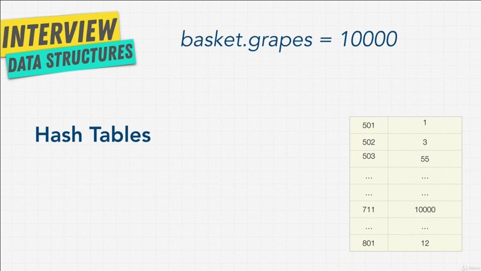

# Chapter-5 Data Structures Hash Tables

## Table of Contents

1.  [Hash Tables Introduction](#Hash-Tables-Introduction)

 

## Hash Tables Introduction

It's time for our next data structure _hash tables_. Hash tables or _hash map_,
_maps_, _maps on_, _unordred maps_, _dictionaries objects_, there are many ways
to call this data structure, and different languages ave have different names
for it, and slight variations on the hash tables. **_Objects_** for example, in
**_JavaScript_** are a **_type of hash tables_**.

The reason I'm starting the course with arrays and objects or hash tables is,
because these two are the two are most common interview question. You're _going
to use them in any coding question_.

Me personally, I have yet to be part of an interview that you didn't have to
know these. They are an absolute MUST. Luckily for us, pretty much every
language has a built in hash table, just like arrays. In Python they're called
_dictionaries_, JavaScript as we said are Objects. Java has maps, Ruby has
_hashes_; and hash tables are very important all across computer science. You
see them a lot in databases, in caches, and they're extremely useful. So what
are they?

Also you may wondering, what does the name hash table mean? Where did this name
come from? Well let's look at an example,
 

 

Imagine you're going grocery shopping, and you have an object here, basket
(`basket.grapes`) and you want to add grapes as the property of the baskets
object; again, we're using JavaScript syntax, but this should look familiar to
you.

We wanted to set, that `baskter.grapes` is going to equal `10000`. We're buying
`10000` grapes, because you can never have too may grapes. Now first of,
thinking about how we would store this with arrays, it will to be a little bit
more difficult right?. In the array we have an _index_ that's numbered and the
_value_. With hash tables or an objects, we get to set a _key_ which is grapes,
and a _value_; so we get to set a _key value pair_. So, right away we see some
benefits in here.

A way hash table works, is we have the _key_ which is grapes, and this **key is
used as the _index_** of where to find the values in memory. Remember with the
arrays we have the index, which was the number, but with hash tables we use
_grapes_ as a way to find it in our memory shelf.

This is done this way, with something called a **_ has function_**. But for now
we just assume this (has function) is a _black-box_, we don't know what going on
with hash function (black-box). All that's happen is we're going to pass
_grapes_ into this black-box, this black-box is going to do some magic, and out
of it, comes a key into an index, where we want to store this (grapes) values.

Now, our `10000` grapes can be stores and this memory address `711`. Technically
it actually stores both grapes (key) and the value (`10000`), her I've just
simplified it to `10000` just so it's a little bit cleaner; But keep in mind,
that **_it's going to store both key and value_**; I'll show you a diagram
showing this later on.

So, this black-box gets to decide where to put the data on our memory in our
computers. But you might be wondering, what is this thing (hash function)? And
why does he get to decide where to put all this information?

For that I'll see you in the next lectures.

**[⬆ back to top](#table-of-contents)**
 
 
