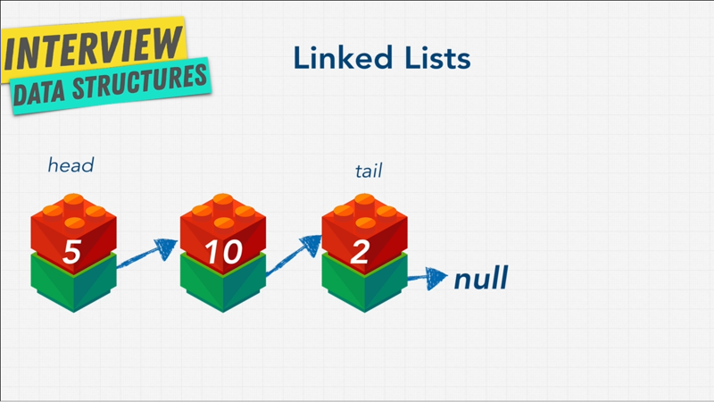
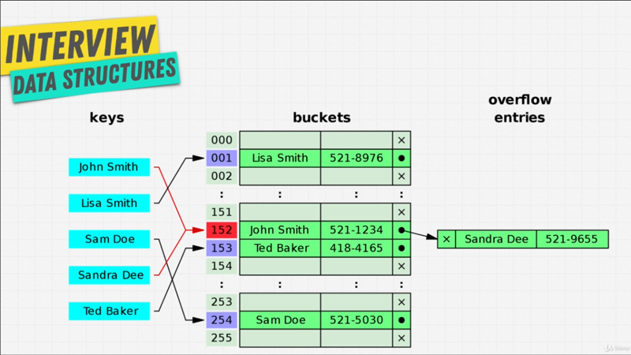
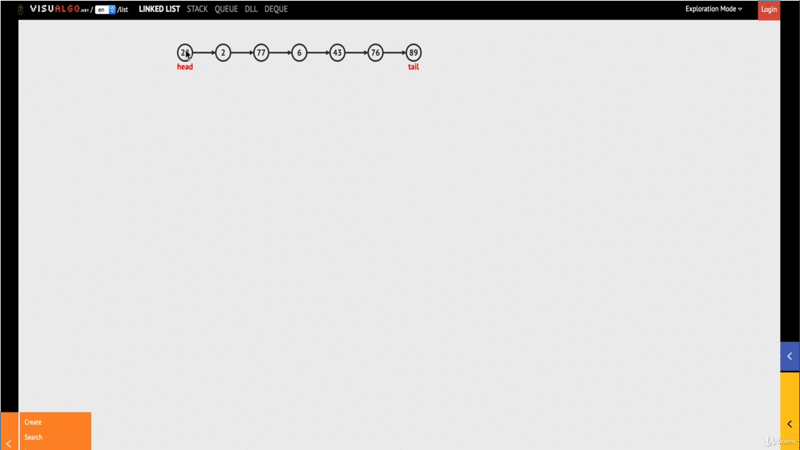
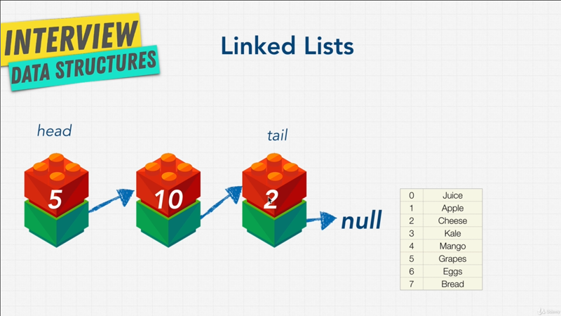
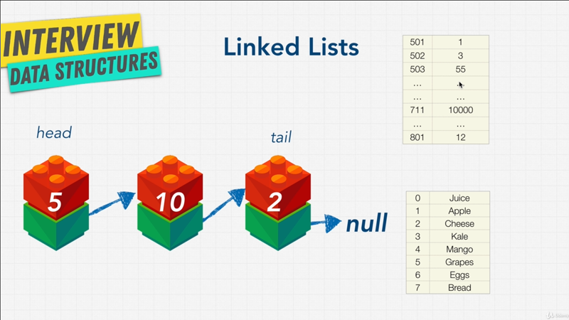
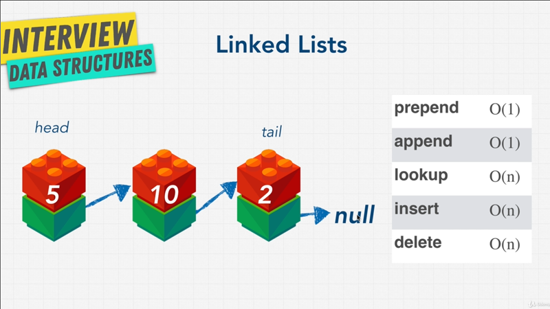

# Chapter-6 Data Structures Linked List

## Tables of Contents

1.  [Linked List Introduction](#linked-list-introduction)
2.  [What is a Linked List](#what-is-a-linked-list)
3.  [Exercise Why Linked List](#exercise-why-linked-list)

<br/>


## Linked List Introduction
<br/>


<br/>

It's time to talk about our third data structure, and we're going to be talking
about two types of linked list in the next coming lectures. `[1]` **Singly**,
and `[2]` **Doubly** linked list. What problem do we encounter with arrays?
Well, with **static arrays**, we only had a certain amount of data, or memory
that can be allocated next to each other in memory. But then in both dynamic
arrays and static arrays can increase their memory (space) once it hits certain
limit, and double up that memory in another location; but that operation once in
while of doubling up the array in order to create more memory had a performance
implication, it's cost us all of `O(n)`, additionally arrays also had bad
performance for any sort of operations, like **_insert_** and **_delete_**, that
had to **_shift indexes_** over, especially when you inserted or deleted any
word that **wasn't the end of the array**.

Then came hash tables, they were great, we were pretty much store things
wherever we wanted in memory, and hash tables would just take care of it for us,
and know where to place it in memory. We didn't have to worry about some
problems that came with the arrays, life was good, but unfortunately they
weren't really ordered. How to solve this problems? Linked list to the rescue.

So, does mean this we all should just be using linked list all the time and
disregard arrays and hash tables, because linked list are the best data
structure? No, _as always there are **tradeoffs** when it comes to data
structures_. In the next coming lectures, let's learn more about them, so we can
get a clear picture.
<br/>


<br/>

By the way, remember this above diagram, that I showed you in the has table
chapter? And I said that when we had **collision**, one way to solved it was
using something like `152` arrow into new data structure. We had no idea what
this data structures was. Well this `John Smith` to `Sandra Dee` and little
arrow pointing, that's a linked list. So get started and learn what linked list
are.

**[⬆ back to top](#table-of-contents)**
<br/>
<br/>

## What is a Linked List
<br/>


<br/>

What is a linked list? As the name suggests it's a list that is linked; that's
answer is not very helpful can you actually explain it to us? Alright, as
above diagram.

A list or in this case we'll find out soon a singly linked list, **contains
a set of nodes**, and think of nodes as a **block**, both _red_ and _green_ block
together is a _node_. These nodes have two elements, the `[1]` **value of the
data** you want to store, in this case the number `5` and `[2]`a **pointer** to
the _next node in line_.

So, you can see the _green block_ points to the next node. The first node is
called the **head**, and the last node is called the **tail**. Now, depending on
some people like to call the _tail_ anything after the head, including the this
block (the middle node, before the tail), but I prefer the term _tail_ referring
to the very last node. Finally linked list are we call **null terminated**,
which signifies that it's the end of the list. So we know this is the _tail_ node
because it points to _null_, there's nothing coming after it.

Now, **pointer** is a term you hear a lot; i Programming and Computer Science,
we have lecture coming up discussing what a _pointer_ actually is. The focus
just for linked list for now, you can see that it's a simple data structure.
It's simply an element that links to the next element, that links to the next
element, and keeps going, keeps going until the last element that points to
_null_. You can have them (nodes/ elements) **sorted**, and you can have
**unsorted**, and you can have them nodes it's pretty much contain any sort of
data type.

Let's take a look at some pseudo code,

```javascript
const basket = ["apples", "grapes", "pears"]

/*
|-----------------|
|-- pseudo code --|
|-----------------|

linked list: apples --> grapes --> pears.

apples
8947 --> grapes
         8742 --> pears
                  372 --> null
*/
```

Up until now we learned how arrays work, and here I can just create a simple
array, let's say a `basket` that contains our grocery list. We have _apples_, we
have _grapes_ and we have _pears_.

Now, how can we have a _basket_ that's not an array but in linked list? Well, we
can say that our linked list and this is not actual code, just pseudo code.
I can say that our linked list will contains _apples_ that then points to
_grapes_ that then point to _pears_.

These little arrows `-->`, are essentially _pointers_ saying, _apples_ to
_grapes_ to _pears_. Remember this isn't actually code, I'm just creating a nice
diagram for you.

A more accurate diagram might be something like this, where we have _apples_ in
memory space let's say `8947`, and this node points to the next node, which is
_grapes_ that is at `8742` in memory, and then that node point to _pears_ that
is at `372` location in memory, because _pears_ is the end of the list, the tale
it points to _null_.

You just thinking to your self, how come I'm not just coding this in JavaScript,
just show us how linked list work in JavaScript and stop with this pseudo code
gibberish. Well, JavaScript doesn't actually come with linked lists built in.
Remember what I said, _different language have different tools available to
them_. Languages like Java have linked list, while JavaScript doesn't come
pre-built linked list.

Luckily for us, we can build one, and this is why you typically do in
programming, when you don't have something, you build it!. We have the building
block to be able to build a linked list, an that's what we're going to do as
part of an exercise coming up.

Before we code our own linked list, and create our own linked list data
structure, let's do a fun little exercise.

**[⬆ back to top](#table-of-contents)**
<br/>
<br/>

## Exercise Why Linked List
<br/>


<br/>

It's time for little exercise, why do you think linked list may be better than
hash tables or array? Just from what we know right now. I want you to answer
this question in your head, or write down, before you go into the next lecture.

I also want to show you a nifty little tools named
[visualgo](https://visualgo.net/en/list), this little visual shows you how
a linked list works, so you can play around with it, and see where they might
shine over arrays or hash tables. You see over we have a **_head_** with the
value of `22`, and a **_tail_** with a value of `89`, and others nodes
connecting all of them, and you can use this website to do anything to a linked
list, you can **create**, **search**, **insert** or **remove**.

I can either _insert_ to the _head_, if I click and go, I enter the value `85`.
I can insert to the _tail_ at the very end, if I had go all right, that's seems
pretty simple nothing to crazy.

It looks a little bit complicated, and we're actually going to code this all
ourselves, and build this in, but I want you to play with this data structure,
and in your head, come up with why we might want to use linked list.

### Exercise - Question 1

Why linked list better than hash tables or array? Let's discuss the answer.

One key thing that you may have seen is, that linked list have a sort of `[1]` **loose
structure** that allows you to insert a value into the middle of the list, by
simply resetting a few pointers, just like we saw in the animation.

I can **insert** anything that I want, and the only changes that happen
is in the middle of nodes that we insert to it. This is the same for
**deleting** node in a linked list.
<br/>


<br/>

We remember with array data structure, how when we wanted to insert something
that wasn't at the end of the array, we had to add the item, let's say in memory
space `[1]` into `[1] apple`, and then **shift all the items down** and **index
down** which cost us a lot of time, it cost us `O(n)`.

The main different between arrays and linked lists, is that in an array an
element or **elements are indexed**; So if I want to go to item at index `5
Grapes`, I can do that easily. In a linked list you start at the _head_, and
traverse (cross) the list until you get to item `5 Grapes`, which is `O(n)`, and
this idea of traversal is the same as iteration that we did with arrays, where
we go from `0` to `5`m except we like to call this traversal, because you don't
really know when the linked list will end. You start from the _head_ and you
keep going until you hit _null_.

As you'll see in our coding example, we're going to have to use something like
a `while-loop`, when we implement our linked list, because we don't usually know
how long the list is going to be.

Another advantage that an array might have is, that most computers have caching
systems, that make reading from sequential memory that is memory right next to
each other, shelf's right next to each other, faster then reading scattered
(dislocated) address; and that something that we've talked about already.

Array items are always located right next to each other in computer
memory.Linked list and nodes instead are actually scattered all over memory,
kind like hash tables, so iterating through a linked list or traversing through
a linked list is usually quite bit slower than iterating through items like an
array. Even though, they're technically both `O(n)`.  However, these **insert**
that we can do in the middle of a linked list, is a lot better than array.

What about hash tables?
<br/>


<br/>

Remember hash tables, when we talked about hash tables, well just like hash
tables, when we insert something into a linked list, we just scatter it all over
memory, and we can just keep adding it, keep adding it, keep adding it. We don't
have to do any of unshifting, or shifting o the indexes that we did with the
arrays, which is really really nice.

You can also **delete** node very easily versus with an array. But one advantage
that it has over hash tables is, that there is some sort of order to linked
list, each node point to the next nodes. So, you can have sorted data like
a hash tables;
<br/>


<br/>

If we look at our Big-O of linked list, we can see that **_prepend_**, which is
common language we say to add to the beginning of a linked list, **prepend** is
`O(1)`. **Append** which is at the end of the list to add a new item is `O(1)`.
**Lookup**, which we can also call traversal to look for an item, Let's say we
want to find `10` is `O(n)`, because we have to go from the _head_ all the way
until we find what we're looking for, **Insert** is also `O(n)`, because we have
to go one by one find the index, we don't know how longer linked list is, we
find the index and then _insert_ there which technically could take `O(n)`, and
again something that we're going to implement in code and have a better
understanding of; And **delete** is also `O(n)`, because we have to find the
items.

Now, you're thinking to yourself, hold on, **insert** and **delete** in arrays
are also `O(n)`, so how is that better? And that's something that we're going to
get into, when we actually take look at the code. Remember (**insert**,
**delete**) is the worst case, in which case we _insert_ or _delete_ the very
last item, and most of times that won't be the case in linked list, again
something that we're going to talk about a little bit, when we code our own
linked list.

Looking at a diagram like this, it's really hard to truly understand how they
work, and what linked list are. So, we're going to code our own.

In the net lecture, we're going to talk about the final piece of the puzzle,
what a pointer is?, and then finally, code our own linked list, so we understand
the Big-O implications a little bit better.

**[⬆ back to top](#table-of-contents)**
<br/>
<br/>
