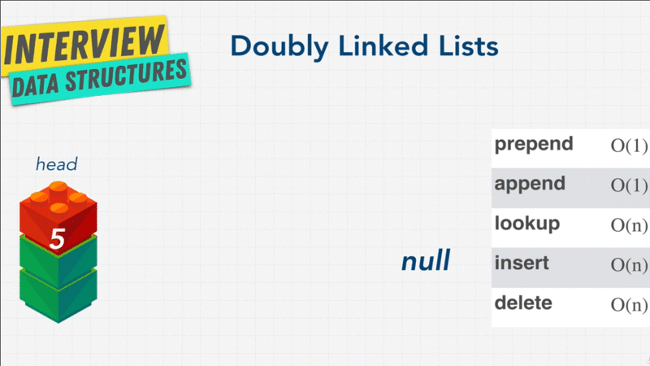
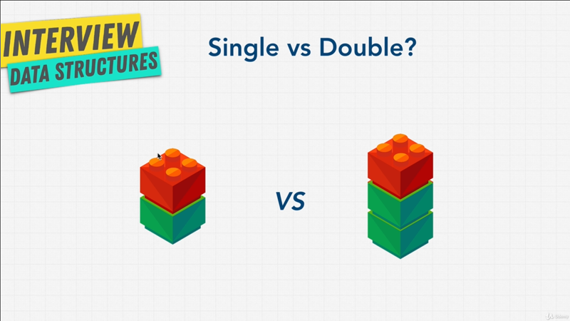

# Chapter-6 Data Structures Linked List

## Tables of Contents

1. [Linked List Introduction](#linked-list-introduction)
2. [What is a Linked List](#what-is-a-linked-list)
3. [Exercise Why Linked List](#exercise-why-linked-list)
4. [What is Pointer](#what-is-pointer)
5. [Our First Linked List](#our-first-linked-list)
6. [Node Class](#Node-Class)
7. [Insert method](#insert-method)
8. [Doubly Linked List](#doubly-linked-list)
9. [Singly VS Doubly Linked List](#singly-vs-doubly-linked-list)

</br>

## Linked List Introduction

</br>


</br>

It's time to talk about our third data structure, and we're going to be talking
about two types of linked list in the next coming lectures. `[1]` **Singly**,
and `[2]` **Doubly** linked list. What problem do we encounter with arrays?
Well, with **static arrays**, we only had a certain amount of data, or memory
that can be allocated next to each other in memory. But then in both dynamic
arrays and static arrays can increase their memory (space) once it hits certain
limit, and double up that memory in another location; but that operation once in
while of doubling up the array in order to create more memory had a performance
implication, it's cost us all of `O(n)`, additionally arrays also had bad
performance for any sort of operations, like **_insert_** and **_delete_**, that
had to **_shift indexes_** over, especially when you inserted or deleted any
word that **wasn't the end of the array**.

Then came hash tables, they were great, we were pretty much store things
wherever we wanted in memory, and hash tables would just take care of it for us,
and know where to place it in memory. We didn't have to worry about some
problems that came with the arrays, life was good, but unfortunately they
weren't really ordered. How to solve this problems? Linked list to the rescue.

So, does mean this we all should just be using linked list all the time and
disregard arrays and hash tables, because linked list are the best data
structure? No, _as always there are **tradeoffs** when it comes to data
structures_. In the next coming lectures, let's learn more about them, so we can
get a clear picture.
</br>


</br>

By the way, remember this above diagram, that I showed you in the has table
chapter? And I said that when we had **collision**, one way to solved it was
using something like `152` arrow into new data structure. We had no idea what
this data structures was. Well this `John Smith` to `Sandra Dee` and little
arrow pointing, that's a linked list. So get started and learn what linked list
are.

**[⬆ back to top](#table-of-contents)**
</br>
</br>

## What is a Linked List

</br>


</br>

What is a linked list? As the name suggests it's a list that is linked; that's
answer is not very helpful can you actually explain it to us? Alright, as
above diagram.

A list or in this case we'll find out soon a singly linked list, **contains
a set of nodes**, and think of nodes as a **block**, both _red_ and _green_ block
together is a _node_. These nodes have two elements, the `[1]` **value of the
data** you want to store, in this case the number `5` and `[2]`a **pointer** to
the _next node in line_.

So, you can see the _green block_ points to the next node. The first node is
called the **head**, and the last node is called the **tail**. Now, depending on
some people like to call the _tail_ anything after the head, including the this
block (the middle node, before the tail), but I prefer the term _tail_ referring
to the very last node. Finally linked list are we call **null terminated**,
which signifies that it's the end of the list. So we know this is the _tail_ node
because it points to _null_, there's nothing coming after it.

Now, **pointer** is a term you hear a lot; i Programming and Computer Science,
we have lecture coming up discussing what a _pointer_ actually is. The focus
just for linked list for now, you can see that it's a simple data structure.
It's simply an element that links to the next element, that links to the next
element, and keeps going, keeps going until the last element that points to
_null_. You can have them (nodes/ elements) **sorted**, and you can have
**unsorted**, and you can have them nodes it's pretty much contain any sort of
data type.

Let's take a look at some pseudo code,

```javascript
const basket = ["apples", "grapes", "pears"];

/*
|-----------------|
|-- pseudo code --|
|-----------------|

linked list: apples --> grapes --> pears.

apples
8947 --> grapes
         8742 --> pears
                  372 --> null
*/
```

Up until now we learned how arrays work, and here I can just create a simple
array, let's say a `basket` that contains our grocery list. We have _apples_, we
have _grapes_ and we have _pears_.

Now, how can we have a _basket_ that's not an array but in linked list? Well, we
can say that our linked list and this is not actual code, just pseudo code.
I can say that our linked list will contains _apples_ that then points to
_grapes_ that then point to _pears_.

These little arrows `-->`, are essentially _pointers_ saying, _apples_ to
_grapes_ to _pears_. Remember this isn't actually code, I'm just creating a nice
diagram for you.

A more accurate diagram might be something like this, where we have _apples_ in
memory space let's say `8947`, and this node points to the next node, which is
_grapes_ that is at `8742` in memory, and then that node point to _pears_ that
is at `372` location in memory, because _pears_ is the end of the list, the tail
it points to _null_.

You just thinking to your self, how come I'm not just coding this in JavaScript,
just show us how linked list work in JavaScript and stop with this pseudo code
gibberish. Well, JavaScript doesn't actually come with linked lists built in.
Remember what I said, _different language have different tools available to
them_. Languages like Java have linked list, while JavaScript doesn't come
pre-built linked list.

Luckily for us, we can build one, and this is why you typically do in
programming, when you don't have something, you build it!. We have the building
block to be able to build a linked list, an that's what we're going to do as
part of an exercise coming up.

Before we code our own linked list, and create our own linked list data
structure, let's do a fun little exercise.

**[⬆ back to top](#table-of-contents)**
</br>
</br>

## Exercise Why Linked List

### Linked List Example - visualgo

</br>


</br>

It's time for little exercise, why do you think linked list may be better than
hash tables or array? Just from what we know right now. I want you to answer
this question in your head, or write down, before you go into the next lecture.

I also want to show you a nifty little tools named
[visualgo](https://visualgo.net/en/list), this little visual shows you how
a linked list works, so you can play around with it, and see where they might
shine over arrays or hash tables. You see over we have a **_head_** with the
value of `22`, and a **_tail_** with a value of `89`, and others nodes
connecting all of them, and you can use this website to do anything to a linked
list, you can **create**, **search**, **insert** or **remove**.

I can either _insert_ to the _head_, if I click and go, I enter the value `85`.
I can insert to the _tail_ at the very end, if I had go all right, that's seems
pretty simple nothing to crazy.

It looks a little bit complicated, and we're actually going to code this all
ourselves, and build this in, but I want you to play with this data structure,
and in your head, come up with why we might want to use linked list.

### Exercise - Question 1

Why linked list better than hash tables or array? Let's discuss the answer.

One key thing that you may have seen is, that linked list have a sort of `[1]` **loose
structure** that allows you to insert a value into the middle of the list, by
simply resetting a few pointers, just like we saw in the animation.

I can **insert** anything that I want, and the only changes that happen
is in the middle of nodes that we insert to it. This is the same for
**deleting** node in a linked list.
</br>


</br>

We remember with array data structure, how when we wanted to insert something
that wasn't at the end of the array, we had to add the item, let's say in memory
space `[1]` into `[1] apple`, and then **shift all the items down** and **index
down** which cost us a lot of time, it cost us `O(n)`.

The main different between arrays and linked lists, is that in an array an
element or **elements are indexed**; So if I want to go to item at index `5
Grapes`, I can do that easily. In a linked list you start at the _head_, and
traverse (cross) the list until you get to item `5 Grapes`, which is `O(n)`, and
this idea of traversal is the same as iteration that we did with arrays, where
we go from `0` to `5`m except we like to call this traversal, because you don't
really know when the linked list will end. You start from the _head_ and you
keep going until you hit _null_.

As you'll see in our coding example, we're going to have to use something like
a `while-loop`, when we implement our linked list, because we don't usually know
how long the list is going to be.

Another advantage that an array might have is, that most computers have caching
systems, that make reading from sequential memory that is memory right next to
each other, shelf's right next to each other, faster then reading scattered
(dislocated) address; and that something that we've talked about already.

Array items are always located right next to each other in computer
memory.Linked list and nodes instead are actually scattered all over memory,
kind like hash tables, so iterating through a linked list or traversing through
a linked list is usually quite bit slower than iterating through items like an
array. Even though, they're technically both `O(n)`. However, these **insert**
that we can do in the middle of a linked list, is a lot better than array.

What about hash tables?
</br>


</br>

Remember hash tables, when we talked about hash tables, well just like hash
tables, when we insert something into a linked list, we just scatter it all over
memory, and we can just keep adding it, keep adding it, keep adding it. We don't
have to do any of unshifting, or shifting o the indexes that we did with the
arrays, which is really really nice.

You can also **delete** node very easily versus with an array. But one advantage
that it has over hash tables is, that there is some sort of order to linked
list, each node point to the next nodes. So, you can have sorted data like
a hash tables;

### Linked List Big-O

</br>


</br>

If we look at our Big-O of linked list, we can see that **_prepend_**, which is
common language we say to add to the beginning of a linked list, **prepend** is
`O(1)`. **Append** which is at the end of the list to add a new item is `O(1)`.
**Lookup**, which we can also call traversal to look for an item, Let's say we
want to find `10` is `O(n)`, because we have to go from the _head_ all the way
until we find what we're looking for, **Insert** is also `O(n)`, because we have
to go one by one find the index, we don't know how longer linked list is, we
find the index and then _insert_ there which technically could take `O(n)`, and
again something that we're going to implement in code and have a better
understanding of; And **delete** is also `O(n)`, because we have to find the
items.

Now, you're thinking to yourself, hold on, **insert** and **delete** in arrays
are also `O(n)`, so how is that better? And that's something that we're going to
get into, when we actually take look at the code. Remember (**insert**,
**delete**) is the worst case, in which case we _insert_ or _delete_ the very
last item, and most of times that won't be the case in linked list, again
something that we're going to talk about a little bit, when we code our own
linked list.

Looking at a diagram like this, it's really hard to truly understand how they
work, and what linked list are. So, we're going to code our own.

In the net lecture, we're going to talk about the final piece of the puzzle,
what a pointer is?, and then finally, code our own linked list, so we understand
the Big-O implications a little bit better.

**[⬆ back to top](#table-of-contents)**
</br>
</br>

## What is Pointer

Let's quickly talk about _pointers_. Something that you'll hear a lot in
Computer Science topics. A pointer is simply is **_a reference to another place in
memory, or another object, or another node_**. In JavaScript we can demonstrate
it something like this,

```javascript
let obj1 = {a; true};
let obj2 = obj1;

console.log("obj1", obj1)       // [A]
console.log("obj2", obj2)       // [B]

// Result:
// [A]: obj1 { a: true  }
// [B]: obj2 { a: true  }

obj1.a = "booya"
console.log("obj1", obj1)       // [C]
console.log("obj2", obj2)       // [D]

// Result:
// [C]: obj1 { a: 'booya'  }
// [D]: obj2 { a: 'booya'  }

delete obj1
console.log("obj1", obj1)       // [F]
console.log("obj2", obj2)       // [G]

// Result:
// [F]: obj1 { a: 'booya'  }
// [G]: obj2 { a: 'booya'  }

obj2 = "hello"
console.log("obj1", obj1)       // [H]
console.log("obj2", obj2)       // [I]

// Result:
// [H]: obj1 { a: 'booya'  }
// [G]: obj2 hello
```

If I have an object, let's call it `obj1` that is a simple object that as `a` as
`true` |`{a: true}`; And now we do something like `obj2 = obj1`. We've just
created a pointer, a reference to an object. That is what a pointer is, it's
simply a reference.

Here `obj1`, I'm not copying the object, I'm not saying `obj1` equals `{a:
true}`, and also, creating another location in memory that says, `{a; true}` in
memory, when we look at our RAM, there's only one entry, `{a: true}`; And both
`obj1` and `obj2` point to the same location in memory.

To show you that is the case let log `obj1` and `obj2`, we get result both `{a:
true}`; but, if I change `obj1.a = "booya"`, so accessing property in `obj1`,
and I run this, look of that, both `obj1` and `obj2` changed. Because I've
created a pointer here, saying `obj2` is going to reference `obj1` | (`obj2
= obj1`) like so; And they both point to the same location in memory.

That's what pointer is. It's simply saying, "hey, this is where it is in
memory". And when we look at our above linked list example,
</br>


</br>

When remove, let's say a node at index of `2 [77]`, we remove that and that just
disappears from memory; how does that work?

> **Note**: JavaScript is **not possible to manually destroy or delete
> a variables** that you create with `var` in this example Andre just try to
> `delete obj1` and get "ReferenceError: obj1 is not defined" but it not just
> like that, `obj1` is still exist even you delete it.
> [MDN](https://developer.mozilla.org/en-US/docs/Web/JavaScript/Reference/Operators/delete)

I still have `obj2` even though I delete `obj1`. What's happening here? Well the
way it works in most programming language is, that our computers are going to
delete the memory that is on use, and because it sees that `obj2` is still
referencing `{a: true}` in memory it's not going to be delete it. Because
there's still a _pointer_ to `{a: true}` location in memory.

This is how things get deleted in languages like JavaScript, this is what you
might call _garbage collection_ where as soon as we say `obj2 = "hello"`, now
`obj2` which you referenced the memory space that had `{a: true}` is now just
simply a string. Because JavaScript is garbage collected, that is memory is
managed automatically, `{a: true}` gets automatically garbage collected and
deleted, because noting is pointing to it.

However there is a low level languages where you have to manage your own
memory, and you have to manually delete `{a: true}` on referenced item in
memory. This can cause a lot of possible issue, where you leave memory that's
not being used in memory, which is a valuable resource. But then there's also
benefits with non garbage collected languages where you get to manage your own
memory, so you can make things really really fast that efficient.

I think that's enough for pointer's. A pointer is simply a **reference to something
else in memory**. We're going to use this knowledge in our next lecture to
create our very first linked list data structure.

**[⬆ back to top](#table-of-contents)**
</br>
</br>

## Our First Linked List

### Linked List Structure

It's time to create our very first linked list data structure. Let's say
I wanted to create a linked list that has `10`, pointing to `5`, pointing to
`16`, nice little simple one. First off, how will we go about visualizing this
in a language like JavaScript that doesn't have linked list.

```javascript

// 10 --> 5 --> 16

const myLinkedList = {
    head: {
        value:
        next: {

        }
    }
}
```

Well we can simply that we have a new linked list, let just say here
`myLinkedList`, and this is going to equal to an object that has a **head**
property, remember because the very first term in a linked list is the _head_,
and we're going to have a node. The point of the node is to say, "hey, anything
can be in the snow, just put anything you want, and it's a container around this
data". **Think of node as the bucket of data**, and in this case we can just use
an object to put our data in,

All this node needs to have in a linked list is a **value** property, of what
the value of the node, plus a **next** property which is the pointer to the next
node. Now _head_ value can be anything we want, and the _next_ property has to
be a pointer or a reference to the next when in which case will be an object, so
will be another object, that we're going to reference in memory. With this way,
the _value_ of the node can always change, but the pointer (_next_) are always
going to be pointing to _value_ property. So we can change items, and nothing
else will change, it will still point to that changed and updated _value_
property.

Let me show you what I mean,

```javascript
// 10 --> 5 --> 16

const myLinkedList = {
    head: {
        value: 10,
        next: {
            value: 5,
            next: {
                value: 16,
                next: null,
            },
        },
    },
};
```

We have the head here, in which case it's `10` so we want to set `10` as our
_value_, and this head is going to reference point to the next node, which will
have a _value_ of `5`, and the _next_ value, is the next node in the list,
which is `16`, well as `16` as the tail of our linked list, so that means it has
point to _null_ as the _value_ property of tail, or what we call _null
terminated_, that means it's the end of the list, perfect.

So, this is what we want to create, a linked list, using this as our structure.

### Implement Linked List Structure

```javascript
class Linkedlist {
    constructor(value) {}
}

const myLinkedList = new Linkedlist(10);
```

We're going to create a class called `Linkedlist`, and this class will have the
constructor, which is the function that gets run at the very beginning when we
create the linked list. This constructor is going to take a `value` as
parameter. What does that mean? Well, when we finally say, that we're creating
a `myLinkedList`; remember, we want to create it, when I create `myLinkedList`,
I'm going to instantiate the class that is run the class function, run the
constructor, and create a linked list. I'm going to say `Linkedlist()` and give
it a value to start off the list, because while the list can't be empty, has to
have something, it has to start with a head.

So, in our case, we want to started with `10`, and ideally by running command
`new Linkedlist(10)`, we've created the first part of our linked list, just the
`10`.

```javascript
constructor(value) {
    this.head = {
        value: value,
        next:  null
    },

    this.tail =  this.head
    this.length =  1
}
```

Within this constructor, we have `this.head` reference, because while we need to
keep track of the _head_, and `this.head` is going to simply have a `value` that
is equal to _value_ that we passed in; and finally the `next`. What should
`next` property be when we first create this list? Well, since `10` is the only
thing that we'll have or one node, `next` is going to equal `null`, to begin
with.

Remember, constructor is all about creating the very first linked list node,
what happens when we instantiate a class to start off `myLinkedList`.

Finally we have two other piece of information that we need to track. `[1]` is
`this.tail`, and remember the word `this` just refer to `Linkedlist`, so it's
just referring to `new Linkedlist(10)` that we created. What is the _tail_ going
to be? Well, because we only have one item, the **_head is also the tail_**, so
we just simply say `this.tail = this.head`.

By the way, I know this get a little bit confusing, as we go through this
lecture series on linked list, it is a bit hard to wrap your mind around. So
I really recommend that you code along here, and do the next exercise, because
just watching me talk about linked list, is bad going to solidify your
information. It is hard to really visualize things, so you may need to build
linked list a couple times to really get the hang of it, but this will become
second nature, once you get used to the syntax, and also the idea of having this
_head_ and _tail_ and referencing them.

The final piece of the puzzle is, if we want, we can keep track `[2]` _the
length of the linked list_. This is optional, but I think it's good to keep
track and because we have one item when we create this linked list; we give it
a value, we'll give it a length of `1` (`this.length = 1`);

```javascript
class Linkedlist {
    constructor(value) {
        this.head = {
            value: value,
            next: null,
        };

        this.tail = this.head;
        this.length = 1;
    }
}

const myLinkedList = new Linkedlist(10);

console.log(myLinkedList);

// Result:
// Linkedlist {
//   head: { value: 10, next: null },
//   tail: { value: 10, next: null },
//   length: 1
// }
```

So, we put the all the puzzle into one piece, If I run this, look at that,
I have a linked list with object **_head_** have _value_ is `10`, and _next_ is
`null`, because while there's only one node; and object **_tail_** is the exact
same thing pointing to object **_head_**; and we have linked list **_length_**
of `1`.

### Exercise - 1 create `append()` method

```javascript
class Linkedlist {
    // ....
    // ....

    append(value) {
        // Code here
    }
}

myLinkedList.append(5);
myLinkedList.append(16);
```

Congratulations, we just built our very first linked list. However it's time for
a little bit of an exercise, Our list is not complete right? We need to create
this linked list (`10 --> 5 --> 16`); so, we need to be able to add `5`, and
then `16`. My challenge to you is, we want to create an `append()`, and this
`append()` method is going to take a _value_ as property, and inside this
method we want to write a piece of code that allows us to say
`myLinkedList.append()` and give a value `5` to append to our current list.

So, I want to be able to say append `5` and then append `16` to create our
completed list of `10 --> 5 --> 16`. How would you go about doing that? I'm
going to leave this for you to try out.

Remember this may be a little bit hard, and I'll provide the solution lecture,
but you should try first, and we'll code along. But I do encourage you to
challenge yourself, and just think about what's happening and what we've done in
the constructor to create this append method. Good luck.

### Exercise - 1 answer `append()` method

Let me show you what I would done here.

Final `append()` method,

```javascript
append(value) {

    const newNode = {
        value: value,
        next: null
    };

    this.tail.next = newNode;
    this.tail = newNode;
    this.length++;

    return this;
};

myLinkedList.append(5);
console.log(myLinkedList)

// Result:
// Linkedlist {
//   head: { value: 10, next: { value: 5, next: null } },
//   tail: { value: 5, next: null },
//   length: 2
// }

myLinkedList.append(16)
console.log("==>[16]", JSON.stringify(myLinkedList, null, 4))
// Result:
// ==>[16] {
//     "head": {
//         "value": 10,
//         "next": {
//             "value": 5,
//             "next": {
//                 "value": 16,
//                 "next": null
//             }
//         }
//     },
//     "tail": {
//         "value": 16,
//         "next": null
//     },
//     "length": 3
// }
```

#### Chunked `append()` method

```javascript
const newNode = {
    value: value,
    next: null,
};
```

The first thing we would want to do is to create a new node with the _value_. We
can do that quite easily saying `const newNode`, that's going to equal an
_object_ with properties that we should be familiar by now. We have `value` as
property of `newNode` that is going to equal the _value_ that we get as
a parameter, and then we have another property of `newNode` called `next` that
will be `null`.

So, we have our `newNode` here, and we want to attach it now after the `10`,
which is our very first node. Well we can simply do that by saying
`this.tail.next`.

```javascript
myLinkedList(5);

console.log(myLinkedList);

// Result
// Linkedlist {
//   head: { value: 10, next: null },
//   tail: { value: 10, next: null },
//   length: 1
// }

console.log(myLinkedList.tail.value); // Result: 10
console.log(myLinkedList.tail.next); // Result: null
```

Remember, the _next_ value on _tail_ is equal _null_ (`myLinkedList.tail.next`);
So, that is what is the _tail_ (`this.tail`), that is the last item in our list;
Because this method (`append()`) doesn't know that we only have one item, we
could have hundred items, we just want to _add at the end_.

```javascript
this.tail.next = newNode;
this.tail = newNode;
this.length++;

return this;
```

So, it's going grab the tail (`this.tail`) and then grab the _next_ value of the
_tail_ (`myLinkedList.tail.next`). It's going grab the **_pointer_** of the
_tail_ and say, "Hey, instead of pointing it to `null`, pointed to this
`newNode` that we just created".

We've pointed the _tail_ to now pointed to the `newNode` (`thist.tail
= newNode`), which has the _next_ value as `null` already setup; and then we
also want to say this (`this.tail`) what we had us _tail_ before (in logging),
which was the value of `10` (`myLinkedList.tail.value`), is no longer the
_tail_. We have a new last item, that is `this.tail` is now going to equal the
`newNode`.

Because we are running `this.tail = newNode` operation after `this.tail.next
= newNode`, when we run the `tail.next` is still this node (`tail: { value: 10,
next : null}`). As soon we update this node (`tail: { value: 10, next: null }`)
to have a _next_ of the `newNode`, we can now remove and update the _tail_
(`this.tail`) to be the `newNode`. Because, by that point, by the time this line
runs (`this.tail = newNode`), the _next_ (`tail.next`) has been updated properly
for this older _tail_ value (`this.tail.value`) property.

Finally, we want to make sure that we add the length to equal to now; so, we're
going to do `this.length++`; And just for fun, because we want to make sure that
we do this right, we want to `return this` which is the `Linkedlist`. Remember
`this` is just references what `Linkedlist` class is that get instantiated.
We're going to say `return this`, so that we get back our linked list
(`myLinkedList`).

```javascript
myLinkedList.append(5);
console.log(myLinkedList);

// Result:
// Linkedlist {
//   head: { value: 10, next: { value: 5, next: null } },
//   tail: { value: 5, next: null },
//   length: 2
// }
```

We see, when we run `myLinkedList.append(5)`, I've get return our linked list
which has a _head_ with property of _value_ is `10`, and property _next_ is the
new node that we created, with nested property _value_ of `5`, and nested _next_
property is _null_. The _tail_ now have property of _value_ now which is `5`,
and _next_ property is _null_; with a length now is `2`. It's look like it's
working.

```javascript
myLinkedList.append(16);
console.log("==>[16]", JSON.stringify(myLinkedList, null, 4));
// Result:
// ==>[16] {
//     "head": {
//         "value": 10,
//         "next": {
//             "value": 5,
//             "next": {
//                 "value": 16,
//                 "next": null
//             }
//         }
//     },
//     "tail": {
//         "value": 16,
//         "next": null
//     },
//     "length": 3
// }
```

We do `myLinkedList.append(16)` as well, I use `JSON.stringify()` to print the
logging with nice structure and readable, because the way logging works, it
won't show nested object.

We have the nested _value_ of `5`; So, the head is referencing value of `10`,
which points to the next node which is has _value_ of `5`, which points to next
nested _value_ which is `16`; And we get the _tail_ which have _value_ of `16`
and _next_ value of _null_; And the last, property _length_ now is `3`.

How cool is that? We just created our linked list, are `10 --> 5 --> 16` linked
list just like that. I hope you got that right. But if you didn't, don't get
discouraged, build this method is takes you sometimes to get used to. Luckily
for you, once you write it a couple of times, then it becomes like I said second
nature; so, don't stress out, because I have another challenge for you. Now you
know how to do **append**, you should be able to do **_prepend_**, right?
Prepend is adding to the beginning of the list.

### Exercise - 2 create `prepend()` method

```javascript
class Linkedlist {
    // ...
    // ...

    prepend(value) {
        // Code here...
    }
}

myLinkedList.prepend(1);
```

Let's say that in our list (`10 --> 5 --> 16`) we want to add `1` as our new
head now instead of `10`; So our linked list now become `1 --> 10 --> 5 --> 16`,
how would you do that with a new method called `prepend()`?, is going to take
a _value_ as parameter. And we're going to be able to run a command like
`myLinkedList.prepend(1)`, to add the `1` at the beginning of the list.

### Exercise - 2 answer `prepend()` method

Final `prepend()` method

```javascript
prepend(value) {

    const newNode = {
        value: value,
        next: null
    };

    newNode.next = this.head;
    this.head = newNode;
    this.length++;

    return this;
};

myLinkedList.prepend(1);
console.log(myLinkedList)
console.log("==>{1}", JSON.stringify(myLinkedList, null, 4))

// Result:

// Linkedlist {
//   head: { value: 1, next: { value: 10, next: [Object] } },
//   tail: { value: 29, next: null },
//   length: 5
// }
// ==>{1} {
//     "head": {
//         "value": 1,
//         "next": {
//             "value": 10,
//             "next": {
//                 "value": 5,
//                 "next": {
//                     "value": 16,
//                 }
//             }
//         }
//     },
//     "tail": {
//         "value": 16,
//         "next": null
//     },
//     "length": 4
// }


```

#### Chunked `prepend()` method

Let's look at what the code should like,

```javascript
const newNode = {
    value: value,
    next: null,
};
```

The very first thing we do, just like we did with `append()`, is to create the
node, that we're going to add. So, I'm going to say `newNode`, that have two
objects, the **_value_** and the **_next_**.

Now, `next` as second object, I want to leave as `null`, and I'll show you why
ion the next lecture that is the case we and w don't just have `next: this.head`
to reference the very first item in our list which is `10`, but for now just
trust me, that this `next` we want to leave as `nuill`, because we can do that
later. Right now we're just creating an empty node with the `value`.

```javascript
newNode.next = this.head;
this.head = newNode;
this.length++;

return this;
```

Next, we want to say our `newNode.next` which this value (`next: null`), is going
to equal `this.head`. So, we've just created a _pointer_ saying that the new
node we just created is going to `this.head`, the very first item in our list.

Then obviously, just like we did with `append()`, we want to update the
reference now, to say that `this.head` is no longer equal to the old value,
it's now the new node.

The last but not least, we want to add `this.length++` and make sure we increase
the length of our list,

Finally if we `return this` our linked list, and we can run the method, we get
the result,

```javascript
myLinkedList.prepend(1);
console.log(myLinkedList);

// Result:
// Linkedlist {
//   head: { value: 1, next: { value: 10, next: [Object] } },
//   tail: { value: 16, next: null },
//   length: 4
// }
```

Look at that, we've prepend `1` to the very first item on the list, the
**_head_** is now referencing `10`, and the **_tail_** of our list is now `16`.

That wasn't too bad it was it. In the next lecture, I want to talk about quickly
this `newNode` code that we are repeating, both in `append()` and `prepend()`;
and we might want to do with it.

**[⬆ back to top](#table-of-contents)**
</br>
</br>

## Node Class

We talked about how `newNode` gets repeated both times in `append()` and
`prepend()`, as we create more methods on our linked list, we're going to have
to constantly say `newNode` with object inside of it `value: value`, `next:
null`. Usually we want to keep things DRY. Many implementation of linked list,
you'll see something like this, where `newNode` is actually another class.

```javascript
class Node {
    constructor(value) {
        this.value = value;
        this.next = null;
    }
}

class Linkedlist {
    // ...
    // ...

    append(value) {
        const newNode = new Node(value);
        // ...
        // ...
    }

    prepend(value) {
        const newNode = new Node(value);
        // ...
        // ...
    }
}
```

For example, I can create a new class, and this is how object oriented
programming usually works, we have classes that interact with other classes ti
create our programs. So you will see a lot of implementation of linked list that
have class of `Node`.

This class is going to have a constructor that takes a **_value_**, and this
value will have `this.value = value`, it's going to have `this.next = null`,
just like that.

So that way, instead of us saying `const newNode`, and creating this `newNode`
every time, I can just say, every time I want to create a new node, we can say
`const newNode = new Node(value)`.

So, every time we have a new node, we just instantiate what we call create and
run this `new Node()` class, that create a node for us, with **_value_**
property, and **_next_** property.

You might prefer using this (`const newNode = new Node(value)`) syntax, but
because I find this can get a little bit confusing, especially if you're not
used to classes, I want to just keep things the way they are, because I think
it's easier to read; and as you saw, it's fairly easy to implement if you want
to do that on your own.

**[⬆ back to top](#table-of-contents)**
</br>
</br>

## Insert method

We've just implemented `prepend()`, `append()`, as this
[diagram](#linked-list-big---o), it should be clear to you why that is an `O(1)`
operation for both of these. We don't really have to loop through anything. We
just have a reference to the **_tail_** and the **_head_**, and we reassigned
some values, nice and easy.

Now, comes the hard part. What about `insert`, `lookup` (traversal), `delete`?
I think we should code those as well to fully understand how linked list work.

This exercise is going to be a little bit tougher. But, I'm going to give you
a heads up, that there's going to be some _looping involved_.

```javascript
// 1 --> 10 --> 5 --> 16
class Linkedlist {
    // ...
    // ...

    printList() {
        const array = [];
        let currentNode = this.head;

        while (currentNode !== null) {
            array.push(currentNode.value);
            currentNode = currentNode.next;
        }

        console.log(array);
        return array;
    }

    insert(index, value) {}
}

myLinkedList.insert(2, 99);
```

We want to create a `insert()` method, in this method is going to have an
`index` and `value` as parameter. Because, we're going to want to be able to say
"Insert at this (`index`) location, and this `value` into the list ".

For example, if I wanted to say `myLinkedList.insert(2, 99)`, I want to insert
at index of `2`, with the value `99`. That would be mean, if we go back to our
linked list index example condition (`1 --> 10 --> 5 --> 16`) , index of `2` is
mean I want to insert `99` and have that point to `5` (`1 --> 10 --> 99 -->
5 --> 16`), how we go about doing that?

I want to warn you, this can get little tricky, and the best way to really think
about it, is to grab a piece of paper and a pen and draw out the steps that you
should do.
</br>


</br>

A good way to practice this, and make sure you get it right, is to use the
[visualgo](https://visualgo.net/en/list) and practice _inserting_ and see what
happens when you do index of `2` let's say `99`, I hit _Go_, see what happens?
You're going to have to code that action. Did you get that. Ply around with
visualgo as you try and code the `insert()` function.

Like I said, a little hint, that there's going to be some looping involves, you
saw that in the demonstration or in animation there was some of traversal. So
we're going to do some sort of traversal to find the index.

I also want to code a quick `printList()` function;

```javascript
Linkedlist {
  head: { value: 1, next: { value: 10, next: [Object] } },
  tail: { value: 16, next: null },
  length: 4
}
```

So that instead of using way of this way of printing our list, which as it gets
deeper and deeper, it gets harder and harder to understand, I'm going to just
create a `printList()` function that should access to, to make sure that your
`insert()` method is working. This `printList()` is simply going o just list our
linked list; But instead of having this ugly print out I'm just going to print
out in an array, so our linked list example condition is just going to be
printed in an array.

All we're going to do, is say `const array` is going to be an empty array. Will
have a current `currentNode` variable, that will have `this.head`, the first
item in the list. All we're going to do is do a `while-loop`, remember
`while-loop` is similar to a `for-loop`, we're looping but instead we're saying
while this is happening, while a condition is happening run the below command.

So I'm going to say while `currentNode` doesn't equal to `null`, as long as
there is a `currentNode` and we're not pointing to a `null`, in that case just
simply add to the array the current node value
(`array.push(currentNode.value)`).

We don't care about the pointer or anything, we just want to push to the array
the value, and we want to then update the `currentNode` to equal
`currentNode.next`. So we're going to keep going until `currentNode` is going to
be `null` which case we're going to stop; again `while-loops` are really really
good if we _don't really know the length of our linked list_, or we _want to do
something while a condition is met_.

At last, we can simply return the array. If I run the `printList()`,

```javascript
myLinkedList.printList();

// Result
// [ 1, 10, 5, 16 ]
```

We get back our linked list as an array.

So, using the `printList()` command to check your work, see if you can create
`insert()` method, Good Luck.

### Exercise - 3 answer `insert()` method

Final `insert()` method,

```javascript
insert(index, value) {
    // check params
    if (index >= this.length) {
        this.append(value);

        return this.printList();
    };

    if (index === 0) {
        this.prepend(value);

        return this.printList();
    };

    const newNode = {
        value: value,
        next: null
    };

    const leader = this.traverseToIndex(index - 1);
    const holdingPointer = leader.next;

    leader.next = newNode;

    newNode.next = holdingPointer;
    this.length++;

    return this.printList()

};

traverseToIndex(index) {
    // check params
    // ....

    let counter = 0;
    let currentNode = this.head;

    while (counter !== index) {
        currentNode = currentNode.next;

        counter++;
    };

    return currentNode;
}
```

### Chunked `insert()` method

```javascript
// Check params
if (index >= this.length) {
    this.append(value);

    return this.printList();
}

if (index === 0) {
    this.prepend(value);

    return this.printList();
}
```

The very first thing I want to do, is well first of all check my parameters and
this is something that you usually want to do with all methods, I know we
simplified things and when we looked at `presnt()` and `append()`, We never
checked whether the `value` was something that we wanted; But when it comes into
inserting something, we want to make sure especially that the `index` is a value
that we understand, so our program doesn't give any errors.

There's many things that we can do for a check, I'll leave it up you to really
implement a good checking. The one important check that I think we should have
is if `index >= this.length`. So, if I give an insert of let's say index at
`200`, and our list is only three items long, I want to be able to handle that
properly. In this case I'm saying, as long as the index is greater or equal to
this dominant (`this.length`), in that case, just add it to the end of the list.
To simplify things, I think is good enough and we can just say return
`this.append()` and we'll just add the value.

We can try this by simply run this command,

```javascript
myLinkedList.insert(200, 98);

// Result
// [ 1, 10, 5, 16, 98 ]
```

Now, what if I'm inserting index of `2`?

```javascript
myLinkedList.insert(2, 98);
```

Now, it's the hard part.

```javascript
const newNode = {
    value: value,
    next: null,
};

const leader = this.traverseToIndex(index - 1);
const holdingPointer = leader.next;
```

We want to first create the `newNode` and remember we can create a new class
instance, if we wanted to, but in our case we'll just create a new object that
has a `value: value`, and `next: null`, nothing new here, we've seen this
before.

Comes the trick part; And I like to comment this out or at least visualize it so
we understand what we are doing,

```javascript
node list:        [1, 10, 5, 16, 98]
index of:          0   1  2   3   4

node1(10)---------------node2(5)


        inserted-node(99)
```

We have two nodes, that are connected, and then we have new node that come
along, an says "Hey, I want you to insert me right in between", what should the
steps be?

Well, the first thing we need to do is to actually figure out the which node the
first one is, because remember to insert something we can pick whatever index we
want. So if we want to insert an index of `2`, we want to grab whatever is that
index of `2`. So, we need to traverse our list to find this node `[5]`, and get
reference to it, otherwise we don't really have a reference to it. Remember
a linked list only have reference to this `[1]` _head_, and to this `[98]`
_tail_.

So, the very first thing we want to do is to actually get to that node, we are
going to call the first node the `leader`, because that's going to be the first
one, first node `node1` that we going to connect to the new `inserted-node`, and
`inserted-node` now going to _point_ next to old node (`node2`), or the not that
was initially connected to to the first node (`node1`).

So, I'm going to say this leader node is going to be, well how can we get that?
We need to somehow traverse one by one the node list until we find the index we
are looking for; and to keep the code clean I'm going to create a new method,
I'm going to name the new method `this.traverseToIndex(inndex)`. That simply
going to get the _index_ that is `[2]`, and I want to grab the `leader`. So if
I want to insert the number `99` in index `[2]`, I have to make sure that `[10]`
points to `[99]`; and `[99]` point to `[5]`. That means I need to grab the index
`1` not the index `2` and pint it to the `leader` that is the `[10]`, the leader
that we want of the list. So I'm going to do is `- 1`,
(`this.traverseToIndex(inndex) - 1`).

This new method `traverseToIndex()` we're going to create it. I have `this`
keyword here, because again it's a method onto `Linkedlist` class.

```javascript
traverseToIndex(index) {
    // check params
    // ....

    let counter = 0;
    let currentNode = this.head;

    while (counter !== index) {
        currentNode = currentNode.next;

        counter++;
    };

    return currentNode;
}
```

I'm going to say `traverseToIndex` that going to get an `index`, and this is
where we do our traversal or looping. We want to do _check for parameter_ and
make sure that it's a valid index, and that's something you can do on your own,
it's not very important for this example, we can assume that the index is going
to be valid number and a valid index.

In this method, we're going to first do something like a `counter` that equal to
`0` (`counter = 0`). We're going to say the `currentNode` is something we did
similar to the `printList()`, we're going to keep the current node as
`this.head`. (`currentNode = this.head`).

While the `counter` doesn't equal the index (`counter !== index`), because we're
keep traversing, go from the beginning from the _head_ all the way until the
`counter` is equal to the `index`. So keep going through the `while-loop` as
long as the `counter` doesn't equal the `index`; but as soon as the `counter`
become the `index`, while we reach the point that we want, in our case
`traverseToIndex(index - 1)`, that means as soon as we get the `[10]` then stop;
But until then I want you to traverse through this. So, `currentNode` is going
to equal `currentNode.next`. We're going to keep moving the current node over
the right and we're going to increment the counter one by one (`counter++`).
That our traversal (looping). All we need to do at the end, because we want to
return something from this method, is to `return currentNode`.

We have the traverse method. We say traverse to the `index`, in our case if we
do `insert(2, 99)`, is going to create a new node, and it's going to traverse to
`index - 1`, so it's going to index `1` which is have value of `[10]`, and the
`counter` is going to equal to `index`, it's going to exit out of the loop, and
it's going to return the `currentNode` which is `[10]`.

We grab the reference to the `leader`. Congrats, but we are not done yet,
right?. Once we grab the reference to the `leader`, what we do next? Well the
next thing is we want to make sure that we grab the next item in this original
list `1 --> 10 --> 5 --> 16 --> 98`, we want to hold a pointer to number `[5]`.
Again, we don't want to break this list, we want to make sure that the
connections are working properly, and that `[99]` comes after `[10]`, and after
`[99]` comes `[5]`.

The next step we want to do in our `insert()` method is to what I call
`holdingPointer` we'll say to `leader.next` (`holdingPointer = leader.next`).
`leader.next` have value now is `[5]`, and this `[5]` we now have it referenced
in this variables `holdingPointer` that will have temporarily.

Because we have `[5]` saved and referenced to `holdingPointer`, we can now
update the `leader` next to point our `newNode`; So I can say `leader.next` is
going to pointer to `newNode`, (`leader.next = newNode`). Remember, because of
how references is work, we've deleted the reference of `[5]` so, `[10]` no
longer points to `[5]`, but we've saved the reference to it in `holdingPointer`.

```javascript
node1(10)           node2(5)
    \
     \
      \
      inserted-node(99)
```

We have remove the references to `node2`, now `[10]` points to `[99]`. What we
do next? We need inserted node to point `[5]`.

```javascript
node1(10)           node2(5)
    \                   /
     \                 /
      \               /
      inserted-node(99)
```

That's pretty simple, we simply say `newNode.next` is going to equal to
`holdingPointer`, (`newNode.next = holdingPointer`), the `[5]` that we are
keeping in memory.

```javascript
node1(10)-- - inserted - node(99)-- - node2(5);
```

Finally we say `this.length++`, because we added to the list. Just we know we
did it properly we can return `this.printList()`. Once we insert something we
just want to print the list. Let see if that works.

```javascript
myLinkedList.printList(); // [ 1, 10, 5, 16, 98 ]
myLinkedList.insert(2, 99); // [ 1, 10, 99, 5, 16, 98 ]
myLinkedList.insert(20, 79); // [ 1, 10, 99, 5, 16, 98, 79 ]
```

Before we had `[ 1, 10, 5, 16, 98 ]`, when we run `insert(2, 99)` we get back
the list `[ 1, 10, 99, 5, 16, 98 ]`. If we do to test one more time `insert(20,
79)`, we get back `[ 1, 10, 99, 5, 16, 98, 79 ]`.

### Summary `insert()` method

I know that was challenging, and `insert()` is probably the toughest function to
implement, or method to implement in linked list, but practices this a couple
times, really understand what each step is doing, draw it out if you need to.
But, congratulations we just implemented an `insert()` function into our linked
list.

You might notice `traverseToIndex()` where we had a `while-loop`, and this might
make sense now right; Why we had the `insert O(n)`, because we had to loop
through our list, and `lookup O(1)` which can also be called **traversal** was
also `O(n)`; that was our traverse to index. If we are looking an item at index
of `10` for example, we'd have to look up in the worst case, is that we had to
go through the entire list same with `insert()`.

### Exercise - 4 `remove()` method

Now that we've done the `insert()` you should be able to do the next one on your
own, that is `delete O(n)`. Using something very similar to how we did with
`insert()`; Or I like to call this `remove()`, let's have a `remove()` that have
the parameter `index` of what you want to remove.

```javascript
class Linkedlist {
    // ...
    // ...

    remove(index) {
        // ...
        // ...
    }
}
```

Good luck coding this.

### Exercise - 3 answer `remove()` method

Final `remove()` method,

```javascript
remove(index) {
    // Check Parameters
    const leader = this.traverseToIndex(index-1);
    const unwantedNode = leader.next;

    leader.next = unwantedNode.next;
    this.length--;

    return this.printList();
}
```

### Chunked `remove()` method

```javascript
// node list: [ 1, 10, 99, 5, 16, 98, 79 ]
```

First we need to do is check the parameters and we might want to check whether
the `index` has a positive number, whether the `index` is higher then the
length; but, that something we've already talked about. Let's go to meet and
potato's.

The main part of all we need to do, is once again get the reference to our
`leader`. So, if we want to remove let's say `[99]`, so that is index of `2`. In
that case we want to make sure that we remove the `[10]` to `[99]` _pointer_,
and instead point `[10]` to `[5]`; and because of how memory works, and garbage
collected languages like JavaScript as soon as we remove that reference. `[99]`
is going to get deleted.

```javascript
node1(10)           node2(5)
    \
     \
      \
      deleted-node(99)
```

All we're saying is, remove `deleted-node` _pointer_ from `node2`

```javascript
node1(10)--------------node2(5)

      deleted-node(99)
```

and then just updated `node1` _pointer_ reference to `node2`.

```javascript
node1(10)--------------node2(5)
```

I hope above little diagram make sense. Let's code this out.

```javascript
const leader = this.traverseToIndex(index - 1);
const unwantedNode = leader.next;

leader.next = unwantedNode.next;
this.length--;

return this.printList();
```

First, we find the `leader` like just we did in `insert()` function by using
`this.traverseToIndex(index - 1)`. Now, we have the `leader`, and we can point
`node1(10)` to now point to `node2(5)`, but we need a _reference_ to this
`node2(5)`. The way we get that reference is to say `unwantedNode` that the node
we want to delete, is going to have a `leader.next`.

That is, the `unwantedNode` is going to equal `leader.next` which
`deleted-node(99)`; we've got that variable, so we can do `leader.next` to equal
on `unwantedNode.next`. We grab the `leader`, and then we said, this node
I want to deleted (`[99]`), I want to grab it by using `leader.next`, and then
make sure that we get the pointer that is `[99]` to `[5]`, which is
`unwantedNode.next` which equal to `[5]`, to now be pointed from `leader.next`.

Of course, we don't forget we have to decrease the length (`this.length`),
because we're removing a node. The last, we can just `return this.printList()`

```javascript
myLinkedList.printList(); // [ 1, 10, 99, 5, 16, 98, 79 ]
myLinkedList.remove(2); // [ 1, 10, 5, 16, 98, 79 ]
myLinkedList.remove(2); // [ 1, 10, 16, 98, 79 ]
```

I'm going to say, that we want to remove index of `2` (`remove(2)`) to remove
`[99]`. If we run this function we get back a linked list `[ 1, 10, 5, 16, 98, 79 ]`.

If I run again `myLinkedList.remove(2)`, to remove `[5]`, we get `[5]` has
deleted.

Once again, we know why `delete` is an operation of `O(n)`, because we have to
`traverseToIndex`.
</br>

 method or delete operation in linked list")
</br>

Going back to [visualgo](https://visualgo.net/en/list), we now have a better
understanding of how above diagram works. If I remove the _tail_ I've to
traverse everything, one by one until we hit the _tail_, and then just remove it
the node we want to delete it. I encourage you to play around with visualgo, to
better understanding our linked list implemented.

There are other method we can add to it, but these are the main ones of linked
list that you can see. This should give you a better idea of how we calculate
Big-O notation with linked list, and where some of the _drawbacks_ are. I mean,
you can explain data structures for a long time, but without actually coding
yourself it's hard to see why some operations take longer than others, and
linked list are very popular in interviews question.

Now you have the tools to build your own linked list in a language that doesn't
even have it natively like JavaScript.

Well done, getting this far. In the next lecture, we're going to introduce you
to the second type of linked list that I mentioned at the beginning. Up until
now, we've created **singly linked list**; there's also a **doubly linked
list**. What does that mean for that? I'll see you in the next lecture.

**[⬆ back to top](#table-of-contents)**
</br>
</br>

## Doubly Linked List

Up until this point we talked about **singly linked list**, and we should have
a good idea of how they work, but what is **doubly linked list**?

Doubly linked list is similar except it **_links to the node before it_**. Let's
have a look a little animation below,
</br>


</br>

We have a head node, let's say we just have one node, you see we have an extra
block here; We're not really sure what this does yet. Now, if we want to add
a new block to to this list, a doubly linked list, we wanted to add a node that
contains the value `10`, we would now have a pointer to the next node,we also
have pointer (this is the new part) to the previous node, and the new node is
going to point to null, and this node (`10`) becomes the tail.

If we added another node, we'd have the `10` node point to the new node `2`,
we'd also have the new node point to the previous node. Finally the node with
value `2` becomes a tail which means it points to null.

That's what a doubly linked list does. It has an extra little block, extra piece
of data that also links to the previous node. Now, why do you think that's
important? Doubly linked list **allow us to traverse our list backwards**. Up
until now, we were only able to go from the beginning all the way to the end.
With doubly linked list, I can start from the end and go backwards.

In singly linked list there is no way for me to know what comes before `10`, in
doubly linked list that is no problem. It's exactly the same as the singly
linked list but **contain the additional pointer to the previous node**;
**_searching_** through doubly linked list can actually be a little bit more
efficient; **lookup\_** can technically be `O(n / 2)`, because we can start at
both ends, and if we know in which half of the list what we're looking for is,
we **can pick the optimum place to start**. The **_lookup_** here is still
`O(n)`, because if you remember with our rule book, `O(n / 2)` is still `O(n)`,
but is still technically a little bit faster.

The **downside** to a doubly linked list as you can see is that we might have to
hold little bit more memory, and additional block of memory, and we have
a lecture talking about when to use doubly linked list and a singly linked list
later on; but to understand this properly I think we should convert our single
linked list that we created in the previous lectures to a doubly linked list.

Let's go have a look at how to do that.

### Exercise - 5 Answer Doubly Linked List Refactor Code

Final `DoublyLinkedList` class,

```javascript
class DoublyLinkedList {
    constructor(value) {
        this.head = {
            value: value,
            prev: null,
            next: null,
        };
        this.tail = this.head;
        this.length = 1;
    }

    append(value) {
        // const newNode = new DoublyNode(value);
        const newNode = {
            value: value,
            prev: null,
            next: null,
        };

        // console.log("newNode:", newNode)
        this.tail.next = newNode;
        this.tail = newNode;
        this.length++;

        console.log("append:", this);
        return this;
    }

    prepend(value) {
        // const newNode = new DoublyNode(value);
        const newNode = {
            value: value,
            prev: null,
            next: null,
        };

        newNode.next = this.head;
        this.head.prev = newNode;
        this.head = newNode;
        this.length++;

        console.log("prepend:", this);
        return this;
    }

    printList() {
        const array = [];
        let currentNode = this.head;

        while (currentNode !== null) {
            array.push(currentNode.value);
            currentNode = currentNode.next;
        }

        console.log(array);
        return array;
    }

    insert(index, value) {
        // Check for proper params
        if (index >= this.length) {
            this.append(value);

            return this.printList();
        }

        if (index === 0) {
            this.prepend(value);

            return this.printlist();
        }

        const newNode = new DoublyNode();
        const leader = this.traverseToIndex(index - 1);
        const follower = leader.next;

        leader.next = newNode;
        newNode.prev = leader;
        newNode = follower;
        follower.prev = newNode;
        this.length++;

        console.log(this);
        return this.printList();
    }

    traverseToIndex(index) {
        // Check Params
        let counter = 0;
        let currentNode = this.head;

        while (counter !== index) {
            currentNode = currentNode.next;
            counter++;
        }

        return currentNode;
    }

    remove(index) {
        // Check Parameters
        const leader = this.traverseToIndex(index - 1);
        const unwantedNode = leader.next;

        leader.next = unwantedNode.next;
        this.length--;

        return this.printList();
    }
}
```

### Chunked `DoublyLinkedList` class

```javascript
constructor(value) {

    this.head = {
        value: value,
        prev: null,
        next: null
    };
    this.tail = this.head;
    this.length = 1;
};
```

We add extra features of an extra pointer for convert the singly linked list
code into doubly linked list, let go line by line. Luckily for us it's not that
difficult. As you can imagine if we go line by line and go into constructor the
one extra piece of information is we need to add now is `this.prev` pointer will
be `null` to begin with, so the _head_ is going to point to `null`, and
everything else is still the same.

```javascript
append(value) {

    const newNode = {
        value: value,
        prev: null,
        next: null
    };

    // console.log("newNode:", newNode)
    newNode.prev = this.tail;
    this.tail.next = newNode;
    this.tail = newNode;
    this.length++;

    console.log("append:", this)
    return this;
};

const myDoublyLinkedList = new DoublyLinkedList(10);
myDoublyLinkedList.append(5)
myDoublyLinkedList.append(16)
console.log(myDoublyLinkedList)

// Result:
// DoublyLinkedList {
//   head: <ref *1> {
//     value: 10,
//     next: { value: 5, prev: [Circular *1], next: [Object] }
//     prev: null,
//   },
//   tail: <ref *2> {
//     value: 16,
//     next: null
//     prev: { value: 5, prev: [Object], next: [Circular *2] },
//   },
//   length: 3
// }
```

What happens when we append something in `DoublyLinkedList`? We're going to add
a `newNode` that also has `prev` property that points points to `null`.

We're still going to have the `this.tail.next = newNode` and all doesn't change,
the only line that changes is, we need to add `prev` property, because remember
_append_ is adding at the end of the list, we want to add the previous property
to equal whatever was at the end of the original list before we did the
_append_. All we need to do is say `newNode.prev = this.tail` the very last
item, before it gets updated (`this.tail = newNode`),

Let's see if `append()` function it works the way we have it. I append `[5]` and
`[16]` and I log `DoublyLinkedList` you can see I get `[10]` for value of `head`
that point to `next` node we see value `[5]` that points to an object `[Objet1]`
that we didn't really know yet. Also point to `prev` object `[Circular *1]`.
Within this `[10]` node, we see that `prev` points to `null`, because there's
nothing before the head.

Now we look at the `tail`, we see that the `tail` now has value of `[16]`,
`next` is `null`, because it is the tail, it's the end, but the `prev` node is
also pointing to node `[5]`, and the `DoublyLinkedList` has a `length` of `3`.

All we've added is the **_previous reference_**.

Now let's do a `prepend()`, that is to add at the beginning of the list.

```javascript
prepend(value) {

    const newNode = {
        value: value,
        prev: null,
        next: null
    };

    newNode.next = this.head;
    this.head.prev = newNode;
    this.head = newNode;
    this.length++;

    console.log("prepend:", this)
    return this;
};

myDoublyLinkedList.prepend(1)
console.log(myDoublyLinkedList)
printList()
// Result:
// DoublyLinkedList {
//   head: <ref *1> {
//     value: 1,
//     next: { value: 10, next: [Object], prev: [Circular *1] },
//     prev: null
//   },
//   tail: <ref *2> {
//     value: 16,
//     prev: { value: 5, prev: [Object], next: [Circular *2] },
//     next: null
//   },
//   length: 4
// }
//
// [ 1, 10, 5, 16  ]
```

We once again to add a new property which will be `prev` that will equal to
`null` for now. We want to keep everything the same way; we want to make sure
that the `newNode.next` is going to point to whatever the _head_ is currently
(`newNode.next = this.head`).

We also wan to say that `thiss.head.prev` should now to point to our `newNode`,
because it's no longer the _head_ (`this.head.prev = newNode`). Then we can
update the _head_ `this.head` to be our `newNode`, and `this.length++` is going
to increase and we're going `return this`.

So, we test with `prepend(1)` to the beginning at the list, We see that our
`DoublyLinkedList` now has a `head` with the `[1]` value that's pointing to the
`next` with `value` is `[10]`; And our `tail` is still the same, `tail` is
`[16]` that point to the `value` of `[5]`. If we `printList`  we get `[1, 10, 5,
16]` as we expected.

We going to next method, the `insert()`, how would that work?

```javascript
insert(index, value) {
    // Check for proper params
    if (index >= this.length) {
        this.append(value);

        return this.printList();
    };

    if (index === 0) {
        this.prepend(value);

        return this.printlist();
    };

    const newNode = new DoublyNode();
    const leader = this.traverseToIndex(index -1);
    const follower = leader.next;

    leader.next = newNode;
    newNode.prev = leader;
    newNode.next = follower;
    follower.prev = newNode;
    this.length++;

    console.log(this);
    return this.printList()
};

myDoublyLinkedList.insert(1, 99)

// Result:
// insert: DoublyLinkedList {
//   head: <ref *1> {
//     value: 1,
//     next: { value: 99, next: [Object], prev: [Circular *1] },
//     prev: null
//   },
//   tail: <ref *2> {
//     value: 16,
//     prev: { value: 5, prev: [Object], next: [Circular *2] },
//     next: null
//   },
//   length: 5
// }
// [ 1, 99, 10, 5, 16 ]
```

We go line by line, the check `if` parts, everything's OK. We have `newNode`, so
again we'll add a `prev` property that will be `null` for now. We still grabbing
the `leader` and traversing to the index, but now we have to do things a bit
differently, we need to grab the `leader` as well as the `follower`.

So if we want to add `99` between `[10]` and `[5]`, we need to grab reference to
`[10]` as the `leader`, and also the `follower` as now have value `[5]`.

I'm going to change the name `leader.next` that keep the `[5]` to say
`follower`. So the leader of our `newNode` and the `follower` of our `newNode`.
The `follower` is going to be the `[5]`, (`const follower = leader.next`).
We're going to update `leader.next`, so that is `[5]` which is what comes after
`[10]`, to be the `newNode` or `[99]`.

Now, `newNode.next` is going to equal the `follower`, that is `[5]`,
(`newNode.next = follower`).

We also want to make sure that our `newNode.prev` is going to equal to `leader`,
that is the `[10]`. (`newNode.prev = leader`).

Also make sure that the `follower` that is the `[5]` has a `prev` value that
points to a `newNode`, (`follower.prev = newNode`).

If I run `insert(1, 99)`, and just check if that is working, We see our linked
list has `length` of `5`, I see that `head` have `value` of `[1]`, the `next`
with the item is have `value` of `99`, as we expected, and it has both `next`
and `prev` properties.

Is not too bad right, as long as you visualize the steps and draw your diagrams,
all we're doing is saying add the `newNode` or get the `leader` to point to
`newNode`; the `newNode` should point to the `leader`; and the `newNode` should
point after it `next` to the `follower`; and the `follower` is now to point back
to the `newNode`.

You might to go through this in your head, or draw out on the paper, but it
should make sense now. At the end of the day singly linked list and doubly
linked list **aren't that different**. As you see all we are doing is managing
another pointer that points to the previous node.

I'm going to leave the `remove()` method up to you to implement on your own in
the `DoublyLinkedList`, as you've learned up until now it shouldn't be very
different with what we did in the `insert()`.

I hope you have an understanding of how linked list work now. Interviewers love
asking questions of all linked list, because it requires a lot of information to
be held in your head. As you can see they can really complicated if you're not
the type of person that thinks clearly through their steps, and understand what
they're doing one by one; and the steps are really important. That's why
interviewers love this questions because they really get to see how you think.

With linked list, as long do you draw out why you are doing step by steps, it
becomes really really easy, as long as you don't just start coding it out from
memory. Just draw the steps, think about your steps, and interviewers will be
impressed.

**[⬆ back to top](#table-of-contents)**
</br>
</br>

## Singly VS Doubly Linked List

</br>


</br>

We've learn about singly and doubly linked list. So let's talk about when you
should use one over the other.

Let's start with singly linked list, the **pros** of a singly linked list is,
that it's a fairly `[1]` **simple implementation**, especially compared to the
doubly one. It require `[2]` **less memory** as we can see, singly use less
block.  Because there's less memory when we do things like `delete()` and
`insert()`, because there is technically less operation, we don't have to move
around to the previous property, it's `[3]` **little bit faster**.

The `cons` or downside with singly linked list, is that it `[1]` **cannot be
iterated in reverse** or traverse from back to front. If we ever lose the
reference to `this.head` node of the list, the list can actually be lost in
memory forever. So singly linked list is **appropriate to use when you have less
memory**  or memory is really expensive. You want to be careful of how much you
use, and your main goal is that you want to do **fast insertion and deletion**,
and you don't have really much searching, especially when you have insertion at
the beginning of a list.

A doubly linked list, well the good side of is or **pros** is that it can be
`[1]` **iterated or traversed both form the front or from the back**. Another
beauty is that, if you need to delete a previous node, you don't need to
traverse from the head node and find what the previous node, which a singly
linked list has no concept of; you can do that fairly easy with a doubly linked
list.

The down side or **cons** for doubly linked list, is that it's `[1]` **fairly
complex**, as we saw to implement and `[2]` **requires more memory and
storage**, because of the extra block or property, and there are some actual
operations that we need to perform to make sure that when we do insert and
delete that the previous property is updated as well.

Doubly linked list are really good when you `[1]` **don't have that much
limitation on memory**; and when `[2]` **you want good operation for searching for
elements such as searching backwards** instead just forwards.

Most of the time in interview situation you're going to see singly linked list.
You maybe asked a theoretical or broad question about the different between
singly and doubly linked list; But most of the time this is where you're going
to see.

**[⬆ back to top](#table-of-contents)**
</br>
</br>
