# Chapter-7 Data Structure Stacks and Queues

## Table of Contents

1. [Stacks and Queues Introduction](#stacks-and-queues-introduction)
2. [What is Stacks](#what-is-stacks)
3. [What is Queues](#What-is-Queues)
4. [Exercise Stacks Vs Queues](#exercise-stacks-vs-queues)
5. [How JavaScript Works](#how-javascript-works)
6. [Exercise Stack Implementations](#exercise-stack-implementations)

</br>

## Stacks and Queues Introduction

</br>

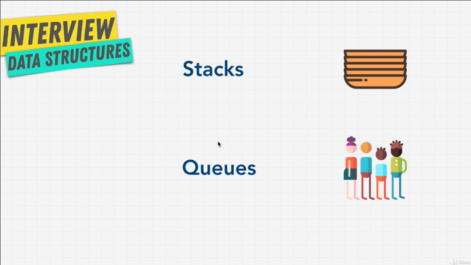
</br>

We're going to learn two data structures at the same time, stack and queues;
because they're very similar. They are both what we call **linear data
structures**. Linear data structures allow us to traverse, that is go through
data elements sequentially one by one, in which only one data element can be
directly reached. This become more clear to you as we talk more about stacks and
queues the next couple lecture.

The reason that these are very similar is that they can be **implemented in
similar ways**; and the **main different** is only how **items get removed**
from this data structure.

Unlike an array, in stacks and queues, there's **no random access operations**.
You mainly use stacks and queues to run command like **push**, **peak**,
**pop**. All of which deal exclusively with the element at the beginning or the
end of the data structure.

Now, after I said that, was you first thought? Does it kind of sound limiting,
that with stacks and queues we usually can access the first or the last element
in the data structure. Why would we ever want to use something like this?. This
is an important topic in Computer Science. You will see that we can build things
like stacks and queues which are using arrays or linked lists, except unlike
arrays and linked lists we have less methods or less actions that we can perform
on stacks and queues.

Sometimes it's good to have these higher level data structures that built on top
of lower like linked list and arrays to limit the operations you can do on them.
That's actually a benefit.

In Computer Science having this limited ability on a data structure is an
advantage, because you can control, that whoever uses this data structure,
performs only the right operations that are efficient. If you give somebody all
the tools in the world, it's a lot harder for them to operate, than  if you just
give them two or three, so that they know exactly what they need to do.

Let's talk about stacks and queues throughout the next couple lectures to really
understand how they work, and then finally code our own.

**[⬆ back to top](#table-of-contents)**
</br>
</br>

## What is Stacks

</br>

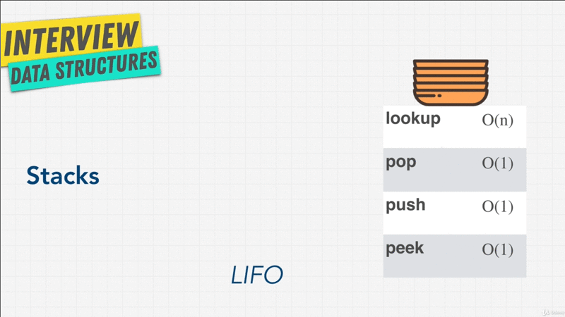
</br>

Let's talk about stacks. Stacks is a type of data structure that you can think
of hem as plate's; that is, we have one piece of data and then another piece of
data comes along and get stacked on top of that piece of data, it's keep
goings. You can think of it as these plates stacked on top each other vertically
and you can only touch the top plate.

You can't really access anything from the bottom, the way you can access data
from a stack is, to grab the first plate from the top, and second plate, and
keep goings until you've gone through all the stack.

This is called _LIFO_, or _Last In First Out_, because the last item that comes
in is the first one that comes out. You're thinking to yourself why is this
useful? When will we actually use something like a stack? They're actually
useful in quite a surprising number of ways. They're very good obviously when
you **need to know the very last value was seen or added**; and stacks are very
important in language specific engines. You might heard something like Stack
Overflow, a website that a lot of engineers visit.

Now most of programming languages are modeled with the stack architecture in
mind; and when functions get called in a programming language, usually they
follow this model, of last in first out. A function within a function within
a function gets called; and then we start popping those functions until we get
to the very beginning. Don't worry this is going to be a little bit more clear
when we actually code our own stack.

Another useful way that we might use stacks is such as browser history,where you
go back and forth from one website to another, and then you hit the back button
or the front button that's using stacks; or maybe you're writing a piece of
text and you want to undo something so you can click the undo option to go back
or forward to redo, ever wonder how that works?

Well, the idea comes from stacks, that is you store the previous state over your
work, and the memory in such order that the last one appears first. This is
something we can do with stacks.

As you can see, stacks that usually come with **three types of methods**.
There's a few others but these are the main ones, **pop**, **push**, and
**peak**; **pop** is remove the last item, that is remove the plate; **push** is
how to plate; and **peak** is simply view the top most  plate. I've added
**lookup** in here just to show you that it's Big-O `O(n)`, because you usually
don't want to traverse through entire stack; but just so you now if we wanted
to do that, it's going o be a heavy operations.

Let's talk queues in next lectures.

**[⬆ back to top](#table-of-contents)**
</br>
</br>

## What is Queues

</br>

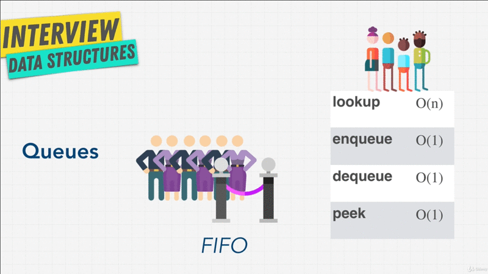
</br>

The best way to think about queues is like an entrance to a rollercoaster. The
first person that arrives in line gets to go first on the rollercoaster, and
ten the second person, the third, the fourth, the fifth, and the six finally
gets to go.

It's the opposite of stacks, in that we access _First In First Out_. The
first item in the queue gets access first that is first out, we call that FIFO;
and queues are used again a lot in programming problems and interview questions.
For example, if you had any sort of wait list app to perhaps buy tickets for
a concert that uses queues. What about the restaurant app, where you check into
the restaurant to see if you can get a table, that uses queues. What about Uber
our Lift when you want to grab a ride, well the person that requested the ride
first, will get priority and then you'll get second. Finally the most common
example of queues is a printer, if you had a printer at home, and you have three
people on three different computers at you home, let's say your family members
and you press print and each person prints different items, the person that
click prints first should have their first print out, same with the second
person that goes next, and the third person.

Now on the right above diagram, I have a couple of words that are different then
_push_ and _pop_, and I'm using a bit of standard here. You can use _push_ for
**enqueue**, which means add  to the queue, that is add a person in line which
is `O(n)`; and **dequeue** which you can think of as _pop_, which is remove
person from line.  However _dequeue_ unlike _pop_ doesn't take the last person
in line, it takes the first person.

So that stacks and queues differs; and we have these names to make sure that we
understand the differences, but we have **peak** which once again tells us
what's the first item that's going to come up, that is the first person in the
list versus a queue that is the last played, which was the last in first out.

Once again **lookup** in queue usually don't do, because you're only interested
in _enqueuing_ and _dequeueing_.  You can see here, our Big-O notation is quite
fast.

We actually going to demonstrate this in code, but I want you to try and answer
this question, why would you not to use an array to build a queue? Well, the
answer is that it's very inefficient, because we're removing the first item from
the list. If you remember arrays, if you unshift something you remove the first
item, you're going to shift shift all those indexes.

So create ting a queue from arrays, although you can do it, it is really really
bad. That something we'll talk a little bit more about when we actually code.

OK, that enough for queue, let's go to our first exercise.

**[⬆ back to top](#table-of-contents)**
</br>
</br>

## Exercise Stacks Vs Queues

Let's do a quick exercise before we actually create our own stacks and queues,
because JavaScript doesn't have its own stacks or queues data structure.

```javascript
// Stacks

// google
// udemy
// youtube
```

I mentioned that there's two ways that we can build stacks and queues, If we
talk about stacks we can think of it as our browser history, let's say we visit
`[1]` Google first then `[2]` Udemy and then `[3]` we visit youtube. In
a stack because Google was the first item, it would actually be placed on the
stack like,

```javascript
// Stack placed

twitter
youtube
udemy
google
```

Then we go to udemy, so we'd be placed on the stack, on top, and then we go
to youtube. Now if we want to go to a new website let's say we go to `[4]`
twitter, but then we decide I want I want to go back,

```javascript
// Stack placed

youtube
udemy
google
```

Well we remove twitter with press back button on our browser, and we get
youtube, and if we press back again,

```javascript
// Stack placed

udemy
google
```

We get to udemy and then back again,

```javascript
// Stack placed

google
```

We go back to Google. So stacks has a **top** and a **bottom**, and we can build
it either with **arrays** or **linked lists**. My question to you is, why would
we want to build stacks with arrays? That is will create a class of stacks that
has the data being held in arrays versus using linked lists and vice versa.
Think about that.

```javascript
// Queues

Matt -- Joy -- Samir -- Pavol
```

What about queues? Let's say we have a queues, I'm creating a waitlist app, and
here we have a couple of people that want to on the waitlist. First person that
shows up is `Mat`, and then all the sudden `Joy` comes in lines up, and then
perhaps we have `Samir` that comes and waits in line, and then we have `Pavol`.

In this case, we want `Matt` to be first then `Joy`, and `Sumir`, then `Pavel`,
and with queues we can once again use **arrays** and **linked list** to
implement it. Which one do you think will be better for queues?  Is there one
better or they both equal? I want you think about this.

In next lecture, I'm going to answer this for you, but I recommend taking time
to think about what you know about arrays and linked list, and how they might
benefit or might not benefit stacks and queues.

### Stack pros and cons

I said that with stacks they can be implemented using **arrays** or **linked
lists**, in this case both arrays and linked lists are going to work fairly
well. In the end it depends what you prefer, and what your priorities are. By
this points you should understand the pros and cons of arrays, and pros and cons
of linked lists.

So, we don't need to go into much detail, since we've talked about it before;
But one major thing is that **arrays allow something called _cache locality_**,
which makes them technically faster when accessing its items in memory, because
they're right next to each other versus a linked list that has scattered all
over memory, and also **linked list have _extra memory associated_ with them**,
because we have to hold them on to those pointers, in other hand, they have more
dynamic memory. We can keep adding to the list versus an array where you have
either a static array or dynamic array that has certain amount of memory, and as
soon as it's about to reach its limit, it's going to have to double up their
memory and create new space for it, somewhere in memory.

So, you have to think about what sort of operations you're going to do, and why
your priorities are to decide which one you want; but they could both work.
We're going to build stack data structure with both of these coming up.

### Queues pros and cons

Queues in other hand is a very simpler answer. You **never want to build it with
an _array_**, or if you do, while that's not necessarily a good idea, and
ideally you want to implement them with linked lists; Why is that? Well, if you
remember, arrays have indexes associated with them,

```javascript
0.      1.     2.       3.
Matt -- Joy -- Samir -- Pavel
```

If we have `[Matt] | 0`, `[Joy] | 1`, `[Samir] | 2`, `[Pavel] | 3` that are in
queue, if this was in an array data structure, and `Matt` was the first in line,
we need to remove `Matt` from from the queue; well, once we remove `Matt` we now
need to shift the indexes over,

```javascript
0.     1.       2.       3.
Joy -- Samir -- Pavel
```

So, we have to go one by one, and say, all right, `Joy` is now in index of `0`,
`Samir` is now in index of `1`, and `Pavel` is now in index of `2`, and there's
nothing in index of `3`. We just shifted those arrays, it's `O(n)` operation or
linear time versus something like linked list where all we have is a pointer.

```javascript
Head                    Tail
Matt -- Joy -- Samir -- Pavel
```

We have a pointer to the `Head`, and then perhaps we have a pointer to the
`Tail`.

```javascript
   Head            Tail
-- Joy -- Samir -- Pavel
```

All we need to do is say, `Head` is `Matt`, we want to remove `Matt`, and `Joy`
is going to be the `Head`, and nothing else changes, and that's an `O(1)`
operation or constant time.

I hope you are able to get the answer, otherwise at least now you know; and this
is a very common interview question that you might get asked that hopefully you
have an answer to now. Enough talking I think it's time to build these data
structures from the ground up.

**[⬆ back to top](#table-of-contents)**
</br>
</br>

## How JavaScript Works

How does JavaScript actually work? Imagine getting this question during an
interview, or how about this, **explain the difference between asynchronous and
synchronous in JavaScript?** or maybe they ask you to explain this statement.
**JavaScript is a single thread language that can be non-blocking?**

In this optional lectures we're going to help you to answer those question.
Maybe you need to visit a few times as you progress to really get it. So, don't
fell discourage if you don't fell 100% confident.

Now we don't need to know how JavaScript works internally to write a program;
but it is important to learn. I see a loot of people who have been developers
for years and not know this (how JavaScript works); it's like being a pilot and
not knowing an airplane can fly. OK that's a little bit dramatic there; But you
get my point.

</br>

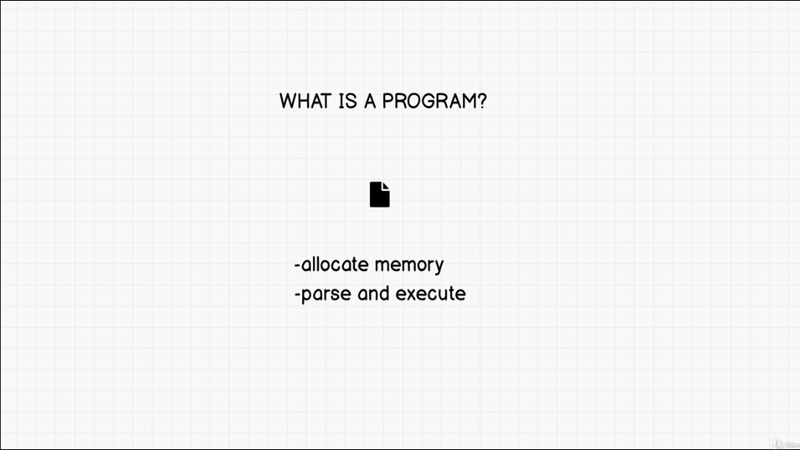
</br>

First, what is a program? Well, a program has to do some simple things. `[1]` it
has to **allocate memory**, otherwise we would be able to have variables or even
have a file on our computer. `[2]` It also **have to parse and execute
scripts**, which means read and run commands.

</br>

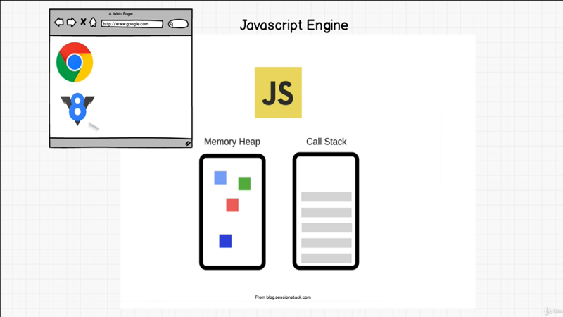
</br>

Now, we also know that form our previous discussion, there's the JavaScript
engine, that each browser implements, in chrome it's the `V8`; and the `V8`
engine reads the JavaScript that we write in changes into machine executable
instruction for the browser. Now the engine consists of two parts, `[1]`
a **Memory Heap** and `[2]` a **Call Stack**.

The _Memory heap_, this is where the _memory allocation_ happens; and the _Call
Stack_  this is where your code is _read and execute it_; it tells you where you
are in the programs.

Let's simplify this and show you what I mean.

### Memory Leak

```javascript
// Memory Heap
const a = 1:
const b = 10:
const c = 100:
```

For us to allocate the memory in the Memory Heap; well it's a simple as dong
`const a = 1`, we've just allocate a memory; now when we assign this, the
JavaScript engine is going to remember that, "oh ya, `a` has value of `1`".
We've just use up the Memory Head, and I can keep going on and on, keep copying,
pasting, and changing these variables to `const b = 1`, `const c = 1`.  I can
change value `cons c = 100`, may be `const b = 10`.

Now, what's an issue that we see with this? There's something called **Memory
Leak**, that you're going to hear as you become a developer; and what we've done
here is, we've created all these variables, these global variables that are in
the in the Memory Heap, but you see this Memory Heap box (chapter-7.3.png), and
with all the memory we have a limited amount that we can actually have. So, by
increasing the number of variables that we have, imagine if I had just this page
full of variables, and instead of just numbers, they're like very very big
arrays.

Well, **Memory Leak happen when you have _unused memory_**, such as let's say
we're now not using a variable `a`, but It's going it's still there. Well, by
having unused memory, just laying around it fills up this Memory Heap. That's
why you hear that **global variables are bad**. Global variables are bad,
because if we don't forget to clean up after ourselves, we fill up this Memory
Heap; and eventually the browser will not be able to work.

### Call Stack Example

Alright, that's memory. Let's talk about the Call Stack, what is that? Well,
with a Call Stack, we can have something like this,

```javascript
// Call Stack
console.log("1");
console.log("2");
console.log("3");
```

We have three console logs that stack with each others, if I run this code in
the browser terminal,

</br>

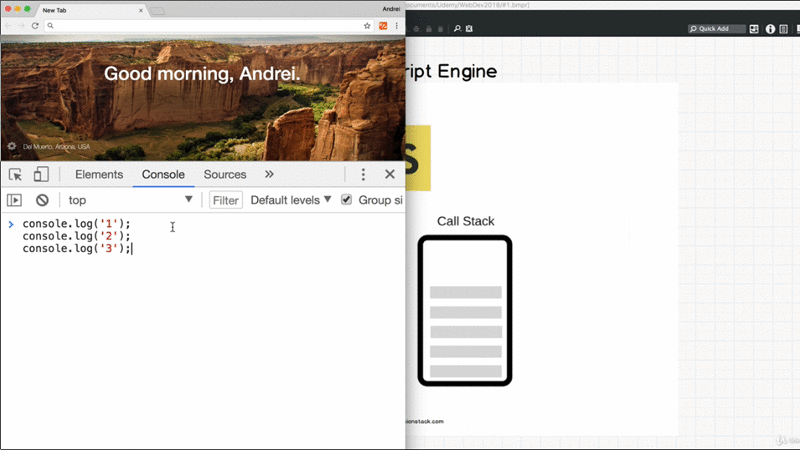
</br>

Well, I get `1`, `2`, `3`. So, the Call Stack if you remember that's what it
**reads and execute our scripts**.

</br>

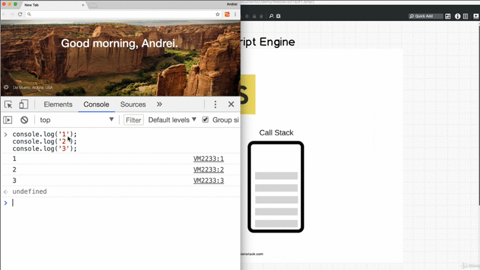
</br>

So, What the Call Stack does, it reads the first line console log, it get puts
in the Call Stack. So the JavaScript engines says, console log has been added,
let's pop it onto this Call Stack; and then it runs it, and create `1`, then it
says, OK, I'm removing the first console log as I just finished running it,

I'm going to place the _second console log_ into my Call Stack, adds it on, and
says, Yap, execute `2`; and then it removes that, ti pops it, and then get the
third console log, and logs console log three with result `3`, and finally
removes it.

Let's have a bit more of a complex example here, to demonstrate this points.
Imagine I have something like this,

```javascript
const one = () => {

    const two = () => {

        console.log("4");
    };

    two();
};

// Result:
// 4
```

I have a function called with ES6 features `const one = () => {}`, and inside
this function I have another function `const two = () => {}`, and for now it's
not really going to do much, is going to console log `"4"`. and inside function
`one()` we just run `two()`, I get back result `4`.

So, what happens here according to a Call Stack?

```javascript
one()
// CALL STACK
```

If we have the Call Stack here, we first ran the `one()` function; So, on top of
Call Stack the `one*()` function gets run.

```javascript
two()
one()
// CALL STACK
```

As, we enter into this Call Stack, we see that we run another function `two()`,
so `two()` goes on top of the Call Stack;

```javascript
console.log("4")
two()
one()
// CALL STACK
```

Now we run the `two()` function, which is console logging `4`, that run inside
`two()` function.

```javascript
two()
one()
// CALL STACK
```

So, now we _read_ this, the Call Stack is going to say, OK there's nothing else
inside of this. I'm going to run `console.log("4")`, So it's going to print out
number `4` on terminal. It's going to remove that from the Call Stack.

```javascript
one()
// CALL STACK
```

Then remove the `two()`.

```javascript

// CALL STACK
```

Then remove the `one()`, because it's just been called; and the Call Stack is
now empty.

### Single Thread & Multi Thread

Let's revisit the statement from the beginning of this lecture,

</br>

> **JavaScript is a Single Threaded language that can be Non-Blocking**.
</br>

Single Thread means **that it has only one Call Stack**, and one Call Stack
only. You can only do one thing at a time. As you saw Call Stack is First In
Last Out. So what ever at the top of Call Stack, gets run first then below that
until the Call Stack is empty.

Other languages can have multiple Call Stacks, and these are called **multi
thread**. You can also see how that might be beneficial to have multiple Call
Stack; so, we don't keep waiting around for stuff.

**Why JavaScript design to be single threaded**? Well, running code on a single
thread can e quite easy and simple, since you don't have to deal with
complicated scenarios that arise in multi-thread environment, you just have one
thing to worry about; and when I say issues with multi-threaded environment, can
have such thing as **Deadlocks** now.

```javascript
// Call Stack
console.log("1")    // Line-1
console.log("2")    // Line-2
console.log("3")    // Line-3
```

Guess what,**_you just learn what synchronous programming means_**. Synchronous
programming simply means, `Line-1` get execute it, `Line-2` get executed, and
then `Line-3` get executed. The latter (last one) can't start before the first
finished. So this `console.log("2")` doesn't start until `console.log("1")`
finished, and `console.log("3")` doesn't start until these about to finish,
because, well we've looked at the Call Stack.

### Stack Overflow

</br>

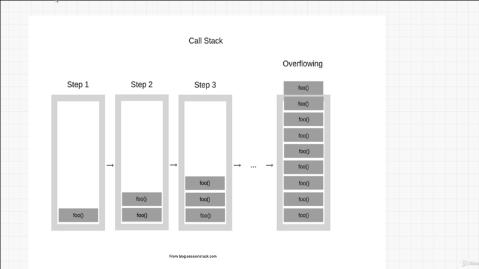
</br>

Now, you may have head the site stackoverflow. Have you wonder Stack Overflow
means?, Stack Overflow is when a stack is overflowing. Kind of like we talked
about memory leaks, and how the _memory heap_ of a JavaScript engine can
overflow. Well with Stack Overflow this happens, when the Call Stack just gets
bigger and bigger until it just doesn't ave enough space anymore, how can we do
that? Can we recreate a Stack Overflow?

```javascript
// Recursion
function foo() {
    foo();
}

foo();

// Result
```

All you have to do is create a function `foo()` and this function will just have
`foo()`. What is happening here? This something called **Recursion**; and
**_recursion means a function that calls itself_**. If we look at above
function does, we run `foo()` and `foo()` get executed, what `foo()` does? Well
we run `foo()` again.

So, it's just keep looping over and over, there is no end in sight. We keep
adding `foo()` to the Call Stack, we keep adding it until the Stack it doesn't
fit or doesn't have anymore space.

So, hopefully this now make sense, the JavaScript engine which is `V8` engine at
Chrome has a Memory Heap and a Call Stack.

Now, JavaScript is Single Threaded, only one statement is executed at a time,
but there is a problem now isn't it? What if `Line-2` was a big big task we need
to do, maybe loop through an array that had millions of items, what would
happens there? Well, we would have this `Line-1` get execute, then the `Line-2`
has a massive job well just work there, and `line-3` will take a really long
time to get log; and in our small example that doesn't man much, but if we have
this on a website, well the user wouldn't be able to do anything. The website
would pretty much freeze until that task is done, and that user just waits
there, that's not very good is it?.

With synchronous task, if we have one function that takes up a lot of time it's
going to hold up the line (Stack). So sound like we need something
**non-blocking**, Remember our first statement,

> JavaScript is a Single Threaded language that can be non-blocking

Ideally we don't wait around for things that take time, how we solve this
problem in JavaScript world? Well asynchronous to the rescue. Think of
asynchronous is like a **_behavior_**; synchronous execution is great, because
it is predictable. We know what happens first then what happen next; but it can
get slow. So when we have to do things like image processing, or making request
over the network like API calls; we need something more that just synchronous
task right?.

So, you thinking to yourself, how we do asynchronous programming?, we can do
asynchronous programming by doing something like this,

```javascript
// Call Stack
console.log("1");
setTimeout(() => { console.log("2"); }, 2000 );
console.log("3");
```

We use `setTimeout()` it's allows us to create a time out; and we can just give
it a first parameter is the function that we want to run, and then the second
parameter is how many seconds we want to wait?, Let's run on the console to see
what happens.

</br>

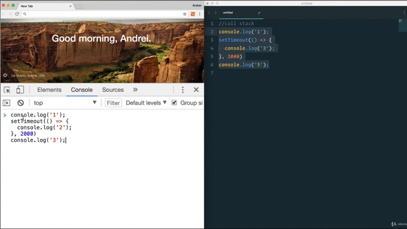
</br>

We have `console.log("1")` and get result `1`, then `console.log("3")` with
result `3`, and then we get `console.log("2")` two second later. It's looks like
we just skipped this whole steps, and then put this `setTimeout()` at the very
end of the Stack.

Well, you just witness asynchronous programming, in order to understand, and
what just happens, well, I need to take you the next part.

### JavaScript Run-Time Environment

</br>

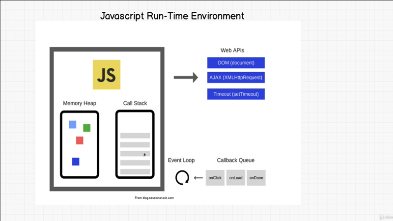
</br>

Above diagram is show us JavaScript engine with heap and call stack to run. We
need more that just the JavaScript engine, we need what we call a **JavaScript
Run-Time Environment**,

JavaScript Run-Time Environment is again part of the browser, it's include in
the browser; they have extra things, on top the engine they have something
called the **Web APIs**, **CallBack Queue**, and **event Loop**.

As you can see, `Timeout (setTimeout)` is part of the web API, it's not
technically part of JavaScript is it? It's what the browser give us to use. So
we can do asynchronous program.

Looking at this diagram, let see if we can figure out what our code was doing.

```javascript
console.log("1");                       // [1]
setTimeout(() => console.log("2"));     // [2]
console.log("3");                       // [3]

// Call Stack

// WEB API

// CALLBACK QUEUE

// EVENT LOOP
```

We can create here our own **_Call Stack_**, we'll have a **_Web API_**, and then we'll have
a **_CallBack Queue_**, and then **_Event Loop_**. Just like we have in our
JavaScript Run-Time Environment.


So, what's happening here,

```javascript

console.log("1");                       // [1]
// Call Stack

// WEB API

// CALLBACK QUEUE

// EVENT LOOP
```

Well, first we have a `[1]` console log that goes into the Call Stack, and that
gets run; so, we log console logging to the browser.

```javascript

setTimeout(() => console.log("2"));     // [2]
// Call Stack

// WEB API

// CALLBACK QUEUE

// EVENT LOOP
```

Then we get `setTimeout()` into our Call Stack, because we finished this first
stack `[1]`, we're going to the second one. What `setTimeout()` going to happen
is, well in the Call Stack is going to say, OK I have `setTimeout()`, and
because `setTimeout()` is not part of JavaScript, but part of the Web API, it
has a special characteristic, what's going to happen is, i triggers the Web API,

```javascript

// Call Stack

setTimeout(), 2000                      // [2]
// WEB API

// CALLBACK QUEUE

// EVENT LOOP
```

Says, hey `setTimeout()` has just been called, and because we notified Web API,
we can Pop out of the call stack. Now the Web API starts a timer of two seconds,
it's going to know that in two second you have to do something.

```javascript

console.log("3");                       // [3]
// Call Stack

setTimeout(), 2000                      // [2]
// WEB API

// CALLBACK QUEUE

// EVENT LOOP
```

Because the call stack is empty, the JavaScript engine now goes to
`console.log("3")`, and execute this.

```javascript

// Call Stack

setTimeout(), 2000                      // [2]
// WEB API

// CALLBACK QUEUE

// EVENT LOOP
```

So, that makes sense right, now we've done `1` and `3` in the terminal browser,
but we still have `setTimeout()` two seconds in the Web API. Now After two
seconds, when your time limit is up, the Web API is going to say, Okay
`setTimeout()` should be run, let's see what's inside of it. We'll we have
a `console.log("2")`.


```javascript

// Call Stack

setTimeout(),                           // [2]
// WEB API

// CALLBACK QUEUE

// EVENT LOOP
```

So, what's going o happen is, it's going to say, hey `setTimeout()` is done.

```javascript

// Call Stack

// WEB API

callback()
// CALLBACK QUEUE

// EVENT LOOP
```

We have a `callback()`, and this `callback()` of `settimeout()` we added to the
CallBack Queue, to saying that, hey we have to run something, we're ready to run
it.

Now, the last part, the Event Loop checks and says, hey, is the Call Stack is
empty?, and it keeps checking all the time. If the Call Stack is empty and
there's nothing running right now in the JavaScript engine, it's going to say,
hey do we have any CallBack? It's going to check the CallBack Queue and say, is
anything in there? Because the Call Stack is empty, we can throw something in
there, and make it do some work. In our case we say, oh yeah I do. Let me put
this (`callback()`) into the Call Stack.

```javascript

callback()
// Call Stack

// WEB API

// CALLBACK QUEUE

// EVENT LOOP
```

So, bow we move the code back into the Call Stack, and then the `callback()` we
run it, and by running it, we see that we have a `console.log("2")`.

```javascript

console.log("2")
callback()
// Call Stack

// WEB API

// CALLBACK QUEUE

// EVENT LOOP
```

So, it's going to say `console.log("2")`, it's going to run, once it's done it's
going to pop it out of the Call Stack.

```javascript

callback()
// Call Stack

// WEB API

// CALLBACK QUEUE

// EVENT LOOP
```

Again, we're done with the `callback()`, so we remove it.


```javascript

// Call Stack

// WEB API

// CALLBACK QUEUE

// EVENT LOOP
```

There you go, we're done. Everything is empty, and we've just run, and get this
result on web browser `1, 3` it's going to go through the entire Web API,
CallBack Queue, Event Loop and then it's going to run the `console.log("2")` to
get the final result, and finish the running program.

That was a lot of information. So you might need to watch, or read this for few
times, but hopefully that makes sense to you, of why we noticed this behavior.

I want to challenge your understanding here, knowing what you know, and what
I just tell you, what happen if I changes to zero (`setTimeout(), 0`), that
means zero second, what will happen?

</br>

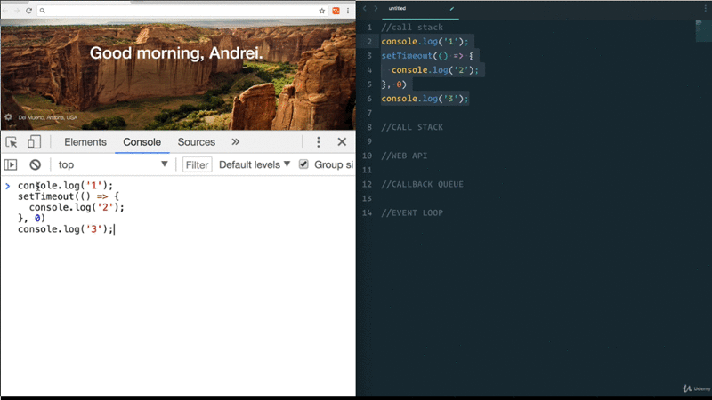
</br>

We get the result `1, 3, 2`. Now think about why that happened. Even though this
`setTimeout()` is still went through the process. It still got entered into Web
API, and then the CallBack Queue, and then the Event Loop, and by the time that
was happening, the Call Stack had already moved on to the `console.log("3")`;
and only after `console.log("3")` was done and the Call Stack was empty, the
Event Loop said, oh yeah we can call `console.log("2")`.

Hopefully that make sense to you. If you able to understand that, you'll
actually have a lot of people that hire for JavaScript roles, ask question like
this on an interview, and you have to explain why that is. So, i hope that made
sense to you, and you can use that to your advantage at the next interview.

### Recap

If you wanted to load your latest tweets onto a web page, and you do this
synchronously then visitors to your site won't be able to do anything until
those tweets are loaded, this could cause a log delay before they even get to
see the content of your site. They may not be able to click anywhere and the
page will fell like it's frozen, not a very good user experience.

Another way to think about this, is **_calling_** your teacher with a question.
**Synchronous** way is you called the teacher on the phone until the teacher
answers the phone, and ask him the question, and hopefully get an answer. So,
you let the phone ring until he picks up, but you're not doing anything else in
the _meantime_.

**Asynchronous** means, that you send a **_text_** to a teacher with a question,
then when the teacher or she has the time or will respond to you, and call you
with the answer, so you can do other stuff in between. JavaScript is
asynchronous when you can leave it a message; and a CallBack tells you, Hey Mr.
Teacher has a message for you when you're not too busy.

That's why we call it a CallBack function, and a Callback Queue, we're calling
back to let them know that, hey there's some stuff waiting for you.

Now, we see over on the Web API, we have **DOM**, **AJAX**, **Timeout**, and
there's a few other things; But we also in the CallBack Queue, you have
`onClick`, `Onload`, `onDone`. Do you remember the **_event listeners_**,

```javascript
element.addEventlistener("click", () => console.log("was clicked"))
```

Well, with an event listeners we had something like above code, we have an
`element`, we added the `addEventlistener()`, in this inside bracket we can say
`"click"`, and a function that perhaps just console logging a `"was clicked"`.

Well, similar to an asynchronous way of programming, We've created this click
function, and now we're just listening to it; and every time a click happens on
the web page, so on the DOM, we run the callback function which
`console.log("was clicked")`.

So, to finish things up, when is asynchronous happening, i happens a lot, when
you try and talk between machines, like speaking to a database, making network
request, image processing, reading flies, etc..

But, to recap what we just learned, **JavaScript is a single threaded language
that can be non-blocking**, it has one Call Stack, and it does one thing at
a time. In order to block the single threaded it can be asynchronous with
a callback functions, and these callback functions gets run in the background,
through the CallBack Queue, and then the Event Loop, to bring back to the Call
Stack.

So, next time you get asked, what is the difference between asynchronous or
synchronous program, or how JavaScript work, you should have a little bit more
confidence to answer that question, and I hope that this was helpful.

**[⬆ back to top](#table-of-contents)**
</br>
</br>

## Exercise Stack Implementations

It's time to code our Stack, and I have a little exercise for you here.

```javascript
class Node {
  constructor(value){
    this.value = value;
    this.next = null;
  }
}

class Stack {
  constructor(){
    this.top = null;
    this.bottom = null;
    this.length = 0;
  }
  peek() {
  }
  push(value){
  }
  pop(){
  }
  //isEmpty
}

const myStack = new Stack();


// Discord
// Udemy
// google
```

I have create the template of what we want our stack data structure to look
like. We also have a class of `Node`, if you decide to use that and you should
be familiar with it from our linked list exercise, or you can just ignore it and
create a new node yourself in here.

This `class Stack`, is going to have in its constructor constructor three
properties. We have `this.top` which is remember the _top plate_, we have the
`this.bottom` which is the _bottom plate_, and then `this.length` with value
`0`, and both `top` and `bottom` are current `null`.

Now, we're going to be using linked list to fill these values; But we don't need
to use the linked list class that we've used before, instead you can just use
the `Node` class to simply assign values, and make sure that the `.next` point
to different node as we add things.

Now your task is to create three methods that work for this data structure,
`peek()` which let us _see the very top element_ or _top node_; the `push()`
method which lets us _add a node to the top the stack_, and `pop()` method lets us
_remove from the top of the stack_; and if you want optionally you can use also
do an `isEmpty()` method, which is common with the stack to check to check that
our stack is empty.

We'll start off with a `myStack` that gets instantiated. Your code works, if you
can do something like this,

```javascript
```

Where you say `myStack.push(google)` , then `.push(Udemy)`, then
`.push(Discord)` just like browser history; and then you can do `.pop(Discord)`,
and `.pop(Udemy)`, and `.pop(google)`.

Good luck, and I see you in the solution. Try your best first before you going
to the solution for comparing your solution to the lecture solution.


**[⬆ back to top](#table-of-contents)**
</br>
</br>
