# Chapter-8 Data Structure Tree


## Table of Contents

1. [Tree Introduction](#tree-introduction)
2. [Binary Trees](#binary-trees)
3. [Big-O log of N](#big-o-log-of-n)
4. [Binary Search Tree](#binary-search-tree)
5. [Balanced vs Unbalanced BST](#balanced-vs-unbalanced-bst)
6. [BST Pros and Cons](#bst-pros-and-cons)
7. [Exercise Binary Search Tree](#exercise-binary-search-tree)
8. [Solution Insert Method](#solution-insert-method)
9. [Solution Lookup Method](#solution-lookup-method)
10. [Solution Remove Method](#solution-remove-method)
11. [AVL Trees](#avl-trees)
12. [Binary Heaps](#binary-heaps)
13. [Quick Note on Heaps](#quick-note-on-heaps)
14. [Priority Queues](#priority-queues)

</br>

## Tree Introduction

Welcome back, it's time to learn another data structure. This is a big one, and
exciting one at that, because it's going to introduce a low more new topics,
especially when we get into our algorithms as well, they're called Trees,

</br>

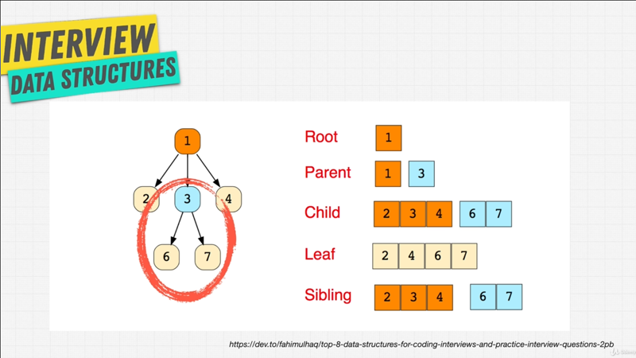
</br>

Trees are data structure that have what we call a **hierarchical structure**, as
opposed to something like linked list or arrays which are **linear**. Trees can
**have zero or more child nodes**.

You see, a Tree usually start with a _single_ **Root**  node, or a **Parent**
node, and every child of the Tree descends from this Root node, so it's kind
like an inversed Tree like above; and every **Child** of a node descends from only
one Parent.

So you have a Parent child relationship that you see is, you need directional,
that is it's going one way; and you also have **Leaf** nodes which are the very
end of a three data structure.

Finally, within a tree you can have things like **Subtrees**, such as the area
over here circled in red `3, 6, 7` from a Subtree.

Tree data structure are very important, because you work with them every day.
If we go t twitter.com or any website, for that matter and we open the developer
tools, if I go to the Elements tab, you see our web pages are created by
something called **DOM** (document object model), and this is a Tree data
structure. It's doesn't look like a tree that I just showed you, but the browser
is just making it look nice, but underneath it, we have `<head>` and `<body>`
that are children of the `<html>` tag; inside the  `<body>` we have all these
children, and inside these children we have more children and more children, and
they're all connected hierarchical to one another.

I'm sure everybody has tried to play chess online versus a computer; well,
a computer in a chess game at least back in the day before we had things like
machine learning, used a Tree data structure to make a decision. Should I make
this move?; or should I make that move?; and it would pick moves based on which
move had the better outcome. Facebook comment for example are a Tree data
structure, where I can comment on a friends photo, and their friend can comment
on my comment.

Family Trees can be represented in a Tree data structure; and for us engineers
and programmers, you might have heard of the [abstract syntax
Tree](https://en.wikipedia.org/wiki/Abstract_syntax_tree), if I google abstract
syntax tree in an image tab, this is how program are and code is usually being
run. Usually we write code and then it gets broken down by the machine into this
abstract syntax tree, so that it understands what we wrote down.

The beauty of Trees is, that we **use the same principle as we did in linked
list**, that is we have Nodes, and these Nodes can contains any type of
information that we want, we can have user information, we can just have numbers
like we have in picture above, anything we want we can contain within a node.

</br>

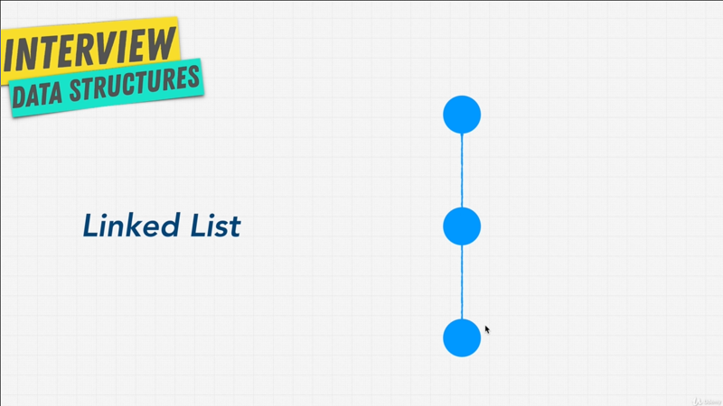
</br>

Now you might be thinking, this kind reminds me of a linked list and you'd be
right, linked list is technically a type of Tree, but with just one single path
and it's linear, there's only one way to go from top to bottom, versus what
we've seen before in a normal tree like (pic: chapter-8-1.png).

Now the thing to keep in mind here, there might be different than linked list
is, that a node can only point to a child as you can see all the arrow point
down. There's always one entry point, which is the Root, but nodes don't really
have to reference their parent.

Now, just like in real life, there are many types of Three data structures that
we can have. If you go to Wikipedia and you look for all the [Tree data
structures](https://en.wikipedia.org/wiki/Tree_data_structure), it's going to
well intimidate you, that's for sure, because look how many different types of
Trees we have.

Just like in real life how we have all these different types of Trees, there's
different types of Trees that we can have for a specific use case, but don't get
overwhelmed. In this course we're going to go over the main ones that get used,
I would say 90% of the time, and the ones that you're most likely going to
encounter during an interview, because at the end of the day, once you
understand what a Tree data structures like, how to create it, how to perhaps
use some actions on it, then all the other Trees that you saw are just minor
alterations to what we know.

I want to warn you back in the day, when I took a class on data structures,
these parts especially Trees, really really dragged on, and made me not
interested in data structures, because there's so many things you can talk about
when it comes to Trees. I'm going to try and keep engaged to the best of my
ability and try be an efficient, through this section; and show you the
important to know for an interview and to lay the foundation, not to teach you
every single Tree that is which is not going to benefit. With that in mind I'll
see you in next lecture.

**[⬆ back to top](#table-of-contents)**
</br>
</br>

## Binary Trees

We're now into the Tree data structure section, if we go to our [mind
map](https://coggle.it/diagram/W5E5tqYlrXvFJPsq/t/master-the-interview-click-here-for-course-link).
As we can see, Trees or linked lists are a type of a Tree that we've already
talked about, but there's a few others that we  haven't yet to talk about, we're
going to cover that and get familiar with the main different types by starting
off with Binary Tree, let's get in to it.

</br>

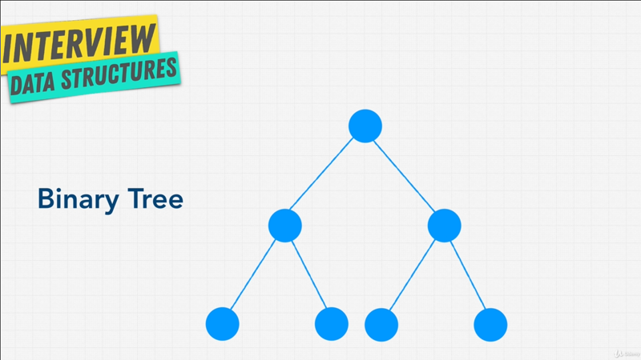
</br>

A Binary Tree is something you've likely seen before, and it's a type a Tree
with a few rules that are applied to it; But they're quite straight forward,
each node can only have either `0`, `1` or `2` nodes, and each child can only
have one parent. Above diagram is a Binary Tree.

</br>

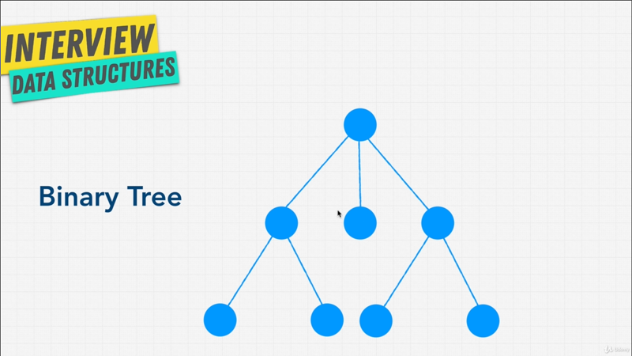
</br>

Above diagram is not a Binary Tree, because it has three children, or at least
one of the nodes have three children.

If we go to look up at Binary Tree diagram, **each node represents a certain
state**, and this is very similar to what we've done in the past, especially
with linked list, if we take a look with an example below,

```javascript
function BinaryTreeNode(value) {
    this.value = value;
    this.left = null;
    this.right = null;
}
```

In order for me to create a Binary Tree, I can just create a function called
`BinaryTreeNode`, and this `BinaryTreeNode` perhaps will get a `value` and will
simply have `this.value` associated with it, which is the `value` that we give it
inside of the function. We have two other properties which is a pointer to the
left side of the Tree `this.left = null`, and a pointer to the right side of the
Tree `this.right = null`. That's it.

We can represent a `BinaryTreeNode` simply having a value and then a left and a
right property. Very similar to what we did, or very similar principle to what
we did with linked lists.

We're going to actually code a Tree and create a Tree data structure like we
have for past data structures; but I want to also point out a few
**_terminology_** we might come across and that are **_important_**. In this
case we're looking at something called a Tree is **completely full**, that means
there no gaps in the Tree. Let me show you what I mean,

</br>

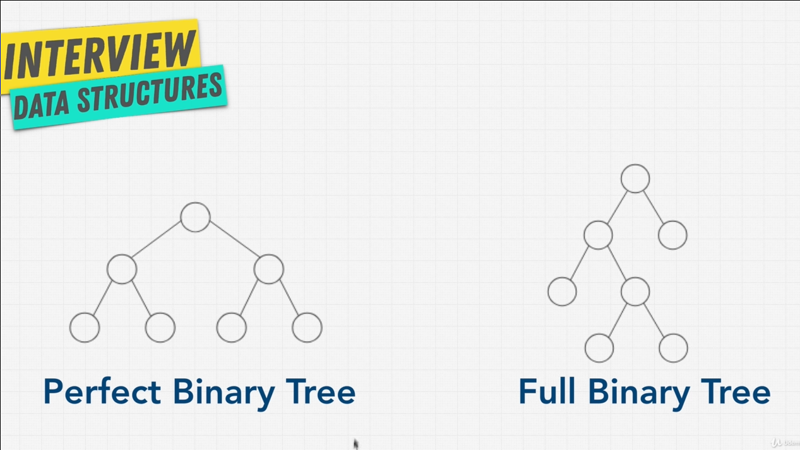
</br>

A **Perfect Binary Tree** has _everything filled in_, that means all the leaf
nodes are full, and there's no node that only has one child; a node either has
zero children or two children; also the bottom layer of the Tree is completely
filled, nothing missing.

Versus a **Full Binary Tree** which simply says that _a node has either zero or
two children but never one child_.

Why is this important?, because this (Perfect Binary Tree) is really really
efficient and something that is desirable (hoped-for); when Binary Tree are
perfect like this, they have **two really interesting properties**:

> `[1]` the number of total nodes on each level doubles as we move down the Tree

For example here, we have one node in the next level we have two; so we just
doubled the nodes. In the next level we have `4` nodes, so we doubled `2` to
`4`; if we had another level that's a perfect Binary Tree, we'd have `8` nodes,
so were doubling every time.

> `[2]` the number of nodes on the last level is equal to sum of the number of
> nodes on all the other levels  plus one `(+1)`

What I mean, if I take a bottom level that is `4` for the second property states
that all the nodes above it `+1` is going to equal the bottom level, which means
other words, that about half of our node are on the last level; and this is
brings up a really interesting point; by organizing our data in this way, we
have half of this data in the bottom level, if somehow we can avoid visiting
every node even if the node we're looking for is at the very bottom, perhaps
there is some efficiencies that we can have and you'd be right. Because of this
type of structure you're going to see a new notation of Big-O,

</br>

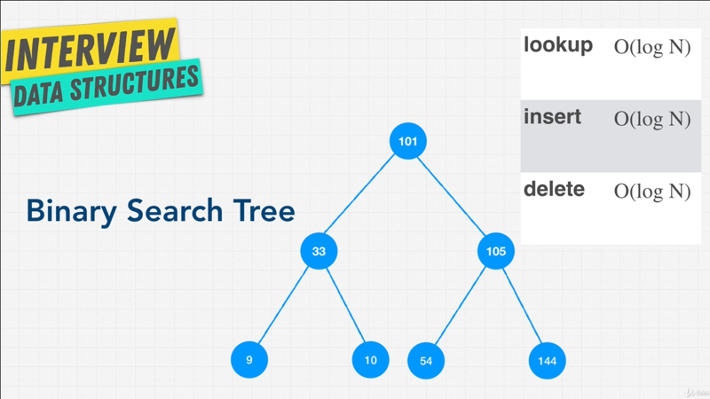
</br>

Something that we've been waiting for a long time `O(log N)`. When we start
talkie about Binary search Trees you're going to start seeing `O(log N)`
notation, but what that's mean?, in the next lecture I want to talk about
`O(log N)` and why Trees allow us to have some thing like this, and what the
implications are. I'll see you in the next one.

**[⬆ back to top](#table-of-contents)**
</br>
</br>

### Big-O log of N

In previous lectures we talked about a special characteristic or properties of
Binary Trees; and because of the way Binary Trees are structured, there is
a certain way for us to calculate the number of nodes they have;


```javascript
Level 0: 2^0 = 1
```

For example, on `Level 0` of a Binary Tree, that is the very top level, where we
only have one Root node, we can calculate how many node they are by doing two to
the _power_ of the level which is `0`. So if I do `2^0` it's going to equal `1`,
that is we have one node.


```javascript
level 1: 2^1 = 2
```

If we go our level down, and say what about `Level 1`, how many levels do we
have? Well we have `2^1` which equal `2`.

```javascript
Level 2: 2^2 = 4
```

All right keeps going, what about `Level 2`, how many nodes in total do we have
on that level? Well we have `2^2` which is equal to `4`.

```javascript
Level 3: 2^3 = 8
```

Then one last level, let's say `Level 3`, how many level three in a perfectly
balanced Binary Tree? Well two to the power of three `2^3` is going to equal
`8`.

We just do some math here, and I promise that, this course is going to be mathy,
but bear with me here. I want to explain to you what `O(log N)` means.

Knowing what we just did now, and knowing that these are the total number of
nodes; if we imagine above data was in an array, that means that we have eight
places that we need to iterate through eight nodes that we need to check,
perhaps to search for something.

```javascript
# of nodes = 2^h - 1 = 7

log of nodes = height

// # = number
// h = height
```

> `h` starts from count of 1

Well, based on this formula here, that means that we can find out the number of
nodes in a Tree by doing `2^h` or the _height_ that is the level. If we know
how many levels are Binary Tree is, we can find out how many total nodes there
are with formula `2^h - 1`. Why this `-1`? Well if we go back to our diagram
(chapter-8-3.png), this Binary Tree we have `7` total nodes and the height of
the Tree it's **3 level deep**. So `2^h - 1` is `7` nodes.

```javascript
log of nodes = 100

log 100 = 2;

10^2 = 100

log of nodes = steps

```

If we actually simplify `2^h - 1` we can just simply say `log nodes = height` or
the _steps_. I use _log_ here just think is you wondering _log_ simply mean that
`log 100` is equal to `2`; because `10` to the _power_ of `2` (`10^2`) equal
`100`.

All I did was using this `10^2` and simplified, and said that `log nodes
= height` and we've dropped `-1` here, because it's insignificant, but `log
nodes` is the number of steps or height; let's just change to _steps_ that we
would use in a Tree.

Let's me show you on a diagram.

</br>

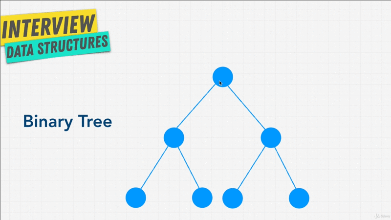
</br>

`log N` is simply means that based on the height, the maximum number of
decisions; let's say we're looking for a specific node that we're going to take
is `log N`, and that means is The Root node we are looking for? No, then we
either go Left leaf or Right leaf of node, unless we go Left leaf and say, "Is
this the node that we're looking for?" (that's our second steps), if the answer
is _no_ then either to go Left or Right, and we say is this node we are looking
for? Yes, so we have maximum `3` steps here; instead of, if we went `7` steps,
you can see that there's some sort of efficiencies here.


Coming up, we're going to learn about **binary Search Tree** where we're able to
minimize those steps, instead of visiting every single node. So, when you see
the notation of `O(log N)` don't get startled (shocked); all that saying is,
that the choice of the next element on which to perform some sort of action is
_one of several possibility_ and only one needs to be chosen; we don't have to
check both.

In a good way to think about `log N` is when you're looking through
a _phone-book_. You don't actually check every single person in a phone-book do
you? Instead you can simply do what's called **Divide and Conquer** by looking
based on where their names alphabetically begin. You would open up the book to
where you think the letter will start with the name will start with, and then
keep dividing and conquering until you get that person. You only need to
explore a _subset of each section_ before you eventually find someone's phone
number. Just think of that. `O(log N)` is just like looking through a phone
book.

The reason I just talked about `O(log N)` in such detail is, because it's an
important concepts, it's really really fast, as you can see

</br>

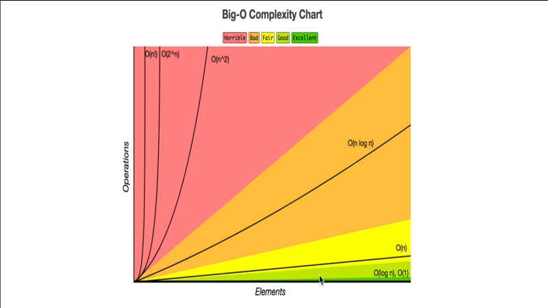
</br>

`O(log N)` is in the light green good area, that's even better than `O(n)`
linear time, because we don't need to check every single element.

In the next lecture, we're going to talk about the most common Tree that you're
going to see in a lot of places called Binary Search Tree. As the name suggests,
it allows us to search really efficiently and just by looking at above graph,
you might be able to think about how a place like Google, and Google search
might find this extremely useful. When we search through Google, they have a ton
of Websites, a ton of nodes to search through. How are they able to give us an
answer to our searches so fats? If they used `O(n)` complexity it's going to
take a lot of time, and it's going to be really expensive for them.  So instead
they use a Tree structure or Tree data structure; so that our search can be
a lot faster with something like `O(log N)`.

**[⬆ back to top](#table-of-contents)**
</br>
</br>


## Binary Search Tree

Let's continue our discussion with the most common Tree data structure. That is
the Binary Search Tree, which is a subset of Binary Tree which we talked about.
What is a Binary Search Tree?

Well, a Binary Search Tree are really really good as the name suggests at
searching, they're great for comparing things. Now, why would this better than,
let's say hash table? Where we can just give it a key and get the item right
away; well, this data structure preserves (maintain) relationship, just like you
wouldn't want your folders on your computer to be a hash table data structure,
because there is no sort of relationship, instead you want your folders to have
relationships, to have a parent folder and a subfolder and in a subfolder.

</br>


</br>

A thing like Binary Search Tree allows us to preserve these relationship. When it
comes to Binary Search Trees, these are the rules:

1. All child nodes in the Tree to the Right of the Root node must greater than
   current node.

   Than means if I keep going to the Right leaf, the number or the value of the
   node constantly increases. You can see above diagram from `101` to `105` to
   `144`.

   If I keep going in `Level 2` here, the Right leaf start from `33` to `37`,
   that is increasing.

   If I go to the Left leaf, from Root Tree from `101` to `33` to `9`, that
   always decreasing.

   Same with `Level 2` on Right Leaf, start from `105` to `54`,

   If I go to the Left leaf it's decreases, to Right leaf it's increases.

2. A node can only have up to two children.

   Because, it's a Binary Tree.

The advantage of a Binary Search Tree is that, well it should be obvious (clear)
with the name right? Searching and Lookup is very easy to find what you're
looking for, because if I'm looking for let's say number `37` I can start at
`101`, and say is `37` less then `101` (`37 < 101`)? Yes, okay then go to the
Left leaf; is `33` less than `37` (`33 < 37`)? No, then go to the Right leaf,
and I find `37`.

I don't have to iterate in a linear fashion through each node, and that is what
Lookup means. `Lookup O(log N)` is simply means that I can search for an item
a lot faster than, let's say an array, where I have to iterate and loop through
every single item.

What about `Insert O(log N)` and  `Delete O(log N)`?, in hash table I can do
insert and delete really fast at `O(1)` constant time, but with a Binary Search
Tree it looks like I can only do `O(log N)`, that should be obvious right?
Because in order for us to insert or delete something in a Binary Search Tree,
we need to figure out where to insert the item, or where the items is before we
delete it.

For example, with `105`, let's say we want to delete `105`, well we have to
first from the Root node get to `105` and then we have to decide which node is
going to take it's place, in this case because `54` is less then `144`, `144` is
going to come up over at `105` place.

As you can imagine, this operation although seems simple right now, if we had
a lot of children and a lot of nested nodes, a lot of reordering needs to
happen, and shift our nodes around. Don't worry, we're actually going to code
this so you understand this, just like we have in previous data structure; but
I want to demonstrate instead of me just using my cursor here, a nifty little
tool to visualize how Binary Search Tree work, and how their operations are
`O(log N)`.

We're going to use [visualgo](https:visualgo.net), again and I'll link this and
I highly recommend that you all play around with Binary Search Trees, but let's
do a couple of operations here.

</br>

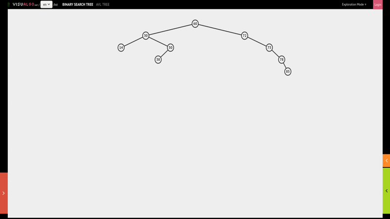
</br>


See that it generated a random Binary Search Tree for me, let's say I want to do
an Insert, and I want to insert, let's say the number `1`, by click go, it's
going to traverse, figure out where it wants to insert and it's going to insert
`1`.

</br>

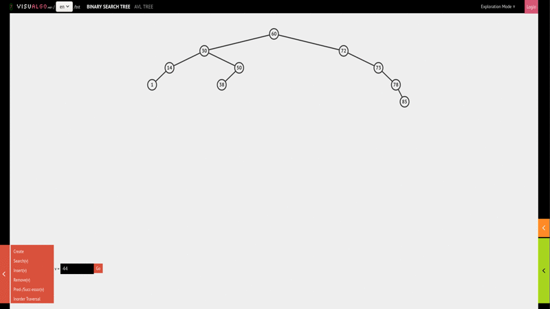
</br>

What if I want to insert perhaps number `44`, this time around, if I hit go,
a traverses figures out where `44` should go, and places it on the Right leaf
with parent node `38`. So we're always traversing and figuring out using `O(log
N)`, where we should place the item.

</br>

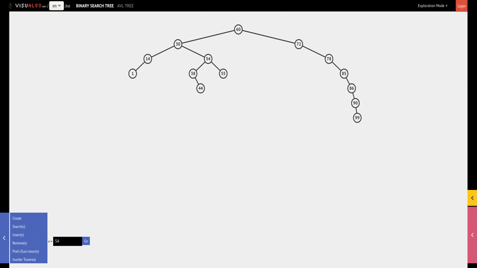
</br>

What about removing? Let's add one more node, I add `51` so it will add on the
Right leaf for parent node `50`. Let's say we want to delete `50`, now if
I remove `50`, I hit go, I find `50`, remove it, and then I have to replace with
`51` and go up.

So there's a bit of a tough little logic happening there. We're gonna have to
incorporate and we're gonna get to that, but for now as I end this lecture,
I recommend that you go to visualgo and play around with Binary Search Tree, so
that you get accustomed to; and as you play with it, see if you notice a problem
that we might encounter with Binary Search Tree, because we going to discuss it
in the next lecture.

**[⬆ back to top](#table-of-contents)**
</br>
</br>

## Balanced vs Unbalanced BST

While playing with visualgo did you notice a problem with Binary Search Trees?
If not let me demonstrate something to you.

</br>

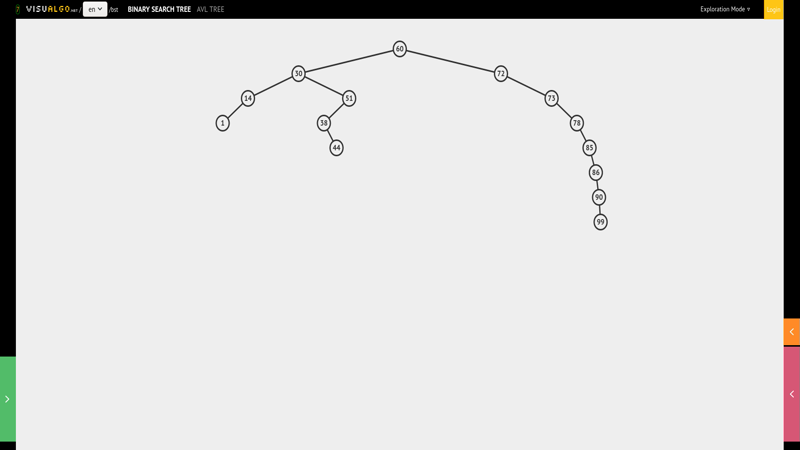
</br>

Let's say I keep inserting here, let's say `86` and then while that's going,
I'll also insert `90`, Finally I'll insert `99`. What is the problem with this
Binary Search Tree? Well, you can imagine a situation where we have this really
**_Unbalanced Binary Search Tree_**, where all the nodes just keep getting added
to the **Right Leaf**. If we imagine we don't have the **Left leaf Tree
section**, all of sudden _turn into a Link List_, where we're just loop through
every single node.

</br>


</br>

This is a big problem that comes with Binary Search Trees, that is you can have
_Balanced Search Tree_ like the one above, that gives us this `O(log N)`, and
performance,

</br>

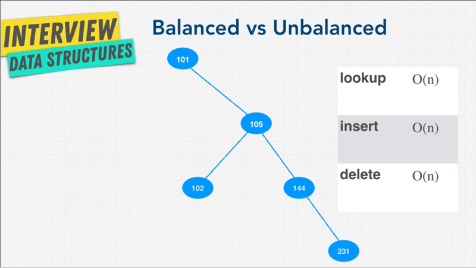
</br>

But then also have _Unbalanced_ ones, where it sort of turns into a long linked
list, where instead of being able to do the `O(log N)` operations, you now have
to move through every single node and Lookup, and Insert become `O(n)` or linear
time, and you even saw in our visualgo demonstration how slow it took to insert
items because they had to loop through so many things.

One of the keys that you'll have to remember and this is a question that you
might get asked in interviews is, **why Unbalanced Binary Search Tree is bad?**,
and I hope this demonstrate why it's not a good idea.

</br>

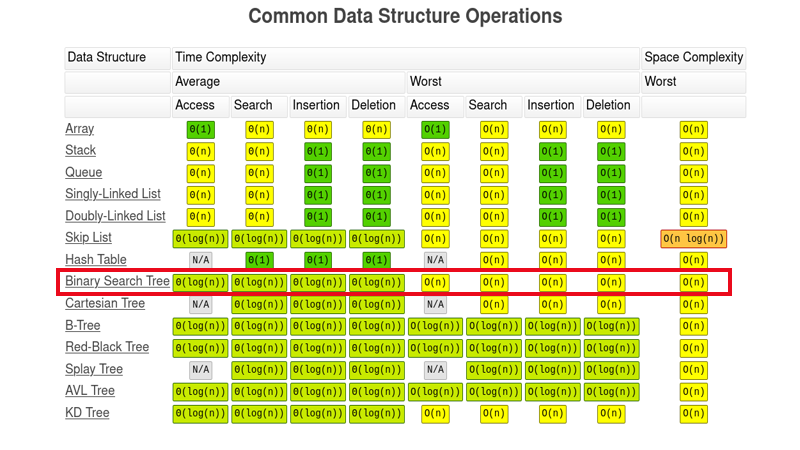
</br>

Ideally we want to balance our Search Trees, so that we can have `O(log N)`
performance optimization. If we go to our [Big-O
Cheatsheet](https://www.bigocheatsheet.com/), we see that with Binary Search
Trees, that we have all `O(log N)` for most things, which is average, but when
it comes to **worst case**, when we have _Unbalanced Tree_ that all operations are
`O(n)` or linear time.

So, you might be asking yourself, **how do you balance a Tree?** And luckily for
us, there's algorithms that help us do that. It is really _advanced_, and we
will talk about it after we build our own Tree, and some of the options that we
have.

</br>

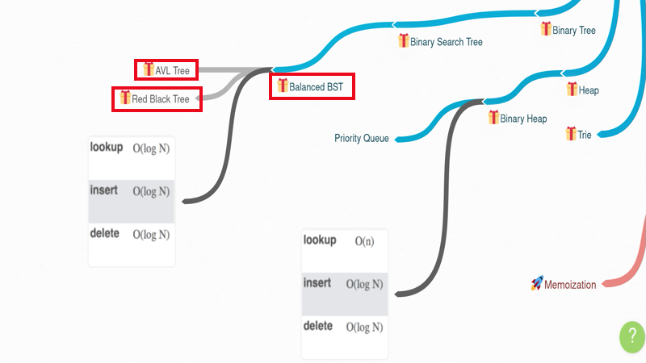
</br>

For example, we have things like, **AVL Tree**, and **Red Black Tree**, that
allow us to make sure that our Binary Search tree is going to be balanced;
luckily for us they are built in most programming languages (libraries and
tools), and in interview question, they won't really ask you to Balance a Binary
Search tree, because well it can get pretty complicated, and time consuming and
interviews usually don't have enough time to get you to do that. The idea is to
able to talk about it, and know that there are ways top balance a Search Tree,
and able to talk about the trade offs just like we did.

Now, we're going to talk about these two ways of balancing this Search Trees in
upcoming lecture; but for now let's just focus on the basics in the next
lecture.

**[⬆ back to top](#table-of-contents)**
</br>
</br>

## BST Pros and Cons

</br>

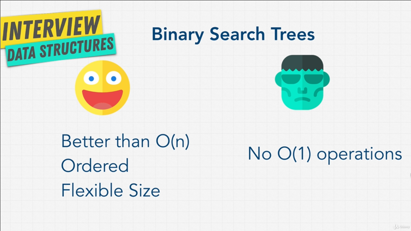
</br>

Before we code our Binary Search Tree, let's just go over the performance
implications and why we might want to use it over the data structures.

It's strengths are that it has really good performance across the board.You saw
that most operations or all operations in a **Binary Search Tree are better then
`O(n)`**, assuming that the Binary Search Tree is Balanced. It is also
**Ordered**, and because we can place the node anywhere in memory, we can just
have **flexible size**, we can keep growing our Tree.

The downside is, as you may have noticed it has **No `O(1)` operation**. We
usually have to do some sort of traversal through the Tree for any sort
operation; so compared to an array, a _Lookup_ for example, will be a lot faster,
because we have  `O(log N)` for searches versus of if we iterate through an
entire array, if the _array is unsorted_. _Inserts_ and _Deletes_ are also
faster then an array, unless the array is adding to the end, otherwise array
have to shift all the indexes versus Binary Search Tree that is just `O(log n)`.

What about Binary Search Tree versus Hash Tables (hash map)? Well, although hash
tables allow us to Insert Search at constant time `O(1)`, with Binary Search
Trees we have _sorted data_, and we also have this structure **Parent** and
**Child** relationship that you won't be able to get to much with hash tables.
A good thing to keep in mind is, that Binary Search Tree aren't fastest for
anything; remember their operations are usually always `O(log N)`.

On average an array or an object will have faster operations, but there are
certain condition where they do outperform objects in arrays `{[]}`, so Binary
Search tree do perform really well, as long as you make sure that you stay away
from the cases that we discussed and we balance our Binary Search Tree.

Enough talk, enough slides, I think to fully grasp and understand how Trees
work, we should code our own, I'll see you in the next lecture.

Enough talk, enough slides, I think to fully grasp and understand how Trees
work, we should code our own, I'll see you in the next lecture.

**[⬆ back to top](#table-of-contents)**
</br>
</br>

## Exercise Binary Search Tree

It's time to write our own Binary Search Tree. In this exercise I'm going to
challenge you to write your own before you read the solution.

Keep in mind, that just like with Linked Lists, it's going to require us to keep
track of the nodes to the _Left_ and to the _Right_ of the current node; and also we
have a _value_ associated with a node.

I recommend you actually dray  this out on a piece of paper to understand,
because keeping ever thing in your head and the calculations, might be a little
bit difficult.

```javascript
class Node {
    constructor(value) {
        this.left = null;
        this.right = null;
        this.value = value;
    }
}

class BinarySearchTree {
    constructor() {
        this.root = null;
    }

    insert(value) {
        // Code here
    }

    lookup(value) {
        // Code here
    }

    // remove(value) {
        // Code here
    // }
}

function traverse(node) {
    const tree = { value: node.value };

    tree.left = node.left === null ? null : traverse(node.left);
    tree.right = node.right === null ? traverse.(node.right);
    console.log(tree)

    return tree;
};
```

I have started here with all the essentials you need. We've created a Binary
Search Tree class, We have Node class that we ca use. We start our Binary Search
Tree with `this.root` of `null`, because we don't have anything yet; but
remember we have the Root which is our top most node, which currently is empty.

We're going to initialize our Binary Search Tree, and hopefully we're able to
_create two methods_, `[1]` _Insert_ and `[2]` _lookup_.

Our goal is to create this tree over below,

```
               9

        4             20

     1     6     15        170
```

`9` as the Root node, then `4` and `20` as it's children, an then `4` has `1`
and `6` as it's children; and `20` has `15` and `170` as it's children.

So ideally, if we implement Insert correctly, we can say or run the command
below,

```javascript
tree.insert(9)
tree.insert(4)
tree.insert(6)
tree.insert(20)
tree.insert(170)
tree.insert(15)
tree.insert(1)
```

Then, Ideally after running above command, you're be able to create this Tree
data structure.

At the bottom here, I create a small little function for you called
`traverse()`, for now I want you just ignore it, because we're using something
called recursion here, which we haven't got into yet; But I only create this
function, for you to be able to test out your code, and to make sure that it
actually works.

All you need to do in order for you to verify that this is working is, to say
`JSON.stringify(traverse(tree.root))`. We just give the Root node of our Tree,
and it's going to traverse and printout everything into a string, so that you
can check in the console that your Tree actually is working.

In the solution lecture, I'm going to demonstrate how this works, but I've added
this `traverse()` function as a little helper for you in case you want to double
check your work to make sure that it's correct.

By the way, the `lookup()` method should simply be return the node that we're
looking for, and if it doesn't find the node, then we can _return normal or
false_, whichever you want.

I've added `remove()` method here, which we're going to talk about later,
because it's a little bit difficult; so for now just worry about Insert and
Lookup, and I'll see you in the solution lecture.

**[⬆ back to top](#table-of-contents)**
</br>
</br>

## Solution Insert Method

Final `insert()` method,

```javascript

insert(value) {
    const newNode = new Node(value);

    if (this.root === null) {
        this.root = newNode;
    };

    console.log(newNode);
};

const tree = new BinarySearchTree();

tree.insert(9);

// Result
// Node { left: null, right: null, value: 9  }
```

Well comeback, hopefully that wasn't too bad. Keep in mind that when it come
into interviewing, interviewers want you to know that you understand the
_contents_. You won't necessarily have to code a Binary Search Tree from
scratch; Most of the time, at least. Because in real life you have things like
this [library](#https://github.com/afiore/arboreal), that somebody else created
that allows to use Tree Traversal Manipulation techniques, because this has
already been done before, and you can see by using a library like this, that you
can just use it and create the Tree that you want.

Most likely you're not implement it from scratch by yourself, but we do want to
understand the fundamentals and how it works. So, if this challenging to you,
don't get frustrated, this doesn't make you a bad engineer or a bad coder,
you're just working towards building those fundamentals, so that you can use
tools like library that I mentioned to you earlier in the future, and still
understand how it works.

### Chunked Code

Let's get to the answer, I want to create a tree that looks like below,

```
               9

        4             20

     1     6     15        170
```

So the first things I'm going to do is, work on the `insertion()` method.

```javascript
const newNode = new Node();
```

Now, Within this the very first thing I want t do is to say, well, we want to
create the `newNode` and we'll say `new Node()` will be the value; so, we just
creating a new node class instantiating with the value, and that's are our new
node now, so we have references to it.

The first thing we want to check, well, if the Tree is empty and there's no Root
node, well we should add this as our Root node.


```javascript
if (this.root === nuill) {
    this.root = newNode;
};
```

So I'm going to say, `this.root === null`, if that the case, then simply make
the Root node, our current node that we inserted; Nice and easy, an just to
check that this is working.


```javascript
tree.insert(9);
// Result
// Node { left: null, right: null, value: 9  }
```

I run this command `tree.insert(9)` and click run, there you go, our Node has
a `value` of `9`; `left` as `null`, `right` as `null`, because it's the only
note;

For now, we see that our `insert()` is working, only for if the Root node is
`null`;

```javascript
if {
    // ....
    // ....
}
else  {
    let currentNode = this.root;

    while(true) {
        if (value < currentNode.value) {
            // Left
            if (!currentNode.left) {
                currentNode.left = newNode;

                return this;
            };

            currentNode = currentNode.left;
        }
        else {
            // Right
            if (!currentNode.right) {
                currentNode.right = newNode;

                return this;
            };

            currentNode = currentNode.right;
        }

    }
}
```

Let's continue if that's not the case, we'll say, `else {}`, if the root node is
already fill, we'll say that the `currentNode` will be the `this.root`, because
we have to traverse this node, and we won't how how long we're going to traverse
the node, and we will know how long we going o traverse this node for; We want
to keep traversing until find a place to insert this.

This is a bit tricky, bu something you'll get used to, when you're building
Trees. We ant to use `while()` loop, and the condition we're going to use is
`true`; that means, just keep looping every time, because `true` is always going
to equal to `true`; and we have to be careful here, if we do this, we want to
make sure that there is a way for us to exit out of this loop, otherwise we're
going to have an infinite loop, and will crash our little page here.

So, what are the condition that we're going to loop through? We want to traverse
through the Tree; well, the first check we're going to do is say, if `value`, remember
`value` is what we insert, If `value` is less than the `currentNode.value`; so,
we start from the root node, and say, hey is the `value` that we are entering
less than the `currentNode.value`?

If that the case, we know the rules, so we're going to Left leaf, cause `value`
less then the `currentNode`. Now in here, we want to check first of all if there
is no `currentNode` on left `!currentNode.left`, is there an element already to
the Left of the Root node? Because, if there isn't, in that case we can just
assign the `currentNode.left` to our `newNode` that we want to enter, because
there's nothing there, and we can just return out of this loop `return this`

However, if there is something to the Left leaf of our node, let's say in this
case `9`; in that case `currentNode` is going to equal `currentNode.left`; So,
we're going to update and shift over, so that the `currentNode` is no longer
`9`, it's whatever is to the Left of `9`; and that's going to keep us looping
until we hit a node that doesn't have a Left hand side (leaf), so that we can
place the `currentNode` for our node into its place. That for the Left side
(leaf) if the `value` less then the `currentNode`.

If the `value` is greater then `currentNode`, we can decide where we want to
place `value` that are equal; That's up to us, and how we want to implement it,
will say that we'll go Right if value is greater or equal to current node. In
that case, what we want to do, the first check first, if is `currentNode.right`
there's nothing to it, there's nothing next to it to the Right of it; in that
case, just like a above, `currentNode.right` equals the `newNode`; and we're
also going to `return this`, because we want to stop looping.

Remember, as soon as we have the pointer to `null` that's we want to exit out of
this `while()` loop, that going to loop forever, otherwise we simply say
`currentNode` is going to equal `currentNode.right`.

There you go, hopefully this is works; but before we test this out, and see if
we meet any minor mistakes, I do want o warn you, if you are just coding along,
I encourage you to pause a second, and think through line by line, maybe even
drawing thing out, maybe using visualgo to see what we've doing, because it's
really hard to keep this code structure in your head, even myself, I can code
this from scratch, it takes me a bit of time to think things through, and see
how we wanna structure the code, so don't feel frustrated if this is a bit
overwhelming, I encourage you to pause a second, try to code along and
understand what happening step by step.

So if we test,

```javascript
tree.insert(9)
tree.insert(4)
tree.insert(6)
tree.insert(20)
tree.insert(170)
tree.insert(15)
tree.insert(1)
JSON.stringify(traverse(tree.root))

// Result
{
  value: 9,
  left: {
    value: 4,
    left: { value: 1, left: null, right: null },
    right: { value: 6, left: null, right: null }
  },
  right: {
    value: 20,
    left: { value: 15, left: null, right: null },
    right: { value: 170, left: null, right: null }
  }
}

{
  value: 4,
  left: { value: 1, left: null, right: null },
  right: { value: 6, left: null, right: null }
}

{
  value: 20,
  left: { value: 15, left: null, right: null },
  right: { value: 170, left: null, right: null }
}

{ value: 1, left: null, right: null }
{ value: 6, left: null, right: null }

{ value: 15, left: null, right: null }
{ value: 170, left: null, right: null }
```

Once you hang of it, and code this on your own, you'll see that it makes sense;
it's all logic, and  something that we've learned when working with liked lists.

**[⬆ back to top](#table-of-contents)**
</br>
</br>

## Solution Lookup Method

Let's try implement a `lookup()` function, or the search function. We want to
check if an item, or a node exist i our Tree. Let''s see how we go about this.

```javascript
lookup(value) {
    if !(this.root) {
        return false;
    };

    let currentNode = this.root;

    while (currentNode) {
        if (value < currentNode.value) {
            currentNode = currentNode.left;
        }
        else if (value > currentNode.value) {
            currentNode = currentNode.right;
        }
        else if (currentNode.value === value) {
            return currentNode;
        }
    }

    return false;
};
```

The first thing I would want to do is, to check if there is such a thing as Root
node, if it's empty `!this.root` or I could have done this by `this.root ===
nul`, it's a same; we'll just say `return false`, because if the Root doesn't
exist, then it doesn't really matter, we're not going to find that node.

Otherwise, we're going to say, once again `let currentNode` equal to
`this.root`; You'll notice some similarities with what we did when we did the
`insert()`. We still need to traverse through our Tree; but instead our
`while()` loop is going to strop whenever the `currentNode` no longer exists, or
we no longer have a node to go through, because once we've gone through our
Binary Search Tree, and it's `null`, that means we didn't find what we're
looking for.

So, in this case I'm simply going to say if the value that we're looking for is
less than the `currentNode.value`, in that case the `currentNode` is going to
equal `currentNode.left`, because we now want to go Left leaf, if the value is
less than the `currentNode` that means it's not the same, it's not the node
we're looking for, so go Left, because that's where I can find something that
might be less than the `currentNode`;

Otherwise, and we'll use an `else-if` statement here, which says another
condition; So, if that Doesn't match, if the `value` is greater then the
`currentNode.value`, what do you think we do here? Well we go to the Right
leaf. So, we're going to say `currentNode` is now going to be
`currentNode.right`; So, we just keep checking to the Right of use.

Finally `else-if`, that is another condition, and we can say, if
`currentNode.value` is equal the actual `value` that we're looking for, that
means we got a match, that means that node exists; So, we're going to return the
`currentNode`. Nice and simple.

Then finally, because we're not returning anything, we'll just looping through
the `whle()` loop until we find the `currentNode` were we return the
`currentNode` or `currentNode` becomes `null`, because we can't find anything;
If we don't find anything just `return false`.

The only way we return other than `false` is when we find our node with the
matching value.

So let see this,

```javascript
tree.lookup(9)

// Result
Root: Node {
  left: Node {
    left: Node { left: null, right: null, value: 1 },
    right: Node { left: null, right: null, value: 6 },
    value: 4
  },
  right: Node {
    left: Node { left: null, right: null, value: 15 },
    right: Node { left: null, right: null, value: 170 },
    value: 20
  },
  value: 9
}
```

If I now run `tree.lookup(9)`, and I'm click run, there you go, I get the `9`
node that has reference to all the other nodes beneath it.

```javascript
tree.lookup(90)

// Result
currentNode: null or false
```

If I `lookup(90)`, I'll get `false` because it doesn't exists.

```javascript
tree.lookup(20)

// Root
Root: Node {
  left: Node { left: null, right: null, value: 15 },
  right: Node { left: null, right: null, value: 170 },
  value: 20
}
```

If I `lookup(20)`, yep we found `20`.

Well done getting this far. Hope you're able to implement your own Binary
Search Tree. Once you get the hang of it, it's really not that bad. At the end
of the day, each line should make sense, and traversing a Tree should make
sense to you by now.

We also understand, why we have Big-O `O(log n)`, and although we have `loops`
with `while()` loops, we're not actually iterating through every single node,
we're only iterating using **Divide** and **Conquer**, something that you'll
hear a lot of. Divide and Conquer simply means, we're adding up; so we don't
visit all the nodes; each node that we visit we make a decision to go Left or
Right.

**[⬆ back to top](#table-of-contents)**
</br>
</br>

## Solution Remove Method

This exercise is a little bit advanced, and you most likely won't encounter it
in interview. But for those who are curious, that is how to implement the
`remove()` method; if we want to remove an item form a Tree, how would we go
about doing it? Now if you want to try to implement this, I want to give you
a heads up.

The best way for you to visualize and see what steps we need to do is, to go
back to visualgo, start to removing some nodes to see what the **logic is** in
removing nodes. Some steps are really easy.

</br>

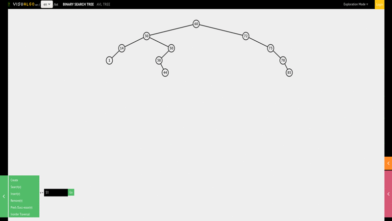
</br>

If we want to remove `1` for example; well, we simply traverse and find `1` and
just remove it. But then there's other cases that gets really complicated such
as, what we do when we remove `51`? Well, we going to start traversing to find
`51` and notice what happen when we find `51`, we actually keep going to `55`,
and then we keep going to `54`; and watch this, we split things and move `54`
up; and I know that's really really confusing. You might want to do this
a couple of times to see what the logic is.

But essentially what we're doing is, we're finding where we want to replace,
going to Right of it, then the Left and placing that Left item to the Top.

Like I said, this is going to be a little bit advanced. But if you want to
challenge yourself using visualgo animation, try to figure out how to implement
your own `remove()` method.

In the next lecture, I'll show you my solution and go over the steps that we
take for this to work. I'll see you in the next one.

Final `remove()` method

```javascript
remove(value) {
    if (!this.root) {
        return false;
    };

    let currentNode = this.root;
    let parentNode = null;

    while(currentNode){
        if(value < currentNode.value){
            parentNode = currentNode;
            currentNode = currentNode.left;
        }
        else if(value > currentNode.value){
            parentNode = currentNode;
            currentNode = currentNode.right;
        }
        else if (currentNode.value === value) {
            //We have a match, get to work!

            //Option 1: No right child:
            if (currentNode.right === null) {
                if (parentNode === null) {
                    this.root = currentNode.left;
                }
                else {
                    //if parent > current value, make current left child a child of parent
                    if(currentNode.value < parentNode.value) {
                        parentNode.left = currentNode.left;
                    }
                    //if parent < current value, make left child a right child of parent
                    else if(currentNode.value > parentNode.value) {
                        parentNode.right = currentNode.left;
                    }
                };
            }
            //Option 2: Right child which doesnt have a left child
            else if (currentNode.right.left === null) {
                currentNode.right.left = currentNode.left;
                if(parentNode === null) {
                    this.root = currentNode.right;
                }
                else {
                    //if parent > current, make right child of the left the parent
                    if(currentNode.value < parentNode.value) {
                        parentNode.left = currentNode.right;
                    }
                    //if parent < current, make right child a right child of the parent
                    else if (currentNode.value > parentNode.value) {
                        parentNode.right = currentNode.right;
                    }
                };
            }
            //Option 3: Right child that has a left child
            else {
                //find the Right child's left most child
                let leftmost = currentNode.right.left;
                let leftmostParent = currentNode.right;

                while(leftmost.left !== null) {
                    leftmostParent = leftmost;
                    leftmost = leftmost.left;
                };

                //Parent's left subtree is now leftmost's right subtree
                leftmostParent.left = leftmost.right;
                leftmost.left = currentNode.left;
                leftmost.right = currentNode.right;

                if(parentNode === null) {
                    this.root = leftmost;
                }
                else {
                    if(currentNode.value < parentNode.value) {
                        parentNode.left = leftmost;

                    }
                    else if(currentNode.value > parentNode.value) {
                        parentNode.right = leftmost;
                    }
                };
            };
            return true;
        };
    };
};
```
### Chunked Code

It took quite a lot of time to get this working, and I'm going to give you
another chance to finish it if you want. I have my code minimized above, just
to show you the `if` statements and the steps that I'm taking, so you could
pause this lecture to read, but let me just go over the steps I'm going to take.

Usually I like coding step by step, but when it comes to `remove()` function,
it's really really hard to go through step by step when you're not coding
yourself, or you don't have a diagram to point to and show; So, I'm going to
leave the code for you so you can implement it on your own; and actually like
always recommend, draw out with a piece of paper to understand what's going on,
otherwise if I just coded this along, it would be a 30 minutes explanations,
and you will be getting bored, and then you're not going to have fun with data
stricture any more and we don't want that;

```javascript
if (!this.root) {
    return false;
};
```

So, all we're doing is, well, if we doing remove we're going to check if
there's anything in the root; if there isn't, while the Tree's empty, there's
nothing to remove we're going to `return false`.

```javascript
let currentNode = this.root;
let parentNode = null;
```

Otherwise, we're going to grab the `currentNode` as `this,root` first, and then
we do something new here that haven't seen before, we declare a new variable
called `parentNode`, and this something you may realized, I was coded this line.
We need a reference to the parent,

</br>


</br>


Because if we remove something from above diagram such as `14`; Well, before we
get to `1` get reference of `14`, so that when we get to `1` we have access to
`30`, so we can link `30` to `1`.

```javascript
if (value < currentNode.value) {
    parentNode = currentNode;
    currentNode = currentNode.left
};
```

So, if we go back, now that I have `parentNode` variable, and I do my loop to
check if the `value` is less then the `currentNode.value` in which case I'll go
Left, and this should be familiar, but this time I'm also keep tracking of the
`parentNode`,

```javascript
else if (value > currentNode.value) {

}
```

Otherwise, if we need to go to the Right, but also keep track of the
`parentNode`.

```javascript
else if (currentNode.value === value) {
    // We have a match, get to work
}
```

Now we get the interesting part. We're looping through everything here, and
nothing's too crazy until we get to a match, and we find the `currentNode` that
we want to delete, we have a match, we need get to work, and we have **three
options** here.

```javascript
// Option 1: No right child
if (currentNode.right === null) {
    if (parentNode === null) {
        this.root = currentNode.left;
    }
    else {
        // If parent > current value, make current Left child a child of parent
        if (currentNode.value < parentNode.value) {
            parentNode.left = currentNode.left;
        }
        // If parent < current value, make Left child a right child o parent
        else if (currentNode.value > parentNode.value) {
            parentNode.right = currentNode.left;
        }
    }
}
```

The **first option** is that, the `currentNode` has no Right child. If the
`currentNode` has no Right child, let see the above diagram, let say we have
`14` as an example, if I remove `14`, all we did was remove `14`, but we kept
a reference to the `parentNode` which is `30`, and just moved `1` up.

That was nice and easy; and in here with **Option 1**, that really all we do.
We first make sure that the `parentNode` doesn't equal to `nuill`, that means
we're modifying the Root node, otherwise the Root variable gets update to our
`currentNode`.

Otherwise, if `parentNode` is greater than the `currentNode.value`, then make
current Left child, a child of the parent. If parent is less `(currentNode.value
> parentNode.value)` make Left child a Right child of the parent.

Again, I know this is confusing, and like I said, this is something that you
might have to on your own. I'll leave comments out here for you, so you can
actually play around with it, and play with visualgo so you understand what's
happening here.

```javascript
// Option 2: Right Child which doesn't have a Left child
else if (currentNode.right.left === null) {
    if (parentNode === null) {
        this.root = currentNode.left;
    }
    else {
        currentNode.right.left = currentNode.left;

        // If parent > current, make Right child of the Left as the parent
        if (currentNode.value < parentNode.value) {
            parentNode.left = currentNode.right;
        };

        // If parent < current, make Right child a Right child of the parent
        if (currentNode.value > parentNode.value) {
            parentNode.right = currentNode.right;
        };
    };
}
```

That the first options, if that's the case then do that. If we have a Right
child but the Right child doesn't have a Left child; let's find out.

So we check the `parentNode` is not `null`, so, that we have to replace the Root
node; Otherwise we go through similar steps to reassign the node.

What about the last option, _Right child that has a Left child_.

```javascript

// Option 3: Right child that has a Left child
else {
    // find the Right child's Left most child
    let leftmost = currentNode.right.left;
    let leftmostParent = currentNode.right;

    while (leftmost.left !== null) {
        leftmostParent = leftmost;
        leftmost = leftmost.left;
    };

    // Parent's Left subree is now leftmost's right subtree
   leftmostParent.left = leftmost.right;
   leftmost.left = currentNode.left;
   leftmost.right = currentNode.right;

   if(parentNode === null) {
       this.root = leftmost;
   }
   else {
       if(currentNode.value < parentNode.value) {
           parentNode.left = leftmost;

       }
       else if(currentNode.value > parentNode.value) {
           parentNode.right = leftmost;
       }
   };
}
```

This third option will require you to read through the code, and I've left some
nice comments for you, so that it makes sense but we're essentially finding the
Right child's Left most child, and looping through his changing the sub-Trees of
the Tree.

Like I said, this is quite a bit advanced, and really hard to explain, just on
the screen. So, I do recommend it, if you weren't able to get the `remove()`
function to go through this step by step, just play around with these code and
see if it works.

I do encourage you not to get disappointed if the removed method was really
difficult. I didn't really want to include it in the course, because it is
overly complex, and not something you want to worried about, when it comes to an
interview. But I thought some of you might be interested in it; just make sure
that it's not something that discourages you, as long you can do the `insert()`
and `lookup()` that's was matter for interviews.

**[⬆ back to top](#table-of-contents)**
</br>
</br>

## AVL Trees

Now, that we have implemented our Binary Search Tree, I want to talk a little
bit about balancing our Tree. Usually in production you want to have a balanced
Search Tree. There are two types of Trees that are very popular when it comes to
this. Although we built our own Binary Search Tree, you'd most likely in
production use something like _AVL tree_ or _Red Black Tree_ that automatically
rebalances itself, so that we don't have those edge cases where our balanced
Tree turns into a _linear unbalanced Tree_.

These topics, we don't need to code ourselves, because they are a little bit
complex, and most of the time you're using some sort of library that implements
it. But I do want you to understand how it works; So, I'll leave resources for
you for both [Red Black
Tree](https://www.cs.usfca.edu/~galles/visualization/RedBlack.html) and history
[how it
works](https://medium.com/basecs/painting-nodes-black-with-red-black-trees-60eacb2be9a5)
as well as [AVL
Trees](https://www.cs.usfca.edu/~galles/visualization/AVLtree.html) and history
[how it
works](https://medium.com/basecs/the-little-avl-tree-that-could-86a3cae410c7),
where visualgo also has it.

</br>

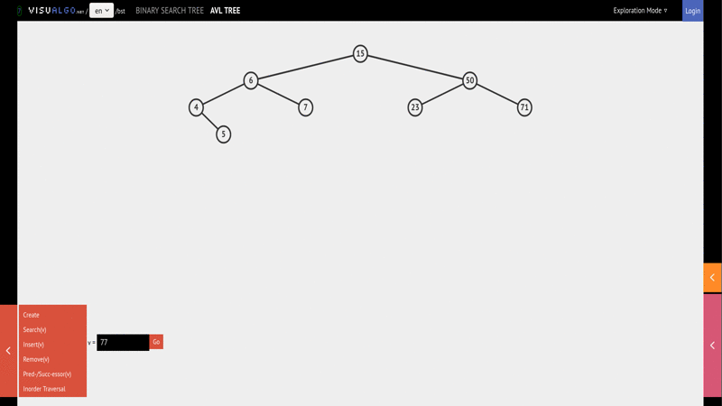
</br>


To demonstrate that visualgo also has AVL Trees, I want to insert `77` into my
AVL Tree, nothing different, we're adding `77` to the Tree.

</br>

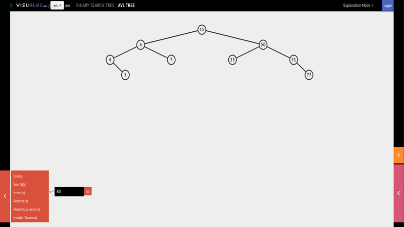
</br>

But If I now add, let's say `80` which will make our Tree a little bit
unbalanced, if I hit go, you'll see that I'm traversing downs, and I add `80`
and then all of a sudden it's unbalanced, it's going to go back and do a little
bit of a switch or rotation to balance out the Tree to make sure that the levels
that we have in Tree are always balanced

</br>

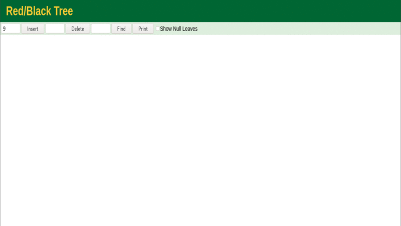
</br>

Then we have Red Black Tree as well, which does things a little bit differently.
Let's say we inserted `9` here then let's say we insert `10` and then finally
let's insert `11`; you'll notice that it's not balanced Tree, we need to balance
it out; and once again automatically make sure that our Tree does get balanced
with with something called Red Black Tree.

As you can see the nodes are Red and Black here, and that's something that we
use to keep track of, when we need to rebalance.

**[⬆ back to top](#table-of-contents)**
</br>
</br>

## Binary Heaps

We've talked about Binary Trees, Binary Search Trees, and then we learned about
how to balance Those Trees, and some of the time complexity involved with Binary
Search Trees (BST), and I want to talk to you about two other common type of
Trees, `[1]` **Heap** and `[2]` **Trie** or Tree.

In this lecture let's get talking about Heap. Now, when it comes to a heap, we're
most likely to talk about Binary Heaps, just like we had with Binary Trees; that
means there's only going to be two children to a node.

Why are these useful, and how are they different from Binary Trees?, let's go
have a look.

</br>

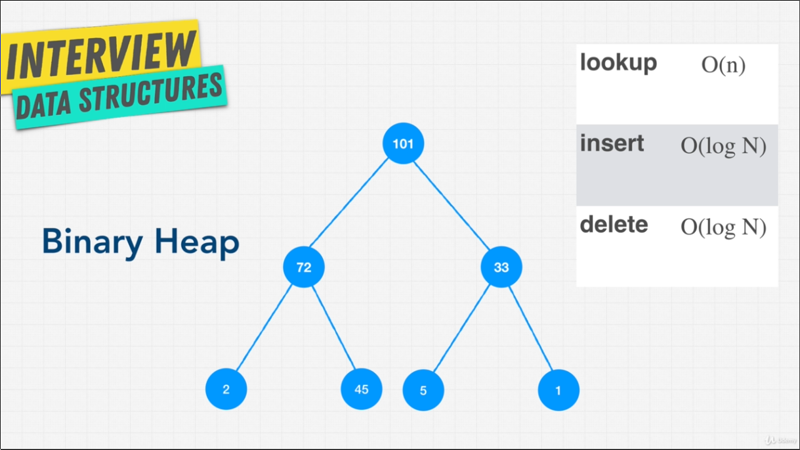
</br>

A Binary Trees every child belongs to a parent node, that has a greater priority
or value. If you look above diagram, every child that is `72` and `33` is lower
than `101`. `72` is higher than `2` and `45`; and `33` is higher than `5` and
`1`. This is actually called a **Max Heap**.

There's also called a **Min Heap**, which is the exact opposite, where the Root
node is the smallest.

Now above diagram value it can be anything you want, it can be a person's name,
it can be a number, it can be really anything because it's a node. But as you
can see, all we're dealing with is, that in a Binary Heap every node on the top
level has a greater value than every node on the next level down; and a Heap can
be used i any algorithms where _ordering is important_; and as we're going to
discuss, it's commonly used to when it comes to priority queues.

Now with _arrays_ we had random access, it allowed us to randomly access any
element within them using an index. In a Linked Lists, we can change things
dynamically unlike an array, but finding something within them is `O(n)` linear
time, because we had to go through the Linked List. Heaps a little bit different
you can do `O(1)` random access like we did with arrays or Hash tables; as we
know about Trees we have to do some sort of traversals.

Now compared to a Binary Search Tree, we sent that `lookup()` is `O(n)`, is not
`O(log N)`, and because it's less ordered than a Binary Search Tree right.

A Binary Search Tree actually had meaning between Left and Right; at the Left
was always less than the right, in a Binary Heap that's doesn't matter. Left and
Right can be any value, as long as it's less than the top value.

So, if we're looking for, let's say `1` we have to check the parent node,
because `1` is less than `101`, we have to check both nodes underneath it; and
because `1` is less than `72` and `33` we have to once again check every single
node and looking for `1` becomes `o(log N)`; so, pretty much turned into
searching through a Linked List or iterating through an array.

So, why would we ever want to use a Binary Heap? Well, it turns out that Binary
Heaps are really really great at doing comparative operations. Just like saying
I want people that have a value over `33`, because in that case we can just grab
these (`101`, `72` and `33`) items quite easily instead of going all the way
down to the nodes.

> Imagine how hard that would be with a Binary Search Tree! is `O(n)`.

Heaps actually used a lot in data storage, priority queues, sorting algorithms.
So let's have a look at how Binary Heap is implemented visually.

<!-- gif here -->

We have Binary Heap here using viualgo, and if we wanted to add, let's say
insert `26` we hit go, all right that was really fast.

<!-- gif here -->

But, what if we wanted to insert, let's say `51`, I had to do a bit of switch
to. See Heaps add value on the Tree in order from Left to Right  and then
bubbles up; if it's not in the same order or the priority order that is `1` kind
like we did here.

<!-- gif here -->

So, if I add, let's say `100`, what you think will happen? Well, if I hit go,
you'll see I add a `100` and then it bubbles up. So, as you can see Insert,
although it looks fast can still take `O(log N)`, and these is the same case
with Deletes as well is `O(log N)`.

Now, in order to truly understand why we need something like a Binary Heap, why
they're so useful, how they're different from Binary Search Tree, we need to
talk about Priory Queues.

**[⬆ back to top](#table-of-contents)**
</br>
</br>

## Quick Note on Heaps

</br>

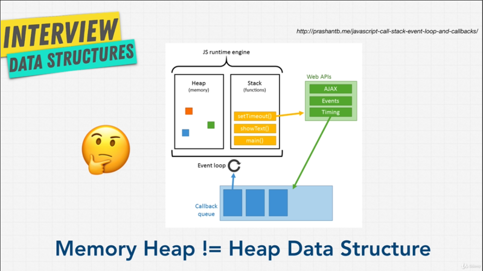
</br>

I wanted to add  a quick gotcha when it comes to Heaps; that is when you hear
**Memory Heaps** that's not the same as the Heap Data Structure. You might have
heard of _memory heaps_ and something like JavaScript  Runtime Engine, where we
have a _Stack_ and a _Heap_, there are two locations where we are able to keep
memory.

Now, this Heap you can think of as _Free Storage_, is a region on our memory
where we can store arbitrary data. Language like **C** also have this Heap. Now,
the naming is just coincidental, and Heap has no _real relationship_ with the
Data Structure that is named Heap. Keep that in mind.

Heap is simply a heap of memory, if you talking about a Language Runtime for
example; versus a Heap Data Structure which is what we're talking about.

I want to clarify that for you, because when I was learning about Heaps, for
some reason I always though they were the same thing, but they're not; just
throwing out there.

**[⬆ back to top](#table-of-contents)**
</br>
</br>


## Priority Queues

Now we learned about Binary Heaps and we mentioned that unlike a Binary Search
Tree, there is no order from Left to Right, 

</br>

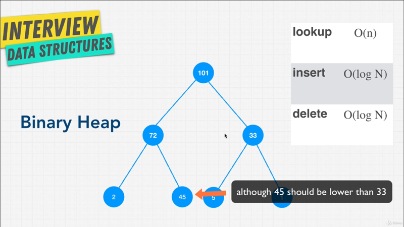
</br>

This `33` and `77` we can swap them, and they'll still be a Binary Heap.

The beady of Binary Heaps is, that they take up the least amount of space
possible, because it's always Left to Right insertion as we just saw. So,
there's no concept of an unbalanced Binary Heap; we don't have to re balance it
like a Binary Search Tree, because of this (do Left to Right) insertion as we
saw in the previous lecture, they preserve this order of insertion which is
pretty amazing right?; and you can actually implement Binary Heaps using an
arrays versus what we did before with Binary Search Trees where we use nodes. So
the only guarantee that Binary Heap it gives us is what I mentioned, the parent
(Root) is always greater then the children.

Now, besides memory efficiency, and just compact, because it's always a complete
Binary Tree; Binary Heaps are really useful for things such as **Priority Queues**.

</br>

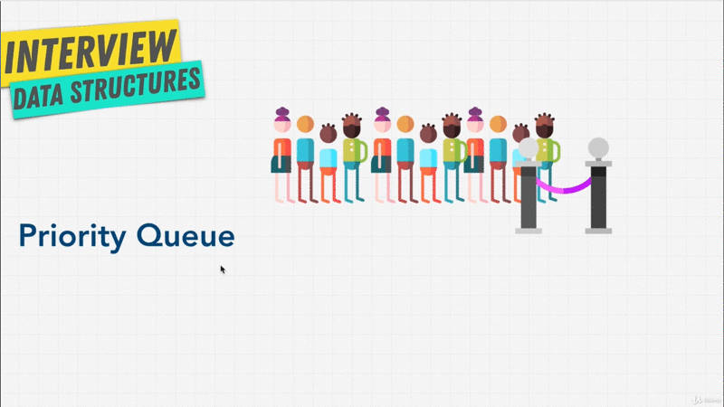
</br>

You just might be asking yourself Priority Queues, and isn't that we just learn
about Queues and isn't that the same data structure? Well no, because with
Queues we just assumed that it was first in first out; you are the first person
in line, you should get to go first into the roller-coaster or the movie's.

Priory Queues is something different, **it is a type of data where each element
has a priority**; and elements with a  higher priority are served before
elements with low priories. You can think as a club, let's say we have
a nightclub that is very very popular, and there's a long lineup and we let some
people in, everybody happy. But then, all of a sudden we have some VIP that
showed up, what they pay a lot more money than the other customers, so we're
going to put them in first. Now, we have a _different priority_, we're even
thought they arrive later, they get to go when they have higher priority.

Another good example is an emergency room. You want to treat the patients that
have the most severe symptom's or condition right?.

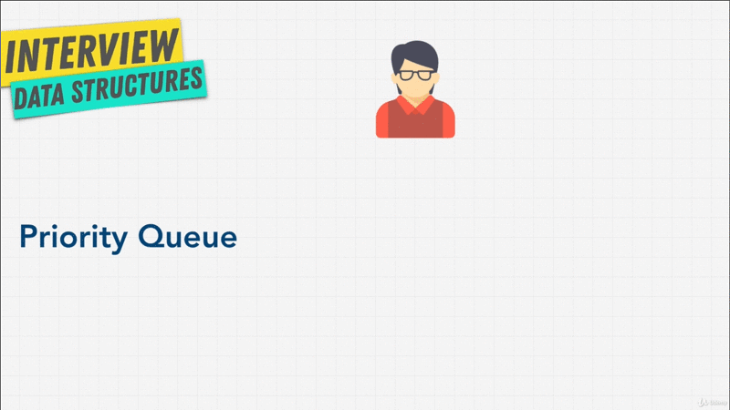

Another way to think about it is, let's say we're lining up to get into an
airplane. We have the first person coming in lining up, and then all of sudden
the captain shows up, and because the captain should get on the airplane before
a normal passenger, the captain gets now put as _priority as the Root Node_,
because the value is higher or at least in this case the value is higher than
the passenger.

So let's say another passenger comes on, because we're doing Left to Right
insertion, we put the passenger to the Right, so now we know going to let the
captain go, and then the first passenger then the second passenger.

Next, we have a stewardess that came in. She should get to go before the
passengers, but not before the captain; well, in that case once again we place
the stewardess below the captain to the Right or to the Left of the passenger;
and then we have another passenger that comes, we do Left to Right insertion, we
see a Right spot down here, so we place them down here.

So, we see how everything gets balanced, which is nice, but also really really
easy for us to now, let people into the airplane, because we know the order, we
go from the Top, then Left, then Right; then Left, then Right; we just keep
going, keep going, we know the priority, very easy.

I'm sure, you see where this might be useful in a lot situation.

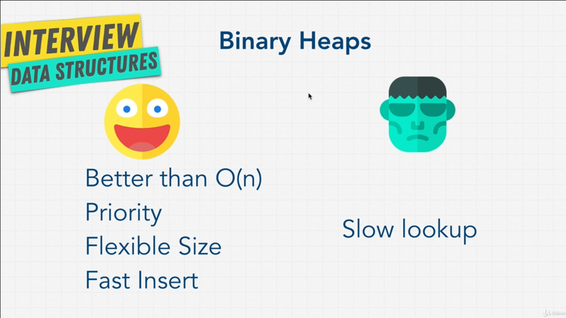

To review, we learned what Binary Search Tree are, they're great, but sometimes
Binary heaps or Priority Queues are even better. Although Searching through
a Binary Heap is a lot slower than a Binary Search Tree. You have an idea of
_priority_, because insertion is done in order; so, you know who should be
first, who should be second, who should be third;

Although we might have to bubble up Insert, every once in a while if there is
somebody that is has really high priority. Most of the time, you will get really
fast Insert with Binary Heap;

As we mentioned, Lookup as are slow, but you want to use Binary Heaps when
you're just using interested in finding the Max or finding the Minimum, if it's
a Min Heap; and a lot of the times in Binary Heaps, in Priority Queues you have
a method called `findMax()` or `findMin()` that is `O(1)`, because you know
right away that the top Root node is the Max or the Minimum; So for those
operations it's really really fast and great. There you have it.

**[⬆ back to top](#table-of-contents)**
</br>
</br>
