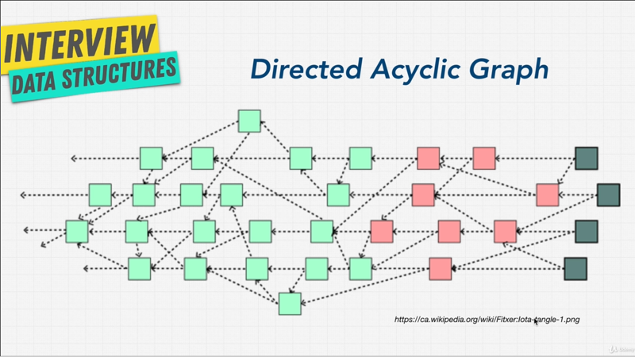

# Chapter-9 Data Structure Graph

## Table of Contents

1. [Graph Introduction](#graph-Introduction)
2. [Types of Graphs](#types-of-graphs)
3. [Exercise Guess The Graph](#exercise-guess-the-graph)
4. [Graph Data](#graph-data)

</br>

## Graph Introduction

Let's learn about the last data structure in this course, Graphs; Graphs are one
of the most useful and most used data structure in computer science. When it
come to modeling real life.

</br>


</br>

In short a Graph is simply a set of values that are related in a pair wise
fashion; and you can see above, it's look a little network, there's connection
to different nodes. In Graph, each item is called a **node** or a **vertex**.

</br>


</br>

Node are then connected with **edges**. As you can imagine. Graph are great data
structure to model real world relationships. We're presenting length's, Graphs
are ideal for cases when you're working with things that connect to other
things, kind like how the internet works. We can use Graphs to represent maybe
Friendships, maybe Family Tree; we can use Graphs to represent networks in the
worldwide web, or we can use Graphs to represent roads one city to another and
the roads that are connected.

As you can imagine Facebook uses it for their social network, Amazon uses it for
their recommendation engines; and Google Maps uses Graphs for determining the
shortest path to where you want to go.

So, let me ask you a question, do you think above diagram is a Graph? Well, yeah
obviously we just went through it.

</br>


</br>

What about above? Yep they are all Graphs. Even the (blue dot) that kind of
looks like a linked list, that's a Graph.

As you can see in our Mind Map diagram, Graphs encompass things that we've
learned before, such as Trees and Linked List. Linked List are type of Tree.
Trees are a type of Graph.

So, in the next couple lectures, let's learn all about Graphs.

**[⬆ back to top](#table-of-contents)**
</br>
</br>

## Types of Graphs

As we saw, there are many types of Graphs but there are certain characteristics
that allow us to describe, let's go over them.

### Directed vs Undirected

</br>


</br>

One thing that you really want to get yourself familiar with, is the idea of
**Directed** and **Undirected**. These types of Graphs are useful for describing
traffic flow for example; of some kind of a system in which movement is not by
directional, that means like where I can go back and forth between nodes, I can
only go in one direction.

A good think about Undirected Graph is, to think of as a highway between two
cities, where you can go back and forth. On the other hand Directed Graphs will
be a one way street, where you can only go one way.

Another way to think about it, is Facebook, what kind of Graph do you think
Facebook has? Well, it has an Undirected Graph, because when I'm connected to a
friend, that friend is also connected to me, it's not one way.

What about Twitter? Twitter is more Directed, because if I have my profile,
people can follow me, and I can follow people, but if somebody follows me I
don't automatically follow them. So Twitter is more Directed.

### Weighted vs Unweighted

</br>


</br>

Another way to describe Graph is, the idea of Weighted Graphs, Unweighted
Weighted Graphs; and as you can see from above images, values can be applied to
various aspects of a Graph, not just the nodes; remember the nodes can carry any
type of information but with Graphs you can also have information in the Edges,
and the connections. Maybe you're going on a trip, and try to figure out the
most efficient way to visit sites that interest you. Well in that case, Google
Maps would use a Weighted Graph to decide what is the shortest path for you to
get there.  These sort of Graphs are used a lot in calculating optimal paths,
the fastest way to get to let's say `1` to `6`.

### Cyclic vs Acyclic

</br>


</br>

Lastly, another way to describe Graph is Cyclic or Acyclic; when you have
vertices connected in a circular fashion, it called a cycle; when you can go
from one node to another to another and then back to that original; versus
Acyclic where you can't do that.

Cyclic Graphs are really common in, an especially Weighted Graphs, such as
Google Maps, because most of the time there is a way to get back.

So, now that we understand a few ways to describe Graphs, let me show you my
favorite Graphs of all time.

</br>


</br>

Above images is my Favorite Graphs. It's by the _Opti project_, and it is a
partial map of the internet.

If you look on detail here, you see that we have IP addresses connecting to IP
addresses, and these are all nodes connected to create the internet, pretty
spectacular right? 

That is the best example of a Graph. 

So, now we understand or at least have a basic understanding of Graphs, let's do
a nice fun exercise.

**[⬆ back to top](#table-of-contents)**
</br>
</br>

## Exercise Guess The Graph


We have our best friend visualgo, and once again hey have a great diagram for
us to play with. Now I'm going to give you four different Graphs, and you're
going to have to tell me what type of Graph it is based on while we've learn so
far, whether it's Weighted, Cyclic, Undirected, Directed.

</br>


</br>

What do you think above one is?  Before I show you the answer. Above diagram is
Undirected Graph, there's no arrow Unweighted Graph, and you can see it's also
Cyclic, because you can go from `0`, `1`, `2' and back to `0`.

</br>


</br>

What about next one, what type of Graph above is? Well, this is an Undirected
Weighted Graph that's also Cyclic. So, you can see that we've weights on the
edges here, there's no arrows, we can go anywhere we want, back and forth, and
we can also make Cyclic.

</br>


</br>


What about this one? Above Graph is a Directed Graph, but Unweighted; and yes
even `6` and `7` here are Graph; but we see here, that it's not Cyclic, it's
Acyclic because there's no way for me to go back. Let's say `0` to `1`, I can go
back to `0`.

</br>


</br>

What about this one? This, is a Directed Weighted Graph. We have weights, has
direction, and when it comes to Cyclic? No, they are no cycles, it's Acyclic.

The final challenge, what type of Graph below?

</br>


</br>

Above Graph is a Directed Acyclic Graph. There's no Cyclic, and it's a Graph.
This Directed Acyclic Graph is quite common and called **DAGH**; and actually a
project like **_Ioata_** which is a pretty popular blogging project uses this
Graph, and use fancy words like Directed Acyclic Graph; but at the end of the
day, that's not impressive anymore right? We know what that is, just simply
**_Graph that goes in one direction_**.

I think it's time for us to learn how to build our own Graph. I'll see you in
the next chapter.

**[⬆ back to top](#table-of-contents)**
</br>
</br>

## Graph Data

Let's learn how to build our own Graph. Graphs when you look at them look very
intimidating; but here's the thing, we've actually learned the tools necessary
to build Graphs, because Graphs are built on top of other data structures.

</br>


</br>

Remember above diagram, of the Directed Acyclic Graph; well, many of the data
structures that we've been playing with, up until now can create something like
above using Trees and Link Lists; I mean, it looks pretty similar right? You
have a node with children and different pointers.

Using that knowledge, let's talk about how to start thinking about Graphs, or at
least how to think about them.

There's **_three ways_** they can think about it. The **first** is called an
**Edge List**, and I have an example for you that we can use to build something
like this.

</br>


</br>

Let's say we want to build this Graph, how wold we go about doing this?. 

### Edge List

With an Edge List, we can say

```javascript
// Edge List
const graph = [[0, 2]], [2, 3], [2, 1], [1, 3]]
```

Now let's see what I did here, I have an array, and within this array I have `4`
items that itself they are arrays. But if we took at the Graph, the array simply
_states the connection_, that is we have `0`, and `2` as the first item in the
array; we have `2` and `3` as the second array, inside of the array; then `2`
and `1`; and `1` and `3`.

An Edge List simply show the connection that `0` is connected to `2`, and `2'
connected to `0`; `2` connected to `3`, and `3` connected to `2`; `2` to `1`;
`1` to `3`, so on and so fort, quit simple.

### Adjacent List

There is another way called **Adjacency** or **Adjacent List**, and in this case
we can create a Graph where the _index is the node_, and the _value is the nodes
neighbors_. What I mean by that?

```javascript
// Adjacent List

const graph = [[2], [2, 3], [0, 1, 3], [1, 2]]

```

> The index of the array is the value of the actual Graph node.

Well then, in here we can use Arrays, we can use Objects, we can use Linked
Lists. But, let's say, that in the index of `0`, the first item `0` is connected
to `2`; the index of `1`, that is node `1` is connected to `[2, 3]`; index of
`2` is connected to `[0, 1, 3]`, and then finally index of `3` or node `3` is
connected to `[1, 2]`.

You can also do the above with an Object, where it might even be clearer, and if
a node value is something other than a number, you can actually give it a value,
so _key and a value_; and this is extremely useful with Objects if you have,
like I said _not a sequential numbers_ as we do in this example; and when we
implement our own Graph, we're going to use an Adjacent List using an Object,
you'll see what I mean.

### Adjacent Matrix


Finally I want to show you the last method to represent Graphs, it's called
**Adjacent Matrix**. An Adjacent Matrix is going to look something like this,

```javascript
// Adjacent Matrix
const graph = [
    [0, 0, 1, 0]
    [0, 0, 1, 1]
    [1, 1, 0, 1]
    [0, 1, 1, 0]
]
```

This matrix is simply going to have `0` and `1`, indicating whether the node
**X** has a connection to node **Y**; `0` means **No**, `1` means **Yes**; and
if you have a way to Graph, you can actually add Weights here, instead of `1`
and `0`, so they can actually be numbers.

Above arrays is the same representation that we've done with Edge List and
Adjacent List, this time with Adjacent Matrix, what does it mean?

```
Y index of node 0	[0, 0, 1, 0]
^			 ^  ^  ^  ^
|			 0  1  2  3		<-- X index of
|
```

Well, index of `0` (Y axis) has connection with index of `2` (X axis)

```
X index of node 1	[0, 0, 1, 1]
^			 ^  ^  ^  ^
|			 0  1  2  3		<-- Y index of
|
```

Then node `1` (Y axis) is connected to index `2` and `3` (X axis)

```
X index of node 2	[1, 1, 0, 1]
^			 ^  ^  ^  ^
|			 0  1  2  3		<-- Y index of
|
```

Then node `2` (Y axis) is connected to index `0`, `1`, and `3` (X axis)

```
X index of node 3	[0, 1, 1, 0]
^			 ^  ^  ^  ^
|			 0  1  2  3		<-- Y index of
|
```

The last, node `4` (Y axis) is connected to index `1`, and `2` (X axis)

Once again, instead of a arrays, you can use Objects here, and actually give it
a key and a value;

So, if we change to an object would be,

```javascript
// Adjacent Matrix
const graph = {
    0: [0, 0, 1, 0],
    1: [0, 0, 1, 1]
    2: [1, 1, 0, 1],
    3: [0, 1, 1, 0]
}
```

</br>


</br>

If we go to visualgo, you'll actually see that, they have these three ways to
describe graphs, the Adjacency Matrix, because it's Weighted you see that
there's numbers here instead of `0` and `1`.

We have the Adjacency List, where it's look like here, they have _hash tables_
with the values.

Also the Edge List, with an extra property of the Weights, because this is a way
to Graph, and you can see the Weights as well in the Adjacency List.

But, we've just taken a loo at a lot of numbers; I think it's time for us to
build our own Graph to finalize our understanding.

 I'll see you in the next time.

**[⬆ back to top](#table-of-contents)**
</br>
</br>
