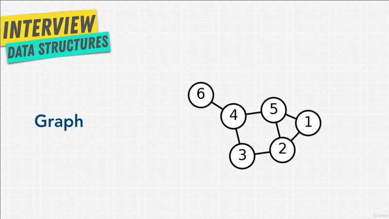

# Chapter-9 Data Structure Graph

## Table of Contents

1. [Graph Introduction](#graph-Introduction)
2. [Types of Graphs](#types-of-graphs)
3. [Exercise Guess The Graph](#exercise-guess-the-graph)
4. [Graph Data](#graph-data)
5. [Exercise Graph Implementation](#exercise-graph-implementation)
6. [Graph Review](#graph-review)

</br>

## Graph Introduction

Let's learn about the last data structure in this course, Graphs; Graphs are one
of the most useful and most used data structure in computer science. When it
come to modeling real life.

</br>


</br>

In short a Graph is simply a set of values that are related in a pair wise
fashion; and you can see above, it's look a little network, there's connection
to different nodes. In Graph, each item is called a **node** or a **vertex**.

</br>


</br>

Node are then connected with **edges**. As you can imagine. Graph are great data
structure to model real world relationships. We're presenting length's, Graphs
are ideal for cases when you're working with things that connect to other
things, kind like how the internet works. We can use Graphs to represent maybe
Friendships, maybe Family Tree; we can use Graphs to represent networks in the
worldwide web, or we can use Graphs to represent roads one city to another and
the roads that are connected.

As you can imagine Facebook uses it for their social network, Amazon uses it for
their recommendation engines; and Google Maps uses Graphs for determining the
shortest path to where you want to go.

So, let me ask you a question, do you think above diagram is a Graph? Well, yeah
obviously we just went through it.

</br>


</br>

What about above? Yep they are all Graphs. Even the (blue dot) that kind of
looks like a linked list, that's a Graph.

As you can see in our Mind Map diagram, Graphs encompass things that we've
learned before, such as Trees and Linked List. Linked List are type of Tree.
Trees are a type of Graph.

So, in the next couple lectures, let's learn all about Graphs.

**[⬆ back to top](#table-of-contents)**
</br>
</br>

## Types of Graphs

As we saw, there are many types of Graphs but there are certain characteristics
that allow us to describe, let's go over them.

### Directed vs Undirected

</br>


</br>

One thing that you really want to get yourself familiar with, is the idea of
**Directed** and **Undirected**. These types of Graphs are useful for describing
traffic flow for example; of some kind of a system in which movement is not by
directional, that means like where I can go back and forth between nodes, I can
only go in one direction.

A good think about Undirected Graph is, to think of as a highway between two
cities, where you can go back and forth. On the other hand Directed Graphs will
be a one way street, where you can only go one way.

Another way to think about it, is Facebook, what kind of Graph do you think
Facebook has? Well, it has an Undirected Graph, because when I'm connected to a
friend, that friend is also connected to me, it's not one way.

What about Twitter? Twitter is more Directed, because if I have my profile,
people can follow me, and I can follow people, but if somebody follows me I
don't automatically follow them. So Twitter is more Directed.

### Weighted vs Unweighted

</br>


</br>

Another way to describe Graph is, the idea of Weighted Graphs, Unweighted
Weighted Graphs; and as you can see from above images, values can be applied to
various aspects of a Graph, not just the nodes; remember the nodes can carry any
type of information but with Graphs you can also have information in the Edges,
and the connections. Maybe you're going on a trip, and try to figure out the
most efficient way to visit sites that interest you. Well in that case, Google
Maps would use a Weighted Graph to decide what is the shortest path for you to
get there.  These sort of Graphs are used a lot in calculating optimal paths,
the fastest way to get to let's say `1` to `6`.

### Cyclic vs Acyclic

</br>


</br>

Lastly, another way to describe Graph is Cyclic or Acyclic; when you have
vertices connected in a circular fashion, it called a cycle; when you can go
from one node to another to another and then back to that original; versus
Acyclic where you can't do that.

Cyclic Graphs are really common in, an especially Weighted Graphs, such as
Google Maps, because most of the time there is a way to get back.

So, now that we understand a few ways to describe Graphs, let me show you my
favorite Graphs of all time.

</br>


</br>

Above images is my Favorite Graphs. It's by the _Opti project_, and it is a
partial map of the internet.

If you look on detail here, you see that we have IP addresses connecting to IP
addresses, and these are all nodes connected to create the internet, pretty
spectacular right?

That is the best example of a Graph.

So, now we understand or at least have a basic understanding of Graphs, let's do
a nice fun exercise.

**[⬆ back to top](#table-of-contents)**
</br>
</br>

## Exercise Guess The Graph


We have our best friend visualgo, and once again hey have a great diagram for
us to play with. Now I'm going to give you four different Graphs, and you're
going to have to tell me what type of Graph it is based on while we've learn so
far, whether it's Weighted, Cyclic, Undirected, Directed.

</br>


</br>

What do you think above one is?  Before I show you the answer. Above diagram is
Undirected Graph, there's no arrow Unweighted Graph, and you can see it's also
Cyclic, because you can go from `0`, `1`, `2' and back to `0`.

</br>


</br>

What about next one, what type of Graph above is? Well, this is an Undirected
Weighted Graph that's also Cyclic. So, you can see that we've weights on the
edges here, there's no arrows, we can go anywhere we want, back and forth, and
we can also make Cyclic.

</br>


</br>


What about this one? Above Graph is a Directed Graph, but Unweighted; and yes
even `6` and `7` here are Graph; but we see here, that it's not Cyclic, it's
Acyclic because there's no way for me to go back. Let's say `0` to `1`, I can go
back to `0`.

</br>


</br>

What about this one? This, is a Directed Weighted Graph. We have weights, has
direction, and when it comes to Cyclic? No, they are no cycles, it's Acyclic.

The final challenge, what type of Graph below?

</br>


</br>

Above Graph is a Directed Acyclic Graph. There's no Cyclic, and it's a Graph.
This Directed Acyclic Graph is quite common and called **DAGH**; and actually a
project like **_Ioata_** which is a pretty popular blogging project uses this
Graph, and use fancy words like Directed Acyclic Graph; but at the end of the
day, that's not impressive anymore right? We know what that is, just simply
**_Graph that goes in one direction_**.

I think it's time for us to learn how to build our own Graph. I'll see you in
the next chapter.

**[⬆ back to top](#table-of-contents)**
</br>
</br>

## Graph Data

Let's learn how to build our own Graph. Graphs when you look at them look very
intimidating; but here's the thing, we've actually learned the tools necessary
to build Graphs, because Graphs are built on top of other data structures.

</br>


</br>

Remember above diagram, of the Directed Acyclic Graph; well, many of the data
structures that we've been playing with, up until now can create something like
above using Trees and Link Lists; I mean, it looks pretty similar right? You
have a node with children and different pointers.

Using that knowledge, let's talk about how to start thinking about Graphs, or at
least how to think about them.

There's **_three ways_** they can think about it. The **first** is called an
**Edge List**, and I have an example for you that we can use to build something
like this.

</br>


</br>

Let's say we want to build this Graph, how wold we go about doing this?.

### Edge List

With an Edge List, we can say

```javascript
// Edge List
const graph = [[0, 2]], [2, 3], [2, 1], [1, 3]]
```

Now let's see what I did here, I have an array, and within this array I have `4`
items that itself they are arrays. But if we took at the Graph, the array simply
_states the connection_, that is we have `0`, and `2` as the first item in the
array; we have `2` and `3` as the second array, inside of the array; then `2`
and `1`; and `1` and `3`.

An Edge List simply show the connection that `0` is connected to `2`, and `2'
connected to `0`; `2` connected to `3`, and `3` connected to `2`; `2` to `1`;
`1` to `3`, so on and so fort, quit simple.

### Adjacent List

There is another way called **Adjacency** or **Adjacent List**, and in this case
we can create a Graph where the _index is the node_, and the _value is the nodes
neighbors_. What I mean by that?

```javascript
// Adjacent List

const graph = [[2], [2, 3], [0, 1, 3], [1, 2]]

```

> The index of the array is the value of the actual Graph node.

Well then, in here we can use Arrays, we can use Objects, we can use Linked
Lists. But, let's say, that in the index of `0`, the first item `0` is connected
to `2`; the index of `1`, that is node `1` is connected to `[2, 3]`; index of
`2` is connected to `[0, 1, 3]`, and then finally index of `3` or node `3` is
connected to `[1, 2]`.

You can also do the above with an Object, where it might even be clearer, and if
a node value is something other than a number, you can actually give it a value,
so _key and a value_; and this is extremely useful with Objects if you have,
like I said _not a sequential numbers_ as we do in this example; and when we
implement our own Graph, we're going to use an Adjacent List using an Object,
you'll see what I mean.

### Adjacent Matrix


Finally I want to show you the last method to represent Graphs, it's called
**Adjacent Matrix**. An Adjacent Matrix is going to look something like this,

```javascript
// Adjacent Matrix
const graph = [
    [0, 0, 1, 0]
    [0, 0, 1, 1]
    [1, 1, 0, 1]
    [0, 1, 1, 0]
]
```

This matrix is simply going to have `0` and `1`, indicating whether the node
**X** has a connection to node **Y**; `0` means **No**, `1` means **Yes**; and
if you have a way to Graph, you can actually add Weights here, instead of `1`
and `0`, so they can actually be numbers.

Above arrays is the same representation that we've done with Edge List and
Adjacent List, this time with Adjacent Matrix, what does it mean?

```
Y index of node 0	[0, 0, 1, 0]
^			 ^  ^  ^  ^
|			 0  1  2  3		<-- X index of
|
```

Well, index of `0` (Y axis) has connection with index of `2` (X axis)

```
X index of node 1	[0, 0, 1, 1]
^			 ^  ^  ^  ^
|			 0  1  2  3		<-- Y index of
|
```

Then node `1` (Y axis) is connected to index `2` and `3` (X axis)

```
X index of node 2	[1, 1, 0, 1]
^			 ^  ^  ^  ^
|			 0  1  2  3		<-- Y index of
|
```

Then node `2` (Y axis) is connected to index `0`, `1`, and `3` (X axis)

```
X index of node 3	[0, 1, 1, 0]
^			 ^  ^  ^  ^
|			 0  1  2  3		<-- Y index of
|
```

The last, node `4` (Y axis) is connected to index `1`, and `2` (X axis)

Once again, instead of a arrays, you can use Objects here, and actually give it
a key and a value;

So, if we change to an object would be,

```javascript
// Adjacent Matrix
const graph = {
    0: [0, 0, 1, 0],
    1: [0, 0, 1, 1]
    2: [1, 1, 0, 1],
    3: [0, 1, 1, 0]
}
```

</br>


</br>

If we go to visualgo, you'll actually see that, they have these three ways to
describe graphs, the Adjacency Matrix, because it's Weighted you see that
there's numbers here instead of `0` and `1`.

We have the Adjacency List, where it's look like here, they have _hash tables_
with the values.

Also the Edge List, with an extra property of the Weights, because this is a way
to Graph, and you can see the Weights as well in the Adjacency List.

But, we've just taken a loo at a lot of numbers; I think it's time for us to
build our own Graph to finalize our understanding.

 I'll see you in the next time.

**[⬆ back to top](#table-of-contents)**
</br>
</br>

## Exercise Graph Implementation

It's time to create our own Graph, and I've created template here for you. You
can also create your own if you want, but I've include things that lets you
focus on the critical part.

```javascript
class Graph {
    constructor() {
	this.numberOfNodes = 0;
	this.adjacentList = {
	};
    }
    addVertex(node)  {
    }
    addEdge(node1, node2) {
	//undirected Graph
    }
    showConnections() {

	const allNodes = Object.keys(this.adjacentList);
	for (let node of allNodes) {

	    let nodeConnections = this.adjacentList[node];
	    let connections = "";
	    let vertex;

	    for (vertex of nodeConnections) {
		connections += vertex + " ";
	    }
	    console.log(node + "-->" + connections);
	}
    }
}

const myGraph = new Graph();
myGraph.addVertex('0');
myGraph.addVertex('1');
myGraph.addVertex('2');
myGraph.addVertex('3');
myGraph.addVertex('4');
myGraph.addVertex('5');
myGraph.addVertex('6');
myGraph.addEdge('3', '1');
myGraph.addEdge('3', '4');
myGraph.addEdge('4', '2');
myGraph.addEdge('4', '5');
myGraph.addEdge('1', '2');
myGraph.addEdge('1', '0');
myGraph.addEdge('0', '2');
myGraph.addEdge('6', '5');

myGraph.showConnections();
//Answer:
// 0-->1 2
// 1-->3 2 0
// 2-->4 1 0
// 3-->1 4
// 4-->3 2 5
// 5-->4 6
// 6-->5
```

We have a Graph class and a few methods that we're going to have to add.

</br>


</br>

Now, we are going to recreate a Graph right above, Undirected Unweighted Graph
like above using Adjacency List; and for Adjacency List, we're going to use a
Hash Table. So, how we going to go about doing this?

Well, I have a few things that I've set up for you. First, we have in the
`constructor()` simply `numberOfNodes` that will have to increment, just to keep
track of how many nodes or _Vertexes_ or _Vertices_ we have in our Graph. Also
I've created the `adjacentList` for you, which is an object.

As you do this exercise, you're going to realize why we want to use, let's say
an object versus an array, because if we start removing things from the Graph,
or placing things in the Graph that's out of order, it's going to cost us a lot.
Remember arrays on shifting?, and shifting is expensive. With objects, we can
quickly find items and see their connections, so that ideally in this case where
we take look at `0`, in this case will have `0` is going to be connected to an
array of its connection which will be `[1, 2]`. So, I'll have something like

```javascript
0: [1, 2]
```

Your task is to add a new method called `addVertex()`, that adds a new node or
vertex, the naming here kind of goes back and forth; and then also `addEdge()`,
that is to add a connection between node `1` and nod `2`. Keep in mind this is
Undirected Graph, so both node `1` and node `2` point to each other.

If you scroll down in above code, I've actually created the function calls that
we're going to do. We've created the `Graph()`, and then I'm creating `0` all
the way through `6`, just like we have on the Graph diagram above; and then
we're going to add the **_edges_**, that is the connection between everything.
`1` is connected to `0`, `0` is connected to `2`, `6' is connected to `5`;
simply just saying this, "I'm never repeating myself", that means I'm never
saying add `3` in `1`, and then saying add edge `1` and `3`. I only say this
once, and that's the key.

Also, the order doesn't matter, if I switch the order of these calls around, it
should still give me above Graph diagram.

Alright, I know you excited to get going, but the final thing, and this is only
optional, if you want to do this yourself you can also code yourself, but is not
really that important for this lecture. I've created a small helper function
called `showConnections()`, and you can look through this function if you want,
it's not really important to the core of the course; but I've made this, so you
can check your work, because If I run this at the end
`myGraph.showConnections()`, it's going to printout the answer like this,

```javascript
//Answer:
// 0-->1 2
// 1-->3 2 0
// 2-->4 1 0
// 3-->1 4
// 4-->3 2 5
// 5-->4 6
// 6-->5
```

It's going to show all the connections of the Graphs that you've created; and
this way, you can check that these connections that is node `4` is connected to
`[3, 2, 5]`, just like we have in above diagram.

Alright, that enough for me. Good luck, and I'll see you in the next solution
lecture.

### Solution Graph Implementation

This is actually extremely simple, but it looks overly complex, and that's a
general trend with Graphs, they look really really intimidating at first, and
really hard to think about them in your mind; But once you put things down,
understand things, maybe draw things out, they're actually quite simple, and
they're very similar to what we've learned up untill now. Everything we've
learned about Hash Tables, Arrays, Trees, Linked List are all parth of Graphs;
and Graphs simply use those data structure.

For those of you that weren't able to solve this problem, it might be because
you were a little bit intimidated ast to the task at hand; but, let me show you
how simple this can be. In order to add a _vertex_ to our Adjacency List,

```javascript
addVertext(node) {
    this.adjacentList[node] = [];
    this.numberOfNodes++;

    console.log(node)
}
// Result
// 0-->
// 1-->
// 2-->
// 3-->
// 4-->
// 5-->
// 6-->
```


All we need to do is to simply say `this.adjacentList[node]`; so, we're adding
the _key_ into this _object_ of the know that we want to add, that going to
equal an empty array `[]`. Because, when we enter a new node, it's not going to
have connection initially, we want to add the Edge afterwards; and then finally
we want to increase the `numberOfNodes++` by `1`, now we have one more; that's
it, we've just created our nodes.

If I run this, we have `0` all the way through `6`, and they are in our
Graph. Unfortunately, none of them connect to anything, we've just created the
nodes, but not the Edges. So let's go ahead and do that.

```javascript
addEdge(node1, node2) {
    this.adjacentList[node1].push(node2)
    this.adjacentList[node2].push(node1)
}
// Result
// 0-->1 2
// 1-->3 2 0
// 2-->4 1 0
// 3-->1 4
// 4-->3 2 5
// 5-->4 6
// 6-->5
```

With the Edges, because this is is Undirected Graph; Well, we'll have to do is
say, `this.adjacentList` is going to a `[node1]`, that is the first node that
we're giving, and the `node1` is going to push, remember this is an Object so
we're getting the _key_, so that is, let's say that is `node0` is going to push
to the array of connections that knows your house (array), and say that it's
going to be connected to `node2`.

Because this is Undirected, that means we have to do it the other way around as
well; so, we simply copy `this.adjacentList[node1].push(node2)`, and we simply
reverse things; so, `node2` is also connected to `node1`.

If, I run this, here look at that we have our Graph, how simple as that, that
wasn't bad right?; and I mean we could cease this in a Linked List if we wanted
to, but the concept is the same.

If we look at `0`, that is connected to `[1. 2]`, we can confirm that `0` is
connected to `[1. 2]`; If we look at `1` is connected to `[3, 2, 0]`, and let's
check maybe `5` which is connected to `[4, 6, 5]`. There it is, we've just
created our very first Graph.

When it comes to interviews, Graphs aren't as big of a topic as the other data
structures mostly, because they take a bit of time and questions regarding
Graphs can be overly complex. That doesn't mean that you won't see them, but
they are rare.

However, by knowing the basic fundamentals, what types of Graphs we have, and
how create graphs? How you might want to hold data and Graphs such as Adjacency
Matrix, Adjacency List, and Edge list?

You already show, that you have the ability to understand Graphs, which is an
advanced concepts. Now because Graph question aren't that big a part of
interviews, we won't be spending any more coding time on it. But also, keep in
mind, that we have a section coming up on algorithms, where we're going to dive
a little bit deeper into things, such as _Breadth First Search_ and _Depth First
Search_, which can be applied both to Graphs and Trees.

So, if you can feel, like you can still learn a bt about Graphs, don't worry,
we're still getting there, but for now, congratulations on creating your first
Graph, I'll see you in the next lecture.

**[⬆ back to top](#table-of-contents)**
</br>
</br>

## Graph Review

What are the pros and cons of Graphs? Well, when it comes to perfomance and
Big-O notation, it gets a litlle bit complicated, because there are so many
different types of Graphs. You can think of Graphs as really useful when it
comes to relationships, they're simply indispensable, because some data just
needs to be in a Graph form, there's no other way around it; and there are
algorithms around Graph, such as the ones we're going to be talking about in the
algorithm section that allows us to perfom some operations such as _finding the
shortest path_ or _traversing a Graph_.

But, when it comes to Graphs, because they can get complicated, scaling is
pretty hard. You need a big company or at least a lot of resources and
engineering power to make sure that you build Graph data structures that scale
well; but, luckily for us will never have to implement your own Grahp in
production or at least 99% of the population, there are tools like
[neo4j](https://neo4j.com) which is popular database that allows you to build
really fast Graph databases, and most of the time you'll use tools like this to
build complex structures to contain our data.

Congratulations, We've now covered anphter part of our data structure mind map,
that is Graphs. We've learned about Acyclic or Cyclic, Weighted or inweighted,
Directed or Undirected. We were also able to build our own Graph.

Now, there's still a few things left, that I see up there, and perhaps over here
which we're going to get into the algorithm sectionm, but for now take a break,
drink some coffe or tea and I'll see you in the next lecture.

**[⬆ back to top](#table-of-contents)**
</br>
</br>
<!-- set textwidth=80 tabstop=8 shiftwidth=4 softtabstop=4 -->
