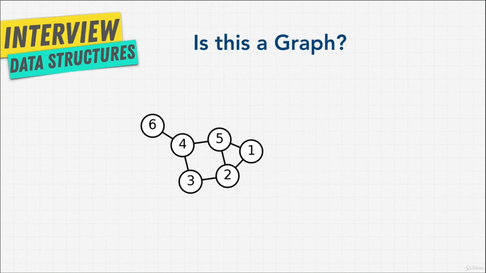

# Chapter-9 Data Structure Graph

## Table of Contents

1. [Graph Introduction](#graph-Introduction)

 

## Graph Introduction

Let's learn about the last data structure in this course, Graphs; Graphs are one
of the most useful and most used data structure in computer science. When it
come to modeling real life.

In short a Graph is simply a set of values that are related in a pair wise
fashion; and you can see above, it's look a little network, there's connection
to different nodes. In Graph, each item is called a **node** or a **vertex**.

 

 

Node are then connected with **edges**. As you can imagine. Graph are great data
structure to model real world relationships. We're presenting length's, Graphs
are ideal for cases when you're working with things that connect to other
things, kind like how the internet works. We can use Graphs to represent maybe
Friendships, maybe Family Tree; we can use Graphs to represent networks in the
worldwide web, or we can use Graphs to represent roads one city to another and
the roads that are connected.

As you can imagine Facebook uses it for their social network, Amazon uses it for
their recommendation engines; and Google Maps uses Graphs for determining the
shortest path to where you want to go.

So, let me ask you a question, do you think above diagram is a Graph? Well, yeah
obviously we just went through it.

 

 

What about above? Yep they are all Graphs. Even the (blue dot) that kind of
looks like a linked list, that's a Graph.

As you can see in our Mind Map diagram, Graphs encompass things that we've
learned before, such as Trees and Linked List. Linked List are type of Tree.
Trees are a type of Graph.

So, in the next couple lectures, let's learn all about Graphs.

**[⬆ back to top](#table-of-contents)**
 
 
